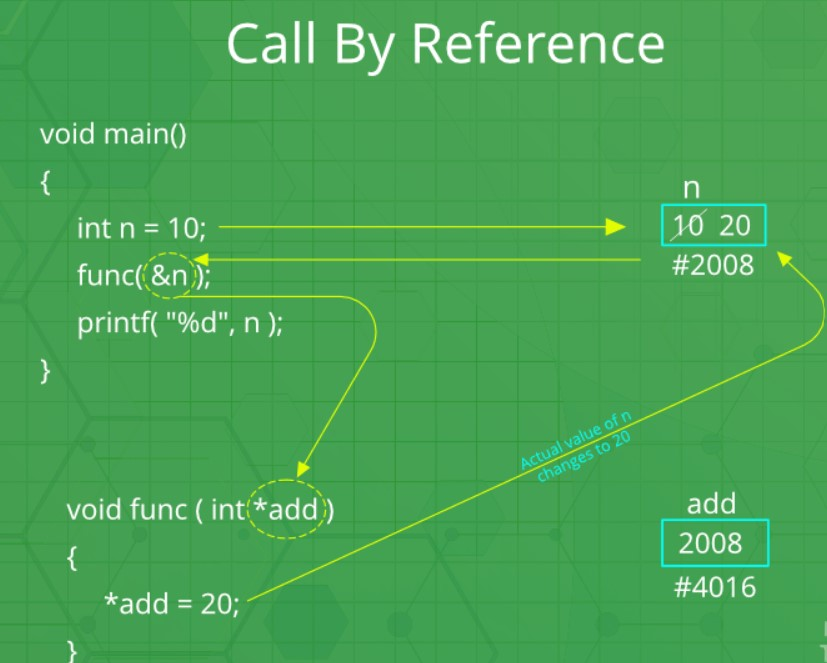

# Pointer & Reference

- [Pointer & Reference](#pointer--reference)
  - [🚀Pointer](#pointer)
    - [Address Of Operator(`&`)](#address-of-operator)
    - [Pointer Variables](#pointer-variables)
    - [🚨Dereference Operator(`*`)](#dereference-operator)
    - [🌟Pointer Applications🌟](#pointer-applications)
      - [🚀Pass By References - Using Pointers | Modify the passed parameters in a function](#pass-by-references---using-pointers--modify-the-passed-parameters-in-a-function)
  - [👉Reference(`&`) in  C++](#reference-in--c)
    - [Differences between 👉pointers and 👉references in C++](#differences-between-pointers-and-references-in-c)
      - [✅✅Pass by Reference: Using `pointer`|`reference`  - When to use What](#pass-by-reference-using-pointerreference----when-to-use-what)
    - [Arrays are 🧠🧠Passed as References🧠🧠 by Default](#arrays-are-passed-as-references-by-default)
    - [🌟Reference Applications🌟](#reference-applications)
      - [🚀🚀Pass By Reference| 👉👉 Modifying `formal` parameter reflects in `actual` parameter](#pass-by-reference--modifying-formal-parameter-reflects-in-actual-parameter)
      - [🚀🚀Avoiding a copy of large structures](#avoiding-a-copy-of-large-structures)
      - [🚀🚀In For Each Loops to modify all objects](#in-for-each-loops-to-modify-all-objects)
      - [🚀For Each Loop to avoid the copy of objects](#for-each-loop-to-avoid-the-copy-of-objects)

## 🚀Pointer

### Address Of Operator(`&`)

To get the address of a variable, use the `&` operator.

```cpp
    int a = 10;
    cout << &a << endl; // 0x59ca3ffd2c
```

### Pointer Variables

A pointer variable is a variable that stores the address of another variable. To declare a pointer variable, use the `*` operator.

```cpp
    int a = 10;
    int *p;
    p = &a;
    cout << &a << endl; // 0xd8609ff95c -> address of a
    cout << p << endl;  // 0xd8609ff95c -> address of a
    cout << &p << endl; // 0xd8609ff950 -> address of p itself
```

<div align="center">
 
</div>

### 🚨Dereference Operator(`*`)

An interesting property of pointers is that they can be **used to access the variable they point to directly**. This is done by preceding the pointer name with the dereference operator (`*`). The operator itself can be read as `"value pointed to by"`

- `&value => address`
- `*address => value`

```cpp
 int a = 10;
 int *p;
 p = &a;
 cout << *p << endl; // 10
```

```cpp
#include <stdio.h>
#define RED "\e[0;91m"
#define GRN "\e[0;92m"
#define NC "\e[0m"
int main() {
    // Declare and Access
    int a = 12;
    int *ptr = &a;
    printf(RED "ptr:" NC " %p  %x  %X", ptr, ptr, ptr);

    // !Indirection to GET the values
    int n1 = *ptr;
    int n2 = *ptr + 8;
    printf(RED "\na:" NC " %d", *ptr);
    printf(RED "\nn1:" NC " %d", n1);
    printf(RED "\nn2:" NC " %d", n2);

    // !Indirection to SET value
    *ptr = 99;
    printf(RED "\nnew a:" NC " %d", *ptr);

    // !Indirection and void Pointers
    void *vPtr = &a;
    // int n3 = *vPtr; // warning: dereferencing 'void *' pointer
    // must cast a void pointer before indirection
    int n3 = *((int *)vPtr);
    printf(RED "\nn3:" NC " %d", n3);

    //! Testing for a Null pointer
    printf(GRN "\ntesting for a Null pointer....\n" NC);
    int *p = NULL;
    // execute if pointer isn't NULL
    if (p)
        printf("1 | pointer value: %d\n", *p);

    // execute if pointer is NULL
    int someValue = 123;
    if (!p) {
        p = &someValue;
    }
    // execute if pointer isn't NULL
    if (p)
        printf("2 | pointer value: %d\n", *p);
    return 0;
}
```


### 🌟Pointer Applications🌟

#### 🚀Pass By References - Using Pointers | Modify the passed parameters in a function

```cpp
void watchVideo(int views) {
    views = views + 1;
}

int main() {
    int views = 100;
    watchVideo(views);
    cout << "views: " << views << endl;//100
}
```

vs:

```cpp
void watchVideo(int *viewsPtr) // int *viewsPtr=&views
{
    *viewsPtr = *viewsPtr + 1;
}

int main() {
    int views = 100;
    watchVideo(&views);
    cout << "views: " << views << endl; // 101
}
```

## 👉Reference(`&`) in  C++

A reference is an `alias` for an already existing variable. Once a reference is initialized to a variable, it cannot be changed to refer to another variable. Hence, a reference is similar to a `const pointer`.

- [https://www.geeksforgeeks.org/references-in-c/](https://www.geeksforgeeks.org/references-in-c/)

```cpp
int main() {
    int x = 10;
    int &y = x;
    y++;
    x++;
    cout << x << " " << &x << endl; // 12 0x7ffc8b9d8b50
    cout << y << " " << &y << endl; // 12 0x7ffc8b9d8b50
}
```

<div align="center">

</div>

### Differences between 👉pointers and 👉references in C++

C and C++ support pointers which are different from most of the other programming languages. Other languages including C++, Java, Python, Ruby, Perl and PHP support references.

Both `references` and `pointers` can be used **to change local variables of one function inside another function**. Both of them can also be used to save copying of big objects when passed as arguments to functions or returned from functions, to get efficiency gain. Despite the above similarities, there are the following differences between references and pointers.

Major dif:

- The reference is an **alias for a variable**  whereas pointers are used to **store address of variable**.
- Reference variable **cannot be updated**.
- A reference **must be initialized on declaration** while it is not necessary in case of pointer.
  - Due to the above limitations, references in C++ cannot be used for implementing data structures like Linked List, Tree, etc. In Java, references don’t have the above restrictions and can be used to implement all data structures. References being more powerful in Java is the main reason Java doesn’t need pointers.
- References **cannot have a null value** assigned but pointer can.
- References are safer and easier to use:
  1. **Safer**: Since references must be initialized, wild references like wild pointers are unlikely to exist. It is still possible to have references that don’t refer to a valid location (See questions 5 and 6 in the below exercise)
  2. **Easier to use**: A pointer needs to be dereferenced with `*` to access the memory location it points to, whereas a reference can be used directly. A pointer to a class/struct uses `‘->’` (arrow operator) to access its members whereas a reference uses a `‘.’` (dot operator)

- [https://www.educative.io/edpresso/differences-between-pointers-and-references-in-cpp](https://www.educative.io/edpresso/differences-between-pointers-and-references-in-cpp)
- [https://www.geeksforgeeks.org/pointers-vs-references-cpp/](https://www.geeksforgeeks.org/pointers-vs-references-cpp/)
- [https://www.geeksforgeeks.org/passing-by-pointer-vs-passing-by-reference-in-c/](https://www.geeksforgeeks.org/passing-by-pointer-vs-passing-by-reference-in-c/)
- [https://techdifferences.com/difference-between-pointer-and-reference-2.html](https://techdifferences.com/difference-between-pointer-and-reference-2.html)

#### ✅✅Pass by Reference: Using `pointer`|`reference`  - When to use What

```cpp
void swapPassByRefsWithRefOp(int &n1, int &n2) {
    int temp;
    temp = n1;
    n1 = n2;
    n2 = temp;
}
void swapPassByRefsWithPointer(int *n1, int *n2) {
    int temp;
    temp = *n1;
    *n1 = *n2;
    *n2 = temp;
}
int main() {
    int a = 1, b = 2;
    swapPassByRefsWithRefOp(a, b);
    cout << a << " " << b << endl; // 2 1
    swapPassByRefsWithPointer(&a, &b);
    cout << a << " " << b << endl; // 1 2
    return 0;
}
```

The performances are exactly the same, as **references are implemented internally as pointers**. But still we can keep some points in mind to decide when to use what :

- Use `references`
  - In function **parameters** and **return types**.
  - there are few places like the **copy constructor** argument where pointer cannot be used. Reference must be used to pass the argument in the copy constructor.
  - Similarly, references must be used for **overloading** some operators like ++.
- Use `pointers`:
  - Use pointers if pointer **arithmetic** or passing `NULL-pointer` is needed. For example for arrays (Note that array access is implemented using pointer arithmetic).
  - To implement **data structures** like linked list, tree, etc and their algorithms because to point different cell, we have to use the concept of pointers

- **References are usually preferred over pointers whenever we don’t need “reseating”.**
- Overall, Use references when you can, and pointers when you have to. But if we want to write C code that compiles with both C and a C++ compiler, you’ll have to restrict yourself to using pointers

### Arrays are 🧠🧠Passed as References🧠🧠 by Default

- [https://github.com/dev-SR/exercise/tree/main/C%2B%2B/1.2array#-arrays-are-passed-by-references-only-but-others-are-by-value](https://github.com/dev-SR/exercise/tree/main/C%2B%2B/1.2array#-arrays-are-passed-by-references-only-but-others-are-by-value)

### 🌟Reference Applications🌟

#### 🚀🚀Pass By Reference| 👉👉 Modifying `formal` parameter reflects in `actual` parameter

- [https://www.geeksforgeeks.org/parameter-passing-techniques-in-c-cpp/](https://www.geeksforgeeks.org/parameter-passing-techniques-in-c-cpp/)

This technique uses in/out-mode semantics. **Changes made to formal parameter do get transmitted back to the caller through parameter passing**. **Any changes to the formal parameter are reflected in the actual parameter in the calling environment as formal parameter receives a reference (or pointer) to the actual data**. This method is also called as call by reference. This method is efficient in both time and space.

```cpp
// pass by value
void applyTax(int income) {
    float tax = 0.1;
    income = income - (income * tax);
}
int main() {
    int income = 100;
    applyTax(income);
    cout << "Income after tax: " << income << endl; // 100
}
```

vs

```cpp
// pass by reference - using reference operator `&`
void applyTax(int &income) {
    float tax = 0.1;
    income = income - (income * tax);
}
int main() {
    int income = 100;
    applyTax(income);
    cout << "Income after tax: " << income << endl; // 90
}
```

<div align="center">
    
</div>

same with pointers:

```cpp
// pass by reference - using pointers
void applyTax(int *income) {
    float tax = 0.1;
    *income = *income - (*income * tax);
}
int main() {
    int income = 100;
    applyTax(&income);
    cout << "Income after tax: " << income << endl; // 90
}
```

#### 🚀🚀Avoiding a copy of large structures

Imagine a function that has to receive a large object. If we pass it without reference, a new copy of it is created which causes wastage of CPU time and memory. We can use references to avoid this.


```cpp
struct Student {
   string name;
   string address;
   int rollNo;
}

// If we remove `&` in below function, a new
// copy of the student object is created.
// We use const to avoid accidental updates
// in the function as the purpose of the function
// is to print s only.
void print(const Student &s)
{
    cout << s.name << "  " << s.address << "  " << s.rollNo << '\n';
}
```

#### 🚀🚀In For Each Loops to modify all objects

We can use references in for each loops to modify all elements.

```cpp
void printArr(const vector<int> &v) {
    for (int x : v) {
        cout << x << " ";
    }
    cout << '\n';
}
int main() {
    vector<int> v{10, 20, 30, 40};
    for (int x : v) {
        x = x + 5;
    }
    printArr(v); // 10 20 30 40
    // We can modify elements if we
    // use reference
    for (int &x : v) {
        x = x + 5;
    }
    printArr(v); // 15 25 35 45
}
```

ex2:

```cpp
void printStr(const string &s) {
    for (char c : s) {
        cout << c << " ";
    }
    cout << '\n';
}
int main() {
    string s = "hello";
    for (char &c : s) {
        if (c >= 'a') {
            c -= 32;
        }
    }
    printStr(s); // H E L L O
    return 0;
}
```

#### 🚀For Each Loop to avoid the copy of objects

We can use references in each loop to avoid a copy of individual objects when objects are large.

```cpp
vector<string> v{"apple", "banana", "cherry"};

// We avoid copy of the whole string
// object by using reference.
for (const auto &x : v) {
    cout << x << '\n';
}
```
