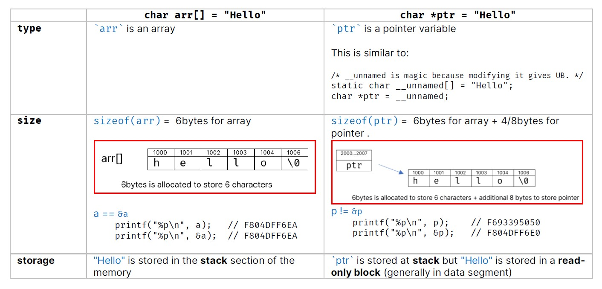

# char, char[], string

<div id='up'></div>

- [char, char[], string](#char-char-string)
  - [Character Data Type](#character-data-type)
    - [Reading a Char using `cin.get()`](#reading-a-char-using-cinget)
    - [Ctype headers](#ctype-headers)
    - [Problems](#problems)
      - [Problems 1 : Shortest Path](#problems-1--shortest-path)
  - [🌨️C-Style Strings / Char[]🌨️](#️c-style-strings--char️)
    - [Initializing and Accessing a C-Style String](#initializing-and-accessing-a-c-style-string)
    - [🌟🌟`char s[]` vs `char *s`(Constant String)🌟🌟](#char-s-vs-char-sconstant-string)
    - [`std::string` vs `char[]`](#stdstring-vs-char)
    - [👉Input - Cpp](#input---cpp)
      - [cin](#cin)
      - [cin.getline(arr,len)](#cingetlinearrlen)
      - [cin.getline(arr,len,delim)](#cingetlinearrlendelim)
    - [👉Input - C](#input---c)
      - [Single Word](#single-word)
      - [Single Line](#single-line)
        - [`gets`](#gets)
        - [`fgets`](#fgets)
        - [`scanf("%[^\n]",s);`](#scanfns)
      - [Multiple Lines](#multiple-lines)
      - [`getchar`](#getchar)
    - [👉clearing input buffer🚀](#clearing-input-buffer)
      - [C: Using `getchar()` | `while ((getchar()) != '\n')`](#c-using-getchar--while-getchar--n)
      - [CPP: Using ` cin.ignore(numeric_limits::max(),'\n'); `](#cpp-using-cinignorenumeric_limitsmaxn)
    - [🚀Array of String](#array-of-string)
      - [Using 2D Char Array | Array of Pointers to Strings](#using-2d-char-array--array-of-pointers-to-strings)
      - [String[] in Cpp](#string-in-cpp)
      - [Input: 2D Char Array | C](#input-2d-char-array--c)
      - [Input: Array of Pointers to Strings | C](#input-array-of-pointers-to-strings--c)
    - [🌟CString Library Functions](#cstring-library-functions)
    - [🖐️CString Example](#️cstring-example)
      - [lowercase to uppercase](#lowercase-to-uppercase)
      - [String Len](#string-len)

## Character Data Type

Ascii Encoding:

```cpp
int main() {
    char ch = 'A';
    char newLineChar = '\n';
    cout << (int)ch << endl;          // 65
    cout << (int)newLineChar << endl; // 10
    cout << sizeof(char) << endl;     // 1
    cout << sizeof(ch) << endl;       // 1
    cout << ch + 1 << endl;//66
    ch = ch + 1;
    cout << ch << endl;//B

    cout << "Letters" << endl;
    for (int i = 0; i < 128; i++) {
        cout << i << " - " << (char)i << endl;
    }

    return 0;
}
```

### Reading a Char using `cin.get()`

**cin.get() vs cin:**

- `cin.get()` reads all possible type of characters including `whitespace`.

- Generally, `cin` with an extraction operator `(>>)` **ignores when whitespace is found**. However, `cin.get()` **reads a string with the whitespace**.

```cpp
 char ch;
 ch = cin.get();
 cout << (int)ch << endl;
```

Now if Input whitespace is given `" "` and `Enter` is pressed Output will be `32`

```cpp
 char ch;
 cin >> ch;
 cout << (int)ch << endl;
```

But with `cin` Now if Input whitespace is given `" "` and `Enter` is pressed  nothing will happen as `cin` ignores the whitespace and continues to read the next character.

```cpp
char ch;
ch = cin.get();
if (ch == ' ') {
 cout << "Whitespace" << endl;
} else if (ch == '\n') {
 cout << "Newline" << endl;
} else if (ch >= 'A' && ch <= 'Z') {
 cout << "Uppercase letter" << endl;
} else if (ch >= 'a' && ch <= 'z') {
 cout << "Lowercase letter" << endl;
} else if (ch >= '0' && ch <= '9') {
 cout << "Digit" << endl;
} else {
 cout << "Special character" << endl;
}
```

### Ctype headers

`#include <cctype>`

- `isalnum` checks if a character is alphanumeric
- `isalpha` checks if a character is alphabetic
- `islower` checks if a character is lowercase
- `isupper` checks if a character is an uppercase character
- `isdigit` checks if a character is a digit
......

- [https://en.cppreference.com/w/cpp/header/cctype](https://en.cppreference.com/w/cpp/header/cctype)

```cpp
char ch;
ch = cin.get();//a
// Testing
if (isupper(ch)) {
 cout << "Uppercase" << endl;
} else if (islower(ch)) {
 cout << "Lowercase" << endl;//Lowercase
} else if (isdigit(ch)) {
 cout << "Digit" << endl;
} else {
 cout << "Special character" << endl;
}
// Conversion
ch = toupper(ch);
cout << ch << endl;//A
```

### Problems

#### Problems 1 : Shortest Path

Suppose you want to go to a location, located at `(X,Y)` starting from origin `(0,0)`. Your friend tells
you a long way by telling the steps you should walk in each direction (N,W,E or S). Find the shortest path.
Input & Output is a string. Refer Example:

- Input: `NNNEEWS`
- Output: `NNE`

<div align="center">

</div>

```cpp
char ch = cin.get();
int x = 0, y = 0;
while (ch != '\n') {
 switch (ch) {
 case 'N':
  y++;
  break;
 case 'S':
  y--;
  break;
 case 'E':
  x++;
  break;
 case 'W':
  x--;
  break;
 }
 ch = cin.get();
}
cout << "X: " << x << " Y: " << y << endl;

if (x >= 0 && y >= 0) {

 //go in x direction
 for (int cnt = 1; cnt <= x; cnt++) {
  cout << "E";
 }
 //go in y direction
 for (int cnt = 1; cnt <= y; cnt++) {
  cout << "N";
 }
}
```

```bash
NNNEEWS
X: 1 Y: 2
ENN
```

## 🌨️C-Style Strings / Char[]🌨️

[☝️ Top ☝️](#up)

**`{'J', 'h', 'o', 'n', '\0'}`:**

- Sequence of characters stored in contiguous memory (character array)
- Need to **explicitly** terminate by a `null` character.
- Character Arrays support **read**, **write** & **update**.

**String Literals:`"Jhon"`**

- Sequence of characters written in double quotes.
- Stored in **read only memory**
- Terminated by a Null Character

UnderStanding `Null` terminated `char` array

```cpp
int n[10];
cout << n << endl; // address
char names[10];
cout << names << endl; //garbage
```

### Initializing and Accessing a C-Style String

[☝️ Top ☝️](#up)

```cpp
    char name[]{"Jhon"};                       //<-- string literal (invalid in c)
    char name2[] = "Jhon";                     // <-- string literal
    char name3[] = {'J', 'h', 'o', 'n', '\0'}; // <-- char array ; explicit null termination is required
    char name4[] = {'J', 'h', '\n', 'o', 'n', '\0'};

    // uses loop to print whole array
    cout << name << endl;         // Jhon
    cout << name4 << endl;        // Jh'\n'on
    cout << strlen(name) << endl; // 4
    // in c
    printf("%s\n", name2); // Jhon
    printf("%s\n", name3); // Jhon
    printf("%s\n", name4); // Jh'\n'on

    //Accessing character in a String
    name2[0] = 'X';
    printf("%s\n", name2); // Xhon
```

### 🌟🌟`char s[]` vs `char *s`(Constant String)🌟🌟

[☝️ Top ☝️](#up)

- [https://www.geeksforgeeks.org/whats-difference-between-char-s-and-char-s-in-c/](https://www.geeksforgeeks.org/whats-difference-between-char-s-and-char-s-in-c/)
- [https://overiq.com/c-programming-101/character-array-and-character-pointer-in-c/](https://overiq.com/c-programming-101/character-array-and-character-pointer-in-c/)
- [https://kelvinson.github.io/algos/2019/06/chars-arrays-string/](https://kelvinson.github.io/algos/2019/06/chars-arrays-string/)

```cpp
    char arr[] = "hello"; // array version
    char *ptr = "hello";  // pointer version

    printf("%s\n", arr); // hello
    printf("%s\n", ptr); // hello
```

The similarity is:

The type of both the variables is a pointer to char or (char*), so you can pass either of them to a function whose formal argument accepts an array of characters or a character pointer.

Here are the differences:

<div align="center">

</div>

Assignment in details

<div align="center">

</div>

> **This means `char *s`  is same as `const char s[]` where individual characters of string can't be changed but new assignment is allowed**

```c
    char a[] = "hello";
    a[0] = 'x'; // ok
    a = "another"; // error: assignment to expression with array type
    printf("%s\n", a); // xello

    const char s[] = "hello";
    s[0] = 'x'; // error: assignment of read-only location 's[0]'
    s = "another"; // error: assignment to expression with array type
    printf("%s\n", s);

    char *ss = "hello";
    ss[0] = 'x'; runtime error
    ss = "another";     // OK
    printf("%s\n", ss); // another

    const char *sss = "hello";
    sss[0] = 'x'; //compile time error :  error: assignment of read-only location '*sss'
    sss = "another";
    printf("%s\n", sss);
```

### `std::string` vs `char[]`

[☝️ Top ☝️](#up)

- `char[]` can convert to `std::string` implicitly,
- `std::string` can convert to `char[]` with `.c_str()` or `.data()`

```cpp
char hello[] = "hello";
string str_hello = hello;           //char[] can implicitly converted to string

auto hello1 = str_hello.c_string();
char *hello2 = str_hello.data();
```

### 👉Input - Cpp

[☝️ Top ☝️](#up)

- `WORD`: use `cin` if you want to read a word (**no spaces**)
- `LINE` :use `cin.getline(arr,len)` if you want read a sentence (**including spaces**)
- `PARAGRAPH` :use `cin.getline(arr,len,delim)` if you want read a sentence (**including spaces**)

#### cin

```cpp
char word[100];
/**
 * directly input a list of characters and get it store inside the array
 * automatically; terminates with whitespace
 *
*/
cin >> word;          // hello how are you?
cout << word << endl; // hello
```

#### cin.getline(arr,len)

```cpp
char line[100];
cin.getline(line, 100); // hello how are you?
cout << line << endl;   // hello how are you?
```

#### cin.getline(arr,len,delim)

```cpp
char para[100];
cin.getline(para, 100, '.');
cout << endl << para << endl; //
```

```bash
I like coding
My favorite languages are C++, Java
Happy coding.

I like coding
My favorite languages are C++, Java
Happy coding
```

### 👉Input - C

[☝️ Top ☝️](#up)

- `WORD`: `scanf()` (**no spaces**)
- `LINE` :  (**including spaces**)
  - `gets()`
  - `scanf("%[^\n]s", str)`
- `PARAGRAPH` : `scanf("%[^\t|<r></r>]s", str)`
- `CHAR or CHAR By CHAR`: `getchar`

- [https://iq.opengenus.org/how-to-take-string-input-in-c/](https://iq.opengenus.org/how-to-take-string-input-in-c/)

#### Single Word

The input function scanf can be used with `%s` format specification to read in a string of characters.

```c
    char firstName[10];
    char *secondName; // or char *secondName = "";

    printf("Enter FirstName:");
    scanf("%s", firstName);
    printf("Enter SecondName:");
    scanf("%s", secondName);
    printf("FirstName: %s, SecondName: %s", firstName, secondName);

    return 0;
```

```bash
Enter FirstName:soikat
Enter SecondName:rahman
FirstName: soikat, SecondName: (null)
```

Memory for `secondName` is not allocated and thus, we're trying to write in a non-authorized memory address. We're just declaring a pointer. You're not specifying how much memory to reserve for the string. We can statically declare this like `char firstName[10]` or dynamically allocate it like `char *secondName = (char *)malloc(10);`

```c
#include <stdio.h>
#include <stdlib.h>
int main() {
    char firstName[10];
    // char *secondName; // or char *secondName = "";
    char *secondName = (char *)malloc(10);
    printf("Enter FirstName:");
    scanf("%s", firstName);
    printf("Enter SecondName:");
    scanf("%s", secondName);
    printf("FirstName: %s, SecondName: %s", firstName, secondName);
    return 0;
}
```

- [https://stackoverflow.com/questions/14707427/taking-string-input-in-char-pointer](https://stackoverflow.com/questions/14707427/taking-string-input-in-char-pointer)

The problem with the scanf function is that it terminates its input on the first white space it finds. A white space includes blanks,tabs,carraige returns,form feeds and new lines.

Therefore, if the following line of text is typed : `HELLO BOY`

then only the string `"HELLO"` will be read into the array address , since the blank space after the word 'NEW' will terminate the reading of string.
The unused locations are filled with garbage.

The scanf function automatically terminates the string that is read with a null character and therefore, the character array should be large enough to hold the input string plus the null character. Note that unlike previous scanf calls, in the case of character arrays, the ampersand `(&)` is not required before the variable name.

#### Single Line

- [https://www.geeksforgeeks.org/taking-string-input-space-c-3-different-methods/](https://www.geeksforgeeks.org/taking-string-input-space-c-3-different-methods/)

##### `gets`

Another method of reading **a string of text containing whitespaces** is to use the library function `gets`.

It reads characters from the keyboard until a **new line character** is encountered and then appends a null character to the string.
Unlike scanf, it does not skip whitespaces.

```c
#include <stdio.h>
#include <stdlib.h>
int main() {
    char fullName[20];
    printf("Enter your fullname:");
    gets(fullName);
    printf("%s", fullName);
    return 0;
}
```

> Note : `gets()` has been **removed** from `c11`. So it might give you a warning when implemented.
> We see here that it doesn’t bother about the size of the array. So, there is a chance of `Buffer Overflow`.

##### `fgets`

To overcome the above limitation, we can use `fgets` as :

- Syntax : `char *fgets(char *str, int size, FILE *stream)`
- Example : `fgets(str, 20, stdin)`; as here, 20 is MAX_LIMIT according to declaration.

```c
#include <stdio.h>
#define MAX_LIMIT 20
int main() {
    char fullName[MAX_LIMIT];
    char country[MAX_LIMIT];

    printf("Enter FullName:");
    fgets(fullName, MAX_LIMIT, stdin);
    printf("%s", fullName);
    printf("Enter Country Name:");
    fgets(country, MAX_LIMIT, stdin);
    printf("%s", country);

    return 0;
}

```

```c
Enter FullName:soikat rahman
soikat rahman
Enter Country Name:BD
BD
```

##### `scanf("%[^\n]",s);`

```c
int main() {
    char fullName[20];
    char country[20];
    printf("Enter your fullname:");
    scanf("%[^\n]", fullName);
    printf("%s\n", fullName);
    printf("Enter your country name:");
    scanf("%s", country);
    printf("%s", country);
}
```

Here, `[]`is the `scanset` character. `^\n` tells to take input until `newline` doesn’t get encountered. Here we used `^`(XOR -Operator ) which gives true until both characters are different. Once the character is equal to New-line (`‘\n’`),  `^` (XOR Operator ) gives false to read the string. So we use `“%[^\n]s”` instead of `“%s”`.

```bash
Enter your fullname:soikat rahman
soikat rahman
Enter your country name:BD
BD
```

#### Multiple Lines

- [http://www.c4learn.com/c-programs/accept-paragraph-using-scanf-in-c.html](http://www.c4learn.com/c-programs/accept-paragraph-using-scanf-in-c.html)

```c
#include <stdio.h>
int main() {
    char para[100];

    printf("Enter Paragraph :\n");
    scanf("%[^\t]s", para);

    printf("Accepted Paragraph : %s", para);

    return 0;
}
```

```bash
Enter Paragraph :
Hello World
this is an example of
multi-line input

Accepted Paragraph : Hello World
this is an example of
multi-line input
```

How ?: `scanf("%[^\t]s", para);`

- Here scanf will accept Characters entered with spaces.
- It also accepts the Words , new line characters .
- `%[^\t]s`  represent that all characters are accepted except `tab(t)`, whenever `t` will encountered then the process of accepting characters will be terminated.
- Press `tab` and then `enter` to terminate the process

Drawbacks :

- Paragraph Size cannot be estimated at Compile Time
- It’s vulnerable to buffer overflows

How to Specify Maximum Size to Avoid Overflow ?

```c
//------------------------------------
// Accepts only 10 Characters
//------------------------------------
scanf("%10[^\t]s", para);
```

```bash
Enter Paragraph :
aaaaaaaaaa aaaaaaaaa a aaaaaaaaaaaaa aaaaaaa
Accepted Paragraph : aaaaaaaaaa
```

#### `getchar`

```c
#include <stdio.h>
// #include <string.h>
void main() {
    char instr[100], ch;
    int i = 0;
    printf("Enter the line \n");
    do {
        ch = getchar();
        instr[i] = ch;
        i++;
    } while (ch != '\n');

    i = i - 1;
    instr[i] = '\0';
    printf("%s \n", instr);
}
```

```bash
Enter the line
hello world
hello world
```

### 👉clearing input buffer🚀

[☝️ Top ☝️](#up)


- [https://www.geeksforgeeks.org/clearing-the-input-buffer-in-cc/](https://www.geeksforgeeks.org/clearing-the-input-buffer-in-cc/)
- [https://stackoverflow.com/questions/257091/how-do-i-flush-the-cin-buffer](https://stackoverflow.com/questions/257091/how-do-i-flush-the-cin-buffer)

Problems arise when we want to read a word but give a sentence as input. In that case only the first word will be read by `cin`, rest of the sentence will be in `buffer`. Then if we try to read the next word/sentence, it will be read from the `buffer` and not from the keyboard.

```cpp
char username[20];
char fullName[100];
cin >> username;            // << hello world
cout << username << endl;   // >> hello
cin.getline(fullName, 100); // << (X)  do not takes input as reads from previous input (buffer)
//Or,  cin >> fullName;
cout << fullName << endl;   // >>   world  <- prints from buffer
```

incase of c:

```c
#include <stdio.h>
int main() {
    char str[80], ch;
    printf("Enter a word:");
    scanf("%s", str);
    printf("Enter a char:");
    ch = getchar();
    printf("Word:%s\n", str);
    printf("Char:%c", ch);
    return 0;
}
```

```bash
Enter a word:hello
Enter a char:Word:hello
Char:
```

How can it be resolved?

#### C: Using `getchar()` | `while ((getchar()) != '\n')`

```c
#include <stdio.h>
int main() {
    char str[80], ch;
    printf("Enter a word:");
    scanf("%s", str);
    // clearing input buffer; left over "\n" from previous input
    getchar(); // Discards '\n'
    printf("Enter a char:");
    ch = getchar();
    printf("Word:%s\n", str);
    printf("Char:%c", ch);
    return 0;
}
```

```c
Enter a word:hello
Enter a char:x
Word:hello
Char:x
```

single `getchar()` will read only one character from the keyboard that is the leftover '\n' from previous input. But if we input multiple words instead of a single word, then it cant  get rid of complete buffer left over from previous input.

```bash
Enter a word:hello world
Enter a char:Word:hello
Char:w
```

Here, `getchar()` only got rid of the leftover '\n' from previous input but 'world' is still in the buffer.

We can use `while ((getchar()) != '\n')` to clear  the input buffer completely.

```c
int main() {
    char str[80], ch;
    printf("Enter a word:");
    scanf("%s", str);
    // clearing input buffer; left over "\n" from previous input
    // getchar();
    while ((getchar()) != '\n'); // Discards '\n'
    printf("Enter a char:");
    ch = getchar();
    printf("Word:%s\n", str);
    printf("Char:%c", ch);
    return 0;
}
```

```bash
Enter a word:hello world
Enter a char:x
Word:hello
Char:x
```

#### CPP: Using ` cin.ignore(numeric_limits::max(),'\n'); `

Clearing Input Buffer:

```cpp
char username[20];
char fullName[100];
cin >> username;          // << dev-sr new
cout << username << endl; // >> dev-sr
// discards the input buffer
cin.ignore(numeric_limits<streamsize>::max(), '\n');
// in c
// while ((getchar()) != '\n');
cin.getline(fullName, 100); // << soikat rahman
cout << fullName << endl;   // >> soikat rahman
```

### 🚀Array of String

[☝️ Top ☝️](#up)

#### Using 2D Char Array | Array of Pointers to Strings

```cpp
char options[][10] = {"MEDIUM", "HARD", "EASY", "TOUGH"};
// options[3] = "VERY HARD";   // invalid
//
char choose[10];
cin >> choose;
for (int i = 0; i < 4; i++) {
    if (strcmp(choose, options[i]) == 0) {
        cout << "You choose: " << options[i] << endl;
        break;
    }
}
```

This is how Array of Strings works internally:

```c
char options[][10] = {"MEDIUM", "HARD", "EASY"};
// ⏬

char options[][10] = {{'M', 'E', 'D', 'I', 'U', 'M','\0'},
                      {'H', 'A', 'R', 'D', '\0'},
                      {'E', 'A', 'S', 'Y', '\0'}};
```

Array of Strings:

<div align="center"></div>

We can also user Array of Pointers to Strings:

```cpp
    char *options[] = {"MEDIUM", "HARD", "EASY", "TOUGH"};
    options[3] = "VERY HARD"; //ok

    for (int i = 0; i < 5; i++) {
        printf("%s\n", options[i]);
    }

    scanf("%s", options[0]);  // invalid
    strcpy(options[0], "M");  // invalid
    gets(options[0]);         // invalid
    strcat(options[0], "S");  // invalid

```

 Array of Pointers:

<div align="center"></div>

- [https://overiq.com/c-programming-101/array-of-pointers-to-strings-in-c/](https://overiq.com/c-programming-101/array-of-pointers-to-strings-in-c/)

#### String[] in Cpp

```cpp
string op[] = {"MEDIUM", "HARD", "EASY"};
char choose[10];
cin >> choose;
for (int i = 0; i < 4; i++) {
    if (strcmp(choose, op[i].c_str()) == 0) {// c_str() converts string to char*
        cout << "You choose: " << options[i] << endl;
        break;
    }
}
//or comparing string == string
string ch;
cin >> ch;
for (int i = 0; i < 4; i++) {
    if (ch == op[i]) {
        cout << "You choose: " << options[i] << endl;
        break;
    }
}
```

In Java:

```java
String[] ops = {"MEDIUM", "HARD", "EASY"};
```

#### Input: 2D Char Array | C

[☝️ Top ☝️](#up)

```c
int main() {
    int n = 3;
    // scanf("%d", &n);
    printf("Enter 3 Country Name:\n");
    char OpIn[n][10];
    for (int i = 0; i < n; i++) {
        printf("Movie[%d]: ", i);
        scanf("%s", OpIn[i]);
    }
    for (int i = 0; i < 4; i++) {
        printf("%s\n", OpIn[i]);
    }
    return 0;
}
```

```bash
Enter 3 Country Name:
Movie[0]: BD
Movie[1]: UK
Movie[2]: US
BD
UK
US
```

Taking lines:

```c
int main() {
    int n = 3;
    // scanf("%d", &n);
    printf("Enter 3 Comments:\n");
    char OpIn[n][100];
    for (int i = 0; i < n; i++) {
        printf("comment[%d]: ", i);
        gets(OpIn[i]);
    }
    for (int i = 0; i < 4; i++) {
        printf("%s\n", OpIn[i]);
    }
    return 0;
}
```


```word
Enter 3 Comments:
comment[0]: this was a good movie
comment[1]: this was a bad movie
comment[2]: I haven't watched the movie
this was a good movie
this was a bad movie
I haven't watched the movie
```


#### Input: Array of Pointers to Strings | C

[☝️ Top ☝️](#up)

```cpp
    int n = 3;
    // scanf("%d", &n);
    printf("Enter 3 Country Name:\n");
    char *OpIn[n];
    for (int i = 0; i < n; i++) {
        printf("Movie[%d]: ", i);
        // memory allocation is needed
        OpIn[i] = (char *)malloc(10);
        scanf("%s", OpIn[i]);
    }
    for (int i = 0; i < 3; i++) {
        printf("%s\n", OpIn[i]);
    }
```

Array of Pointers to Strings(Line):

```c
int main() {
    char *options[] = {"MEDIUM", "HARD", "EASY", "TOUGH"};
    for (int i = 0; i < 4; i++) {
        printf("%s\n", options[i]);
    }
    int n = 3;
    // scanf("%d", &n);
    printf("Enter FullNames of Your 3 Friends:\n");
    char *OpIn[n];
    for (int i = 0; i < n; i++) {
        printf("F[%d]: ", i);
        // memory allocation is needed
        OpIn[i] = (char *)malloc(100);
        gets(OpIn[i]);
    }
    for (int i = 0; i < 3; i++) {
        printf("%s\n", OpIn[i]);
    }
    return 0;
}
```


```bash
Enter FullNames of Your 3 Friends:
F[0]: jhon snow
F[1]: jhon bestow
F[2]: jhon kurry
jhon snow
jhon bestow
jhon kurry
```


### 🌟CString Library Functions


[☝️ Top ☝️](#up)


[https://www.cplusplus.com/reference/cstring/](https://www.cplusplus.com/reference/cstring/)

```cpp
char name[100];
// name = "Jhon"; // error: char[100] is not assignable
//Copying:
strcpy(name, "Jhon");
cout << name << endl; // Jhon
//Concatenating:
strcat(name, " Smith");
cout << name << endl; // Jhon Smith
```

finding substring:

```cpp
char sentence[100] = "I love reading books on science";
char word[100];
cin >> word; // books

/*
    cout << strstr(sentence, word); // books on science

    strstr() returns a `pointer` to the first occurrence of the substring in the string.
    That's why it print `books on science`
*/

char *output = strstr(sentence, word);
if (output != NULL) {
    cout << word << " is found" << endl;
} else {
    cout << "Not found" << endl;
}
```

```c
int main() {
    printf(GRN "String concatenation:\n\n" NC);
    char s1[] = "Hello";
    char s2[] = "World";
    strcat(s1, s2);
    printf("Output string after concatenation: %s\n", s1);
    printf(GRN "\nString Length:\n\n" NC);
    char s[] = "I love programming in C!";
    printf("%s\n", s);
    int i = 0;
    while (s[i] != '\0') {
        i++;
    }
    // for (i = 0; s[i] != '\0'; i++) { // }

    printf("String length (from scratch): %d\n", i);
    printf("Sizeof string: %d\n", sizeof(s));
    printf("String length (built in): %d\n", strlen(s));

    printf(GRN "\nString Copy: strcpy, strncpy\n" NC);
    char another_string[] = "Programming is funny";
    printf(YEL "strcpy......................\n" NC);
    printf("1. Before copy: \"%s\"\n", s);
    //char *strcpy( char *dest, const char *src )
    strcpy(s, another_string);
    printf("2. After copy: \"%s\"\n\n", s);

    printf(YEL "strncpy.....................\n" NC);
    printf("3. Before copy: \"%s\"\n", s);
    /* char *strncpy( char *dest, const char *src, size_t n )
  n: The first n character copied from src to dest.
 */
    printf("4. After copy: \"%s\"\n\n", strncpy(s, "Hello World", 3));
    // The null char is missing!
    printf("5. Before copy: \"%s\"\n", s);
    printf("6. After copy: \"%s\"\n\n", strncpy(s, "Hello World", sizeof(s)));
    printf("7. Before copy: \"%s\"\n", s);
    char another_long_string[] = "This is a dummy very very long string...";
    strncpy(s, another_long_string, sizeof(s));
    s[sizeof(s) - 1] = '\0';
    printf("8. After copy: \"%s\"\n\n", s);

    printf(GRN "\nString Compare: strcmp, strncmp\n\n" NC);
    char str_1[] = "abc";
    char str_2[] = "abcaaaaa";

    printf("strcmp %s, %s: %d\n", str_1, str_2, strcmp(str_1, str_2));
    printf("strncmp %s, %s: %d\n", str_1, str_2, strncmp(str_1, str_2, 3));
    return 0;
}
/*
I love programming in C!
String length (from scratch): 24
Sizeof string: 25
String length (built in): 24
String Copy: strcpy, strncpy
strcpy......................
1. Before copy: "I love programming in C!"
2. After copy: "Programming is funny"

strncpy.....................
3. Before copy: "Programming is funny"
4. After copy: "Helgramming is funny"

5. Before copy: "Helgramming is funny"
6. After copy: "Hello World"

7. Before copy: "Hello World"
8. After copy: "This is a dummy very ver"

strcmp abc, abcaaaaa: -1
strncmp abc, abcaaaaa: 0

 */
```

### 🖐️CString Example

[☝️ Top ☝️](#up)

#### lowercase to uppercase

```cpp
int main() {
    char s[] = {'H', 'e', 'l', 'l', 'o', '\0'};
    printf("%s\n", s);

    for (int i = 0; i < 5; i++) {
        if (s[i] >= 97 && s[i] <= 122) {
            s[i] = 'A' + (s[i] - 'a'); // A+(c-a) => 65+ (99-97) => 67 => C
        }
    }
    printf("%s\n", s);
    printf("%d", 'A');
    return 0;
}
```

#### String Len


```c
int string_len(char str[]) {
    int len;
    while (str[len] != '\0') {
        len++;
    }
    return len;
}
int main() {

    printf("%d\n", string_len("hello"));       // 5
    printf("%d\n", string_len("hello world")); // 11

    char str[10];
    printf("Enter More String:\n");
    while (1 == scanf("%s", str)) {
        printf("len: %d\n", string_len(str));
    }

    return 0;
}
```

- `scanf()` returns number of element taken as input;
  - i.e : `scanf("%d %d",&n1,&n2)` returns `2`
-  `while (1 == scanf("%s", str))` takes one word at a time
-  press ^Z,^D to stop


```word
Enter More String:
<< a
>> len: 1
<< a b a
>> len: 1
>> len: 1
>> len: 1
```
