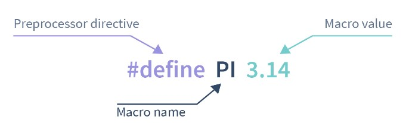
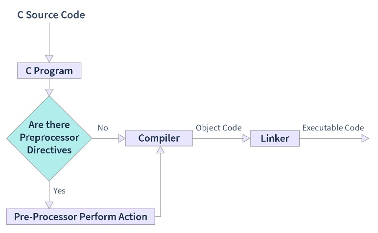

# Miscellaneous topics and Useful Utilities

- [Miscellaneous topics and Useful Utilities](#miscellaneous-topics-and-useful-utilities)
  - [Time](#time)
    - [C](#c)
  - [Random Number Generation](#random-number-generation)
    - [C](#c-1)
      - [C: Random Number in a Range](#c-random-number-in-a-range)
    - [Cpp](#cpp)
      - [CPP: Random Number in a Range](#cpp-random-number-in-a-range)
  - [Enums](#enums)
    - [enum in C](#enum-in-c)
  - [Macros in C](#macros-in-c)
    - [What are Preprocessor and Preprocessor Directives in C Programming?](#what-are-preprocessor-and-preprocessor-directives-in-c-programming)
    - [Types of Macros in C Language](#types-of-macros-in-c-language)
      - [Object like Macros in C](#object-like-macros-in-c)
      - [Function Like Macros in C](#function-like-macros-in-c)
    - [Predefined Macros in C Language](#predefined-macros-in-c-language)
  - [Command Line Arguments](#command-line-arguments)
    - [C: Command Line Arguments](#c-command-line-arguments)


## Time

### C

```cpp
#include <stdio.h>
#include <time.h>
void fn(int x, int n) {
    x = n * 2;
}
int main() {

    int i, j, x, n;
    clock_t start_time, end_time;
    double time_elapsed;

    start_time = clock();
    n = 12345678;
    for (int i = 0; i < 100000000; i++) {
        for (int j = 0; j < 10; j++) {
            x = n * 2;
        }
    }
    end_time = clock();
    time_elapsed = (double)(end_time - start_time) / CLOCKS_PER_SEC;
    printf("Time elapsed: %lf sec.\n", time_elapsed); //~1+sec

    start_time = clock();

    n = 12345678;
    for (int i = 0; i < 100000000; i++) {
        for (int j = 0; j < 10; j++) {
            fn(x, n);
        }
    }

    end_time = clock();

    time_elapsed = (double)(end_time - start_time) / CLOCKS_PER_SEC;
    printf("Time elapsed: %lf sec.", time_elapsed); //~2+sec

    return 0;
}
```


## Random Number Generation

### C


```c
#include <stdio.h>
#include <stdlib.h>
int main() {
    printf("%d ", rand());
    return 0;
}
```

But above code will generate same random number everytime. To generate different random number everytime, we need to seed the random number generator.

```c
#include <stdio.h>
#include <stdlib.h>
#include <time.h>
int main() {
    time_t t;
    srand((unsigned)time(&t));
    printf("%d ", rand());
    return 0;
}
```

#### C: Random Number in a Range

```c
#include <stdio.h>
#include <stdlib.h>
#include <time.h>
int main() {
    // time_t t;
    // srand((unsigned)time(&t));
    srand(time(NULL));

    const short int MAX = 100;
    const short int MIN = 20;
    int n = (rand() % (MAX - MIN + 1)) + MIN;

    printf("%d ", n);
    return 0;
}

```


### Cpp

```cpp
int main() {
    int n = rand();
    cout << n << endl;
    return 0;
}
```

But above code will generate same random number everytime. To generate different random number everytime, we need to seed the random number generator.

```cpp
#include <cstdlib>
#include <ctime>
#include <iostream>
using namespace std;

int main() {
    srand(time(NULL)); // srand(time(0));
    int n = rand();
    cout << n << endl;
    return 0;
}
```

#### CPP: Random Number in a Range

```cpp
int main() {
    srand(time(NULL)); // srand(time(0));
    const short int MAX = 100;
    const short int MIN = 20;
    int n = (rand() % (MAX - MIN + 1)) + MIN;
    cout << n << endl;

    return 0;
}
```

## Enums

### enum in C

```c
#include <stdio.h>
enum LEVEL { EASY,
             MEDIUM,
             HARD };
int main() {
    printf("value: %d\n", EASY);   // value: 0
    printf("value: %d\n", MEDIUM); // value: 1
    printf("value: %d\n", HARD);   // value: 2

    return 0;
}
```

setting value to enum

```c
#include <stdio.h>
enum LEVEL { EASY = 1,
             MEDIUM = 2,
             HARD = 3 };
int main() {
    printf("value: %d\n", EASY);   // value: 1
    printf("value: %d\n", MEDIUM); // value: 2
    printf("value: %d\n", HARD);   // value: 3

    return 0;
}
```

## Macros in C

Suppose we are working on an application in C language and there is one value or an object or segment of code which we require so many times in our code then with the help of macros we can define it once and use it many times.

`Macro` in C programming is known as the piece of code defined with the help of the `#define` directive. Macros in C are very useful at multiple places to replace the piece of code with a single value of the macro. Macros have multiple types and there are some predefined macros as well.

<div align="center">

</div>

- [https://www.scaler.com/topics/c/macros-in-c/](https://www.scaler.com/topics/c/macros-in-c/)


```c
#include <stdio.h>
#define PI 3.14

void main() {
    printf("PI =  %.2f", PI); // PI =  3.14
}
```

### What are Preprocessor and Preprocessor Directives in C Programming?

Whenever we write a certain code in C language it goes under the process of compilation where it gets converted from source code to machine understandable code.

But before the compilation process, the source code goes through preprocessing which is done by the preprocessor.

<div align="center">

</div>

As the above image shows preprocessor checks for preprocessing directives in the C program.

If there are some preprocessing directives found then certain actions are taken on them by the preprocessor.
There are multiple types of preprocessors such as `#define`, `#if`, `#error`, `#warning` etc., They all start with the `#` symbol.

To define the macro we use the `#define` preprocessing directive which performs the action to replace the macro name with the macro value at the time of preprocessing.

### Types of Macros in C Language

#### Object like Macros in C

An object like macros in C programming is simply the macros that get replaced by certain values or segments of code.


```c
// Examples of object like macros in C language
#define MAX 100
#define MIN 1
#define GRAVITY 9.8
#define NAME "Scaler"
#define TRUE 1
#define FALSE 0
```

#### Function Like Macros in C

In the function like macros are very similar to the actual function in C programming.

We can pass the arguments with the macro name and perform the actions in the code segment.

**In macros there is no type checking of arguments so we can use it as an advantage to pass different `datatypes` in same macros in C language.**


```c
#include <stdio.h>

//object like macro
#define PI 3.14

// function like macro
#define Area(r) (PI*(r*r))

void main()
{
    // declaration and initialization of radius
    float radius = 2.5;

    // declaring and assigning the value to area
    float area = Area(radius);

    // Printing the area of circle
    printf("Area of circle is %f\n", area);

    // Using radius as int data type
    int radiusInt = 5;
    printf("Area of circle is %f", Area(radiusInt));
}
```

more examples:

```c
#include <stdio.h>
#define MAX(a, b) (a > b ? a : b)
void main() {
    printf("%d", MAX(5, 10)); // 10
}
```

`\` is used to break the line in macros.

```c
#include <stdio.h>
#define SWAP(a, b) \
    {              \
        a ^= b;    \
        b ^= a;    \
        a ^= b;    \
    }

void main() {
    int a = 10, b = 20;
    printf("a=%d,b=%d\n", a, b);//a=10,b=20
    SWAP(a, b);
    printf("a=%d,b=%d\n", a, b);//a=20,b=10
}
```


### Predefined Macros in C Language


```c
#include <stdio.h>

void main() {

    // Example of predefined macros
    printf("This is line no.: %d\n", __LINE__);    // 7
    printf("Name of this file: %s\n", __FILE__);   // macros.c
    printf("Current Date: %s\n", __DATE__);        // Sep  5 2022
    printf("Current Time: %s\n", __TIME__);        // 12:17:35
    printf("Compilation success: %d\n", __STDC__); // 1
}
```


## Command Line Arguments

### C: Command Line Arguments

```c
#include <stdio.h>
#include <stdlib.h>

// int main(int argc, char *argv[]) {
int main(int argc, char **argv) {

    int n1, n2, sum;
    n1 = atoi(argv[1]);
    n2 = atoi(argv[2]);
    sum = n1 + n2;
    printf("%d + %d = %d", n1, n2, sum);

    return 0;
}
```

Terminal:

```bash
cd "..." ;  gcc main.c -o main ;  .\main 5 10

5 + 10 = 15
```

