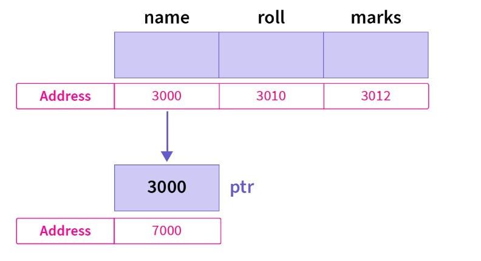
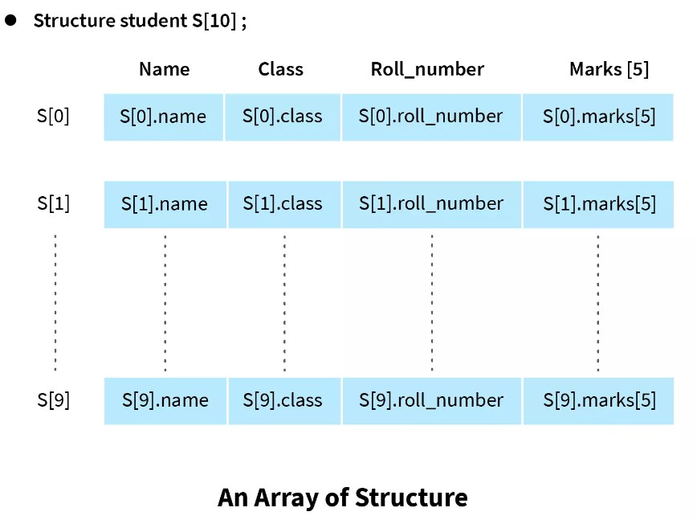

# User-Defined Datatype with Structure

- [User-Defined Datatype with Structure](#user-defined-datatype-with-structure)
  - [Introduction](#introduction)
    - [1. Creating and Declaring structure variables?](#1-creating-and-declaring-structure-variables)
    - [2. Initialization | Assignment](#2-initialization--assignment)
      - [🟣Implicit initialization : Using curly braces `‘{}’`](#implicit-initialization--using-curly-braces-)
      - [👉Using Dot '.' operator | PointersVsArrays Members Assignment](#using-dot--operator--pointersvsarrays-members-assignment)
      - [🌳Designated initializers|Explicit initialization](#designated-initializersexplicit-initialization)
  - [⚡Pointers with Structures🌟](#pointers-with-structures)
    - [Declare a Structure Pointer](#declare-a-structure-pointer)
    - [Initialization of Structure Pointer](#initialization-of-structure-pointer)
    - [Examples:](#examples)
      - [Accessing structure members using the `dot(.)` operator](#accessing-structure-members-using-the-dot-operator)
      - [🌟🌟Accessing structure members using `arrow(->)` operator](#accessing-structure-members-using-arrow--operator)
      - [🚀Structure pointer in function arguments🚀](#structure-pointer-in-function-arguments)
  - [🔥Array of Structures](#array-of-structures)
  - [🔥🔥 Dynamic Memory Allocation of Structure](#-dynamic-memory-allocation-of-structure)
  - [C Structures Limitations](#c-structures-limitations)

## Introduction


### 1. Creating and Declaring structure variables?

```c
// 1. struct declaration
struct StudentType {
    int id; //int id = 0; -> error; members cannot be initialized with declaration
    char name[40];
	int course_ids[5];
};
// declare a variable of type struct Student
int main(){
	struct StudentType s;
	//...
}

//🔥 2. Aliasing the type with `typedef` 🔥
typedef struct StudentType {
    int id;
    char name[40];
    // char *name;
    int course_ids[5];
} Student;
// declare a variable of type struct Student
int main() {
    Student s1;
	//..
}
```

### 2. Initialization | Assignment

#### 🟣Implicit initialization : Using curly braces `‘{}’`

```c
	//Initializing Structures
    Student s1 = {1, "Soikat Rahman", {201, 202, 203, 204}};

    printf("ID: %d, Name: %s\n", s1.id, s1.name);
    for (int i = 0; i < 5; i++) {
        if (s1.course_ids[i])
            printf("course taken: id - %d\n", s1.course_ids[i]);
    }
```

```bash
ID: 1, Name: Soikat Rahman
course taken: id - 201
course taken: id - 202
course taken: id - 203
course taken: id - 204
```

#### 👉Using Dot '.' operator | PointersVsArrays Members Assignment

- Using the dot (.) operator, we can `access` any structure member and then `initialize` or `assign` its value according to its data type.

```c
    Student s1 = {1, "Soikat Rahman", {201, 202, 203, 204}};
	// Assignment
    s1.id = 100;
    s1.name = "Soikat";//⚠️⚠️

	// Initialization
    struct Student s1;
    s1.id = 100;
    s1.name = "Soikat";//⚠️⚠️

```

Above code will throw error:

```bash
error: assignment to expression with array type
    | s1.name = "Soikat Rahman";
```

We can't assign to an array | see here [char s[] vs char *s](https://github.com/dev-SR/exercise/tree/main/C%2B%2B/1.5char-charArr-cString#char-smutable-vs-char-simmutable)

we have to use `strcpy` to assign to an array

```c
    // s1.name = "Soikat Rahman";
    strcpy(s1.name, "Soikat Rahman");
```

This could have avoided, if we used char pointer `char *s` instead of `char *s[40]`.

```c
typedef struct StudentType {
    int id;
    char name[40];
    // char *name;
    int course_ids[5];
} Student;

int main() {
    // Initializing Structures
     Student s1 = {1, "Soikat Rahman", {201, 202, 203, 204}};
    // Assignment
    s1.id = 100;
    s1.name = "Soikat";//OK
```

#### 🌳Designated initializers|Explicit initialization

Unlike implicit initialization, Designated Initialization allows structure members to be initialized in **any order**.

```c
typedef struct StudentType {
    int id;
    char name[40];
    // char *name;
    int course_ids[5];
} Student;

typedef struct Profile {
    char *description;
    Student owner;
} Profile;

int main(){
	Student s1 = {
			.name = "Soikat Rahman",
			.id = 1,
			.course_ids = {201, 202, 203}
			};

    Profile p = {
        .description = "Student Profile",
		// .owner.name = "X",
		// .owner.id = 1,
        .owner = {
            .id = 1,
            .name = "Soikat Rahman",
            .course_ids = {201, 202, 204}}};

	// Set new value...
	p.description = "New";
	// vs
	p = (Profile){
		.description = "Newer",
		.owner = {
			.name = "A"}

	};

}
```

## ⚡Pointers with Structures🌟

- [https://www.scaler.com/topics/c/pointers-and-structures-in-c/]([h](https://www.scaler.com/topics/c/pointers-and-structures-in-c/))

### Declare a Structure Pointer

<div align="center">

</div>

**A structure pointer stores the memory address of a structure variable**. This is the reason why in the figure ptr stores the location 3000 inside it which is the address of the variable student1.

We now know how structures are defined and used in a C code let us see how we can use structure with pointers to access structure variables and its members. Declaration of structure pointer is similar to the declaration of structure variables and the only difference is that the pointer name is prefixed with an asterisk `*` symbol.

Syntax:


```c
struct structure_name *structure_pointer;
```

### Initialization of Structure Pointer

After a structure pointer is declared we need to initialize it to a variable before using it. To initialize a variable we need to provide address of the **structure variable** using the `&` operator.

```c
structure_pointer = &structure_variable;
```

Also, the structure pointer can be initialized during the time of declaration.

```c
struct structure_type *structure_pointer = &structure_variable;
```

Accessing Structure Member Using Pointer
There are two ways to access values of structure members using pointers -

1. Using asterisk `(*)` and dot `(.)` operator with the structure pointer.
2. Using membership or arrow `(->)` operator.

### Examples:

#### Accessing structure members using the `dot(.)` operator

```c
#include <stdio.h>

// create a structure Coordinate
typedef struct Coordinate {
    // declare structure members
    int x, y;
} Coordinate;

int main() {
    Coordinate first_point;
    // declaring structure pointer
    Coordinate *cp;
    cp = &first_point;

    (*cp).x = 5;
    (*cp).y = 10;

    printf("First coordinate (x, y) = (%d, %d)", (*cp).x, (*cp).y);
    // First coordinate (x, y) = (5, 10)
}
```

Explanation:

Here, `cp` is a pointer that points to the structure variable `first_point`. This means dereferencing the pointer gives us the content of `first_point`. Hence, `*cp` and `first_point` are functionally identical. To access members of the structure dot operator can be used followed by the member name.

For example, in the example above:

- `(*cp).x` refers to member `x` of `first_point`.
- `(*cp).y` refers to member `y` of `first_point`.

Note: Parentheses around pointer is important because the precedence of dot operator is greater than indirection `(*)` operator.

#### 🌟🌟Accessing structure members using `arrow(->)` operator

Another way to access structure members in C is using the `(->)` operator. Using this way we don't need asterisk and dot operator with the pointer. To access members of structure using `(->)` operator we write pointer name with `->` followed by name of the member that is

```c
pointer_name->member_name
```

```c
typedef struct Student {
    char name[30];
    int age;
    int roll_number;
} Student;

int main() {
    Student student_1;
    Student *sp = &student_1;
    printf("Enter the details of the Student (student_1)\n");
    printf("\tName: ");
    scanf("%s", sp->name);
    printf("\tAge: ");
    scanf("%d", &sp->age);
    printf("\tRoll Number: ");
    scanf("%d", &sp->roll_number);

    printf("\n Display the details of the student_1 using Structure Pointer\n");
    printf("\tName: %s\n", sp->name);
    printf("\tAge: %d\n", sp->age);
    printf("\tRoll Number: %d", sp->roll_number);
}
```

#### 🚀Structure pointer in function arguments🚀

While passing structure as a function argument, structure variables are treated the same as variables of primitive data types. The basic syntax for passing structure as a function argument is


```c
// passing by value
return_type functionName (struct sturcture_name variable_name);
functionName(vaiable_name);

// passing by reference
return_type functionName (struct structure_name* varible_name);
functionName(&variable_name);
```

```c
#include <stdio.h>
#include <string.h>

typedef struct Student {
    char name[50];
    int id;
} Student;

// pass by value
void printStudent(const Student s) {
    printf("Name: %s, ID: %d\n", s.name, s.id);
}

// pass by reference
void changeStudent(Student *s) {
    s->id = 1;
    strcpy(s->name, "Soikat Rahman");
}

int main() {
    Student student1 = {.id = 101, .name = "Soikat"}; // initialising the object

    // passing by value
    printStudent(student1);
    // passing by reference
    changeStudent(&student1);

    printStudent(student1);
}
```

```bash
Name: Soikat, ID: 101
Name: Soikat Rahman, ID: 1
```

Here, we have defined function arguments as structure pointers and when we are creating function calls instead of passing structure variables we are passing reference of them to function. Because reference of variable is passed to the function any changes made on structure members inside function body will persist outside the function scope.

## 🔥Array of Structures

An array of structures written in C can be described as a collection of numerous structures variables containing data about different entities. It is used to hold information about various entities of diverse data types. The array of structures can also be described as a collection of structure variables.


<div align="center">

</div>

```c
typedef struct Student {
    char name[50];
    int id;
} Student;

void printStudent(const Student arr[], int size) {
    for (int i = 0; i < size; i++) {
        printf("name: %s id:  %d\n", arr[i].name, arr[i].id);
    }
}

int main() {

    Student arr[3];
    int n = (sizeof arr / sizeof arr[0]);

    printf("Enter 3 Student Name:\n");
    for (int i = 0; i < n; i++) {
        scanf(" %[^\n]", arr[i].name);
        arr[i].id = i + 1;
    }
    printStudent(arr, n);
    return 0;
}
```

Another Example:

```c
#include <math.h>
#include <stdio.h>
#include <stdlib.h>
#include <time.h>
#include <unistd.h>
#define RED "\e[0;91m"
#define GRN "\e[0;92m"
#define CYN "\e[0;96m"
#define NC "\e[0m"

#define LEN 5

typedef struct Sample {
    double temperature;
    time_t timestamp;
} Sample;

int rand_range_int(int min, int max) {
    return rand() % (max - min + 1) + min;
}

double rand_range(double min, double max, int decimal_digits) {
    double scale_factor = pow(10, decimal_digits);
    int scaled_min = round(min * scale_factor);
    int scaled_max = round(max * scale_factor);
    return rand_range_int(scaled_min, scaled_max) / scale_factor;
}

double get_temperature() {
    return rand_range(20, 25, 1);
}

int main() {
    printf("\n=== Arrays Of Structures ===\n\n");

    /* Let's build a temperature logger: we need temperature and timestamp */

    Sample samples[LEN];
    // Sample *samples = malloc(num * sizeof(Sample));

    for (int i = 0; i < LEN; i++) {
        printf("Sample %d...\n", i);
        samples[i].timestamp = time(NULL);
        samples[i].temperature = get_temperature();
        sleep(1);
    }

    /* print: timestamp, time offset from first sample, temperature */
    printf(CYN "\ntimestamp\ttime offset\ttemp\n" NC);

    for (int i = 0; i < LEN; i++) {
        printf("%ld\t%d" GRN "\t%12.1f\n" NC,
               samples[i].timestamp,
               samples[i].timestamp - samples[0].timestamp,
               samples[i].temperature);
    }
    return EXIT_SUCCESS;
}
```

## 🔥🔥 Dynamic Memory Allocation of Structure

```c
#include <stdio.h>
#include <stdlib.h>
#include <string.h>
#define TOTAL_SUBJECT 3
typedef struct Student {
    char name[50];
    int id;
    char grade[3];
    int marks[TOTAL_SUBJECT];
} Student;

// pass by ref so that we can modify
void calculate_grade(Student *s) {
    float score, sum = 0;
    for (int i = 0; i < TOTAL_SUBJECT; i++) {
        // printf("%d %f\n", s->marks[i], sum);
        sum += s->marks[i];
    }
    score = sum / TOTAL_SUBJECT;
    // printf("%f\n", score);

    if (score >= 80) {
        strcpy(s->grade, "A+");
    } else if (score >= 70) {
        strcpy(s->grade, "A");
    } else if (score >= 60) {
        strcpy(s->grade, "A-");
    } else if (score >= 50) {
        strcpy(s->grade, "B");
    } else if (score >= 40) {
        strcpy(s->grade, "C");
    } else {
        strcpy(s->grade, "F");
    }
}

void printStudent(const Student s[], int size) {
    printf("\n");
    for (int i = 0; i < size; i++) {
        printf("Name: %s\n", s[i].name);
        printf("ID: %d\n", s[i].id);
        printf("Marks:");
        for (int j = 0; j < TOTAL_SUBJECT; j++) {
            printf("%d ", s[i].marks[j]);
        }
        printf("\nGrade: %s\n\n", s[i].grade);
    }
}
void addStudent(Student *s, int nth) {
    nth++;
    printf("[%d]Enter Name:", nth);
    scanf(" %[^\n]", s->name);

    printf("[%d]Enter Id:", nth);
    scanf("%d", &s->id);

    printf("[%d]Enter marks of Phy., Che. Math:", nth);
    for (int j = 0; j < TOTAL_SUBJECT; j++) {
        scanf("%d", &s->marks[j]);
    }
    printf("\n");
}

int main() {

    Student *student_arr;
    int n, mark;
    printf("Enter number of student:");
    scanf("%d", &n);

    // student_arr = (Student *)malloc(n * sizeof(Student));
    student_arr = (Student *)calloc(n, sizeof(Student));

    if (student_arr == NULL) {
        printf("Memory not allocated.\n");
        exit(0);
    }
    printf("\nEnter %d Student Name:\n", n);
    for (int i = 0; i < n; i++) {
        // printf("Enter Name:");
        // scanf(" %[^\n]", student_arr[i].name);

        // printf("Enter Id:");
        // scanf("%d", &student_arr[i].id);

        // printf("Enter marks of Phy., Che. Math:");
        // for (int j = 0; j < TOTAL_SUBJECT; j++) {
        //     scanf("%d", &student_arr[i].marks[j]);
        // }
        addStudent(&student_arr[i], i);
        calculate_grade(&student_arr[i]);
    }
    printStudent(student_arr, n);
    free(student_arr);
    return 0;
}
```


```bash
>>Enter number of student:2

Enter 2 Student Name:
>>[1]Enter Name:jhon snow
>>[1]Enter Id:101
>>[1]Enter marks of Phy., Che. Math:80 90 70

>>[2]Enter Name:jackson jr.
>>[2]Enter Id:102
>>[2]Enter marks of Phy., Che. Math:20 30 40


Name: jhon snow
ID: 101
Marks:80 90 70
Grade: A+

Name: jackson jr.
ID: 102
Marks:20 30 40
Grade: F
```


## C Structures Limitations

 - Structures in C does not provide the data hiding property(by which we can make some members private and they cannot be accessed from outside of structure) and every member of the structure can be accessed.
 - We cannot define functions inside the Structures in C, so there is no constructor and as structures do not have their own memory so we cannot ever initialize our data members inside it.
 - If the alignment of the Structure members is not correct then they may cause some loss of memory.