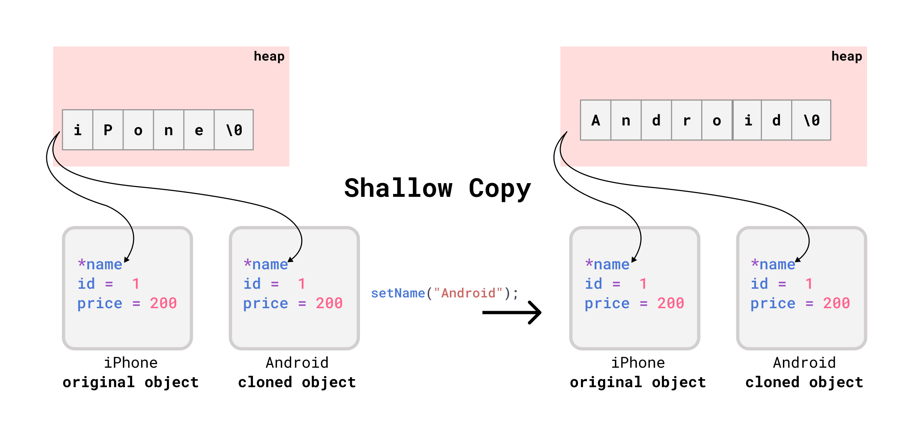
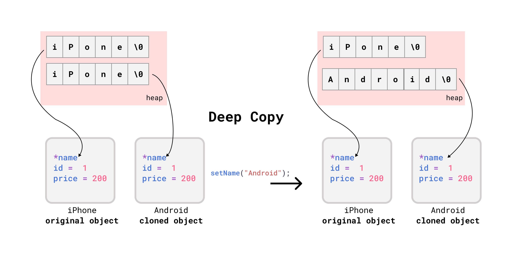

# OOP in C++

- [OOP in C++](#oop-in-c)
	- [Class intro](#class-intro)
		- [Access Modifiers](#access-modifiers)
		- [Getters and Setters](#getters-and-setters)
	- [Default Methods](#default-methods)
		- [Constructor](#constructor)
		- [🌟Copy Constructor](#copy-constructor)
			- [Default Copy Constructor](#default-copy-constructor)
			- [🚀When to create user defined Copy Constructor?](#when-to-create-user-defined-copy-constructor)
		- [🚀Copy Assignment Operator =](#copy-assignment-operator-)
		- [🌟Destructor - Deleting DMA](#destructor---deleting-dma)

## Class intro

```cpp
class Product {
    int id;
    char name[100];
    int price;
};

int main() {
    Product camera;
    cout << sizeof(camera) << endl;
    cout << camera.price << endl; // ERROR: `selling_price` declared private
    return 0;
}
```

### Access Modifiers

A class member can be defined as `public`, `private` or `protected`. By default members would be assumed as `private`.

```cpp
class Product {
public:
    int id;
    char name[100];
    int price;
};

int main() {
    Product camera;
    cout << sizeof(camera) << endl; // 108
    cout << camera.price << endl; // garbage value
    return 0;
}
```

### Getters and Setters

```cpp
class Product {
private:
    int id;
    char name[100];
    int mrp; // maximum retail price
    int selling_price;

public:
    void setMrp(int mrp) {
        if (mrp > 0)
            this->mrp = mrp;
    }
    void setSellingPrice(int price) {
        if (price > mrp)
            this->selling_price = mrp;
        else
            this->selling_price = price;
    }
    int getMrp() {
        return mrp;
    }
    int getSellingPrice() {
        return selling_price;
    }
};

int main() {
    Product camera;
    camera.setMrp(1000);
    camera.setSellingPrice(1200);
    cout << camera.getSellingPrice() << endl; //1000
    return 0;
}
```

## Default Methods

### Constructor

- Constructor Name = Class Name
- Called Automatically when an object is created.
- Memory Allocation happens when constructor is called.
- Constructor is called only once for each object.

```cpp
class Product {
private:
    int id;
    char name[100];
    int mrp; // maximum retail price
    int selling_price;

public:
    //Default Constructor
    Product() { }
    //Parameterized Constructor |  Constructor Overloading...
    Product(int id, char *name, int mrp, int selling_price) {
        this->id = id;
        this->mrp = mrp;
        this->selling_price = selling_price;
        strcpy(this->name, name); // `this->name = name` not possible because name is a char array.
    }

    //..
};

int main() {
    Product camera(1, "Nikon", 100, 200);
    // camera.setMrp(1000);
    // camera.setSellingPrice(1200);
    return 0;
}
```

### 🌟Copy Constructor

#### Default Copy Constructor

```cpp
    Product camera(1, "Nikon", 100, 200);
    camera.showDetails();
    // Product{id = 1, name = Nikon, mrp = 100, selling_price = 200}
    Product webcam(camera); // calls default copy constructor
    webcam.showDetails();
    // Product{id = 1, name = Nikon, mrp = 100, selling_price = 200}
```

If default copy constructor is working fine, then why do we need to write our own copy constructor?

To understand why, we need to understand the following:

- `shallow copy`
- `deep copy`

#### 🚀When to create user defined Copy Constructor?


The compiler created copy constructor works fine for most cases. We need to define our own copy constructor only if **an object has pointers to dynamically allocated objects**, ie a **deep copy** of object is needed.

The following example create dynamic memory for `name` -  a separate memory space is allocated for `name` and the pointer to that memory space is stored in `camera` object. When we copy `camera` to `webcam` object, the compiler creates a **shallow copy** of `camera` object and the pointer to the memory space of `name` is copied to `webcam` object as well. That means `webcam` object has a pointer to the same memory space as `camera` object.

<div align="center">

</div>

```cpp
class Product {
private:
    int id;
    char *name;
    int mrp;
    int selling_price;
public:
    Product(int id, char *name, int mrp, int selling_price) {
        this->id = id;
        this->mrp = mrp;
        this->selling_price = selling_price;
        // dynamically allocate memory for name
        this->name = new char[strlen(name) + 1];
        strcpy(this->name, name);
    }
    void setName(char *name) {
        strcpy(this->name, name);
    }

    //...
};

int main() {
    Product iPhone(1, "iPhone", 100, 200);
    Product android(iPhone);
    android.setName("Android");
    iPhone.showDetails();
    android.showDetails();
}
```

Output: both name are same.

```bash
Product{id = 1, name = iPhone, mrp = 100, selling_price = 200}
Product{id = 1, name = iPhone, mrp = 100, selling_price = 200}
Product{id = 1, name = Android, mrp = 100, selling_price = 200}
Product{id = 1, name = Android, mrp = 100, selling_price = 200}
```

To resolve this issue, we need to write our own copy constructor to create a **deep copy**.

<div align="center">

</div>

Syntax for user defined copy constructor:

`ClassName(ClassName &objectName) { }` - here copy constructor must pass it's first parameter as reference.

```cpp
class Product {
private:
    int id;
    char *name;
    int mrp; // maximum retail price
    int selling_price;

public:
    Product(int id, char *name, int mrp, int selling_price) {
        this->id = id;
        this->mrp = mrp;
        this->selling_price = selling_price;
        this->name = new char[strlen(name) + 1];
        strcpy(this->name, name);
    }
    Product(const Product &p) {
        id = p.id;
        mrp = p.mrp;
        selling_price = p.selling_price;
        // shallow copy
        name = p.name;
    }
    void setName(char *name) {
        strcpy(this->name, name);
    }
 //....
};

int main() {
    Product iPhone(1, "iPhone", 100, 200);
    Product android(iPhone);
    iPhone.showDetails();
    android.showDetails();
    android.setName("Android");
    iPhone.showDetails();
    android.showDetails();
    return 0;
}
```

Output: still remains same as the previous example.

```bash
Product{id = 1, name = iPhone, mrp = 100, selling_price = 200}
Product{id = 1, name = iPhone, mrp = 100, selling_price = 200}
Product{id = 1, name = Android, mrp = 100, selling_price = 200}
Product{id = 1, name = Android, mrp = 100, selling_price = 200}
```

Inside copy constructor, we need to allocate separate memory for `name` for the cloned object.

```cpp
class Product {
private:
    int id;
    char *name;
    int mrp;
    int selling_price;
public:

    Product(int id, char *name, int mrp, int selling_price) {
        this->id = id;
        this->mrp = mrp;
        this->selling_price = selling_price;
        this->name = new char[strlen(name) + 1];
        strcpy(this->name, name);
    }
    Product(const Product &X) {
        id = X.id;
        mrp = X.mrp;
        selling_price = X.selling_price;
        // shallow copy
        //  name = p.name;
        // deep copy
        name = new char[strlen(X.name) + 1];
        strcpy(name, X.name);

    }
    void setName(char *name) {
        strcpy(this->name, name);
    }
//...
};

int main() {
    Product iPhone(1, "iPhone", 100, 200);
    Product android(iPhone);
    iPhone.showDetails();
    android.showDetails();
    android.setName("Android");
    iPhone.showDetails();
    android.showDetails();
}
```

```bash
Product{id = 1, name = iPhone, mrp = 100, selling_price = 200}
Product{id = 1, name = iPhone, mrp = 100, selling_price = 200}
Product{id = 1, name = iPhone, mrp = 100, selling_price = 200}
Product{id = 1, name = Android, mrp = 100, selling_price = 200}
```

### 🚀Copy Assignment Operator =

Assignment operator is called when an **already initialized object is assigned a new value from another existing object**.

```cpp
class Product {
private:
    int id;
    char *name;
    int mrp; // maximum retail price
    int selling_price;
public:

    Product(int id, char *name, int mrp, int selling_price) {
        this->id = id;
        this->mrp = mrp;
        this->selling_price = selling_price;
        this->name = new char[strlen(name) + 1];
        strcpy(this->name, name);
    }
    void operator=(const Product &X) {
        id = X.id;
        mrp = X.mrp;
        selling_price = X.selling_price;
        // deep copy
        name = new char[strlen(X.name) + 1];
        strcpy(name, X.name);
    }
    void setName(char *name) {
        strcpy(this->name, name);
    }
//..
};

int main() {
    Product iPhone(1, "iPhone", 100, 200);
    Product android;
    android = iPhone;
    iPhone.showDetails();
    android.showDetails();
    android.setName("Android");
    iPhone.showDetails();
    android.showDetails();
    return 0;
}
```

### 🌟Destructor - Deleting DMA

- Function that is called Automatically when an object is destroyed ie object goes out of scope or destroyed explicitly by call to delete.
- Compiler provides a default destructor.
- User defined destructor is needed when **class contains pointers to dynamically allocated.**

```cpp
class Product {
private:
    int id;
    char *name;
    int price;

public:
    Product(int id, char *name, int price) {
        this->id = id;
        this->price = price;
        // dynamically allocate memory for name
        this->name = new char[strlen(name) + 1];
        strcpy(this->name, name);
    }
    // Destructor to delete dynamically allocated memory
    ~Product() {
        cout << "Deleting " << name << endl;
        if (name != NULL)
            delete[] name;
        name = NULL;
    }
};
```
