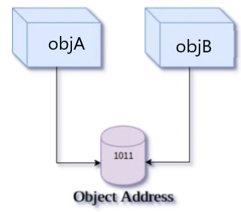

# Copy Constructor

Copy Constructors is a type of constructor which is used to create a copy of an
already existing object of a class type.

> Syntax of Copy Constructor

```cpp
Classname(const classname &objectname)
{
    . . . .
}
```

> ex:

```cpp
class Point
{
private:
    int x, y;
public:
    Point(int x1, int y1) { x = x1; y = y1; }
    // Copy constructor
    Point(const Point &p1) {x = p1.x; y = p1.y; }

};

int main()
{
    Point p1(10, 15); // Normal constructor is called here
    Point p2 = p1; // Copy constructor is called here

    return 0;
}

```

## When is copy constructor called?

---

In C++, a Copy Constructor may be called in the following cases:

-  When an object is returned by value.
-  When an object is passed (to a function) by value as an argument.
-  When an object is constructed based on another object of the same class.
-  When the compiler generates a temporary object.

It is, however, not guaranteed that a copy constructor will be called in all
these cases, because the C++ Standard allows the compiler to optimize the copy
away in certain cases

# Shallow Copy vs Deep Copy

## Shallow copy

---

Shallow copy copies references to original objects. The compiler provides a
default copy constructor. Default copy constructor provides a shallow copy as
shown in below example. It is a bit-wise copy of an object.

> Shallow Copy



Shallow copy constructor is used when class is not dealing with any dynamically
allocated memory.

## Deep Copy

---

The compiler created copy constructor works fine in general. We need to define
our own copy constructor only if an object has pointers or any runtime
allocation of the resource like filehandle, a network connection..etc.

Deep copy allocates separate memory for copied information. So the source and
copy are different. Any changes made in one memory location will not affect copy
in the other location. When we allocate dynamic memory using pointers we need
user defined copy constructor. Both objects will point to different memory
locations.

> Deep Copy


**Deep copy is possible only with user defined copy constructor.** In user
defined copy constructor, we make sure that pointers (or references) of copied
object point to new memory locations.

General requirements for deep copy:

-  A normal constructor.
-  A destructor to delete the dynamically allocated memory.
-  A copy constructor to make a copy of the dynamically allocated memory. An
   overloaded assignment operator.
