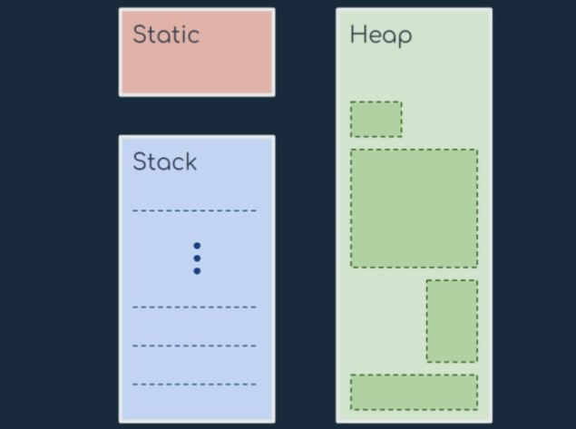

# Dynamic Memory Allocation

- [Dynamic Memory Allocation](#dynamic-memory-allocation)
	- [Methods](#methods)

**Static**: global variable storage, permanent for the entire run of the program

- Life cycle as the entire life of the program
- Global variables, declared outside functions
- Static variables, declared inside functions
- Only one copy of that variable for the whole program

**Stack**: local variable storage (automatic,continuous memory, LIFO)

- Automatically managed
- Grows and shrink as LIFO (Last In First Out)
- Local variables and parameters of a function
- Life cycle limited to the life cycle of that function
- Limited pool of memory
- Stack overflow may occur!

**Heap**: dynamic storage (large pool of memory,not allocated in contiguous order)

- Managed by the programmer
- Allocation and the de-allocation with special functions
- Large pool of memory, physical memory bounds
- Memory blocks managed using pointers
- Memory leaks can occur!

**How to choose one...**

**Static**: for memory you know in advance you will always need it throughout the program

**Stack**: when you have data you need as long as a function is on the stack

**Heap**: for maximum flexibility, when you don't know in advance how much room you'll need

## Methods

| Method                                      | Description                                                                                                                                                                                 |
| ------------------------------------------- | ------------------------------------------------------------------------------------------------------------------------------------------------------------------------------------------- |
| `void *malloc(size_t size)`                 | `Allocate memory` : The malloc() function reserves a block of memory of the specified number of bytes. And, it returns a pointer of void which can be casted into pointers of any form.     |
| `void *calloc(size_t num, size_t size)`     | `Allocate array of elements` : The malloc() function allocates memory and leaves the memory uninitialized, whereas the calloc() function allocates memory and initializes all bits to zero. |
| `void *realloc(void *ptr, size_t new_size)` | `Reallocate memory` : If the dynamically allocated memory is insufficient or more than required, you can change the size of previously allocated memory using the realloc() function.       |
| `void free(void *ptr)`                      | `Free memory`: Dynamically allocated memory created with either calloc() or malloc() doesn't get freed on their own. You must explicitly use free() to release the space.                   |
