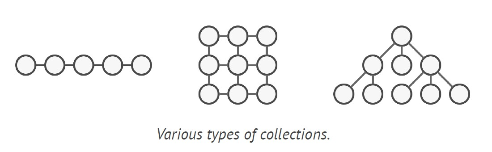
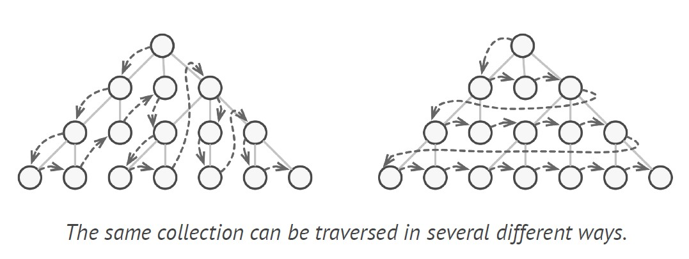
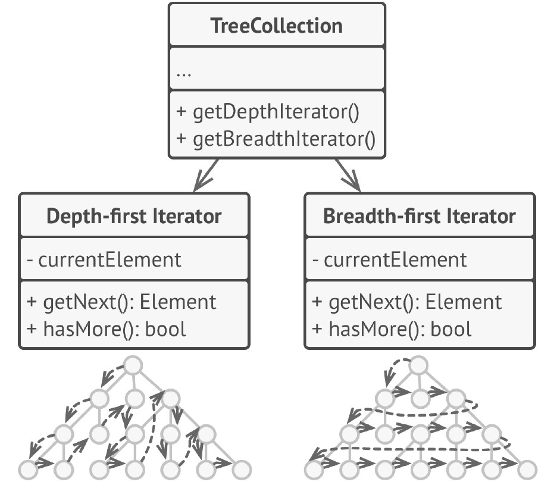
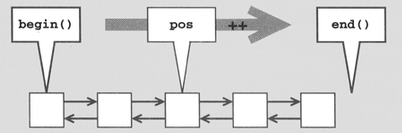
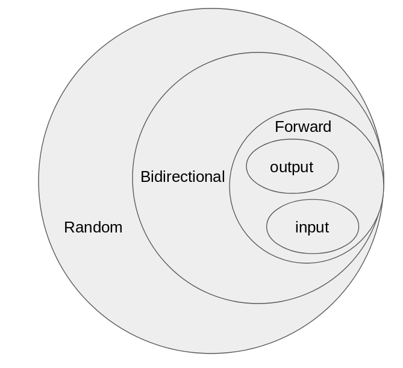
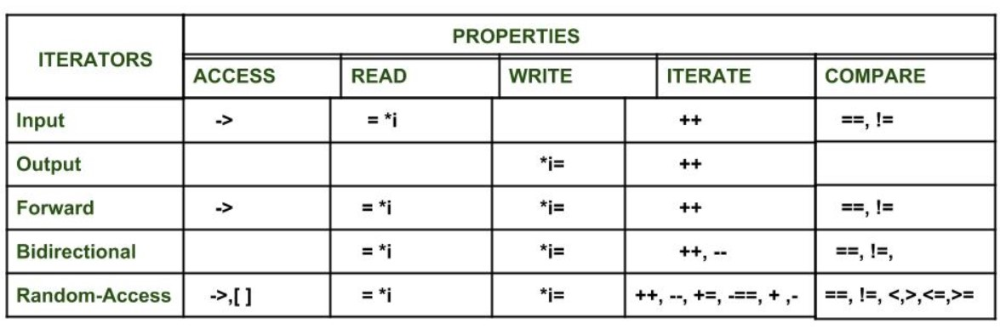

# ITERATOR

**Iterator** is a behavioral design pattern that lets you traverse elements of a collection **without exposing its underlying representation** `(list, stack, tree, etc.)`.

## Problem

Collections are one of the most used data types in programming. Nonetheless, a collection is just a container for a group of objects.

<div align="center"></div>

But no matter how a collection is structured, it must provide some way of accessing its elements so that other code can use these elements. There should be a way to go through each element of the collection without accessing the same elements over and over.

This may sound like an easy job if you have a collection based on a list. You just loop over all of the elements. But how do you sequentially traverse elements of a complex data structure, such as a tree? For example, one day you might be just fine with depth-first traversal of a tree. Yet the next day you might require breadth-first traversal. And the next week, you might need something else, like random access to the tree elements.

<div align="center"></div>

Adding more and more traversal algorithms to the collection gradually blurs its primary responsibility, which is efficient data storage. Additionally, some algorithms might be tailored for a specific application, so including them into a generic collection class would be weird.

On the other hand, the client code that’s supposed to work with various collections may not even care how they store
their elements. However, since collections all provide different ways of accessing their elements, you have no option other than to couple your code to the specific collection classes.

## Solution

The main idea of the Iterator pattern is to extract the traversal behavior of a collection into a separate object called an iterator.

In addition to implementing the algorithm itself, an iterator object encapsulates all of the traversal details, such as the current position and how many elements are left till the end.Because of this, several iterators can go through the same collection at the same time, independently of each other.

<div align="center"></div>

Usually, iterators provide one primary method for fetching elements of the collection. The client can keep running this
method until it doesn’t return anything, which means that the iterator has traversed all of the elements.

All iterators must implement the same interface. This makes the client code compatible with any collection type or any traversal algorithm as long as there’s a proper iterator. If you need a special way to traverse a collection, you just create a new iterator class, without having to change the collection or the client.

## Iterators in C++

An iterator is an object (like a pointer) that points to an element inside the container. We can use iterators to move through the contents of the container.

<div align="center"></div>

Iterators play a critical role in connecting algorithm with containers along with the manipulation of data stored inside the containers. The most obvious form of an iterator is a pointer. A pointer can point to elements in an array and can iterate through them using the increment operator (++). But, all iterators do not have similar functionality as that of pointers.

Depending upon the functionality of iterators they can be classified into five categories, as shown in the diagram below with the outer one being the most powerful one and consequently the inner one is the least powerful in terms of functionality.

<div align="center"></div>

### Five Iterators

**Input Iterators:**

A entity through which you can read data from container and move ahead.
For example - A Keyboard

**Output Iterators:**

A entity through which you can write into the container and move ahead.

**Forward Iterators:**

Iterator with functionalities of input and output iterator in single direction.
For Example - Singly Linked List

**Bidirectional Iterators:**

Forward Iterator that can move in both directions.

**Random Access Iterators:**

Random Access Iterator is an iterator that can read/write in both directions and also can take
jumps.

The following diagram shows the difference in their functionality with respect to various operations that they can perform.

<div align="center"></div>

### Some of the benefits of using iterators are as listed below

1. **Convenience in programming:** It is better to use iterators to iterate through the contents of containers as if we will not use an iterator and access elements using `[ ] operator`, then we need to be always **worried about the size of the container**, whereas with iterators we can simply use member function `end()` and iterate through the contents without having to keep anything in mind.

```cpp

    vector<int> v = {1, 2, 3};
    // Declaring an iterator
    vector<int>::iterator i;
    int j;

    cout << "Without iterators = ";
    // Accessing the elements without using iterators
    for (j = 0; j < 3; ++j) {
        cout << v[j] << " ";
    }

    cout << "\nWith iterators = ";
    // Accessing the elements using iterators
    for (i = v.begin(); i != v.end(); ++i) {
        cout << *i << " ";
    }
```

2. **Code reusability:** Now consider if we make `v` a `list` in place of vector in the above program and if we were not using iterators to access the elements and only using `[ ] operator`, then in that case this way of accessing was of no use for list (as they don’t support random-access iterators). However, if we were using iterators for vectors to access the elements, then just changing the vector to list in the declaration of the iterator would have served the purpose, without doing anything else So, iterators support reusability of code, as they can be used to access elements of any container.

3. **Dynamic processing of the container:**Iterators provide us the ability to dynamically add or remove elements from the container as and when we want with ease.

```cpp

	vector<int> v = {1, 2, 3};
    vector<int>::iterator i;
    int j;
    // Inserting element using iterators
    for (i = v.begin(); i != v.end(); ++i) {
        if (i == v.begin()) {
            i = v.insert(i, 5);
            // inserting 5 at the beginning of v
        }
    }

    // v contains 5 1 2 3
    // Deleting a element using iterators
    for (i = v.begin(); i != v.end(); ++i) {
        if (i == v.begin() + 1) {
            i = v.erase(i);
            // i now points to the element after the
            // deleted element
        }
    }

    // v contains 5 2 3
    // Accessing the elements using iterators
    for (i = v.begin(); i != v.end(); ++i) {
        cout << *i << " ";
    }
```
