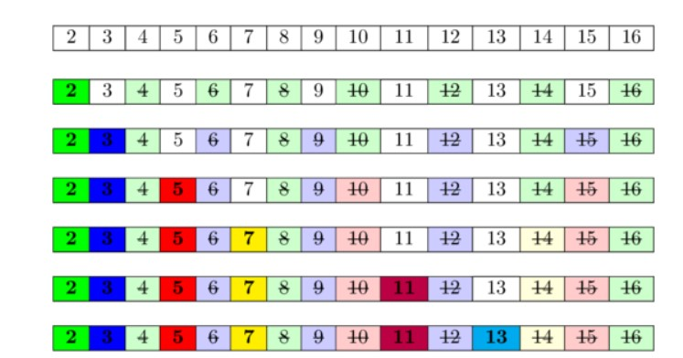

# C Basics

- [C Basics](#c-basics)
  - [Data Types| Format Specifiers | Type Casting | Input/Output](#data-types-format-specifiers--type-casting--inputoutput)
    - [Format specifiers in C](#format-specifiers-in-c)
    - [Implicit Type Conversion](#implicit-type-conversion)
    - [Explicit Type Conversion](#explicit-type-conversion)
    - [overflow](#overflow)
    - [`scanf()`](#scanf)
  - [Control Flow](#control-flow)
    - [Ex: GCD (Greatest Common Divisor/Factor)](#ex-gcd-greatest-common-divisorfactor)
      - [v1](#v1)
      - [v2](#v2)
    - [IsPrime: n/2,sqrt(n)](#isprime-n2sqrtn)
    - [isPrime: using Sieve of Era.tos.thenes](#isprime-using-sieve-of-eratosthenes)

## Data Types| Format Specifiers | Type Casting | Input/Output

### Format specifiers in C

Format specifiers define the type of data to be printed on standard output. You need to use format specifiers whether you're printing formatted output with `printf()` or  accepting input with `scanf()`.

| Format Specifier | Used For       |
| ---------------- | -------------- |
| `%c`             | Character      |
| `%s`             | String         |
| `%d`             | Signed integer |
| `%f`             | Float values   |
| `%lf`            | Double         |
| `%Lf`            | Long double    |
| `%lli or %lld`   | Long long      |
| `%p`             | Pointer        |
| `%x` ,`%X`       | hexadecimal    |

There are different other basic format specifiers where we add symbols before the format specifiers. Such symbols are as follows:

- `–` (minus symbol) this is used for left alignment
- A `number` after % defines that minimum field width and if the string is less than the specified width then by default it will be filled with spaces.
- Then we use (`.`) period this symbol is used to separate field width and its precision.

```c
 char str[] = "HelloWorld";
    printf("%20s\n", str);
    printf("%-20s\n", str);
    printf("%20.5s\n", str);
    printf("%-20.5s\n", str);
    double i = 101.12345;
    printf("%.2lf", i);
    /*
                HelloWorld
    HelloWorld
                Hello
    Hello
 101.12
    */
```

### Implicit Type Conversion

When the type conversion is performed automatically by the compiler without programmers intervention, such type of conversion is known as implicit type conversion or type promotion.

```c
#include <stdio.h>
int main() {
 int a = 10.10, b = 10, sum;
 sum = a + b;
 printf("%d + %d = %d", a, b, sum); // 10 + 10 = 20

 int aa = -50.50;
 printf("%d", aa); //-50
}
```

### Explicit Type Conversion

The type conversion performed by the programmer by posing the data type of the expression of specific type is known as explicit type conversion. The explicit type conversion is also known as type casting.

```c
    int n;
    double d;

    d = 10.10;
    n = d;
    printf("%d\n", n);  //-5010 [garbage]
    printf("%lf\n", d); // 10.1000

    n = (int)d;
    printf("%d\n", n); // 10

    d = n;
    printf("%lf\n", d); // 10.1000
```

### overflow

```c
 n = 1000020004000503;
    printf("%d\n", n); // 1293636343| warning: overflow in conversion from 'long long int' to 'int' changes value from '1000020004000503' to '1293636343'
    n = -4325987632;
    printf("%d\n", n); // -31020336| warning: overflow in conversion from 'long long int' to 'int' changes value from '-4325987632' to '-31020336' [-overflow]
```

### `scanf()`

```c
int main() {

    int a;
    scanf("%d", &a);
    printf("%d\n", a);

    double x, y;
    scanf("%lf %lf", &x, &y);
    printf("%lf %lf\n", x, y);

    // At this point we're leaving the '\n' on stdin:
    // Therefore we have to eat it.
    getchar(); // <-- Makes eat the space characters, tabulations, newline.

    char c1;
    printf("Enter C1:");
    scanf("%c", &c1);
    printf("%c\n", c1);

    getchar(); // <-- Makes eat the space characters, tabulations, newline.

    char c2;
    printf("Enter C2:");
    c2 = getchar();
    printf("%c\n", c2);

    getchar(); // <-- Makes eat the space characters, tabulations, newline.

    char ch;
    do {
        printf("Enter a character | `q` to Quit\n");
        scanf("\n%c", &ch); /* '\n' <-- Makes `scanf` eat the newline. */
        // or
        // scanf(" %c", &ch); /* ' ' <-- Makes `scanf` eat the newline. */
        printf("%c\n", ch);
    } while (ch != 'q');

    return 0;
}

```

- [https://stackoverflow.com/questions/13710867/problems-with-character-input-using-scanf](https://stackoverflow.com/questions/13710867/problems-with-character-input-using-scanf)
- [https://www.geeksforgeeks.org/problem-with-using-fgets-gets-scanf-after-scanf-in-c/](https://www.geeksforgeeks.org/problem-with-using-fgets-gets-scanf-after-scanf-in-c/)

## Control Flow

### Ex: GCD (Greatest Common Divisor/Factor)

#### v1

The HCF or GCD of two integers is the largest integer/factor that can exactly divide both numbers (without a remainder).

- `x` is gcd if `a%x == 0` and `b%x == 0`

```c
int main() {
    int a, b, x, gcd;
    scanf("%d %d", &a, &b);// 12 16

    if (a > b) {
        x = b;
    } else {
        x = a;
    }

    for (; x >= 1; x--) {
        if (a % x == 0 && b % x == 0) {
            gcd = x;
            printf("%d ", gcd);
        }
    }

    return 0;
}
```

But this code doesn't print the GCD, it prints the factors of the GCD.

```bash
IN: 10 16
OUT:
4 2 1
```

Here we can see that the GCD is `4` (largest) and the factors are `4`, `2` and `1`.

Therefore, we can simply stop the loop when we find the first factor.

```c
int main() {
    int a, b, x, gcd;
    scanf("%d %d", &a, &b); // 12 16

    if (a > b) {
        x = b;
    } else {
        x = a;
    }

    for (; x >= 1; x--) {
        if (a % x == 0 && b % x == 0) {
            gcd = x;
            printf("%d ", gcd);
            break; /// Important to stop at first factor (largest)
        }
    }

    return 0;
}

```

#### v2

- `gcd(a,0) = a`
- `gcd(a,b) =gcd(b,r) ; r=a%b` do this until `b = 0` then `a` is the gcd;


```c
int main() {
    int a, b, temp, gcd;
    scanf("%d %d", &a, &b);

    if (a == 0) {
        gcd = a;
    } else if (b == 0) {
        gcd = b;
    } else {
        while (b != 0) {
            // gcd(a,b) = gcd(b,a%b)
            temp = b;
            b = a % b; // a<->b
            a = temp;  // b<->a%b
        }
        gcd = a;
        printf("%d", gcd);
    }

    return 0;
}
```

### IsPrime: n/2,sqrt(n)

```c
#include <math.h>
#include <stdio.h>

int is_prime(int n) {
    int i;
    if (n == 2) {
        return 1;
    }

    if (n % 2 == 0)
        return 0;

    int upto = sqrt(n); // or n/2

    for (i = 3; i < upto; i = i + 2) { // i+=2 to avoid even number altogether
        if (n % i == 0) {
            return 0;
        }
    }
    return 1;
}
int main() {
    int n;
    while (1) {

        printf("Please Enter a number (0 to exit):");
        scanf("%d", &n);
        if (n == 0)
            break;
        if (1 == is_prime(n))
            printf("%d is prime\n", n);
        else
            printf("%d is not a prime\n", n);
    }

    return 0;
}
```

### isPrime: using Sieve of Era.tos.thenes

<div align="center">

</div>


```c
#include <math.h>
#define SIZE 40

int area[SIZE];
void sieve() {
    int i;
    for (i = 2; i < SIZE; i++) {
        area[i] = 1; // initially mark from 2 to 40 as prime [ 1 1 1 1 1 1....]
    }

    int upto = sqrt(SIZE);

    for (i = 2; i < upto; i++) {
        if (area[i] == 1) { // current number is prime
            for (int j = 2; j <= SIZE; j++) {//or i*j<=SIZE also possible
                // mark all it's multiple as not prime
                int multiples_of_i = i * j;
                area[multiples_of_i] = 0;
            }
        }
    }
}
int is_prime(int n) {
    int i;
    if (n < 2)
        return 0;
    return area[n];
}

int main() {
    int n;
    sieve();
    while (1) {
        printf("Please enter a number (0 to exit):");
        scanf("%d", &n);
        if (n == 0)
            break;

        if (n >= SIZE) {
            printf("Number should be less than %d\n", SIZE);
            continue;
        }

        if (1 == is_prime(n)) {
            printf("%d is a prime number\n", n);
        } else {
            printf("%d is not a prime number\n", n);
        }
    }

    return 0;
}
```

Visualize the Sieve of Eratosthenes


```c
#include <math.h>
#define SIZE 40

int area[SIZE];

void print_area() {
    int i;
    for (i = 2; i < SIZE; i++) {
        printf("%4d", area[i]);
    }
    printf("\n");
    for (i = 2; i < SIZE; i++) {
        printf("----");
    }
    printf("\n");
}

void sieve() {
    int i;
    for (i = 2; i < SIZE; i++) {
        area[i] = 1; // initially mark from 2 to 40 as prime [ 1 1 1 1 1 1....]
    }
    print_area();

    int upto = sqrt(SIZE);

    for (i = 2; i < upto; i++) {
        if (area[i] == 1) {                       // current number is prime
            for (int j = 2; i * j <= SIZE; j++) { // or i*j<=SIZE also possible
                // mark all it's multiple as not prime
                int multiples_of_i = i * j;
                area[multiples_of_i] = 0;
            }
            print_area();
        }
    }
}
```


```bash
   1   1   1   1   1   1   1   1   1   1   1   1   1   1   1   1   1   1   1   1   1   1   1   1   1   1   1   1   1   1   1   1   1   1   1   1   1   1
--------------------------------------------------------------------------------------------------------------------------------------------------------
   1   1   0   1   0   1   0   1   0   1   0   1   0   1   0   1   0   1   0   1   0   1   0   1   0   1   0   1   0   1   0   1   0   1   0   1   0   1
--------------------------------------------------------------------------------------------------------------------------------------------------------
   1   1   0   1   0   1   0   0   0   1   0   1   0   0   0   1   0   1   0   0   0   1   0   1   0   0   0   1   0   1   0   0   0   1   0   1   0   0
--------------------------------------------------------------------------------------------------------------------------------------------------------
   1   1   0   1   0   1   0   0   0   1   0   1   0   0   0   1   0   1   0   0   0   1   0   0   0   0   0   1   0   1   0   0   0   0   0   1   0   0
--------------------------------------------------------------------------------------------------------------------------------------------------------
Please enter a number (0 to exit):7
7 is a prime number
```