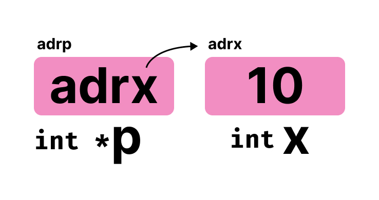
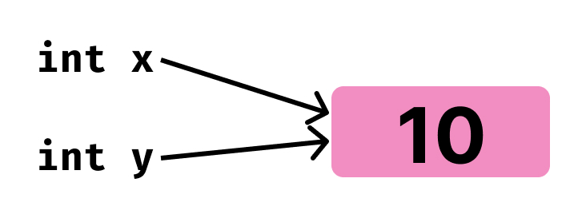

# Pointer & Reference

- [Pointer & Reference](#pointer--reference)
  - [🚀Pointer](#pointer)
    - [Address Operator(`&`)](#address-operator)
    - [Assigning Address to a Pointer Variables | `type *name = address`](#assigning-address-to-a-pointer-variables--type-name--address)
    - [🚨Dereference Operator(`*`) | `*p => contents of the pointer`](#dereference-operator--p--contents-of-the-pointer)
    - [Null Pointer](#null-pointer)
  - [👉Reference(`&`) in  C++](#reference-in--c)
  - [✅✅Pass by Reference: Using `pointer`|`reference`](#pass-by-reference-using-pointerreference)
    - [Differences between 👉pointers and 👉references in C++](#differences-between-pointers-and-references-in-c)
    - [When to use What](#when-to-use-what)
  - [🌼 `const` Pointers|References](#-const-pointersreferences)
  - [Arrays are 🧠🧠Passed as References🧠🧠 by Default](#arrays-are-passed-as-references-by-default)
  - [More Pointer|Reference Applications](#more-pointerreference-applications)
    - [🚀🚀Reference: Modify array in a range based for loop](#reference-modify-array-in-a-range-based-for-loop)
    - [🚀🚀Avoiding a copy of large structures](#avoiding-a-copy-of-large-structures)
    - [🚀For Each Loop to avoid the copy of objects](#for-each-loop-to-avoid-the-copy-of-objects)

## 🚀Pointer

### Address Operator(`&`)

To get the address of a variable, use the `&` operator.

```cpp
    int a = 10;
    cout << &a << endl; // 0x59ca3ffd2c
```

```c
int main() {
    int ar[] = {1, 2, 3, 4, 5};
    for (int i = 0; i < 5; i++) {
        printf("address of a[%d]: %p\n", i, &ar[i]);//use %p format specifier to print the address/pointer.
    }
    return 0;
}
/*

address of a[0]: 000000B44D3FFA50
address of a[1]: 000000B44D3FFA54
address of a[2]: 000000B44D3FFA58
address of a[3]: 000000B44D3FFA5C
address of a[4]: 000000B44D3FFA60

*/
```

Correct format specifier to print pointer or address?

```c
    int a = 12;
    int *ptr = &a;

    printf("%x\n", ptr); // 38fffd28
    printf("%X\n", ptr); // 38FFFD28
    printf("%p\n", ptr); // 0000002038FFFD28
```

The simplest answer, assuming you don't mind the vagaries and variations in format between different platforms, is the standard `%p` notation.

- [https://stackoverflow.com/questions/9053658/correct-format-specifier-to-print-pointer-or-address](https://stackoverflow.com/questions/9053658/correct-format-specifier-to-print-pointer-or-address)


### Assigning Address to a Pointer Variables | `type *name = address`

A pointer variable is a variable that stores the address of another variable. To declare a pointer variable, use the `*` operator.

```cpp
    int a = 10;
    int *p;
    p = &a;
    cout << &a << endl; // 0xd8609ff95c -> address of a
    cout << p << endl;  // 0xd8609ff95c -> address of a
    cout << &p << endl; // 0xd8609ff950 -> address of p itself
```

<div align="center">
 
</div>

### 🚨Dereference Operator(`*`) | `*p => contents of the pointer`

An interesting property of pointers is that they can be **used to access the variable they point to directly**. This is done by preceding the pointer name with the dereference operator (`*`). The operator itself can be read as `"value pointed to by"`. This means **we can read `(*)p` as the `"contents of the pointer"`.**

- `&value => address`
- `*address => value`

```cpp
 int a = 10;
 int *p;
 p = &a;
 cout << *p << endl; // 10
```

Once pointer is assigned to a variable, the initial content of pointer will be the content of that variable. Then we can `change` the content of that variable either by assigning new value through the `pointer` or `the variable` itself.

```cpp
int main() {
    int a = 10;
    int *p;
    p = &a;
    printf("Initial Content: %d\n", a);                 // 10
    printf("Initial Content of the pointer: %d\n", *p); // 10

    // changing the content thorough the variable itself:
    a = 20;
    printf("Content now: %d\n", a);                   // 20
    printf("Content of the pointer, now : %d\n", *p); // 20

    // changing the content thorough the pointer:
    *p = 30;
    printf("Content now: %d\n", a);                   // 30
    printf("Content of the pointer, now : %d\n", *p); // 30
}
```

Here `*p = 30`  changes the content of the variable `a` to `30`, as pointer `p` is pointing to `a`.

```c
#include <stdio.h>
#define RED "\e[0;91m"
#define GRN "\e[0;92m"
#define NC "\e[0m"
int main() {
    // Declare and Access
    int a = 12;
    int *ptr = &a;
    printf("ptr: %p  %x  %X", ptr, ptr, ptr);

    // !GET content of pointer
    int n1 = *ptr;
    printf("\nContent: %d", a);    // 12
    printf("\nContent: %d", *ptr); // 12
    printf("\nContent: %d", n1);   // 12

    // !SET new value using pointer
    *ptr = 99;
    printf("\nNew Content: %d", a);    // 99
    printf("\nNew Content: %d", *ptr); // 99

    // !void Pointers
    void *vPtr = &a;
    // int n3 = *vPtr; // warning: dereferencing 'void *' pointer
    // must cast a void pointer before indirection
    int n3 = *((int *)vPtr);          // converting to an integer
    printf(RED "\nn3:" NC " %d", n3); // 99
}
```

### Null Pointer

A null pointer has a reserved value that is called a null pointer constant for indicating that **the pointer does not point to any valid object or function**. You can use null pointers in the following cases:

- Initialize pointers.
- To check for a null pointer before accessing any pointer variable
- Represent conditions such as the end of a list of unknown length.
- Indicate errors in returning a pointer from a function.

```c
int main() {
    int x = 1;
    int *p = NULL;
    printf("content of x: %d", x);
    printf("content of *p: %d", *p);
    return 0;
}
```

If we run the above program, the program will crash as the pointer `p` is  not pointing to any valid object or function.

The following code will also crash:

```c
int main() {
    int *p = NULL;
    *p = 100;
    return 0;
}
```

Because we are trying to assign a pointer that is pointing nowhere.

Below is an example for checking for a null pointer before accessing any pointer variable:

```c
int main() {
    int x = 1;
    int *p = NULL;
    if (p) {
        *p = 100;
        printf("content of *p: %d", *p);
    }
    p = &x;
    if (p) {
        *p = 10;
        printf("content of *p: %d", *p); // content of *p: 10
    }
}
```

Here, 2nd if block is executed because at this moment `p` is pointing to `x`.


## 👉Reference(`&`) in  C++

A reference is an `alias` for an already existing variable. Once a reference is initialized to a variable, it cannot be changed to refer to another variable. Hence, a reference is similar to a `const pointer`.

- [https://www.geeksforgeeks.org/references-in-c/](https://www.geeksforgeeks.org/references-in-c/)

```cpp
int main() {
    int x = 10;
    int &y = x;
    y++;
    x++;
    cout << x << " " << &x << endl; // 12 0x7ffc8b9d8b50
    cout << y << " " << &y << endl; // 12 0x7ffc8b9d8b50
}
```

<div align="center">

</div>

## ✅✅Pass by Reference: Using `pointer`|`reference`

This technique uses in/out-mode semantics. **Changes made to formal parameter do get transmitted back to the caller through parameter passing**. **Any changes to the formal parameter are reflected in the actual parameter in the calling environment as formal parameter receives a reference (or pointer) to the actual data**. This method is also called as call by reference. This method is efficient in both time and space.

```cpp
void watchVideo(int views) {
    views = views + 1;
}

int main() {
    int views = 100;
    watchVideo(views);
    cout << "views: " << views << endl;//100
}
```

vs:

```cpp
void watchVideo(int *viewsPtr) // int *viewsPtr=&views
{
    *viewsPtr = *viewsPtr + 1;
}

int main() {
    int views = 100;
    watchVideo(&views);
    cout << "views: " << views << endl; // views: 101
}
```

Using `reference`:

```cpp
void watchVideo(int &viewsPtr) // int *viewsPtr=&views
{
    viewsPtr = viewsPtr + 1;
}

int main() {
    int views = 100;
    watchVideo(views);
    cout << "views: " << views << endl; // views: 101
}
```

### Differences between 👉pointers and 👉references in C++


```cpp
#include <bits/stdc++.h>
using namespace std;

int main() {
    int a = 10;
    int &r = a;
    int *p = &a;

    cout << "value = " << a << endl;     // 10
    cout << "pointer = " << *p << endl;  // 10
    cout << "reference = " << r << endl; // 10
    return 0;
}
```

C and C++ support pointers which are different from most of the other programming languages. Other languages including C++, Java, Python, Ruby, Perl and PHP support references.

Both `references` and `pointers` can be used **to change local variables of one function inside another function**. Both of them can also be used to save copying of big objects when passed as arguments to functions or returned from functions, to get efficiency gain. Despite the above similarities, there are the following differences between references and pointers.

Major dif:


| References                                      | Pointers                                                                    |
| ----------------------------------------------- | --------------------------------------------------------------------------- |
| The reference is an **alias for a variable**    | pointers are used to **store address of variable**.                         |
| Don't use dereferencing for reading and writing | Must go through dereference operator to read/write through pointed to value |
| Can't be changed to reference something else    | Can be changed to point somewhere else                                      |
| Must be initialized at declaration              | Can be declared un-initialized (will contain garbage addresses)             |

**References behave like `constant pointers`,** but they have a much friendlier syntax as they dont require the `*` operator to read and write referenced values.

References are safer and easier to use:

  1. **Safer**: Since references must be initialized, wild references like wild pointers are unlikely to exist. It is still possible to have references that don’t refer to a valid location (See questions 5 and 6 in the below exercise)
  2. **Easier to use**: A pointer needs to be dereferenced with `*` to access the memory location it points to, whereas a reference can be used directly. A pointer to a class/struct uses `‘->’` (arrow operator) to access its members whereas a reference uses a `‘.’` (dot operator)

- [https://www.educative.io/edpresso/differences-between-pointers-and-references-in-cpp](https://www.educative.io/edpresso/differences-between-pointers-and-references-in-cpp)
- [https://www.geeksforgeeks.org/pointers-vs-references-cpp/](https://www.geeksforgeeks.org/pointers-vs-references-cpp/)
- [https://www.geeksforgeeks.org/passing-by-pointer-vs-passing-by-reference-in-c/](https://www.geeksforgeeks.org/passing-by-pointer-vs-passing-by-reference-in-c/)
- [https://techdifferences.com/difference-between-pointer-and-reference-2.html](https://techdifferences.com/difference-between-pointer-and-reference-2.html)

### When to use What

The performances are exactly the same, as **references are implemented internally as pointers**. But still we can keep some points in mind to decide when to use what :

- Use `references`
  - In function **parameters** and **return types**.
  - there are few places like the **copy constructor** argument where pointer cannot be used. Reference must be used to pass the argument in the copy constructor.
  - Similarly, references must be used for **overloading** some operators like ++.
- Use `pointers`:
  - Use pointers if pointer **arithmetic** or passing `NULL-pointer` is needed. For example for arrays (Note that array access is implemented using pointer arithmetic).
  - To implement **data structures** like linked list, tree, etc and their algorithms because to point different cell, we have to use the concept of pointers

- **References are usually preferred over pointers whenever we don’t need “reseating”.**
- Overall, Use references when you can, and pointers when you have to. But if we want to write C code that compiles with both C and a C++ compiler, you’ll have to restrict yourself to using pointers

## 🌼 `const` Pointers|References

```cpp
    // Non-const reference
    int a = 10;
    int &r = a;
    cout << "a = " << a << endl;     // 10
    cout << "ref_a = " << r << endl; // 10
    // can modify original value through reference
    r++;
    cout << "a = " << a << endl;     // 11
    cout << "ref_a = " << r << endl; // 11
```

const reference prevent us from modifying the original value through reference.

```cpp
    // const reference
    int a = 10;
    const int &r = a;
    cout << "a = " << a << endl;     // 10
    cout << "ref_a = " << r << endl; // 10
    // can't modify original value through reference
    r++; // error: increment of read-only reference 'r'
```

Can achieve the same thing as `const ref` with pointer: `const pointer`. Remember that a reference by default is just like a `const pointer`.

```cpp
int main() {
    // const pointer
    int a = 10;
    const int *p = &a;
    cout << "a = " << a << endl;   // 10
    cout << "p = " << p << endl;   // 0x7ffeeb0b9b50
    cout << "*p = " << *p << endl; // 10
    // can't modify original value through pointer
    *p = 20;                       // error: assignment of read-only variable 'a'

}
```

## Arrays are 🧠🧠Passed as References🧠🧠 by Default

- Details in [exercise/C++/02array_c_cpp/](https://github.com/dev-SR/exercise/tree/main/C%2B%2B/02array_c_cpp#-arrays-are-passed-by-references-only-but-other-datatype-are-by-value)

## More Pointer|Reference Applications

### 🚀🚀Reference: Modify array in a range based for loop

We can use references in for each loops to modify all elements.

```cpp
void printArr(const vector<int> &v) {
    for (int x : v) {
        cout << x << " ";
    }
    cout << '\n';
}
int main() {
    vector<int> v{10, 20, 30, 40};
    for (int x : v) {
        x = x + 5;
    }
    printArr(v); // 10 20 30 40
    // We can modify elements if we
    // use reference
    for (int &x : v) {
        x = x + 5;
    }
    printArr(v); // 15 25 35 45
}
```

ex2:

```cpp
void printStr(const string &s) {
    for (char c : s) {
        cout << c << " ";
    }
    cout << '\n';
}
int main() {
    string s = "hello";
    for (char &c : s) {
        if (c >= 'a') {
            c -= 32;
        }
    }
    printStr(s); // H E L L O
    return 0;
}
```

### 🚀🚀Avoiding a copy of large structures

Imagine a function that has to receive a large object. If we pass it without reference, a new copy of it is created which causes wastage of CPU time and memory. We can use references to avoid this.


```cpp
struct Student {
   string name;
   string address;
   int rollNo;
}

// If we remove `&` in below function, a new
// copy of the student object is created.
// We use const to avoid accidental updates
// in the function as the purpose of the function
// is to print s only.
void print(const Student &s)
{
    cout << s.name << "  " << s.address << "  " << s.rollNo << '\n';
}
```


### 🚀For Each Loop to avoid the copy of objects

We can use references in each loop to avoid a copy of individual objects when objects are large.

```cpp
vector<string> v{"apple", "banana", "cherry"};

// We avoid copy of the whole string
// object by using reference.
for (const auto &x : v) {
    cout << x << '\n';
}
```
