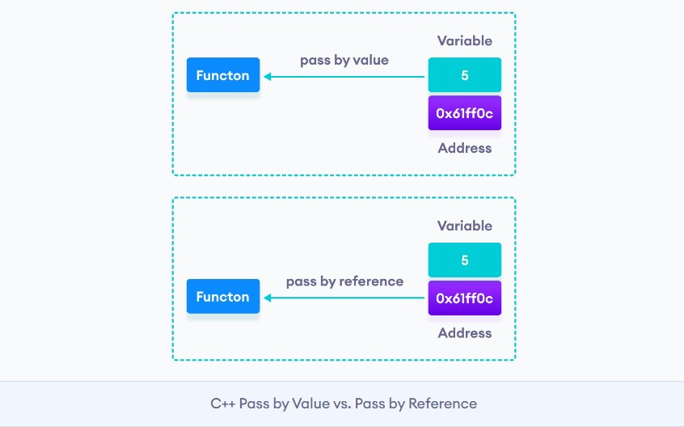

# Array

- [Array](#array)
  - [Creating Array](#creating-array)
  - [Working with Array](#working-with-array)
    - [Ex: Frequency of elements in an array](#ex-frequency-of-elements-in-an-array)
  - [Array and Pointer](#array-and-pointer)
  - [Passing Array To a Function | (default)Pass By Reference/Address](#passing-array-to-a-function--defaultpass-by-referenceaddress)
    - [C/CPP: Arrays are Pass By Reference/Address | ✂️modifies✂️ Original array](#ccpp-arrays-are-pass-by-referenceaddress--️modifies️-original-array)
      - [Other languages also pass arrays by reference](#other-languages-also-pass-arrays-by-reference)
      - [🧠🧠 Only Arrays are passed by References; 🧠🧠But Other datatype are by Value🧠🧠](#-only-arrays-are-passed-by-references-but-other-datatype-are-by-value)
        - [Other languages also pass other variables by value](#other-languages-also-pass-other-variables-by-value)
    - [🌟🌟🌟Returning (Local) Array From the Function in C/C++ | `int* fn(){} ~ int *p = fn()`](#returning-local-array-from-the-function-in-cc--int-fn--int-p--fn)
    - [Example](#example)
      - [Partial Array Processing](#partial-array-processing)
      - [sorting](#sorting)
      - [Find all occurrences](#find-all-occurrences)
  - [More Array feature in CPP](#more-array-feature-in-cpp)
    - [Determining the length of an array in CPP: `size(arr)`](#determining-the-length-of-an-array-in-cpp-sizearr)
  - [for-each loop](#for-each-loop)
    - [unpacking arrays | Structured binding](#unpacking-arrays--structured-binding)

## Creating Array

```cpp
#define LEN 5

int a = 5;
int a{5}; //same as int a = 5;

//array of 5 integers
int a[LEN];
int a[] = {1, 2, 3, 4, 5}; //1, 2, 3, 4, 5
int a[LEN] = {1, 2, 3};    //1, 2, 3, 0, 0
int a[LEN] = {0};          //0, 0, 0, 0, 0

/* Array initialization with designators (sparse array) */
int w[LEN] = {[1] = 1, [3] = 1};                // 0, 1, 0, 1, 0
int q[LEN] = {[1] = 3, [LEN - 1] = 5};          // 0, 3, 0, 0, 5
int t[LEN] = {[0] = 5, 4, [LEN - 3] = 3, 2, 1}; // 5, 4, 3, 2, 1
//array of strings [CPP]
string fruits[4] = {"Apple", "Banana", "Orange"};
```

## Working with Array

```cpp
int main() {
    int marks[100] = {0};

    int n;
    cout << "Enter the number of students: ";
    cin >> n;
    // Assign a value
    marks[0] = -1;

    // Input
    for (int i = 1; i <= n; i++) {
        cout << "Enter the marks of student " << i << ": ";
        cin >> marks[i];
    }

    // Output
    for (int i = 1; i <= n; i++) {
        cout << "Student " << i << " marks: " << marks[i] << endl;
    }
    return 0;
}
```

```c
#include <stdio.h>

// take input
void takeInput(int arr[], int n) {
    for (int i = 0; i < n; i++) {
        scanf("%d", &arr[i]);
    }
}

void display(int *p, int n) {
    for (int i = 0; i < n; i++) {
        printf("%d ", p[i]);
    }
}

int main() {
    int arr[3];
    int n = 3;
    takeInput(arr, n);
    display(arr, n);
}
```


### Ex: Frequency of elements in an array

```c
    int total_marks[] = {86, 78, 94, 88, 86, 65, 64, 62, 72, 61, 72, 66, 65, 67, 88, 84, 64, 85, 86, 68, 90, 65};
    int n = sizeof(total_marks) / sizeof(total_marks[0]);
    int marks_count[100] = {0};
    for (int i = 0; i < n; i++) {
        marks_count[total_marks[i]]++;
        // or
        // mark = total_marks[i];
        // marks_count[mark]++;
    }
    for (int i = 0; i < 100; i++) {
        printf("Marks: %d Count:%d\n", i, marks_count[i]);
    }
```

## Array and Pointer

 The `name` of the array is a `constant pointer` to the `first` element.

```cpp
    int a[] = {1, 2, 3, 4, 5, 6, 7, 8, 9, 10};
    cout << a << endl;     // 0x65febffdc0
    cout << &a[0] << endl; // 0x65febffdc0
    // dereferencing like a pointer
    cout << *a << endl;       // 1
    cout << *(a + 1) << endl; // 2
```

using `p` as a pointer to the first element of the array `a`:

```cpp
    int *p = &a[0];
    cout << a << " " << &a << endl; // 0x65febffdc0 0x65febffdc0
    cout << p << " " << &p << endl; // 0x65febffdc0 0x65febffdb8
    cout << *p << endl;             // 1
    cout << *(p + 1) << endl;       // 2
    // we can use [] as well
    cout << p[1] << endl;      // 2

    cout << sizeof(p) << endl; // 8 ; size of int pointer
    cout << sizeof(a) << endl; // 40 ; size of int array
```


```c
#include <stdio.h>
#define GRN "\e[0;92m"
#define NC "\e[0m"
int main() {
    printf("=== Pointers and Arrays ===\n");

    int x[] = {9, 8, 7, 6, 5};
    int n = sizeof(x) / sizeof(x[0]);

    /* Let's recall:
     *  - an array is an ordered collection of items of the same type
     *  - a pointer holds the address of other data
     *
     * Can we access the elements of an array through pointers? Yes!
     * */
    printf(GRN "Array address, &x[0]==x ??\n" NC);
    printf("&x[0]: %llX\n", &x[0]);
    printf("x:     %llX\n", x);

    printf(GRN "Access an element of x through the pointer:\n" NC);
    int *p = &x[2];
    printf("x[2]: %d, *p: %d\n", x[2], *p);
    *p = 0;
    printf("x[2]: %d, *p: %d\n", x[2], *p);

    // int *alias = x;
    // int *alias = &x[0];

    p = x;

    printf(GRN "Display x through the pointer:\n" NC);
    for (int i = 0; i < n; i++) {
        printf("x[%d]: %d, p[%d]: %d\n", i, x[i], i, p[i]);
    }

    printf(GRN "Set x to 0, 1, 2, 3, 4 through the pointer:\n" NC);
    for (int i = 0; i < n; i++) {
        p[i] = i;
        printf("x[%d]: %d, p[%d]: %d\n", i, x[i], i, p[i]);
    }
    return 0;
}
```

```bash
=== Pointers and Arrays ===
Array address, &x[0]==x ?? :
&x[0]: 4012E00061FEF8
x:     4012E00061FEF8
Access an element of x through the pointer:
x[2]: 7, *p: 7
x[2]: 0, *p: 0
Display x through the pointer:
x[0]: 9, p[0]: 9
x[1]: 8, p[1]: 8
x[2]: 0, p[2]: 0
x[3]: 6, p[3]: 6
x[4]: 5, p[4]: 5
Set x to 0, 1, 2, 3, 4 through the pointer:
x[0]: 0, p[0]: 0
x[1]: 1, p[1]: 1
x[2]: 2, p[2]: 2
x[3]: 3, p[3]: 3
x[4]: 4, p[4]: 4
```


## Passing Array To a Function | (default)Pass By Reference/Address

- [https://www.codingninjas.com/blog/2021/08/31/passing-arrays-to-functions-in-c-c/](https://www.codingninjas.com/blog/2021/08/31/passing-arrays-to-functions-in-c-c/)
- [https://www.scaler.com/topics/passing-array-to-function-in-c-cpp/](https://www.scaler.com/topics/passing-array-to-function-in-c-cpp/)
- [https://www.geeksforgeeks.org/return-local-array-c-function/](https://www.geeksforgeeks.org/return-local-array-c-function/)

```cpp
int fun(int a[]) {
    cout << sizeof(a) << endl;  // 8 -> 'a' is effectively a pointer
    cout << *a << endl;         // 1
    cout << *(a + 1)<< endl;    // 2
    return 0;
}
int fun2(int *a) {
    cout << sizeof(a) << endl;              // 8
    cout << *a << endl;                     // 1
    cout << *(a + 1) << endl;               // 2
    cout << a[0] << endl;                   // 1
    return 0;
}

int main() {
    int a[5] = {1, 2, 3, 4, 5};
    cout << sizeof(a) << endl;              // 20
    fun(a);
    fun2(a);
}
```

> Note that `a[]` for fun() is just a `pointer` even if square brackets are used as the name of an array acts as a special kind of variable -- a `pointer` -- which stores the starting address of the array.

**Points to remember:**

- Passing arrays to functions in C/C++ are **passed by reference**. Even though we do not create a reference variable, **the compiler passes the pointer to the array**, _making the original array available** for the called function’s use_. **Thus, if the function modifies the array, it will be reflected back to the original array.**
- The equivalence between arrays and pointers to an array is valid only and only for the function arguments.
- There is usually **no need to pass an array explicitly by reference** because arrays are always passed by reference.

So, We can use **any of the below** code to declare the function which is intended to receive an array as an argument.

```cpp
void fn(type *arrayname)
void fn(type arrayname[SIZE])
void fn(type arrayname[])
```

If an argument is a multidimensional array, its size must be specified. However, the size of the first dimension is optional.

```cpp
void fn(int arr[SIZE_X][SIZE_Y])
void fn(int arr[][SIZE_Y])
```

In C, when we pass an array to a function say fun(), it is **always treated as** a `pointer` by fun().
Therefore in C, **we must pass the size of the array as a parameter**. **Size may not be needed only in the case of** `‘\0’` terminated `character arrays`, size can be determined by checking the end of string character.

```cpp
void printArray(int a[], int size) { //or int *a
    for (int i = 0; i < size; i++) {
        cout << a[i] << " ";
    }
    cout << endl;
}
int main() {
    int a[5] = {1, 2, 3, 4, 5};
    //int len = sizeof(a) / sizeof(a[0]);
    int len = sizeof(a) / sizeof(int);//20,4
    printArray(a, len);
}
```


### C/CPP: Arrays are Pass By Reference/Address | ✂️modifies✂️ Original array

- [https://www.educative.io/answers/pass-by-value-vs-pass-by-reference](https://www.educative.io/answers/pass-by-value-vs-pass-by-reference)

```cpp
void fn(formal_parameters){

}

arguments = x,y;
fn(arguments|actual_parameters);
```

1. `Call By Reference`: It copies the address of an `argument` into the formal `parameter` of that function. In this method, the address is used to access the actual `argument` used in the function call. **It means that changes made in the `parameter` will alter the passing `argument`.**

2. `Call By Value`: It copies the value of an `argument` into the formal `parameter` of that function. **Hence, changes made to the `parameter` of the main function do not affect the original values that are passed as `arguments`.**

<div align="center">

</div>

Passing arrays to functions in C/C++ are **passed by reference**. Even though we do not create a reference variable, **the compiler passes the pointer to the array**, _making the original array available** for the called function’s use_. **Thus, if the function modifies the array, it will be reflected back to the original array.** Functions have access to the actual array sent in and can modify it

```cpp
void modifyReceivedArr(int a[], int n) {
    for (int i = 0; i < n; i++)
        a[i] = n - i;
}

int main() {
    int ar[5];
    int n = sizeof(ar) / sizeof(int);
    modifyReceivedArr(ar, n);
    printArray(ar, n); // 5 4 3 2 1
}
```

Advantages of Passing Arrays by Reference to Functions:

- Passing similar elements as an array takes less time than passing each element to a function as we are only passing the base address of the array to the function and other elements can be accessed easily as an array is a contiguous memory block of the same data types.
- As we pass reference of base address of the array this means compiler doesn’t create a copy of the array to process inside function which is faster and less memory-intensive compared to passing arguments by value.
- Because arrays are passed by reference to functions this prevents stack memory overflow in the case of recursive functions.


#### Other languages also pass arrays by reference

- Python

```python
def incrementArrayEls(arr):
    for i in range(len(arr)):
        arr[i] += 1
    return arr


def main():
    arr = [1, 2, 3, 4, 5]
    print("main(): arr =", arr) #main(): arr = [1, 2, 3, 4, 5]
    arr2 = incrementArrayEls(arr)
    print("main(): arr =", arr) #main(): arr = [2, 3, 4, 5, 6]
    print("returned: =", arr2) #returned: = [2, 3, 4, 5, 6]

main()
```

- Java

```java
class HelloWorld {
    public static void main(String[] args) {
        int arr[] = {1,2,3,4,5};
        for (int i:arr){
            System.out.print(i);
        }
        //12345
        System.out.println();
        incrementArr(arr);
        for (int i:arr){
            System.out.print(i);
        }
        //23456

    }
    public static void incrementArr(int arr[]){
        for(int i=0;i<5;i++){
            arr[i] = arr[i] + 1;
        }
    }
}
```

#### 🧠🧠 Only Arrays are passed by References; 🧠🧠But Other datatype are by Value🧠🧠

**There is usually no need to pass an `array` explicitly by reference because arrays are always passed by reference.**

**But other types of variables are by default passed by value**. With pass by value, local parameters become copies of the original arguments that are passed in. Therefore, changes made in the function to the passed arguments do not affect the originals.

When needed we have to **explicitly use pass by References** to allow a function to access one of its parameters directly without creating a copy. We may be passing a complex data structure as a parameter, or we could be looking to optimize the function’s performance on a very large number of function calls using such techniques.**Pass by pointer works even more similarly to pass by reference and even achieves the same result:**

- [dev-SR/differences-between-pointers-and-references-in-cpp](https://github.com/dev-SR/exercise/tree/main/C%2B%2B/1.1pointers#differences-between-pointers-and-references-in-c)
- [https://www.geeksforgeeks.org/passing-by-pointer-vs-passing-by-reference-in-c/](https://www.geeksforgeeks.org/passing-by-pointer-vs-passing-by-reference-in-c/)

```cpp
// By Default arrays are always passed by reference.
void swapArr(int a[]) {
    int temp = a[0];
    a[0] = a[1];
    a[1] = temp;
}
/*
So, There is usually no need to pass an array `explicitly` by reference because arrays are always passed by reference. [CPP syntax]
 */
void swapArrRefs(int (&a)[2]) {
    int temp = a[0];
    a[0] = a[1];
    a[1] = temp;
}

// But other variables are passed by Value
void swapOtherVarsCallByValue(int a, int b) {
    int temp = a;
    a = b;
    b = temp;
}
// to modify the original values, we need to pass by address/reference
void swapOtherVarsCallByRefs_Pointer(int *a, int *b) {
    int temp = *a;
    *a = *b;
    *b = temp;
}
// CPP syntax
/*
Pass by reference is used to allow a function to modify a variable without having to create a copy of it.
 */
void swapOtherVarsCallByRefs_CPP_Refs(int &a, int &b) {
    int temp = a;
    a = b;
    b = temp;
}

int main() {
    int arr[2] = {1, 2};
    // with array passed by reference (default)
    swapArr(arr);
    printArray(arr, 2); // 2 1
    swapArrRefs(arr);
    printArray(arr, 2); // 1 2

    // with other variables passed by value (default)
    int a = 1, b = 2;
    swapOtherVarsCallByValue(a, b);
    cout << a << " " << b << endl; // 1,2
    //....
    swapOtherVarsCallByRefs_Pointer(&a, &b);
    cout << a << " " << b << endl; // 2,1
    swapOtherVarsCallByRefs_CPP_Refs(a, b);
    cout << a << " " << b << endl; // 1,2
}
```

##### Other languages also pass other variables by value

- Python

```python
# Python passes other variables by value
def swap(a, b):
    temp = a
    a = b
    b = temp
# But arrays are passed by reference
def swapArr(arr):
    temp = arr[0]
    arr[0] = arr[1]
    arr[1] = temp

def main():
    a,b=1,2
    swap(a,b)
    print(a,b) # 1 2

    arr = [1,2]
    swapArr(arr)
    print(arr) # [2,1]

main()
```


### 🌟🌟🌟Returning (Local) Array From the Function in C/C++ | `int* fn(){} ~ int *p = fn()`

We know that a function can not return more than one variable in C/C++. In some problems, we may need to return multiple values from a function, in such cases, an array could be returned from the function. **To return an array from a function we have to return the `pointer` of a data type of the array**.

Consider the below C++ program. Is it right way of returning array from a function?

```cpp
int *fun() {
    int arr[100];
    arr[0] = 10;
    arr[1] = 20;
    return arr;
}

int main() {
    int *ptr = fun();
    printf("%d %d", ptr[0], ptr[1]);
    return 0;
}
```

Warning:

```bash
In function 'int* fun()':
6:8: warning: address of local variable 'arr' returned [-Wreturn-local-addr]
    int arr[100];
        ^
```

The problem is, we return address of a local variable which is not advised as local variables may not exist in memory after function call is over.
**So in simple words, Functions can’t return arrays in C. However, in order to return the array in C by a function, one of the below alternatives can be used.**

Following are some correct ways of returning array:

- Using Dynamically Allocated Array
- Using static array
- Using struct

1. DMA


```cpp
int *fun() {
    // int *arr = new int[10];
    int *arr = (int *)malloc(10 * sizeof(int)); // in c
    for (int i = 0; i < 10; i++) {
        arr[i] = i;
    }
    return arr;
}

int main() {
    int *p = fun();
    printArray(p, 10);
    free(p);
    return 0;
}
```

2. static array

```cpp
int *fun() {
    static int arr[10];
    for (int i = 0; i < 10; i++) {
        arr[i] = i;
    }
    return arr;
}

int main() {
    int *p = fun();
    printArray(p, 10);
    return 0;
}
```

3. struct

```cpp
struct arrWrap {
    int arr[100];
};
struct arrWrap fun() {
    struct arrWrap x;
    for (int i = 0; i < 10; i++) {
        x.arr[i] = i;
    }
    return x;
}

int main() {
    struct arrWrap x = fun();
    printArray(x.arr, 10);
    return 0;
}
```


### Example

#### Partial Array Processing

```cpp
int partialSum(int a[], int size) {//or int *a
    int ans = 0;
    for (int i = 0; i < size; i++) {
        ans += a[i];
    }
    return ans;
}

int main() {
    int a[5] = {1, 2, 3, 4, 5};
    int len = sizeof(a) / sizeof(a[0]);
    cout << partialSum(a + 3, len - 3) << endl; // 9 [4+5]
}
```

#### sorting


```cpp
void sort(int a[]) {
    int i, j, tmp;
    for (i = 0; i < 10; i++) {
        for (j = i + 1; j < 10; j++) {
            if (a[j] < a[i]) {
                tmp = a[i];
                a[i] = a[j];
                a[j] = tmp;
            }
        }
    }
}

void main() {
    int i;
    int arr[10] = {4, 3, 7, 12, 34, 76, 100, 76, 56, 1};
    sort(arr); // calling function and storing returned array
    printf("Sorted elements are \n");
    printArray(arr, 10); // 1 3 4 7 12 34 56 76 76 100
}
```


#### Find all occurrences

```c
#include <stdio.h>
#include <string.h>

int find_all_occurrences(char str[], char c, int indexes[]) {
    int found = 0;
    char *pstr = str;
    do {
        pstr = strchr(pstr, c);
        if (pstr) {
            int offset = pstr++ - str;
            /*
            char *a = "Hello";
            char *f = strchr(a, 'o');
            printf("%p\n", f);   //00405068
            printf("%p\n", a);   //00405064
            printf("%d", f - a); //4 = offset=(found_address - base_address )
            */
            indexes[found++] = offset;
            pstr++;
        }
    } while (pstr); // while (pstr!=NULL)
    return found;
}

void print_occurrences(char str[], int occurrences_indexes[], int found) {
    char pattern[strlen(str) + 1];
    memset(pattern, ' ', sizeof(pattern)); // similar to " "*10 in python
    for (int i = 0; i < found; i++) {
        pattern[occurrences_indexes[i]] = '^';
    }
    pattern[sizeof(pattern) - 1] = '\0';
    printf("%s\n", str);
    printf("%s\n", pattern);
}

int main() {
    char str[] = "This, is a. sample-string";
    int occurrences_indexes[sizeof(str)];
    int found = find_all_occurrences(str, 's', occurrences_indexes);
    print_occurrences(str, occurrences_indexes, found);
    return 0;
}
```

```bash
This, is a. sample-string
   ^   ^    ^      ^
```

## More Array feature in CPP

### Determining the length of an array in CPP: `size(arr)`

```cpp
void printArray(int arr[], int size) {
    for (int i = 0; i < size; i++)
        cout << arr[i] << " ";
    cout << endl;
}
int main() {
    int ar[5] = {1, 2, 3, 4, 5};
    cout << "Size in arr: " << size(ar) << endl;
    printArray(ar, size(ar));
    return 0;
}
```

## for-each loop

```cpp
#include <iostream>
using namespace std;

int main() {
    int arr[] = {1, 2, 3, 4, 5};

    for (auto &i : arr) // `&` is required, otherwise `i` makes new copy, not reference
        if (i % 2 == 0)
            i = 0;

    for (const auto &i : arr) // reference to avoid copy
        cout << i << endl;
    // 1 0 3 0 5
}
```

### unpacking arrays | Structured binding

```cpp
int main() {
    int arr[3] = {1, 2, 3};

    auto [x, y, z] = arr; // type must be 'auto'
    cout << x << y << z << endl;

    // auto [a, b] = arr; // Error| number of unpacking element must be equal to number of array element
    // cout << a << b << endl;
    return 0;
}
```
