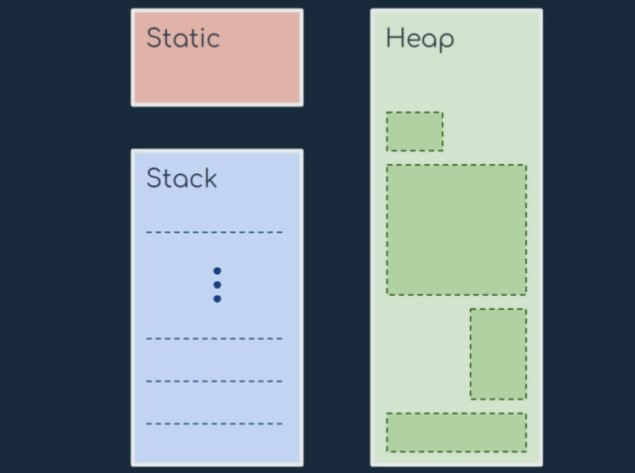

# Dynamic Memory Allocation

- [Dynamic Memory Allocation](#dynamic-memory-allocation)
  - [DMA in C](#dma-in-c)
    - [Methods](#methods)
  - [DMA in CPP](#dma-in-cpp)
    - [Intro](#intro)
      - [`new`](#new)
      - [Initialize memory](#initialize-memory)
      - [Allocate block of memory](#allocate-block-of-memory)
      - [`delete`](#delete)
    - [One-Dimensional Array](#one-dimensional-array)
      - [ex1: manual Input](#ex1-manual-input)
      - [ex2: Random Number Generation](#ex2-random-number-generation)
      - [ex3: Dynamically Resizing Array](#ex3-dynamically-resizing-array)
    - [Two-Dimensional Array](#two-dimensional-array)

## DMA in C

<div align="center"></div>

**Static**: global variable storage, permanent for the entire run of the program

- Life cycle as the entire life of the program
- Global variables, declared outside functions
- Static variables, declared inside functions
- Only one copy of that variable for the whole program

**Stack**: local variable storage (automatic,continuous memory, LIFO)

- Automatically managed
- Grows and shrink as LIFO (Last In First Out)
- Local variables and parameters of a function
- Life cycle limited to the life cycle of that function
- Limited pool of memory
- Stack overflow may occur!

**Heap**: dynamic storage (large pool of memory,not allocated in contiguous order)

- Managed by the programmer
- Allocation and the de-allocation with special functions
- Large pool of memory, physical memory bounds
- Memory blocks managed using pointers
- Memory leaks can occur!

**How to choose one...**

**Static**: for memory you know in advance you will always need it throughout the program

**Stack**: when you have data you need as long as a function is on the stack

**Heap**: for maximum flexibility, when you don't know in advance how much room you'll need

### Methods

| Method                                      | Description                                                                                                                                                                                 |
| ------------------------------------------- | ------------------------------------------------------------------------------------------------------------------------------------------------------------------------------------------- |
| `void *malloc(size_t size)`                 | `Allocate memory` : The malloc() function reserves a block of memory of the specified number of bytes. And, it returns a pointer of void which can be casted into pointers of any form.     |
| `void *calloc(size_t num, size_t size)`     | `Allocate array of elements` : The malloc() function allocates memory and leaves the memory uninitialized, whereas the calloc() function allocates memory and initializes all bits to zero. |
| `void *realloc(void *ptr, size_t new_size)` | `Reallocate memory` : If the dynamically allocated memory is insufficient or more than required, you can change the size of previously allocated memory using the realloc() function.       |
| `void free(void *ptr)`                      | `Free memory`: Dynamically allocated memory created with either calloc() or malloc() doesn't get freed on their own. You must explicitly use free() to release the space.                   |


## DMA in CPP

### Intro

C++ allows us to allocate the memory of a variable or an array in run time. This is known as **dynamic memory allocation**.

In other programming languages such as Java and Python, the compiler automatically manages the memories allocated to variables. But this is not the case in C++.

In C++, we need to de-allocate the dynamically allocated memory manually after we have no use for the variable.

We can allocate and then de-allocate memory dynamically using the `new` and `delete` operators respectively.

- [https://www.geeksforgeeks.org/new-and-delete-operators-in-cpp-for-dynamic-memory/](https://www.geeksforgeeks.org/new-and-delete-operators-in-cpp-for-dynamic-memory/)

#### `new`

```cpp
// Pointer initialized with NULL
// Then request memory for the variable
int *p = NULL;
p = new int;

            OR

// Combine declaration of pointer
// and their assignment
int *p = new int;
```

#### Initialize memory

We can also initialize the memory for built-in data types using new operator. For custom data types a constructor is required (with the data-type as input) for initializing the value. Here’s an example for the initialization of both data types :

`pointer-variable = new data-type(value);`

```cpp
int *p = new int(25);
float *q = new float(75.25);
// Custom data type
struct cust
{
    int p;
    cust(int q) : p(q) {}
};
cust* var1 = new cust;    // Works fine, doesn't require constructor
        //OR
cust* var1 = new cust();        // Works fine, doesn't require constructor

cust* var = new cust(25)        // Notice error if you comment this line
```

#### Allocate block of memory

new operator is also used to allocate a block(an array) of memory of type data-type.

`pointer-variable = new data-type[size];`
where size(a variable) specifies the number of elements in an array. Example:

```cpp
int *p = new int[10]
```

#### `delete`

Since it is programmer’s responsibility to deallocate dynamically allocated memory, programmers are provided delete operator by C++ language.

Syntax: `delete pointer-variable;`

Here, pointer-variable is the pointer that points to the data object created by new.
Examples:

```cpp
delete p;
delete q;
```

To free the **dynamically allocated array** pointed by pointer-variable, use following form of delete:

`delete[] pointer-variable;`

Example:

```cpp
// It will free the entire array
   // pointed by p.
   delete[] p;
```

### One-Dimensional Array

#### ex1: manual Input

```cpp
// allocate memory dynamically for 1d array
int *allocateMemory(int n) {
    int *arr = new int[n];
    return arr;
}
// take input
int *takeInput(int *arr, int n) {
    for (int i = 0; i < n; i++) {
        cin >> arr[i];
    }
    return arr;
}

// delete dynamically allocated 1d array
void delete1d(int *arr) {
    delete[] arr;
    cout << "Deleted !!!\n";
}

void display(int *p, int n) {
    for (int i = 0; i < n; i++) {
        cout << p[i] << " ";
    }
    cout << endl;
}

int main() {
    int n;
    cout << "Enter the size of array: ";
    cin >> n;
    int *p = allocateMemory(n);
    p = takeInput(p, n);
    display(p, n);
    delete1d(p);
}

```

#### ex2: Random Number Generation

```cpp
// generate random array dynamically
int *generateRandomArray(int n) {
    // Use current time as seed for random generator
    srand(time(0)); // or time(NULL);
    /**
        Note: Without first calling srand(), program will create the same sequence of numbers each time it runs.
    */
    int *arr = new int[n];
    for (int i = 0; i < n; i++) {
        arr[i] = rand() % 100;
    }
    return arr;
}
```

- [https://www.geeksforgeeks.org/rand-and-srand-in-ccpp/](https://www.geeksforgeeks.org/rand-and-srand-in-ccpp/)

#### ex3: Dynamically Resizing Array

```cpp
#include <bits/stdc++.h>
using namespace std;

void printArr(int arr[], int size) {
    for (int i = 0; i < size; i++)
        cout << arr[i] << " ";
    cout << endl;
}

int main() {
    int capacity = 5;
    int *arrPointer = new int[capacity];
    int entries = 0;

    while (true) {
        cout << "Enter a number: ";
        cin >> arrPointer[entries];
        if (cin.fail())
            break; // if input is not a number
        entries++;

        // if array is full, resize it
        if (entries == capacity) {
            capacity *= 2;
            // create a temp array(2x size) and copy all elements
            // delete old arr
            // Have the `arrPointer` point to the new array `temp`

            int *temp = new int[capacity];
            for (int i = 0; i < entries; i++)
                temp[i] = arrPointer[i];
            delete[] arrPointer;
            arrPointer = temp;
        }
    }

    printArr(arrPointer, entries);
}
```

### Two-Dimensional Array


```bash
       int **p = new int*[2]; <- array of Integer Pointers
             ┃
             ▼
       ┏━━━━━━┓      ┏━━━━━━━━━━━━━━━┓
       ┃ p[0] ┃----> ┃ new int[n];   ┃
       ┗━━━━━━┛      ┗━━━━━━━━━━━━━━━┛
       ┏━━━━━━┓      ┏━━━━━━━━━━━━━━━┓
       ┃ p[1] ┃----> ┃ new int[n];   ┃
       ┗━━━━━━┛      ┗━━━━━━━━━━━━━━━┛
```

```cpp
// allocate memory for 2D array
int **allocateMemory(int n, int m) {
    int **p = new int *[n];
    for (int i = 0; i < n; i++) {
        p[i] = new int[m];
    }
    return p;
}

// take input 2d array
int **takeInput(int **p, int n, int m) {
    for (int i = 0; i < n; i++) {
        for (int j = 0; j < m; j++) {
            cin >> p[i][j];
        }
    }
    return p;
}
// delete 2d array
void delete2d(int **arr, int r) {
    // delete  allocated blocks
    for (int i = 0; i < r; i++) {
        delete[] arr[i];
    }
    // delete pointer to 2d arrays
    delete[] arr;
}
// print 2d array
int print(int **arr, int r, int c) {
    for (int i = 0; i < r; i++) {
        for (int j = 0; j < c; j++) {
            cout << arr[i][j] << " ";
        }
        cout << endl;
    }
    return 0;
}
int main() {
    int r, c;
    cin >> r >> c;
    int **p = allocateMemory(r, c);
    p = takeInput(p, r, c);
    print(p, r, c);
    delete2d(p, r);
    return 0;
}
```
