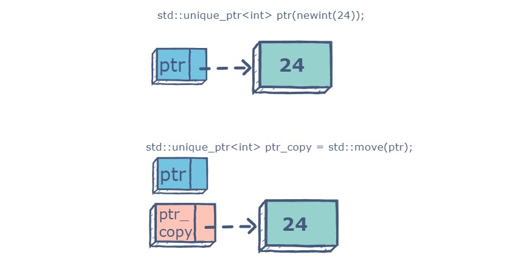
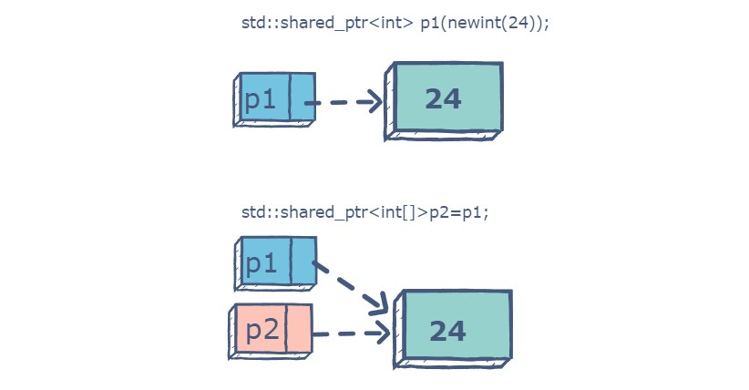

# Smart Pointers in C++

- [Smart Pointers in C++](#smart-pointers-in-c)
	- [Introduction of Smart Pointers](#introduction-of-smart-pointers)
	- [`std::unique_ptr`](#stdunique_ptr)
	- [`std::shared_ptr`](#stdshared_ptr)
	- [`std::weak_ptr`](#stdweak_ptr)


## Introduction of Smart Pointers

A smart pointer is a composition class designed to manage dynamically allocated memory and to ensure that the memory gets deleted when the smart pointer object goes out of scope.

Smart pointers are just classes that wrap the raw pointer and overload the -> and * operators; this allows them to offer the same syntax as a raw pointer.

C++11 has three types of smart pointers that are defined in the `<memory>` header of the Standard Library. They are:

- `std::unique_ptr`
- `std::shared_ptr`
- `std::weak_ptr`

## `std::unique_ptr`

An​ `unique_ptr` has exclusive ownership of the object it points to and ​will destroy the object when the pointer goes out of scope. A `unique_ptr` explicitly prevents copying of its contained pointer. Instead, the `std::move` function has to be used to transfer ownership of the contained pointer to another `unique_ptr`.

<div align="center">

</div>

```cpp
#include <iostream>
#include <memory>
using namespace std;

int main() {
    unique_ptr<int> x(new int);

    *x = 5;
    cout << "Value: " << *x << endl;                 // Value: 5
    cout << "Address of pointer: " << &x << endl;    // Address of pointer: 0x301a5ff5e8
    cout << "Value: " << *x.get() << endl;           // Value: 5
    cout << "Address of value: " << x.get() << endl; // Address of value: 0x17c409840e0

    // delete x; // this is not needed, as the unique_ptr will delete the memory when it goes out of scope

    // / The following line will result in ERROR since
    // we are not allowed to copy a unique ptr
    // unique_ptr<int> ptr_copy = x;

    // The following code needs to be used to copy
    // the pointer.
    unique_ptr<int> ptr_copy = std::move(x);
    cout << *ptr_copy << endl;      // 5
    cout << ptr_copy.get() << endl; // 0x7ffeeb2b8b0c
    cout << x.get() << endl;        // 0 | `x is now a nullptr`

    return 0;
}
```

Different ways to initialize a `unique_ptr`:

```cpp
#include <iostream>
#include <memory>
using namespace std;

int main() {
    unique_ptr<int> x(new int);
    *x = 5;
    unique_ptr<int> y = make_unique<int>(5); // y=5

    unique_ptr<int[]> arr(new int[5]);
    unique_ptr<int[]> arr2 = make_unique<int[]>(3); // arr2=new int[3];

    auto arr3 = make_unique<int[]>(3);

    arr[0] = 1;
    arr2[0] = 1;
    arr3[0] = 1;

    cout << "x: " << *x << endl;            // Value: 5
    cout << "y: " << *y << endl;            // Value: 5
    cout << "arr2[0]: " << arr2[0] << endl; // arr2[0]: 1
    cout << "arr[0]: " << arr[0] << endl;   // arr[0]: 1
    cout << "arr3[0]: " << arr3[0] << endl; // arr3[0]: 1

    return 0;
}
```


## `std::shared_ptr`

<div align="center">

</div>

```cpp
int main() {
    auto x = make_shared<int>(5);

    shared_ptr<int> y = x;
    if (x == y) {
        cout << "x and y are pointing to the same memory" << endl;
    }

    return 0;
}
```

## `std::weak_ptr`

It’s much more similar to shared_ptr except it’ll not maintain a Reference Counter. In this case, a pointer will not have a stronghold on the object.