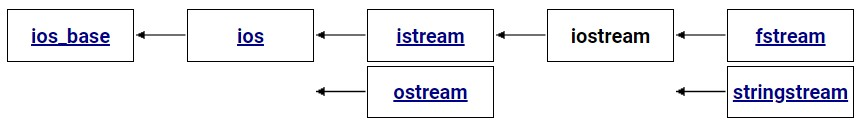

# Streams and Files in C++

- [Streams and Files in C++](#streams-and-files-in-c)
  - [Streams](#streams)
    - [Read from console stream](#read-from-console-stream)
  - [stringstream](#stringstream)
    - [Parsing a string](#parsing-a-string)
    - [More Examples](#more-examples)
  - [File Streams](#file-streams)
    - [Write to file: `ofstream`](#write-to-file-ofstream)
    - [Read from file: `ifstream`](#read-from-file-ifstream)
    - [`fstream`: read and write](#fstream-read-and-write)

## Streams

<div align="center">

</div>

### Read from console stream

```cpp
#include <iostream>
using namespace std;

int main() {
    cout << "Enter first number:";
    int first;
    cin >> first;

    cout << "Enter second number:";
    int second;
    cin >> second;

    return 0;
}
```

Take this input example as an example:

```bash
Enter first number:10 20
Enter second number
```

Because cpp uses buffer to store the input, so the input is not immediately sent to the program. The input is stored in the buffer until the user presses the enter key. In this case, the first input is `10 20`. When we read from the buffer first number `10` will be read and the second number ` 20` will be left in the buffer. When we read the second number, the program will read `white_space` and the program will stop reading.

Therefore we need to use `cin.ignore(n,delim)` to ignore the white space or any other character in the buffer after reading the first number.

```cpp
#include <iostream>
#include <limits>

using namespace std;

int main() {
    cout << "Enter first number:";
    int first;
    cin >> first;

    //  ignore(n,delim) ignores n characters or until delim is found
    cin.ignore(numeric_limits<streamsize>::max(), '\n');
    cout << "Enter second number:";
    int second;
    cin >> second;

    cout << endl
         << first << " " << second << endl;

    return 0;
}
```

more advanced example:

```cpp
#include <iostream>
#include <limits>

using namespace std;

int getNumber(const string &prompt) {
    int number;
    while (true) {
        cout << prompt;
        cin >> number;
        if (cin.fail()) {
            cin.clear();
            cin.ignore(numeric_limits<streamsize>::max(), '\n');
            cout << "Invalid input. Please try again." << endl;
        } else {
            cin.ignore(numeric_limits<streamsize>::max(), '\n');
            break;
        }
    }
    return number;
}

int main() {
    int first = getNumber("Enter first number:");
    int second = getNumber("Enter second number:");
    cout << endl
         << first << " " << second << endl;

    return 0;
}
```

```bash
Enter first number:10 20
Enter second number:x
Invalid input. Please try again.
Enter second number:20

10 20

```

## stringstream

A `stringstream` associates a string object with a stream allowing you to read from the string as if it were a stream (like cin).

### Parsing a string

```cpp
#include <iostream>
#include <sstream>
#include <string>
using namespace std;
int main() {

    string str = "10 20";
    stringstream ss(str);
    int a, b;
    ss >> a >> b;
    cout << a << "+" << b << "=" << a + b << endl; // 10+20=30
}
```


### More Examples


```cpp
struct Person {
    string name;
    int age;
    double weight;
};
Person parsePerson(string str) {
    stringstream ss(str);
    Person p;
    string temp;
    getline(ss, temp, ',');
    p.name = temp;
    getline(ss, temp, ',');
    p.age = stoi(temp);
    ss >> p.weight;
    return p;
}
int main() {
    auto person = parsePerson("John, 23, 80.5");
    cout << person.name << " " << person.age << " " << person.weight << endl; // John 23 80.5
}
```


```cpp
int countWords(string str){
	// Breaking input into word
	// using string stream
	stringstream s(str);

	// To store individual words
	string word;

	int count = 0;
	while (s >> word)
		count++;
	return count;
}

int main(){
    string s = "Hello World "
               "Hello Cpp";
    cout << " Number of words are: " << countWords(s); // 4
}
```


```cpp
string to_string_n(double number, int precision = 2) {
    stringstream ss;
    ss << fixed << setprecision(precision) << number;
    return ss.str();
}

int main() {
    double number = 123.456789;
    cout << to_string_n(number) << endl;

    return 0;
}
```


## File Streams

- `ifstream` - input file stream
- `ofstream` - output file stream
- `fstream` is used for both reading and writing files

### Write to file: `ofstream`

```cpp
#include <fstream>
#include <iostream>
using namespace std;

int main() {
    ofstream file;
    file.open("test.csv");

    if (file.is_open()) {
        file << "id,name,age\n"
             << "1,John,30\n"
             << "2,Jack,25\n";
    }
    file.close();
}
```

### Read from file: `ifstream`


```cpp
#include <fstream>
#include <iostream>
#include <sstream>
#include <vector>
using namespace std;
struct Person {
    int id;
    string name;
    int age;
};

int main() {
    ifstream file;
    file.open("test.csv");
    vector<Person> people;

    if (file.is_open()) {
        string row;
        // ignore the first row
        getline(file, row);

        while (!file.eof()) {
            getline(file, row);
            // cout << row << endl;

            stringstream str_stream(row); // convert string to stream
                                          /*
                                          A stringstream associates a string object with a stream allowing you to read from the string as if it were a stream (like cin),
										  ..... `sscanf()` is equivalent in c.
                                           */
            string field;
            Person person;
            getline(str_stream, field, ',');
            if (field.empty())
                continue;
            person.id = stoi(field);
            getline(str_stream, field, ',');
            person.name = field;
            getline(str_stream, field, ',');
            person.age = stoi(field);

            people.push_back(person);
        }
    }
    for (const auto &person : people) {
        cout << person.id << " " << person.name << " " << person.age << endl;
    }

    file.close();

    return 0;
}
```

### `fstream`: read and write

```cpp
#include <fstream>
#include <iostream>
using namespace std;

int main() {
    fstream file;
    file.open("test.txt", ios::in | ios::out | ios::app);

    if (file.is_open()) {
        file.close();
    }
}
```

