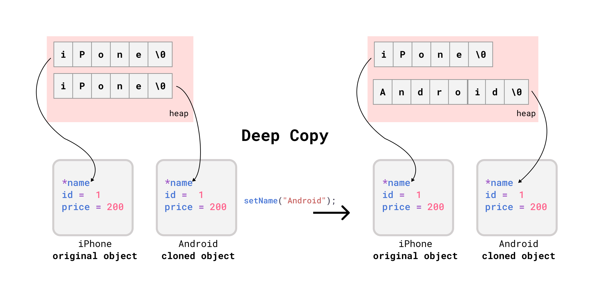

# OOP in C++

- [OOP in C++](#oop-in-c)
  - [Defining a Class](#defining-a-class)
  - [Creating Objects](#creating-objects)
  - [Access Modifiers](#access-modifiers)
  - [Compiling and linking multiple source files](#compiling-and-linking-multiple-source-files)
    - [Using `makefile`](#using-makefile)
  - [Getters and Setters](#getters-and-setters)
  - [Constructor](#constructor)
    - [Member Initialization List](#member-initialization-list)
    - [Default Constructor](#default-constructor)
    - [🌟Copy Constructor](#copy-constructor)
      - [Default Copy Constructor](#default-copy-constructor)
      - [🚀When to create user defined Copy Constructor?](#when-to-create-user-defined-copy-constructor)
  - [🌟Destructor - Delete Dynamically Allocated Memory](#destructor---delete-dynamically-allocated-memory)
  - [Pointer to Objects](#pointer-to-objects)
  - [Array of Objects](#array-of-objects)

## Defining a Class

Definition in: `Rectangle.h`

```cpp
#ifndef RECTANGLE_HEADER_H
#define RECTANGLE_HEADER_H

class Rectangle {
    int width;
    int height;
    void draw();
    int getArea();
};

#endif
```

implementation of methods in `Rectangle.cpp`

```cpp
#include "Rectangle.h"
#include <iostream>

using namespace std;

void Rectangle::draw() {
    cout << "Drawing a rectangle" << endl;
    cout << "Dimensions:" << width << ", " << height << endl;
}

int Rectangle::getArea() {
    return width * height;
}
```

## Creating Objects

`main.cpp`

```cpp
#include <iostream>
using namespace std;
#include "Rectangle.h"

int main() {
    // creating and initializing object
    Rectangle rec;
    rec.width = 10;
    rec.height = 20;

    cout << rec.getArea();

    return 0;
}
```

But above code will not work because in Cpp properties and methods are private by default. So we need to make them public.

```bash
main.cpp:7:9: error: 'int Rectangle::width' is private within this context
    7 |     rec.width = 10;
      |         ^~~~~
main.cpp:8:9: error: 'int Rectangle::height' is private within this context
    8 |     rec.height = 20;
      |         ^~~~~~
main.cpp:10:24: error: 'int Rectangle::getArea()' is private within this context
   10 |     cout << rec.getArea();
      |             ~~~~~~~~~~~^~
```

## Access Modifiers

A class member can be defined as `public`, `private` or `protected`. By default members would be assumed as `private`.

using `public` access modifier in: `Rectangle.h`

```cpp
#ifndef RECTANGLE_HEADER_H
#define RECTANGLE_HEADER_H

class Rectangle {
public:
    int width;
    int height;
    void draw();
    int getArea();
};

#endif
```

Now we can access the properties and methods of the class.

## Compiling and linking multiple source files


`main.cpp`

```cpp
#include <iostream>
using namespace std;
#include "Rectangle.h"

int main() {
    // creating and initializing object
    Rectangle rec;
    rec.width = 10;
    rec.height = 20;

    cout << rec.getArea();

    return 0;
}
```

Compiling both cpp files and the run the executable.

```bash
g++ -std=c++20 Rectangle.cpp  main.cpp -o main ; .\main
```

>> output: 200

We can see that we have to compile these files seperately.

```bash
g++ -c main.cpp
g++ -c Rectangle.cpp
```

Here

- `g++ -c main.cpp`: generates `main.o`
- `g++ -c Rectangle.cpp`: generates a `Rectangle.o`

Next, we link the object files together to generate the executable main.

```bash
g++ -o main main.o Rectangle.o
.\main
```

### Using `makefile`

Organize project directory like this :

```bash
root
├── include/
│   └── all .h files here
│
├── src/
│   └── all .c files here
└── Makefile
```

including header files:

`src/main.cpp`:

```cpp
#include "../include/Rectangle.h"
#include <iostream>
using namespace std;

int main() {
    // ...
}
```

`src/Rectangle.cpp`:

```cpp
#include "../include/Rectangle.h"
#include <iostream>
using namespace std;

//...
```

See and use makefile defined in `C_CPP/README.md`

## Getters and Setters

```cpp
// `Rectangle.h`
#ifndef RECTANGLE_HEADER_H
#define RECTANGLE_HEADER_H
class Rectangle {
private:
    int width;
    int height;

public:
    void draw();
    int getArea();
};
#endif
```

We we set the properties to private, we can't access them from the main function. So we need to create a getter and setter for each property.

```cpp
// `Rectangle.h`
#ifndef RECTANGLE_HEADER_H
#define RECTANGLE_HEADER_H

class Rectangle {
private:
    int width;
    int height;

public:
    void draw();
    int getArea();
    //  getters and setters
    int getWidth();
    void setWidth(int width);
    int getHeight();
    void setHeight(int height);
};

#endif
```

```cpp
// `Rectangle.cpp`
#include "Rectangle.h"
#include <iostream>

using namespace std;

int Rectangle::getWidth() {
    return width;
}

void Rectangle::setWidth(int width) {
    if (width < 0) {
        throw invalid_argument("Width cannot be negative");
    }

    // (*this).width = width;
    //  or
    this->width = width;
    //  or
    // Rectangle::width = width;
}

int Rectangle::getHeight() {
    return height;
}

void Rectangle::setHeight(int height) {
    if (height < 0) {
        throw invalid_argument("Height cannot be negative");
    }
    this->height = height;
}

// ...
```

`main.cpp`

```cpp
#include "Rectangle.h"
#include <iostream>
using namespace std;

int main() {
    Rectangle rec;
    rec.setWidth(10);
    rec.setHeight(5);
    cout << rec.getArea() << endl;// 50
    rec.setHeight(-1); //  throws exception

    return 0;
}
```

## Constructor

- Constructor Name = Class Name
- Called Automatically when an object is created.
- Memory Allocation happens when constructor is called.
- Constructor is called only once for each object.

`include/Rectangle.h`

```cpp
#ifndef MACRO_PRODUCT_H
#define MACRO_PRODUCT_H

class Product {
public:
    // Parameterized Constructor
    Product(int id, char *name, int mrp, int selling_price);
    //  Getters and Setters
    void setMrp(int mrp);
    void setSellingPrice(int price);
    int getMrp();
    int getSellingPrice();
    char *getName();

private:
    int id;
    char name[100];
    int mrp; // maximum retail price
    int selling_price;
};
#endif

```

`src/Product.cpp`

```cpp
#include "../include/Product.h"

#include <cstring>
#include <iostream>
using namespace std;

Product::Product(int id, char *name, int mrp, int selling_price) {
    cout << "Constructor called" << endl;
    this->id = id;
    setName(name);
    setMrp(mrp);
    setSellingPrice(selling_price);
}
char *Product::getName() {
    return name;
}

void Product::setName(char *name) {
    if (strlen(name) <= 0) {
        throw invalid_argument("Name cannot be empty");
    } else if (strlen(name) > 100) {
        throw invalid_argument("Name cannot be more than 100 characters");
    } else {
        strcpy(this->name, name);
        /*
        1.`this->name = name` not possible because name is a char array.
        2. Recommend String class instead of char array:
                Product(int id, const string &name, int mrp, int selling_price)
        3. char array is avoidable:
                >> src/main.cpp:17:18: warning: ISO C++ forbids converting a string constant to 'char*' [-Wwrite-strings]

        */
    }
}
void Product::setMrp(int mrp) {
    if (mrp > 0)
        this->mrp = mrp;
}
void Product::setSellingPrice(int price) {
    if (price > mrp)
        this->selling_price = mrp;
    else
        this->selling_price = price;
}
int Product::getMrp() {
    return mrp;
}
int Product::getSellingPrice() {
    return selling_price;
}
```

`src/main.cpp`

```cpp
#include "../include/Product.h"
#include <iostream>
using namespace std;

int main() {
    Product camera{1, "Nikon", 100, 200};
    // or, Product camera(1, "Nikon", 100, 200);
    cout << "Product{ " << camera.getName() << ", " << camera.getMrp() << ", " << camera.getSellingPrice() << " }" << endl;
    try {
        Product none{1, "", 100, 200};
    } catch (const invalid_argument &e) {
        cout << e.what() << endl;
    }
    return 0;
}
```

### Member Initialization List

```cpp
// Rectangle::Rectangle(int width, int height) {
//     this->width = width;
//     this->height = height;
// }
// Member Initializer List
Rectangle::Rectangle(int width, int height) : width(width), height(height) {}
```

### Default Constructor

If we have parameterized constructor, we need to define a default constructor. Because we can't create object like
`Rectangle rect;` without a default constructor. This will throw an error.

```bash
src/main.cpp:8:15: error: no matching function for call to 'Rectangle::Rectangle()'
    8 |     Rectangle rect;
      |               ^~~~
```

```cpp
class Rectangle {
private:
    int width;
    int height;
public:
    Rectangle();
    Rectangle(int width, int height);
};

Rectangle::Rectangle() {}
Rectangle::Rectangle(int width, int height) : width(width), height(height) {}

int main() {
    Rectangle rect; // Ok
    rect.setWidth(10);
    Rectangle rec{10, 29};
}
```

we can also use `= default` to define a default constructor.

```cpp
class Rectangle {
private:
    int width;
    int height;
public:
    Rectangle() = default;
    Rectangle(int width, int height);
};

// Rectangle::Rectangle() {} we can remove this
Rectangle::Rectangle(int width, int height) : width(width), height(height) {}

int main() {
    Rectangle rect; // Ok
    rect.setWidth(10);
    Rectangle rec{10, 29};
}
```


### 🌟Copy Constructor

#### Default Copy Constructor

```cpp
    Product camera(1, "Nikon", 100, 200);
    camera.showDetails();
    // Product{id = 1, name = Nikon, mrp = 100, selling_price = 200}
    Product webcam(camera); // calls default copy constructor
    webcam.showDetails();
    // Product{id = 1, name = Nikon, mrp = 100, selling_price = 200}
```

If default copy constructor is working fine, then why do we need to write our own copy constructor?

#### 🚀When to create user defined Copy Constructor?

To understand why, we need to understand the following:

- `shallow copy`
- `deep copy`

The compiler created copy constructor works fine for most cases. We need to define our own copy constructor only if **an object has pointers to dynamically allocated objects**, in that case a **deep copy** of object is needed.

The following example create dynamic memory for `name` -  a separate memory space is allocated for `name` and the pointer to that memory space is stored in `camera` object. When we copy `camera` to `webcam` object, the compiler creates a **shallow copy** of `camera` object and the pointer to the memory space of `name` is copied to `webcam` object as well. That means `webcam` object has a pointer to the same memory space as `camera` object.

<div align="center">

</div>

```cpp
class Product {
private:
    int id;
    char *name;
    int mrp;
    int selling_price;
public:
    Product(int id, char *name, int mrp, int selling_price) {
        this->id = id;
        this->mrp = mrp;
        this->selling_price = selling_price;
        // dynamically allocate memory for name
        this->name = new char[strlen(name) + 1];
        strcpy(this->name, name);
    }

    //...
};

int main() {

    Product iPhone(1, "iPhone", 100, 200);
    Product android(iPhone);
    iPhone.showDetails();
    android.showDetails();
    android.setName("Android");
    iPhone.showDetails();
    android.showDetails();
}
```

Output: both name are same.

```bash
Product{id = 1, name = iPhone, mrp = 100, selling_price = 200}
Product{id = 1, name = iPhone, mrp = 100, selling_price = 200}
Product{id = 1, name = Android, mrp = 100, selling_price = 200}
Product{id = 1, name = Android, mrp = 100, selling_price = 200}
```

We can see from the output that we set the name of object `android` to `"Android"`, but the name of `iPhone` is also changed to `"Android"`. This is because both `iPhone` and `android` have a pointer to the same memory space.

<div align="center">

</div>

To resolve this issue, we need to write our own copy constructor to create a **deep copy** by defining how should constructor copy the data using copy constructor:

Syntax for user defined copy constructor:

`ClassName(ClassName &sourceObject) { }` - here copy constructor must pass it's first parameter as reference.

```cpp
class Product {
private:
    int id;
    char *name;
    int mrp; // maximum retail price
    int selling_price;

public:
    // Parameterized Constructor
    Product(int id, char *name, int mrp, int selling_price);
    // Copy Constructor
    Product(const Product &source);
}
Product::Product(int id, char *name, int mrp, int selling_price) {
    this->id = id;
    this->mrp = mrp;
    this->selling_price = selling_price;
    this->name = new char[strlen(name) + 1];
    strcpy(this->name, name);
}
Product::Product(const Product &source) {
    id = source.id;
    mrp = source.mrp;
    selling_price = source.selling_price;
    name = source.name; // shallow copy
}

int main() {
    Product iPhone(1, "iPhone", 100, 200);
    Product android(iPhone);
    iPhone.showDetails();
    android.showDetails();
    android.setName("Android");
    iPhone.showDetails();
    android.showDetails();
    return 0;
}
```

Output: still remains same as the previous example.

```bash
Product{id = 1, name = iPhone, mrp = 100, selling_price = 200}
Product{id = 1, name = iPhone, mrp = 100, selling_price = 200}
Product{id = 1, name = Android, mrp = 100, selling_price = 200}
Product{id = 1, name = Android, mrp = 100, selling_price = 200}
```

Inside copy constructor, we need to allocate separate memory for `name` for the cloned object.

```cpp
///...
Product::Product(const Product &source) {
    id = source.id;
    mrp = source.mrp;
    selling_price = source.selling_price;
    name = source.name; // shallow copy

    // deep copy
    name = new char[strlen(source.name) + 1];
    strcpy(name, source.name);
}

int main() {
    Product iPhone(1, "iPhone", 100, 200);
    Product android(iPhone);
    iPhone.showDetails();
    android.showDetails();
    android.setName("Android");
    iPhone.showDetails();
    android.showDetails();
}
```

```bash
Product{id = 1, name = iPhone, mrp = 100, selling_price = 200}
Product{id = 1, name = iPhone, mrp = 100, selling_price = 200}
Product{id = 1, name = iPhone, mrp = 100, selling_price = 200}
Product{id = 1, name = Android, mrp = 100, selling_price = 200}
```

## 🌟Destructor - Delete Dynamically Allocated Memory

- A destructor deallocates memory occupied by the object when it’s deleted.
- Compiler provides a default destructor.
- User defined destructor is needed when **class contains pointers to dynamically allocated.**

```cpp
class Product {
private:
    int id;
    char *name;
    int price;

public:
    Product(int id, char *name, int price) {
        this->id = id;
        this->price = price;
        // dynamically allocate memory for name
        this->name = new char[strlen(name) + 1];
        strcpy(this->name, name);
    }
    // Destructor to delete dynamically allocated memory
    ~Product() {
        cout << "Deleting " << name << endl;
        if (name != NULL)
            delete[] name;
        name = NULL;
    }
};
```

## Pointer to Objects

```cpp
int main() {
    Rectangle *rectPtr = new Rectangle(10, 20);
    cout << rectPtr->getArea() << endl;
    delete rectPtr;
    rectPtr = nullptr;
}
```

Using smart pointer:

```cpp
#include <iostream>
#include <memory>
using namespace std;

int main() {
    // smart pointer
    unique_ptr<Rectangle> rectangle(new Rectangle(10, 20));
    cout << "Area: " << rectangle->getArea() << endl;
    // or
    unique_ptr<Rectangle> rectangle2 = make_unique<Rectangle>(10, 20);
    cout << "Area: " << rectangle2->getArea() << endl;
    // or
    auto rectangle3 = make_unique<Rectangle>(10, 20);
    cout << "Area: " << rectangle3->getArea() << endl;
}
```

## Array of Objects

```cpp
    Rectangle recArr[] = {
        Rectangle(10, 20),
        Rectangle(20, 30),
        Rectangle(30, 40),
    };
    // or using brace initialization
    Rectangle recArr2[] = {
        {10, 20},
        {20, 30},
        {30, 40},
    };

    for (auto &rec : recArr) {
        cout << "Area: " << rec.getArea() << endl;
    }
    for(auto &rec : recArr2) {
        cout << "Area: " << rec.getArea() << endl;
    }
```

