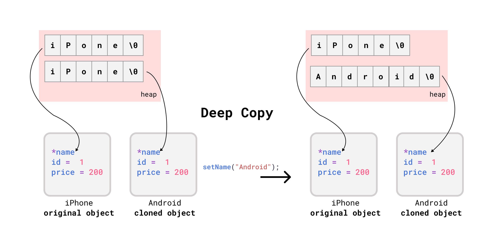

# OOP in C++

- [OOP in C++](#oop-in-c)
  - [OOP intro](#oop-intro)
    - [Defining a Class](#defining-a-class)
    - [Creating Objects](#creating-objects)
    - [Access Modifiers](#access-modifiers)
    - [Compiling and linking multiple cpp files](#compiling-and-linking-multiple-cpp-files)
      - [Using `makefile`](#using-makefile)
    - [Getters and Setters](#getters-and-setters)
  - [Default Methods](#default-methods)
    - [Constructor](#constructor)
    - [🌟Copy Constructor](#copy-constructor)
      - [Default Copy Constructor](#default-copy-constructor)
      - [🚀When to create user defined Copy Constructor?](#when-to-create-user-defined-copy-constructor)
    - [🚀Copy Assignment Operator =](#copy-assignment-operator-)
    - [🌟Destructor - Deleting DMA](#destructor---deleting-dma)

## OOP intro

### Defining a Class

Definition in: `Rectangle.h`

```cpp
#ifndef RECTANGLE_HEADER_H
#define RECTANGLE_HEADER_H

class Rectangle {
    int width;
    int height;
    void draw();
    int getArea();
};

#endif
```

implementation of methods in `Rectangle.cpp`

```cpp
#include "Rectangle.h"
#include <iostream>

using namespace std;

void Rectangle::draw() {
    cout << "Drawing a rectangle" << endl;
    cout << "Dimensions:" << width << ", " << height << endl;
}

int Rectangle::getArea() {
    return width * height;
}
```

### Creating Objects

`main.cpp`

```cpp
#include <iostream>
using namespace std;
#include "Rectangle.h"

int main() {
    // creating and initializing object
    Rectangle rec;
    rec.width = 10;
    rec.height = 20;

    cout << rec.getArea();

    return 0;
}
```

But above code will not work because in Cpp properties and methods are private by default. So we need to make them public.

```bash
main.cpp:7:9: error: 'int Rectangle::width' is private within this context
    7 |     rec.width = 10;
      |         ^~~~~
main.cpp:8:9: error: 'int Rectangle::height' is private within this context
    8 |     rec.height = 20;
      |         ^~~~~~
main.cpp:10:24: error: 'int Rectangle::getArea()' is private within this context
   10 |     cout << rec.getArea();
      |             ~~~~~~~~~~~^~
```


### Access Modifiers

A class member can be defined as `public`, `private` or `protected`. By default members would be assumed as `private`.

using `public` access modifier in: `Rectangle.h`

```cpp
#ifndef RECTANGLE_HEADER_H
#define RECTANGLE_HEADER_H

class Rectangle {
public:
    int width;
    int height;
    void draw();
    int getArea();
};

#endif
```

Now we can access the properties and methods of the class.


### Compiling and linking multiple cpp files


`main.cpp`

```cpp
#include <iostream>
using namespace std;
#include "Rectangle.h"

int main() {
    // creating and initializing object
    Rectangle rec;
    rec.width = 10;
    rec.height = 20;

    cout << rec.getArea();

    return 0;
}
```

Compiling both cpp files and the run the executable.

```bash
g++ -std=c++20 Rectangle.cpp  main.cpp -o main ; .\main
```

>> output: 200

We can see that we have to compile these files seperately.

```bash
g++ -c main.cpp
g++ -c Rectangle.cpp
```

Here

- `g++ -c main.cpp`: generates `main.o`
- `g++ -c Rectangle.cpp`: generates a `Rectangle.o`

Next, we link the object files together to generate the executable main.

```bash
g++ -o main main.o Rectangle.o
.\main
```

#### Using `makefile`

Organize project directory like this :

```bash
root
├── include/
│   └── all .h files here
│
├── src/
│   └── all .c files here
└── Makefile
```

including header files:

`src/main.cpp`:

```cpp
#include "../include/Rectangle.h"
#include <iostream>
using namespace std;

int main() {
    // ...
}
```

`src/Rectangle.cpp`:

```cpp
#include "../include/Rectangle.h"
#include <iostream>
using namespace std;

//...
```

See and use makefile defined in `C_CPP/README.md`

### Getters and Setters

```cpp
// `Rectangle.h`
#ifndef RECTANGLE_HEADER_H
#define RECTANGLE_HEADER_H
class Rectangle {
private:
    int width;
    int height;

public:
    void draw();
    int getArea();
};
#endif
```

We we set the properties to private, we can't access them from the main function. So we need to create a getter and setter for each property.

```cpp
// `Rectangle.h`
#ifndef RECTANGLE_HEADER_H
#define RECTANGLE_HEADER_H

class Rectangle {
private:
    int width;
    int height;

public:
    void draw();
    int getArea();
    //  getters and setters
    int getWidth();
    void setWidth(int width);
    int getHeight();
    void setHeight(int height);
};

#endif
```

```cpp
// `Rectangle.cpp`
#include "Rectangle.h"
#include <iostream>

using namespace std;

int Rectangle::getWidth() {
    return width;
}

void Rectangle::setWidth(int width) {
    if (width < 0) {
        throw invalid_argument("Width cannot be negative");
    }

    // (*this).width = width;
    //  or
    this->width = width;
    //  or
    // Rectangle::width = width;
}

int Rectangle::getHeight() {
    return height;
}

void Rectangle::setHeight(int height) {
    if (height < 0) {
        throw invalid_argument("Height cannot be negative");
    }
    this->height = height;
}

// ...
```

`main.cpp`

```cpp
#include "Rectangle.h"
#include <iostream>
using namespace std;

int main() {
    Rectangle rec;
    rec.setWidth(10);
    rec.setHeight(5);
    cout << rec.getArea() << endl;// 50
    rec.setHeight(-1); //  throws exception

    return 0;
}
```


## Default Methods

### Constructor

- Constructor Name = Class Name
- Called Automatically when an object is created.
- Memory Allocation happens when constructor is called.
- Constructor is called only once for each object.

```cpp
class Product {
private:
    int id;
    char name[100];
    int mrp; // maximum retail price
    int selling_price;

public:
    //Default Constructor
    Product() { }
    //Parameterized Constructor |  Constructor Overloading...
    Product(int id, char *name, int mrp, int selling_price) {
        this->id = id;
        this->mrp = mrp;
        this->selling_price = selling_price;
        strcpy(this->name, name); // `this->name = name` not possible because name is a char array.
    }

    //..
};

int main() {
    Product camera(1, "Nikon", 100, 200);
    // camera.setMrp(1000);
    // camera.setSellingPrice(1200);
    return 0;
}
```

### 🌟Copy Constructor

#### Default Copy Constructor

```cpp
    Product camera(1, "Nikon", 100, 200);
    camera.showDetails();
    // Product{id = 1, name = Nikon, mrp = 100, selling_price = 200}
    Product webcam(camera); // calls default copy constructor
    webcam.showDetails();
    // Product{id = 1, name = Nikon, mrp = 100, selling_price = 200}
```

If default copy constructor is working fine, then why do we need to write our own copy constructor?

To understand why, we need to understand the following:

- `shallow copy`
- `deep copy`

#### 🚀When to create user defined Copy Constructor?


The compiler created copy constructor works fine for most cases. We need to define our own copy constructor only if **an object has pointers to dynamically allocated objects**, ie a **deep copy** of object is needed.

The following example create dynamic memory for `name` -  a separate memory space is allocated for `name` and the pointer to that memory space is stored in `camera` object. When we copy `camera` to `webcam` object, the compiler creates a **shallow copy** of `camera` object and the pointer to the memory space of `name` is copied to `webcam` object as well. That means `webcam` object has a pointer to the same memory space as `camera` object.

<div align="center">

</div>

```cpp
class Product {
private:
    int id;
    char *name;
    int mrp;
    int selling_price;
public:
    Product(int id, char *name, int mrp, int selling_price) {
        this->id = id;
        this->mrp = mrp;
        this->selling_price = selling_price;
        // dynamically allocate memory for name
        this->name = new char[strlen(name) + 1];
        strcpy(this->name, name);
    }
    void setName(char *name) {
        strcpy(this->name, name);
    }

    //...
};

int main() {
    Product iPhone(1, "iPhone", 100, 200);
    Product android(iPhone);
    android.setName("Android");
    iPhone.showDetails();
    android.showDetails();
}
```

Output: both name are same.

```bash
Product{id = 1, name = iPhone, mrp = 100, selling_price = 200}
Product{id = 1, name = iPhone, mrp = 100, selling_price = 200}
Product{id = 1, name = Android, mrp = 100, selling_price = 200}
Product{id = 1, name = Android, mrp = 100, selling_price = 200}
```

To resolve this issue, we need to write our own copy constructor to create a **deep copy**.

<div align="center">

</div>

Syntax for user defined copy constructor:

`ClassName(ClassName &objectName) { }` - here copy constructor must pass it's first parameter as reference.

```cpp
class Product {
private:
    int id;
    char *name;
    int mrp; // maximum retail price
    int selling_price;

public:
    Product(int id, char *name, int mrp, int selling_price) {
        this->id = id;
        this->mrp = mrp;
        this->selling_price = selling_price;
        this->name = new char[strlen(name) + 1];
        strcpy(this->name, name);
    }
    Product(const Product &p) {
        id = p.id;
        mrp = p.mrp;
        selling_price = p.selling_price;
        // shallow copy
        name = p.name;
    }
    void setName(char *name) {
        strcpy(this->name, name);
    }
 //....
};

int main() {
    Product iPhone(1, "iPhone", 100, 200);
    Product android(iPhone);
    iPhone.showDetails();
    android.showDetails();
    android.setName("Android");
    iPhone.showDetails();
    android.showDetails();
    return 0;
}
```

Output: still remains same as the previous example.

```bash
Product{id = 1, name = iPhone, mrp = 100, selling_price = 200}
Product{id = 1, name = iPhone, mrp = 100, selling_price = 200}
Product{id = 1, name = Android, mrp = 100, selling_price = 200}
Product{id = 1, name = Android, mrp = 100, selling_price = 200}
```

Inside copy constructor, we need to allocate separate memory for `name` for the cloned object.

```cpp
class Product {
private:
    int id;
    char *name;
    int mrp;
    int selling_price;
public:

    Product(int id, char *name, int mrp, int selling_price) {
        this->id = id;
        this->mrp = mrp;
        this->selling_price = selling_price;
        this->name = new char[strlen(name) + 1];
        strcpy(this->name, name);
    }
    Product(const Product &X) {
        id = X.id;
        mrp = X.mrp;
        selling_price = X.selling_price;
        // shallow copy
        //  name = p.name;
        // deep copy
        name = new char[strlen(X.name) + 1];
        strcpy(name, X.name);

    }
    void setName(char *name) {
        strcpy(this->name, name);
    }
//...
};

int main() {
    Product iPhone(1, "iPhone", 100, 200);
    Product android(iPhone);
    iPhone.showDetails();
    android.showDetails();
    android.setName("Android");
    iPhone.showDetails();
    android.showDetails();
}
```

```bash
Product{id = 1, name = iPhone, mrp = 100, selling_price = 200}
Product{id = 1, name = iPhone, mrp = 100, selling_price = 200}
Product{id = 1, name = iPhone, mrp = 100, selling_price = 200}
Product{id = 1, name = Android, mrp = 100, selling_price = 200}
```

### 🚀Copy Assignment Operator =

Assignment operator is called when an **already initialized object is assigned a new value from another existing object**.

```cpp
class Product {
private:
    int id;
    char *name;
    int mrp; // maximum retail price
    int selling_price;
public:

    Product(int id, char *name, int mrp, int selling_price) {
        this->id = id;
        this->mrp = mrp;
        this->selling_price = selling_price;
        this->name = new char[strlen(name) + 1];
        strcpy(this->name, name);
    }
    void operator=(const Product &X) {
        id = X.id;
        mrp = X.mrp;
        selling_price = X.selling_price;
        // deep copy
        name = new char[strlen(X.name) + 1];
        strcpy(name, X.name);
    }
    void setName(char *name) {
        strcpy(this->name, name);
    }
//..
};

int main() {
    Product iPhone(1, "iPhone", 100, 200);
    Product android;
    android = iPhone;
    iPhone.showDetails();
    android.showDetails();
    android.setName("Android");
    iPhone.showDetails();
    android.showDetails();
    return 0;
}
```

### 🌟Destructor - Deleting DMA

- Function that is called Automatically when an object is destroyed ie object goes out of scope or destroyed explicitly by call to delete.
- Compiler provides a default destructor.
- User defined destructor is needed when **class contains pointers to dynamically allocated.**

```cpp
class Product {
private:
    int id;
    char *name;
    int price;

public:
    Product(int id, char *name, int price) {
        this->id = id;
        this->price = price;
        // dynamically allocate memory for name
        this->name = new char[strlen(name) + 1];
        strcpy(this->name, name);
    }
    // Destructor to delete dynamically allocated memory
    ~Product() {
        cout << "Deleting " << name << endl;
        if (name != NULL)
            delete[] name;
        name = NULL;
    }
};
```
