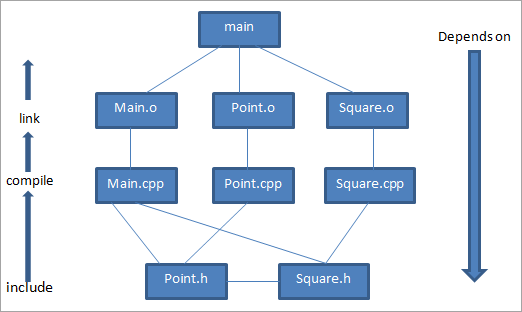

# C++

- [C++](#c)
	- [Setup](#setup)
		- [Install MinGW Compiler](#install-mingw-compiler)
		- [Precompile headers](#precompile-headers)
	- [Compile and Run](#compile-and-run)
		- [cli](#cli)
		- [Compile and run with `Make` And `Makefile`](#compile-and-run-with-make-and-makefile)
			- [⚙️Using better file directory structure](#️using-better-file-directory-structure)
		- [VScode](#vscode)

## Setup

### Install MinGW Compiler

MinGW is a native Windows port of the GNU Compiler Collection (GCC). Install the
latest MinGW compiler, after downloading from
[here](https://sourceforge.net/projects/mingw/). For installation select :

-  `mingw32-base`
-  `mingw32-gcc-g++`

Your path should preferably be `C:\MinGW`. Finally, add the bin directory,
**`C:\MinGW\bin`** to the System **`PATH`**.

- [https://www.scaler.com/topics/c/c-compiler-for-windows/](https://www.scaler.com/topics/c/c-compiler-for-windows/)

>> Installing `make` on Windows with MinGW : [makefile in windows](https://linuxhint.com/run-makefile-windows/)


### Precompile headers

Now we can speed up compilation time by precompiling all the header files, i.e.
by precompiling the **`bits/stdc++.h`** header file. This can speed up
compilation time by up to a factor of 12. For this, first, navigate to the
`stdc++.h` file. This will be located at a directory similar to
**`C:\MinGW\lib\gcc\mingw32\6.3.0\include\c++\mingw32\bits`**. Right click while
pressing Shift to open a Powershell/cmd window there. Run the command
**`g++ -std=c++17 stdc++.h`**, to compile the header. Take care to use the same
flags you used in your build system. Check to make sure that the
**`stdc++.h.gch`** file was created in the directory.

## Compile and Run

### cli

```cpp
g++ main.cpp; .\a
g++ main.cpp -o main; .\main
```

### Compile and run with `Make` And `Makefile`

- [makefile in windows/](https://linuxhint.com/run-makefile-windows/)

Consider a program example with the following files:

- `Main.cpp`: Main driver program
- `Point.h`: Header file for point class
- `Point.cpp`: CPP implementation file for point class
- `Square.h`: Header file for square class
- `Square.cpp`: CPP implementation file for square class

With the above-given `.cpp` and `.h` files, we need to compile these files separately to generate .o files and then link them into executable named main.

So next we compile these files separately.

- `g++ -c main.cpp`: generates `main.o`
- `g++ -c point.cpp`: generates a `point.o`
- `g++ -c square.cpp`: generates `square.o`

Next, we link the object files together to generate the executable main.

```bash
g++ -o main main.o point.o square.o
```

Next, we need to decide which of the files we will have to **recompile and regenerate** when certain parts of the program are updated. For this, we will have a dependency chart that shows various dependencies for each of the implementation files.

<div align="center">

</div>

So in the above dependency chart, we can see the executable `‘main’ `at the root. The executable ‘main’ consists of object files. `main.o`, `point.o`, `square.o` that is generated by compiling` main.cpp`, `point.cpp `and `square.cpp` respectively.

From the dependency chart above, it’s clear that whenever any **`.cpp` file** or **`.h` file referenced by .cpp** file changes, we need to regenerate that `.o` file.

All the above explanations that we have given will work smoothly if there are few files in the project. When the project is huge and files are big and too many, then it becomes difficult to regenerate the files repeatedly.

Thus, we go for make files and we use to make a tool to build the project and generate the executable.

A generic makefile is as shown below:

```bash
# comment


target:  dependency1 dependency2 ... dependencyn
      <tab> command
```

`makefile`:

```makefile
# Makefile for Writing Make Files Example
# *****************************************************
# Variables to control Makefile operation
CC = g++
CFLAGS = -Wall -g

# ****************************************************
main: main.o Point.o Square.o #`main` depends on `main.o` and `Point.o`
# command to build `main` from `main.o` and `Point.o`
    $(CC) $(CFLAGS) -o main main.o Point.o Square.o

# The main.o target can be written more simply
main.o: main.cpp Point.h Square.h # `main.o` depends on `main.cpp` and Point.h, Square.h
# command to build `main.o` from `main.cpp`
    $(CC) $(CFLAGS) -c main.cpp

```

More robust makefile:

```makefile
INCLUDES=Square.h Point.h
OBJ=Point.o Square.o main.o
CC=g++ -Wall
EXECUTABLE=main

# Link: Generate executable file from object files then run it
all: clean $(EXECUTABLE)
$(EXECUTABLE): $(OBJ)
	@echo LINKING... $(CC) -o $@ $(OBJ)
	@$(CC) -o $@ $(OBJ)
# `$(CC) -o $@ $(OBJ)` => `$(CC) -o $(EXECUTABLE) $(OBJ)` => `g++ -Wall -o main Point.o Square.o main.o`
	@echo RUNNING... $(EXECUTABLE)
	@$(EXECUTABLE)

# Compile: Generate object files from source files
%.o: %.cpp $(INCLUDES)
	@echo COMPILING... $(CC) -c $< -o $@
	@$(CC) -c -o $@ $<
# loops through all the .cpp files and creates the .o files
# "Compiling... g++ -Wall -c -o Point.o Point.cpp"
# "Compiling... g++ -Wall -c -o Square.o Square.cpp"
# "Compiling... g++ -Wall -c -o main.o main.cpp"

# @ at the beginning of a line suppresses the command from being printed to the terminal
# $@ is equal to $(EXECUTABLE)
# $< := THE first file


clean:
# rm -f *.o
	del *.o *.exe -f

```


#### ⚙️Using better file directory structure

For example, if we have a file structure like this:

```bash
root/
├── include
│   ├── Rectangle.h
│   ├── TextBox.h
│   └── other `.h` files
├── src
│   ├── main.cpp
│   ├── Point.cpp
│   ├── TextBox.cpp
│   └── other `.cpp` files
└── Makefile
```

Then we can use the following makefile:

```makefile
CC = g++
CFLAGS   = -Wall -std=c++20

SRCDIR   = src
HEADDIR  = include
OBJDIR   = build
BINDIR   = bin
# where the executable will be stored
EXECUTABLE := $(BINDIR)/main

# list of all source files
SOURCES  := $(wildcard $(SRCDIR)/*.cpp)
# list of all header files
INCLUDES := $(wildcard $(HEADDIR)/*.h)
# from the list of all source files, create a list of all object files
OBJECTS  := $(SOURCES:$(SRCDIR)/%.cpp=$(OBJDIR)/%.o)

# all: clean $(EXECUTABLE)
all: $(EXECUTABLE)

# Link: Generate executable file from object file
$(EXECUTABLE): $(OBJECTS)
	@echo LINKING..... $(CC) -o $@ $(OBJECTS)
	@$(CC) -o $@ $(OBJECTS)
	@echo RUNNING: $(EXECUTABLE)
	@$(EXECUTABLE)

# Compile: Generate object files from source files
$(OBJDIR)/%.o : $(SRCDIR)/%.cpp | makedirs
	@echo COMPILING... $(CC) $(CFLAGS) -c "$<" -o "$@"
	@$(CC) $(CFLAGS) -c $< -o $@
# @echo Compiled "$<" successfully!

# `|` is order-only-prerequisites
# https://www.gnu.org/software/make/manual/html_node/Prerequisite-Types.html
makedirs:
# check if the file exists; if not, create it
# mkdir -p $(OBJDIR) in linux
	@if not exist "$(OBJDIR)" mkdir $(OBJDIR)
	@if not exist "$(BINDIR)" mkdir $(BINDIR)

#Delete dependence files, object files, and the EXECUTABLE file
clean:
	@echo CLEANING UP
# check if the directories exist; if so, delete them
	@if exist "$(OBJDIR)" rmdir /s /q $(OBJDIR)
	@if exist "$(BINDIR)" rmdir /s /q $(BINDIR)
```

Including header files:

`src/main.cpp`:

```cpp
#include "../include/Rectangle.h"
#include "../include/TextBox.h"
#include <iostream>
using namespace std;

int main() {
    // ...
}
```

`src/Rectangle.cpp`:

```cpp
#include "../include/Rectangle.h"
#include <iostream>
using namespace std;

//...
```

`src/TextBox.cpp`:

```cpp
#include "../include/TextBox.h"

//...
```

- [https://earthly.dev/blog/g++-makefile/](https://earthly.dev/blog/g++-makefile/)
- [https://www.softwaretestinghelp.com/cpp-makefile-tutorial/](https://www.softwaretestinghelp.com/cpp-makefile-tutorial/)
- [https://makefiletutorial.com/#top](https://makefiletutorial.com/#top)
- [stackoverflow.com/how-to-write-a-makefile-with-separate-source-and-header-directories/73991771#73991771](https://stackoverflow.com/questions/30573481/how-to-write-a-makefile-with-separate-source-and-header-directories/73991771#73991771)

### VScode

[Docs](https://www.geeksforgeeks.org/compiling-with-g-plus-plus/)

-  By vscode Code Runner Extension:

```json
 "code-runner.executorMap": {
      "cpp": "cd $dir && g++ -std=c++17 $fileName -o $fileNameWithoutExt && $dir$fileNameWithoutExt",
 }
```

**Other Vs config:**

```json
{
   "C_Cpp.default.compilerPath": "C:\\MinGW\\bin\\g++.exe"
}
```
