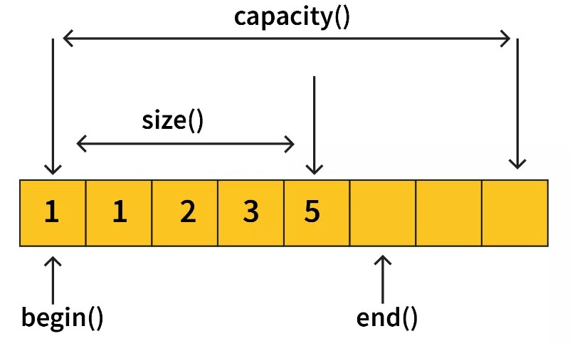

# vector

- [vector](#vector)
  - [initialize](#initialize)
  - [Size](#size)
  - [Access Vector element](#access-vector-element)
  - [Modifiers](#modifiers)
  - [Iterators and traversals](#iterators-and-traversals)
  - [Insertion and Deletion](#insertion-and-deletion)

Methods:

- **`[]`**
- `at()`
- `back()`
- `begin()`
- `capacity()`
- **`pop_back()`**
- **`push_back()`**
- **`reserve()`**
- `resize()`
- **`size()`**
- **`clear()`**
- `empty()`
- `end()`
- `erase()`
- `front()`
- `insert()`

## initialize

```cpp
    // empty container constructor
    vector<int> v1;
    // fill constructor (4 int with value 10)
    vector<int> v2(4, 10);

    // range constructor
    int n[] = {1, 2, 3, 4};
    vector<int> v3(n, n + 4);

    // copy constructor
    vector<int> v4(v3);

    // assignment operator
    vector<int> v5;
    v5 = v3;

    // initializer list constructor
    vector<int> v6{1, 2, 3, 4};
    print(v6);

    // Another way
    vector<int> v7 = {1, 2, 3, 4};
    print(v7);
```

## Size

<div align="center">

</div>

```cpp
vector<int> a = { 10, 20, 30, 40, 50, 60, 70 };
cout << "size() :" << a.size() << endl; //size() :7
cout << "max_size() :" << a.max_size() << endl; //max_size() :536870911
cout << "capacity() :" << a.capacity() << endl; //capacity() :7
a.resize(4); //resize() :4
cout << "resize() :" << a.size() << endl; //size() :4
```

## Access Vector element

```cpp
    vector<int> v{1, 2, 3, 4, 5};
    cout << v[0] << " " << v.at(0) << endl; // 1 1
    cout << v.back() << endl;               // 5
    cout << v.front() << endl;              // 1
```

## Modifiers


```cpp
vector a = {10,20,30,40,50};
a.at(2) = 0;
a[4] = -1; //a = {10, 20, 0, 40, -1, 6}
```

## Iterators and traversals

Iterators offered by vectors

```cpp
vector<int> a = { 10, 20, 30, 40, 50 };
cout << "a.begin() " << *(a.begin()); //10
cout << "a.end() " << *(a.end()); //12853 garbage value because it is out of bounds of the vector
cout << "a.rbegin() " << *(a.rbegin()); //50
cout << "a.rend() " << *(a.rend()); //201336894 garbage value because it is out of bounds of the vector
cout << "a.cbegin() " << *(a.cbegin()); //10
cout << "a.cend() " << *(a.cend()); //12853
```

```cpp
#include <iostream>
#include <vector>
using namespace std;

int main() {
    vector<int> v{1, 2, 3, 4, 5};

    vector<int>::iterator it = v.begin();
    // or auto it = v.begin();

    cout << (*it) << endl; // 1
    it++;
    cout << (*it) << endl; // 2
    it = it + 2;
    cout << (*it) << endl; // 4
    vector<int>::iterator itend = v.end();

    cout << (*itend) << endl; // garbage value
    /*
    end() returns the address of the next element after the last element.
     */
    itend--;
    cout << (*itend) << endl; // 5

    for (auto it = v.begin(); it != v.end(); it++) {
        cout << (*it) << " "; // 1 2 3 4 5
    }

    return 0;
}
```

Iterate through a Vector without using Iterators:

```cpp
#include <iostream>
#include <vector>
using namespace std;

void print(vector<int> &arr) {
    for (auto &i : arr)
        cout << i << " ";
    cout << endl;
}
// Function to update the value in vector
void updateVector(vector<int> &arr) {
    cout << "Vector Before Update: ";
    print(arr);

    // Traverse using the `reference` to value
    // and multiply each value by 2
    for (auto &i : arr) {
        i *= 2;
    }
    cout << "Vector After Update: ";
    print(arr);
}

int main() {
    vector<int> arr = {1, 2, 3, 4};
    updateVector(arr);
}
```

## Insertion and Deletion

<table>
<thead>
  <tr>
    <th>Function</th>
    <th>Description</th>
  </tr>
</thead>
<tbody>
  <tr>
    <td><code>push_back(value)</code></td>
    <td>Adds element to end of vector</td>
  </tr>
    <tr>
    <td><code>insert(iterator,value)</code></td>
    <td>Adds an element at a particular index specified.</td>
  </tr>
  <tr>
    <td><code>pop_back()</code></td>
    <td>Removes element from end of vector</td>
  </tr>
  <tr>
    <td><code>erase()</code></td>
    <td>Removes elements from specific positions or ranges</td>
  </tr>
    <tr>
    <td><code>clear()</code></td>
    <td>Removes all elements from the vector a makes its size 0.</td>
  </tr>
    <tr>
    <td><code>swap(vector)</code></td>
    <td>Swaps contents of one vector with another vector of the same data type.</td>
  </tr>
</tbody>
</table>


- `push_back()` and `pop_back()`

```cpp
    vector<int> v{1, 2, 3, 4};
    v.push_back(5);
    print(v); // {1, 2, 3, 4, 5}
    v.pop_back();
    print(v); // {1, 2, 3, 4}
```

- `insert()`

```cpp
int main() {
    vector<int> v{1, 2, 3, 4, 5};
    /*
 🔵Syntax 1:vector_name.insert (position, val)
    🔴position – It specifies the iterator which points to the position where the insertion is to be done.
    🔴val – It specifies the value to be inserted.
    */
    auto pos = v.begin() + 2;
    v.insert(pos, 10);
    print(v); // {1, 2, 10, 3, 4, 5}

    /*
 🔵Syntax 2:vector_name.insert(position, size, val)
    🔴position – It specifies the iterator which points to the position where the insertion is to be done.
    🔴size – It specifies the number of times a val is to be inserted at the specified position.
    🔴val – It specifies the value to be inserted.
     */

    int n_times = 3;
    pos = v.begin() + 2;
    v.insert(pos, n_times, 0);
    print(v); // {1, 2, 0, 0, 0, 10, 3, 4, 5}

    /*
 🔵Syntax 3:vector_name.insert(position, iterator1, iterator2)
    🔴position – It specifies the position at which insertion is to be done in the vector.
    🔴iterator1 – It specifies the starting position from which the elements are to be inserted
    🔴iterator2 – It specifies the ending position till which elements are to be inserted
     */

    vector<int> v2{100, 200, 300};
    v.insert(v.begin(), v2.begin(), v2.end());
    print(v); // {100, 200, 300, 1, 2, 0, 0, 0, 10, 3, 4, 5}

    return 0;
}
```


- `erase()`

```cpp
int main() {
    vector<int> v{1, 2, 3, 4, 5};

    /*
    Syntax 1: vectorname.erase(position)
    Syntax 2: vectorname.erase(startingposition, endingposition)
     */
    auto pos = v.begin() + 1;
    v.erase(pos);
    print(v); // 1 3 4 5

    auto from = v.begin() + 1;
    auto to = v.begin() + 3;
    v.erase(from, to);
    print(v); // 1 5
}
```

- `clear()` and `empty()`

```cpp
    vector<int> v{1, 2, 3};
    v.clear();
    cout << v.size() << endl;  // 0
    cout << v.empty() << endl; // 1
```