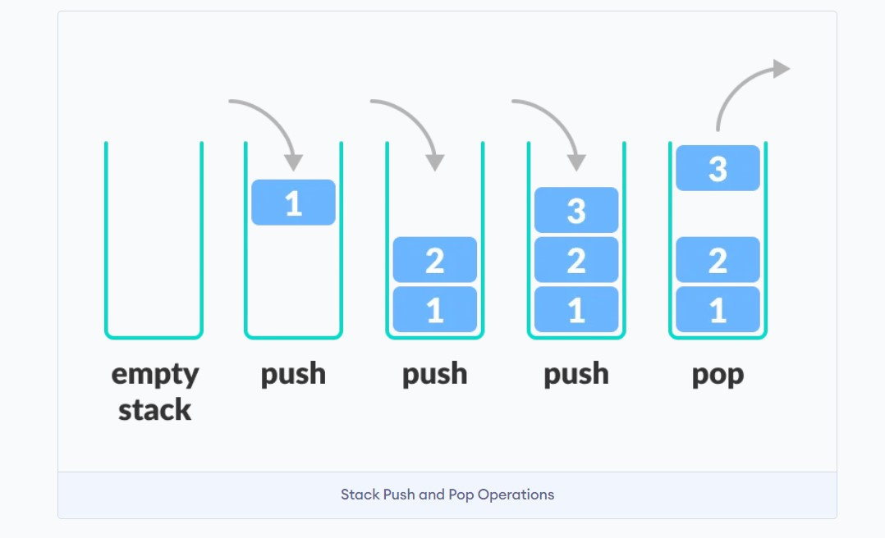

# Stack

- [Stack](#stack)
	- [Introduction](#introduction)
	- [C++ Stack Template Parameters](#c-stack-template-parameters)

## Introduction

<div align="center">

</div>

```cpp
#include <iostream>
#include <stack>
using namespace std;

int main() {

    stack<int> s;
    s.push(1); //{1}
    s.push(2); //{1,2}
    s.push(3); //{1,2,3}

    cout << s.top() << endl; // 3 "** s[2] is invalid**"

    s.pop();                 //{1,2}
    cout << s.top() << endl; // 2

    cout << s.size() << endl;  // 2
    cout << s.empty() << endl; // 0

    return 0;
}
```

## C++ Stack Template Parameters

The time complexity of the stack methods we have discussed depends upon the type of container internally used in the stack object.

A `push_back` call is made to the underlying container.

- For `vector`, time complexity will be amortized `O(n)`.
- For `list`, time complexity will be `O(1)`.
- For `deque`, time complexity will be `O(1)`.

Syntax: `stack<type, container> object_name;`

- `container`: It represents the c++ container data structure to be maintained and used internally by our stack object. Either of C++ `std::vector`, `std::list` or `std::deque` can be used as the container for the stack.
- The default value of the optional argument is C++ `std::deque`.

```cpp
#include <iostream>
#include <list>
#include <stack>
using namespace std;

int main() {
    stack<char, list<char>> st;
    st.push('a');
    st.push('b');

	 cout << st.top() << endl; // b
    return 0;
}
```
