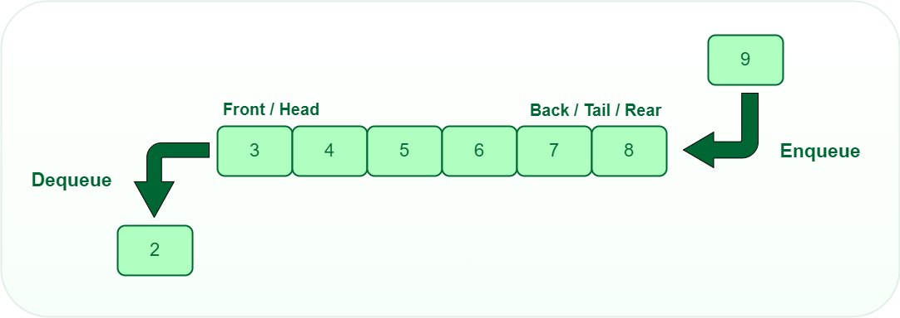

# Queue

- [Queue](#queue)
	- [Introduction](#introduction)

## Introduction

<div align="center">

</div>

Functions Described in a Queue:

<table>
<thead>
  <tr>
    <th>Function</th>
    <th>Description</th>
  </tr>
</thead>
<tbody>
  <tr>
    <td><code>push(a)</code></td>
    <td>inserts an element to the end of the queue.</td>
  </tr>
  <tr>
    <td><code>pop()</code></td>
    <td>removes the first element from the queue, i.e., the element returned by the front method.</td>
  </tr>
  <tr>
    <td><code>front()</code></td>
    <td>This function returns the value of the first element in the queue.</td>
  </tr>
  <tr>
    <td><code>back()</code></td>
    <td>This function returns the value of the last element in the queue.</td>
  </tr>
  <tr>
    <td><code>empty()</code></td>
    <td>This function returns 0 if the queue is not empty and a non-zero value if the queue is empty.</td>
  </tr>
  <tr>
    <td><code>size()</code></td>
    <td>This function returns the size of the queue.</td>
  </tr>
</tbody>
</table>

```cpp
#include <iostream>
#include <queue>
using namespace std;

int main() {
    queue<int> q;
    q.push(1); //{1}
    q.push(2); //{1,2}
    q.push(3); //{1,2,3}

    cout << q.front() << endl; // 1
    cout << q.back() << endl;  // 3

    q.back() = 5;             //{1,2,5}
    cout << q.back() << endl; // 5
    q.back()++;               //{1,2,6}
    cout << q.back() << endl; // 6
    q.back() += 4;            //{1,2,10}
    cout << q.back() << endl; // 10

    q.pop();                   //{2,10}
    cout << q.front() << endl; // 2
    cout << q.back() << endl;  // 10

    cout << q.size() << endl;  // 2
    cout << q.empty() << endl; // 0

    return 0;
}
```


example 2:

```cpp
#include <iostream>
#include <queue>
using namespace std;

int main() {
    queue<int> q;
    int z = 0;
    while (z <= 100) {
        q.push(z);
        z += 10;
    }
    cout << q.front() << "\n"; // 0
    cout << q.back() << "\n";  // 100
    cout << q.size() << "\n";  // 11
    cout << "The elements in the queue q are: \n";
    while (!q.empty()) {
        int first = q.front();
        cout << first << "\n";
        q.pop();
    }

    return 0;
}
```