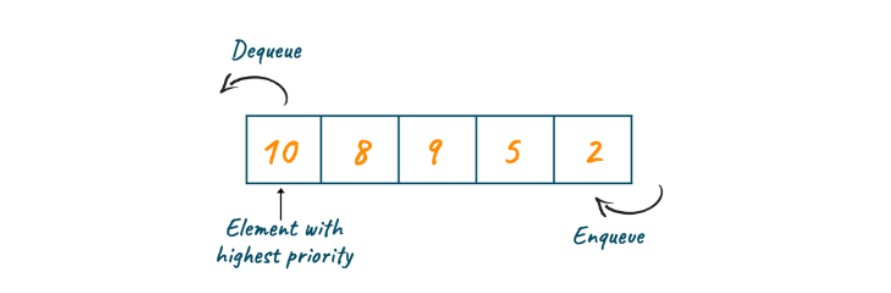

# Priority Queue in C++

- [Priority Queue in C++](#priority-queue-in-c)
	- [Introduction](#introduction)
	- [🔥 Min Heap: storing the smallest element at the top](#-min-heap-storing-the-smallest-element-at-the-top)

## Introduction

<div align="center">

</div>

- In Priority Queue the **top element is either the largest or the smallest of all the elements in the queue**, and t**he elements are arranged in non-increasing order.**
- However, the **highest element** is always the default in the C++ STL.

```cpp
#include <iostream>
#include <queue>
using namespace std;

int main() {
    priority_queue<int> pq;
    pq.push(5); //{5}
    pq.push(2); //{5,2}
    pq.push(8); //{8,5,2}

    cout << pq.top() << endl; // 8

    pq.pop();                 //{5,2}
    cout << pq.top() << endl; // 5

    priority_queue<int> p1;
    p1.push(30);
    p1.push(40);
    p1.push(50);
    p1.push(20);

    while (!p1.empty()) {
        cout << ' ' << p1.top();
        p1.pop();
    }
    // 50 40 30 20

    return 0;
}
```

## 🔥 Min Heap: storing the smallest element at the top

```cpp
#include <iostream>
#include <queue> //Header-file for queue

using namespace std;

int main() {
    // Min Heap
    priority_queue<int, vector<int>, greater<int>> pq;
    pq.push(5); //{5}
    pq.push(2); //{2,5}
    pq.push(8); //{2,5,8}

    cout << pq.top() << endl; // 2

    return 0;
}
```