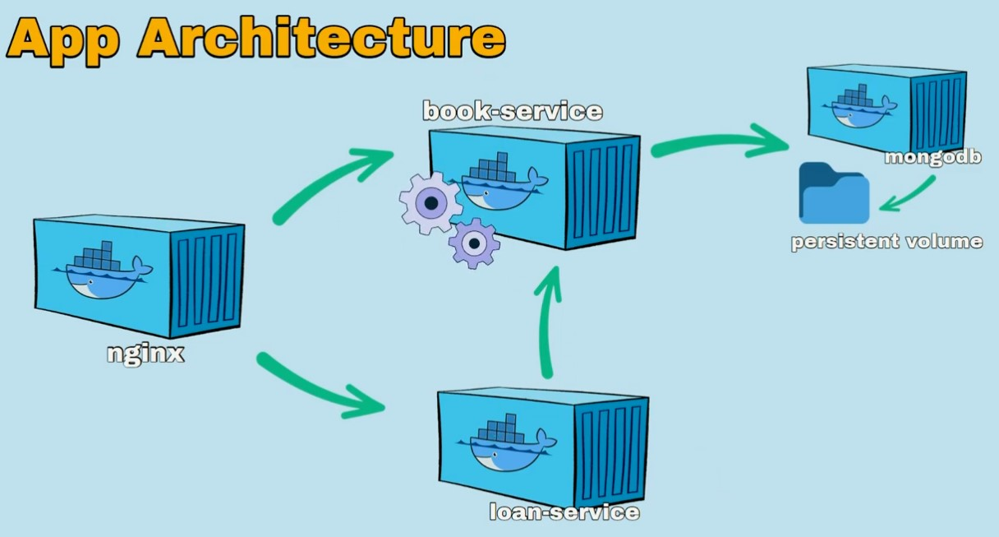

# Docker

- [Docker](#docker)
  - [Introduction](#introduction)
  - [Building basic docker image](#building-basic-docker-image)
    - [2 - Building Docker images for development and production](#2---building-docker-images-for-development-and-production)
  - [Volumes in Docker](#volumes-in-docker)
  - [Docker Compose - Multi-container applications](#docker-compose---multi-container-applications)
    - [Example express.js development and production setup](#example-expressjs-development-and-production-setup)
    - [Ex - Docker Compose for Elasticsearch and Kibana](#ex---docker-compose-for-elasticsearch-and-kibana)
    - [ex 2](#ex-2)

## Introduction

Developing, testing, and deploying applications consistently across various environments can be complex and error-prone due to differences in software versions, dependencies, and configurations. Docker addresses this by providing containerization, which packages an application and its dependencies into a single, portable container that runs reliably on any environment that supports Docker, ensuring consistency and efficiency throughout the development lifecycle.

In short, Docker is a tool for creating and running applications in isolated environments called containers. Key ideas include:

1. **Images**: A Docker image is a template with instructions to create a container. It can be used to create multiple containers.
2. **Containers**: A Docker container is an instance of an image, packaging an application and its dependencies, running in isolated environments.


<p align="center">

</p>

This containers then can be run consistently on any system, ensuring that the application works the same way regardless of the environment.

<p align="center">

</p>

There can be multiple containers in a microservice structure that work together to form a complete application, with each container handling a specific service or function independently.

<p align="center">

</p>

## Building basic docker image

Let's start with basic sample-service express project with following project setup:

```bash
sample-service
├── Dockerfile
├── .dockerignore
├── package.json
└── src
    └── index.js
```

`index.js`

```javascript
import express from 'express';

const app = express();
const port = 3000;

app.get('', async (req, res) => {
	res.json({ message: 'Hello World!' });
});

app.listen(port, () => {
	console.log(`Service running at http://localhost:${port}`);
});

```

`package.json`

```json
{
  "name": "sample-service",
  "type": "module",
  "version": "1.0.0",
  "description": "",
  "main": "src/index.js",
  "scripts": {
    "dev": "nodemon src/index.js",
    "start": "node src/index.js"
  },
  "keywords": [],
  "author": "",
  "license": "ISC",
  "dependencies": {
    "express": "^4.19.2"
  },
  "devDependencies": {
    "nodemon": "^3.1.3"
  }
}
```

- **Dockerfile**: This file contains instructions to build a Docker image. It specifies the base image - node.js to run the application, commands to copies the project files to the image, installs dependencies, and starts the application.

`Dockerfile`

```bash
# Use an official Node runtime as a parent image
FROM node:alpine

# Set the working directory `in the container` to /sample-service
WORKDIR /sample-service

# COPY <source> <destination> or
# COPY <all> <the> <things> <last-arg-is-destination>/:
# Copy files from your project folder to the working directory in the container, WORKDIR
COPY package.json pnpm-lock.yaml ./
# Here './' is the relative path to the working directory in the container

# Install any needed packages
RUN npm install -g pnpm && pnpm install
# Copy the current directory contents into the container at /sample-service
COPY . .
# We copied the package.jsons file first separately to take advantage of Docker’s caching mechanism.

# Defining Entrypoints
# Run the command to start the application
CMD ["node", "./src/index.js"]
```

Here, we are using the official Node.js image as the base image, setting the working directory to `/sample-service`, copying the project files to the image, installing dependencies, and starting the application.

Also note that instead of copying all the files and dirs form the project folder with `COPY . .` command, we copied `package.json` and `pnpm-lock.yaml` first to take advantage of Docker’s caching mechanism. This way, if the `package.json` file hasn’t changed, Docker will use the cached image layer for this step, saving time during the build process.

- `.dockerignore` file: This file specifies files and directories that should be ignored when building the Docker image.

`.dockerignore`

```bash
node_modules
```


Building the Docker image:

```bash
# Syntax: docker build -t <image-name:version-tag> <path-to-dockerfile>
docker build -t sample-service .
```

Running the Docker image:

```bash
# Syntax: docker run -p <host-port>:<container-port> <image-name>
docker run -p 3000:3000 sample-service
```

Now, you can access the application at `http://localhost:3000` in your browser.


Stopping the Docker container:

```bash
# List all running containers
docker ps
# Stop the container
docker stop <container-id>
```

Also to list and delete docker images:

```bash
# List all Docker images
docker images
# Delete a Docker image
docker rmi <image-id>
```

### 2 - Building Docker images for development and production

```bash
sample-service
├── Dockerfile.prod
├── Dockerfile.dev
├── .dockerignore
├── package.json
└── src
    └── index.js
```

`index.js`

```javascript
import express from 'express';

const app = express();
const port = process.env.PORT || 3000;
const environment = process.env.NODE_ENV || 'development';

app.get('', async (req, res) => {
	res.json({ message: 'Hello World!' });
});

app.listen(port, () => {
	console.log(`Service running at http://localhost:${port} in ${environment} mode.`);
});
```

`package.json`

```json
{
  "name": "sample-service",
  "type": "module",
  "version": "1.0.0",
  "description": "",
  "main": "src/index.js",
  "scripts": {
    "dev": "nodemon ./src/index.js",
    "docker-build:dev": "docker build -t sample-service:dev -f Dockerfile.dev .",
    "docker-run:dev": "docker run -p 3000:3000 --name sample-service-dev sample-service:dev",
    "start": "node src/index.js",
    "docker-build": "docker build -t sample-service:0.0.1 -f Dockerfile.prod .",
    "docker-run": "docker run -p 3001:3001 --name sample-service-prod sample-service:0.0.1"
  },
  "keywords": [],
  "author": "",
  "license": "ISC",
  "dependencies": {
    "express": "^4.19.2"
  },
  "devDependencies": {
    "nodemon": "^3.1.3"
  }
}
```

`Dockerfile.dev`

```bash
FROM node:22.3.0-alpine
ENV NODE_ENV=development
ENV PORT=3000
WORKDIR /sample-service
COPY package.json pnpm-lock.yaml ./
RUN npm install -g pnpm && pnpm install
COPY . .
CMD ["pnpm", "dev"]
```

`Dockerfile.prod`

```bash
FROM node:22.3.0-alpine
ENV NODE_ENV=production
ENV PORT=3001
WORKDIR /sample-service
COPY package.json pnpm-lock.yaml ./
RUN npm install -g pnpm && pnpm install --prod
COPY . .
CMD ["pnpm", "start"]
```

<p align="center">

</p>

## Volumes in Docker

Volumes are a way to persist data generated by and used by Docker containers. They enable you to:

- Share data between a host and a container.
- Share data between multiple containers.
- Preserve data even if the container is removed.


## Docker Compose - Multi-container applications

Docker Compose is a tool for defining and running multi-container Docker applications. It uses a YAML file to configure the application’s services, networks, and volumes, enabling you to define a multi-container application with a single command.

Example syntax:

`docker-compose.yml`

```yml
version: "3.8"  # Specify the Compose file format version

services:
  web:  # Define the 'web' service
    build: ./frontend  # Build the image from the `Dockerfile` in the 'frontend' directory
    ports:
      - "3000:3000"  # Map port 3000 on the host to port 3000 on the container

  api:  # Define the 'api' service
    build: ./backend  # Build the image from the `Dockerfile` in the 'backend' directory
    ports:
      - "3001:3001"  # Map port 3001 on the host to port 3001 on the container
    environment:
      MONGO_URL: mongodb://db:27017/sampledb  # Set environment variables for the service

  db:  # Define the 'db' service
    image: mongo:4.0-xenial  # Use the 'mongo:4.0-xenial' image from Docker Hub
    ports:
      - "27017:27017"  # Map port 27017 on the host to port 27017 on the container
    volumes:
      - sampledb:/data/db  # Mount the 'sampledb' volume to the '/data/db' directory in the container

volumes:
  sampledb:  # Define the 'sampledb' volume
    # Named volume 'sampledb' will persist the MongoDB data
```

### Example express.js development and production setup

```bash
sample-service
└── src
    └── index.js
├── Dockerfile.prod
├── Dockerfile.dev
├── docker-compose.yml
├── .dockerignore
├── package.json
```

`docker-compose.yml`

```yml
version: '3'
services:
  dev:
    build:
      context: .
      dockerfile: Dockerfile.dev
    develop:
      watch:
        - action: sync
          path: ./src
          target: /sample-service/src
          ignore:
            - node_modules/
        - action: rebuild
          path: package.json
    ports:
      - '3000:3000'

  prod:
    build:
      context: .
      dockerfile: Dockerfile.prod
    ports:
      - '3001:3001'
```

In the `docker-compose.yml` file, we define two services - `dev` and `prod`. Each service specifies the build context, Dockerfile, and ports to expose. The `dev` service uses the `Dockerfile.dev` file, while the `prod` service uses the `Dockerfile.prod` file.

To build and run the service in development and watch mode:

```bash
docker-compose up --build dev --watch
```

After the service is up, the watch mode starts monitoring the target directories and files. Then, whenever a source file in the `src/` directory is changed, Compose syncs the file to the corresponding location under `/sample-service/src` inside the container. For example, `./src/index.js` is copied to `./sample-service/src/index.js` in the container.

- More on [https://docs.docker.com/compose/file-watch/](https://docs.docker.com/compose/file-watch/)

To build and run the service in production mode:

```bash
docker-compose up --build prod
```

### Ex - Docker Compose for Elasticsearch and Kibana

Below is a simple example of a Docker Compose file for Elasticsearch and Kibana. You can create or copy this file using a text editor.

```yml
services:
  elasticsearch:
    image: elasticsearch:7.17.22
    container_name: elasticsearch
    environment:
      - discovery.type=single-node
    ports:
      - 9200:9200
    networks:
      - my-network

  kibana:
    image: kibana:7.17.22
    container_name: kibana
    environment:
      - ELASTICSEARCH_HOSTS=http://elasticsearch:9200
    ports:
      - 5601:5601
    depends_on:
      - elasticsearch
    networks:
      - my-network

networks:
  my-network:
    driver: bridge
```

Start Elasticsearch and Kibana by running the following command:

```bash
docker-compose up -d
```

This command starts the containers in the background. Elasticsearch can be accessed at `http://localhost:9200`, while Kibana is accessible at `http://localhost:5601`.

To stop the containers, you can use the following command in the same directory:

```bash
docker-compose stop
```

To remove the containers, you can use the following command:

```bash
docker-compose down
```


### ex 2

```yml
services:
  db:
    image: postgres:16.3-alpine3.20
    container_name: postgres_db
    restart: always
    environment:
      POSTGRES_USER: ${POSTGRES_USER}
      POSTGRES_PASSWORD: ${POSTGRES_PASSWORD}
      POSTGRES_DB: ${POSTGRES_DB}
    ports:
      - ${POSTGRES_PORT}:5432
    volumes:
      - 'pgdata:/persisted_data/pgdata'
    networks:
      myapp_net:

volumes:
  pgdata:

networks:
  myapp_net:
```

`.env`

```bash
# Postgres
POSTGRES_USER=myuser
POSTGRES_PASSWORD=mypass
POSTGRES_HOST=localhost
POSTGRES_PORT=5432
POSTGRES_DB=test_db
DATABASE_URL=postgresql://${POSTGRES_USER}:${POSTGRES_PASSWORD}@${POSTGRES_HOST}:${POSTGRES_PORT}/${POSTGRES_DB}
```

`docker exec -it postgres_db psql -U myuser`

- `\l` - list databases
- `\c <db> <user>` - connect to database
- `\dt` - list tables
- `\q` - quit


