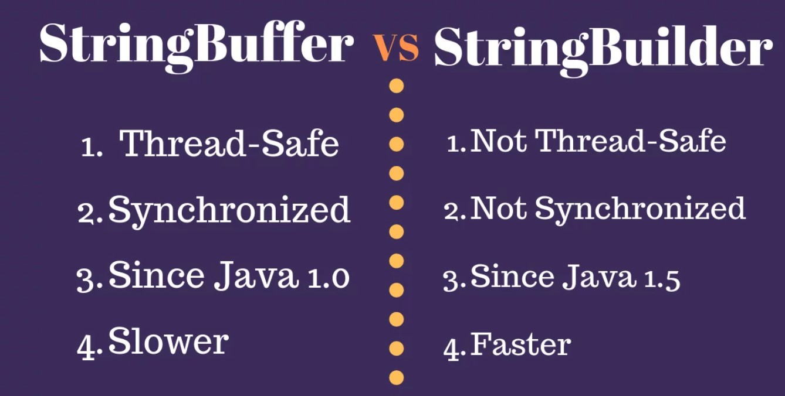

# String

## String vs StringBuffer

Since `String` is immutable in Java, whenever we do String manipulation like concatenation, substring, etc.**it generates a new String and discards the older String for garbage collection.**

These are heavy operations and generate a lot of garbage in heap. So Java has provided `StringBuffer` and `StringBuilder` classes that should be used for String manipulation.

`StringBuffer` and `StringBuilder` are mutable objects in Java. They provide append(), insert(), delete(), and substring() methods for String manipulation. Mutable objects are able to allow modifications on its content directly.

```java
String s = "Java!! "; 
String s1 = s.concat("Hello"); 
String s2 = s1.concat(" World"); 

        System.out.println(s);//Java!! 
        System.out.println(s1);//Java!! Hello 
        System.out.println(s2);//Java!! Hello World

StringBuffer sb = new StringBuffer("Java!! "); 
StringBuffer sb1 = sb.append("Hello"); 
StringBuffer sb2 = sb1.append(" World");

        System.out.println(sb); //Java!! Hello World
        System.out.println(sb1); //Java!! Hello World
        System.out.println(sb2); //Java!! Hello World
```

## StringBuffer vs StringBuilder

`StringBuffer` was the only choice for String manipulation until Java 1.4. But, it has one disadvantage that all of its public methods are synchronized. **StringBuffer provides Thread safety but at a performance cost**.

In most of the scenarios, we don’t use String in a multithreaded environment. So Java 1.5 introduced a new class `StringBuilder`, which is **similar to StringBuffer except for thread-safety and synchronization**.

`StringBuffer` has some extra methods such as `substring`, `length`, `capacity`, `trimToSize`, etc. However, these are not required since you have all these present in String too. That’s why these methods were never implemented in the StringBuilder class.

StringBuffer was introduced in Java 1.0 whereas StringBuilder class was introduced in Java 1.5 after looking at shortcomings of StringBuffer.

If you are in a single-threaded environment or don’t care about thread safety, you should use StringBuilder. Otherwise, use StringBuffer for thread-safe operations.

<div align="center">

</div>

## String vs StringBuffer vs StringBuilder

- `String` is **immutable** whereas `StringBuffer` and `StringBuilder` are **mutable** classes.
- `StringBuffer` is **thread-safe and synchronized** whereas `StringBuilder` is not. That’s why StringBuilder is faster than StringBuffer.
- `String` concatenation operator `(+)` internally uses `StringBuffer` or `StringBuilder` class.
- For String manipulations in a **non-multi threaded** environment, we should use `StringBuilder` else use `StringBuffer` class.


| n0.          | `String`      | `StringBuffer` | `StringBuilder` |
| ------------ | ------------- | -------------- | --------------- |
| Storage      | String Pool   | Heap           | Heap            |
| Modifiable   | No(immutable) | Yes (mutable)  | Yes (mutable)   |
| Thread Safe  | Yes           | Yes            | No              |
| Synchronized | Yes           | Yes            | No              |
| Performance  | Fast          | Slow           | Fast            |
