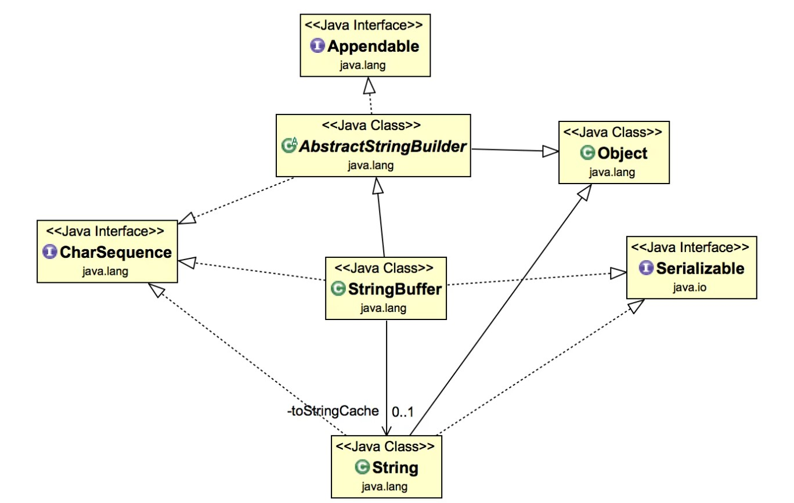

# StringBuffer

- [StringBuffer](#stringbuffer)
	- [Overview](#overview)
	- [StringBuffer Class Diagram](#stringbuffer-class-diagram)
	- [StringBuffer Constructors](#stringbuffer-constructors)
	- [Method](#method)

## Overview

Some important points about StringBuffer in java are:

- `StringBuffer` is much alike the String class, but with **mutability** features.
- `StringBuffer` is **thread safe**, most of it’s methods are synchronized. So StringBuffer object can’t be accessed or used by multiple threads at the same time.
- `java.lang.StringBuffer` extends `AbstractStringBuilder` abstract class.
- StringBuffer implements `CharSequence`, `Appendable` and `Serializable` interfaces.
- StringBuffer `capacity()` method can be used to retrieve the memory available for new character sequences to be added, beyond which the allocation will occur.
- Compared to `StringBuilder` Class, `StringBuffer` operates **slower** due to synchronization.

## StringBuffer Class Diagram

<div align="center">

</div>

## StringBuffer Constructors

`StringBuffer()`: Creates a StringBuffer with empty content and 16 reserved characters by default.

```java
StringBuffer sb = new StringBuffer();
```

`StringBuffer(int sizeOfBuffer)`: Creates a StringBuffer with the passed argument as the size of the empty buffer.

```java
StringBuffer sb = new StringBuffer(20);
```

`StringBuffer(String string)`: Creates a StringBuffer with the passed String as the initial content of the buffer. 16 contingent memory characters are pre-allocated, not including the buffer, for modification purposes.

```java
StringBuffer sb = new StringBuffer("Hello World!");
```


## Method

`char charAt(int index)`: The charAt() method returns the character present at the specified index.

`int codePointAt(int index)`:It returns the Unicode code point of the character at the specified index.

`int codePointBefore(int index)`:It returns the Unicode code point) of the character before the specified index

`int codePointCount(int beginIndex, int endIndex)`: This method returns the number of Unicode code points in the String between the specified range.

`void ensureCapacity(int minimumCapacity)`: This method is used to increase the capacity of the StringBuffer object.

`void getChars(int sourceBegin, int sourceEnd, char\[\] destination, int destBegin)`: jThis method copies the specified characters in a range to a specific destination character array.

`int indexOf(String str, int fromIndex)`: This method returns the index of the first occurrence of the specified substring that starts at the specified index.

`StringBuffer insert(int offset, String str)`: This method inserts the string into the specified string.

`int lastIndexOf(String str)`: This method returns the index of the last occurrence of the specified substring.

`void setCharAt(int index, char ch)`: This method sets a character at the specified index.

`void setLength(int newLength)`: This method is used to set the length of the String.

`String substring(int start, int end)`: This method returns a new String that starts from the specified index and ends with the specified index.

`String toString()`: The toString() method returns data in the form of a string.

`void trimToSize()`: This method reduces the storage space of the string.

`CharSequence subSequence(int start, int end)`: This method returns a new character sequence from the specified range.