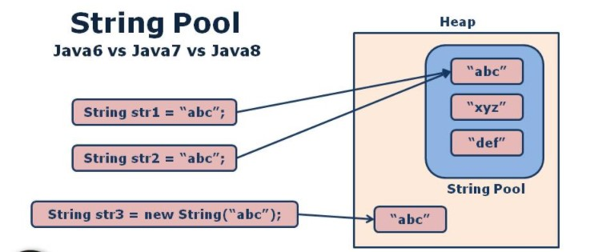

# String CLass

- [String CLass](#string-class)
  - [String Literal Vs String Object](#string-literal-vs-string-object)
    - [1. Direct Initialization](#1-direct-initialization)
    - [2. Object Initialization](#2-object-initialization)
  - [Other Constructors](#other-constructors)
    - [from `byte[]`](#from-byte)
    - [from `char[]`](#from-char)
    - [from `StringBuffer` and `StringBuilder` to **mutable** data **immutable**](#from-stringbuffer-and-stringbuilder-to-mutable-data-immutable)
    - [String Objects Immutability Nature](#string-objects-immutability-nature)
  - [String Methods](#string-methods)
    - [`char charAt(int index)`](#char-charatint-index)
    - [`boolean equals(Object obj)` and `boolean equalsIgnoreCase(String str)`](#boolean-equalsobject-obj-and-boolean-equalsignorecasestring-str)
      - [`boolean equalsIgnoreCase(String string)`](#boolean-equalsignorecasestring-string)
      - [Difference between == and .equals() method in Java](#difference-between--and-equals-method-in-java)
    - [`compareTo(String s)` and  `int compareToIgnoreCase(String s)`](#comparetostring-s-and--int-comparetoignorecasestring-s)
    - [`startsWith()` and `endWith()`](#startswith-and-endwith)

## String Literal Vs String Object

Q) What is the difference between the following two
Statements?

```java
String str = "abc";
Srting str = new String("abc");
```

### 1. Direct Initialization

```java
String str = "abc";
```

- String object will be created in `String Constant
Pool Area` with the data `abc`.
  
- First JVM will check whether any String object is
existed or not in **String Constant Pool Area** with the
data `abc`.
  
- If any String Object is existed with the data `abc`
in String Constant Pool Area, JVM will return that
existed String Object reference with out creating new
String Object. It is called as `String Intern`.
  
- If no String object is existed already with the data
abc' in String Constant Pool Area, then JVM will create
new String Object with the data 'abc'.
  
_Note: In Initial Versions of JAVA, String Constant Pool
area is a block of memory in `Method Area`, if any Object
is created in String Constant Pool area then that Object
is not eligible for Garbage Collection. When Program
Execution is completed or When JVM is in Shutdown then
only String Constant Pool Area data will be removed. In
later Versions of Java String Constant Pool Area is
hoved to `Heap Memory`._

**String pool** in Java is a pool of String literals and interned Strings in JVM for efficient use of String object. Since String is
Immutable Class In Java , it makes sense to cache and shares them in JVM. Java creators introduced this String pool construct as an optimization on the way String objects are allocated and stored. It is a simple implementation of the Flyweight pattern, which in essence, says this: when a lot of data is common among several objects, it is better to just share the same instance of that data than creating several different “copies” of it.

### 2. Object Initialization

```java
Srting str = new String("abc");
```

- As per 'new' keyword, JVM will create new String
object in Heap Memory irrespective of the String object
existed with the same data.
  
- If String objects are created in Heap Memory then
that String objects are eligible for Garbage Collection.
  
- In the above context, str is able to refer heap
memory String object only.



> Final result:

```java
        String s1 = "abc";
        String s2 = "abc";
        String s3 = new String("abc");
        String s4 = "Abc";
        String s5 = new String("abc");

//      `abc` == `abc` : s1==s2 > true
//      `abc` == String(abc) : s1==s3 > false
//      `abc` == `Abc` : s1==s3 > false
//       String(abc) == String(abc) : s3==s5 > false
```

## Other Constructors

### from `byte[]`

> syntax:

```java
public String(byte[] b)
public String(byte[] b,Charset cs) // define which character encoding to use
public String(byte[] b,offset,len)
public String(byte[] b,offset,len,Charset cs)
```

- It can be used to create String class object with  the String equalent of the specified `byte[]` data, where `byte[]` conatisn ASCII values of the characters.

```java
byte[] b= {65,66,67,68,69};
String s= new String(b);//ABCDE
String s= new String(b,2,3);//CDE
Charset cs = Charset.defaultCharset();//declare charset e.g. ASCII , UTF-8, UTF-16
String s = new String(b, cs);
```

### from `char[]`

> syntax:

```java
public String(char[] b)
public String(char[] b,Charset cs) // define which character encoding to use
public String(char[] b,offset,len)
public String(char[] b,offset,len,Charset cs)
```

ex:

```java
char[] ch={'A','B','C','D','E'};
String s= new String(ch);//ABCDE
String s= new String(ch,2,3);//CDE
```

### from `StringBuffer` and `StringBuilder` to **mutable** data **immutable**

```java
StringBuffer sb = new StringBuffer("abc");
String s7 = new String(sb);
StringBuilder sbld = new StringBuilder("abc");
String s8 = new String(sbld);
```

### String Objects Immutability Nature

In case of String objects, that is, immutable objects, if we
perform modification on its content then new object will be
created for storing new data, in the case if data is not
modified then JVM will not create new object, where JVM will
return the same existed object reference value.

```java
        String s1 = new String("ABC");
        String t1 = s1.concat("");
        String t2 = s1.concat(" ");

        System.out.println("`"+s1 + " == " + t1 + "` : " + (s1 == t1));//`ABC == ABC` : true
        /**
         * JVM didn't create new Obj as no Modification occurred with s1
         * */
        System.out.println("`"+s1 + " == " + t2 + "` : " + (s1 == t2));//`ABC == ABC ` : false
        /**
         * JVM did create new Obj as Modification occurred with s1
         * */
```

## String Methods

### `char charAt(int index)`

- Returns the character at the specified index.
- Specified index value should be between `'0' to 'length() -1'` both **inclusive**.
- It throws `IndexOutOfBoundsException` if index is invalid/ out of range.

```java
        String s = "Hello World";
        for (int i = 0; i < s.length(); i++) {
            System.out.print(s.charAt(i) + " ");
        }// H e l l o   W o r l d 
        System.out.println();
        Color.printMsg(Color.GREEN_BRIGHT, "Last char:");
        System.out.println(s.charAt(s.length() - 1));//d
        // System.out.println(s.charAt(s.length())); 
        // exception: StringIndexOutOfBoundsException
```

### `boolean equals(Object obj)` and `boolean equalsIgnoreCase(String str)`

- It can be used to check whether two String objects content
is same or not, if two String objects content is same then
`equals()` method will return `true` value, if two String objects
content is not same then `equals()` method will return `false` value.

```java
        String eq1 = new String("abc");
        String eq2 = new String("def");
        String eq3 = new String("abc");
        System.out.println("String(abc).equal(String(def)) : " + eq1.equals(eq2));//false
        System.out.println("String(abc).equal(String(abc)) : " + eq1.equals(eq3));//true
```

#### `boolean equalsIgnoreCase(String string)`

– Compares same as equals method but in case insensitive way.

IN String class, `equals()` method is able to perform **case sensitive** comparison between two String objects content, but, `equalsIgnoreCase()` method will perform **case insensitive** comparison between two String objects contents.

```java
        String eq1 = new String("abc");
        String eq6 = "ABC";
        String eq7 = new String("ABC");

        System.out.println("String(abc).equalsIgnoreCase(`ABC`)) : " + eq1.equalsIgnoreCase(eq6));//true
        System.out.println("String(abc).equalsIgnoreCase(String(ABC)) : " + eq1.equalsIgnoreCase(eq7));//true
```

#### Difference between == and .equals() method in Java

We can use == operators for reference comparison (address comparison) and .equals() method for content comparison. In simple words, == checks if both objects point to the same memory location whereas .equals() evaluates to the comparison of values in the objects.

```java
String eq1 = new String("abc");
String eq2 = new String("def");
String eq3 = new String("abc");
System.out.println("String(abc)[@" + eq1.hashCode() + "] == String(def)[@" + eq2.hashCode() + "] : " + (eq1 == eq2));
System.out.println("String(abc)[@" + eq1.hashCode() + "] == String(abc)[@" + eq3.hashCode() + "] : " + (eq1 == eq3));
System.out.println("String(abc)[@" + eq1.hashCode() + "].equal(String(def))[@" + eq2.hashCode() + "] : " + eq1.equals(eq2));
System.out.println("String(abc)[@" + eq1.hashCode() + "].equal(String(abc))[@" + eq3.hashCode() + "] : " + eq1.equals(eq3));
String eq4 = "abc";
String eq5 = "abc";
System.out.println("`abc`[@" + eq4.hashCode() + "] == String(abc)[@" + eq1.hashCode() + "] : " + (eq1 == eq4));
System.out.println("`abc`[@" + eq4.hashCode() + "] == `abc`[@" + eq5.hashCode() + "] : " + (eq4 == eq5));

// String(abc)[@96354] == String(def)[@99333] : false
// String(abc)[@96354] == String(abc)[@96354] : false
// String(abc)[@96354].equal(String(def))[@99333] : false
// String(abc)[@96354].equal(String(abc))[@96354] : true
// `abc`[@96354] == String(abc)[@96354] : false
// `abc`[@96354] == `abc`[@96354] : true
```

So, If we provide == operator in between two String objects reference variables then it will perform references
comparison, but, if access equals() on a String reference the variable then equals() method will perform String objects
content comparison.

[more info](https://www.geeksforgeeks.org/difference-equals-method-java/)

### `compareTo(String s)` and  `int compareToIgnoreCase(String s)`  

`int compareTo(String s)`

Compares the two strings **lexicographically** (dictionary) based on the Unicode value of each character in the strings.

1. If `str1` comes first when compared with `str2` in dictionary order then compareTo() method will return `-ve` value.
2. If `str2` comes first when compared with `str1` in dictionary
order then compareTo() method will return `+ve` value.
3. If str1 and str2 are at the same position in dictionary order then compareTo() method will return `0` value.

```java
        String c1 = "abc";
        String c2 = "def";
        String c3 = "abc";
        System.out.println("`abc`.compareTo(`def`): " +c1.compareTo(c2));//-3
        System.out.println("`def`.compareTo(`abc`): " +c2.compareTo(c1));//3
        System.out.println("`abc`.compareTo(`abc`): " +c1.compareTo(c3));//0
```

`compareToIgnoreCase`:

```java
        String c1 = "abc";
        String c4 = "ABC";
        System.out.println("`abc`.compareTo(`ABC`): " +c1.compareTo(c4));//32
        System.out.println("`abc`.compareToIgnoreCase(`ABC`): " +c1.compareToIgnoreCase(c4));//0
```

### `startsWith()` and `endWith()`

`boolean startsWith(String prefix, int offset)`

- Checks whether the String is having the specified prefix or not **starting from the specified `offset` index.**

`boolean startsWith(String prefix)`

- Tests whether the string is having specified prefix, if yes then it returns true else false. The offset index value is 0 in this overloaded method.

`boolean endsWith(String suffix)`

- Checks whether the string ends with the specified suffix

```java
//`Hello World`.startsWith('llo',2) : true
//`Hello World`.startsWith('Hello') : true
//`Hello World`.endWith('World') : true
```