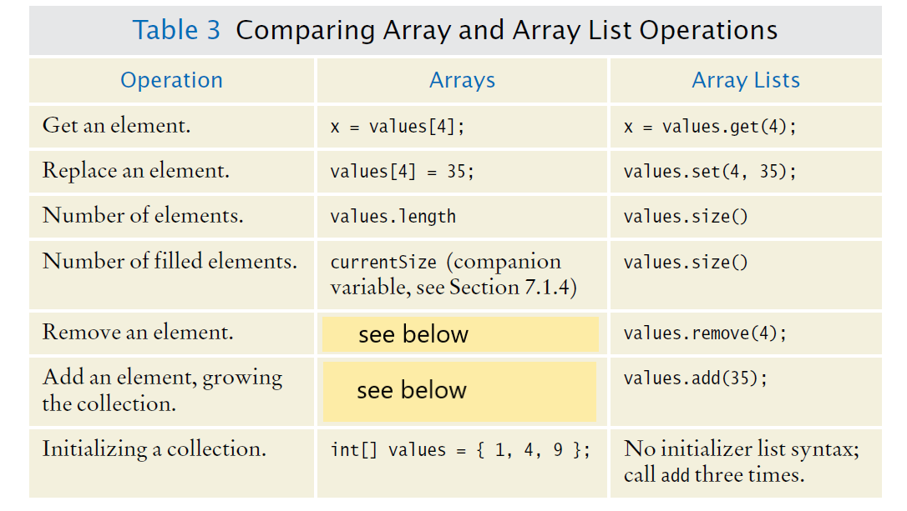
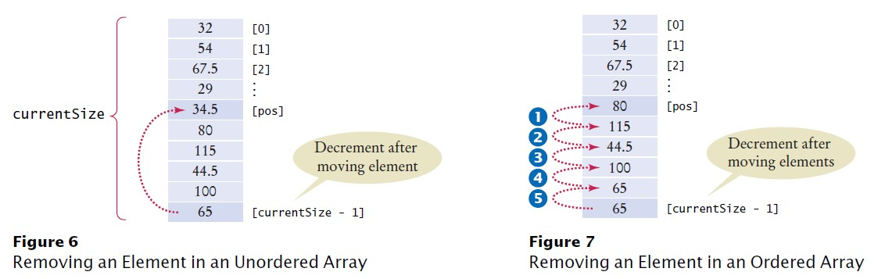

## Array vs ArrayList

### Removing Array Element



If the elements in the array are not in any particular order, simply overwrite
the element to be removed with the last element of the array, then decrement the
current- Size variable.

```java
values[pos] = values[currentSize - 1];
currentSize--;
```

The situation is more complex if the order of the elements matters. Then you
must move all elements following the element to be removed to a lower index, and
then decrement the variable holding the size of the array.

```java
for (int i = pos + 1; i < currentSize; i++)
{
	arr[i - 1] = ar[i];
}
currentSize--;
```

### Inserting Array Element


If the order of the elements does not matter, you can simply insert new elements
at the end, incrementing the variable tracking the size.

```java
if (currentSize < values.length)
{
	currentSize++;
	arr[currentSize - 1] = newElement;
}
```

Note the order of the movement: When you remove an element, you first move the
next element to a lower index, then the one after that, until you finally get to
the end of the array. When you insert an element, you start at the end of the
array, move that element to a higher index, then move the one before that, and
so on until you finally get to the insertion location.

```java
if (currentSize < values.length){
	currentSize++;
	for (int i = currentSize - 1; i > pos; i--){
		arr[i] = arr[i - 1];
	}
	arr[pos] = newElement;
}
```
