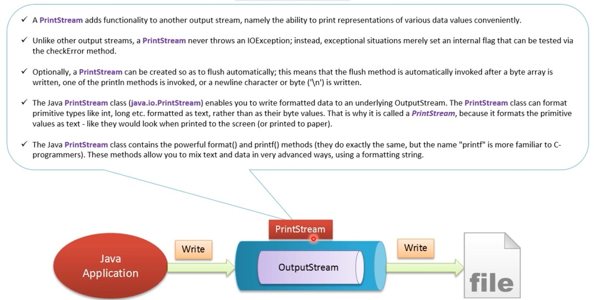

# ByteStream

- [ByteStream](#bytestream)
    - [FileInputStream](#fileinputstream)
    - [FileOutputStream](#fileoutputstream)
    - [DataInputStream/DataOutputStream](#datainputstreamdataoutputstream)
        - [Characters and Strings in Binary I/O](#characters-and-strings-in-binary-io)
    - [PrintStream](#printstream)

<div align="center">

</div>

## FileInputStream

`FileInputStream` is useful to read data from a file in the form of **sequence of bytes**. `FileInputStream` is meant
for reading streams of raw bytes such as **image** data. **For reading streams of characters**, consider
using `FileReader`.

## FileOutputStream

`FileOutputStream` is an OutputStream for writing data/streams of **raw bytes** to file or storing data to file. To
write primitive values into a file, we use FileOutputStream class. For writing**byte-oriented and character-oriented**
data, we can use FileOutputStream but **for writing character-oriented data**, `FileWriter` is more preferred.

## DataInputStream/DataOutputStream

<div align="center">

</div>

`DataInputStream` reads `bytes` from the stream and converts them into appropriate `primitive-type values or strings`
. `DataOutputStream` converts `primitive-type values or strings` into bytes and outputs the `bytes` to the stream.

<div align="center">

</div>

<div align="center">

</div>

### Characters and Strings in Binary I/O

A Unicode character consists of two bytes.

The `writeChar(char c)` method writes the `Unicode` of character `c` to the output.

The `writeChars(String s)` method writes the `Unicode` for each character in the string `s` to the output.

The `writeBytes(String s)` method writes the lower byte of the `Unicode` for each character in the string `s` to the
output. The high byte of the Unicode is discarded. The writeBytes method is suitable for strings that consist of `ASCII`
characters, since an ASCII code is stored only in the lower byte of a Unicode. If a string consists of `non-ASCII`
characters, you have to use the `writeChars` method to write the string.

The `writeUTF(String s)` method writes two bytes of length information to the output stream, followed by the
modified `UTF-8` representation of every character in the string `s`.

`UTF-8` is a coding scheme that allows systems to operate with **both ASCII and Unicode**.Most operating systems use
ASCII. Java uses Unicode. The ASCII character set is a subset of the Unicode character set. Since most applications need
only the ASCII character set, it is a waste to represent an 8-bit ASCII character as a 16-bit Unicode character. The
modified UTF-8 scheme stores a character using one, two, or three bytes. Characters are coded in one byte if their code
is less than or equal to 0x7F, in two bytes if their code is greater than 0x7F and less than or equal to 0x7FF, or in
three bytes if their code is greater than 0x7FF.

**The `UTF-8` format has the advantage of saving a byte for each ASCII character,** because a Unicode character takes up
two bytes and an ASCII character in UTF-8 only one byte. If most of the characters in a long string are regular ASCII
characters, using UTF-8 is more efficient.

## PrintStream

The Java `PrintStream` class (java.io.PrintStream) enables you to **write formatted data to an
underlying `OutputStream`**. Unlike other output streams, the PrintStream converts the primitive data (integer,
character) into the `text` format instead of bytes. It then writes that formatted data to the output stream.

And also, the `PrintStream` class **does not throw any input/output exception**. Instead, we need to use
the `checkError()` method to find any error in it.

> Note: The PrintStream class also has a feature of auto flushing. This means it forces the output stream to write all the data to the destination under one of the following conditions:

- if newline character `\n` is written in the print stream
- if the `println()` method is invoked
- if an array of bytes is written in the print stream

The `PrintStream` class is similar to the `PrintWriter` class in that it lets you write data to an output stream.
PrintStream and PrintWriter have nearly identical methods. The primary difference is that PrintStream writes raw bytes
in the machine’s native character format, and PrintWriter converts bytes to recognized encoding schemes. Thus, files
created with PrintWriter are more compatible across different platforms than files created with PrintStream.

However, the most common way to write console output — `System.out` — uses `PrintStream` to write data to the operator’s
console. Using System.out is the only time you should use PrintStream instead of PrintWriter.

<div align="center">

</div>

````java
PrintStream output=new PrintStream("printstream.txt");
String data="This is a text inside the file.";
output.println(data);
````
