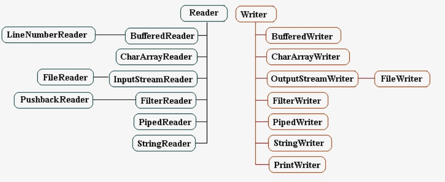
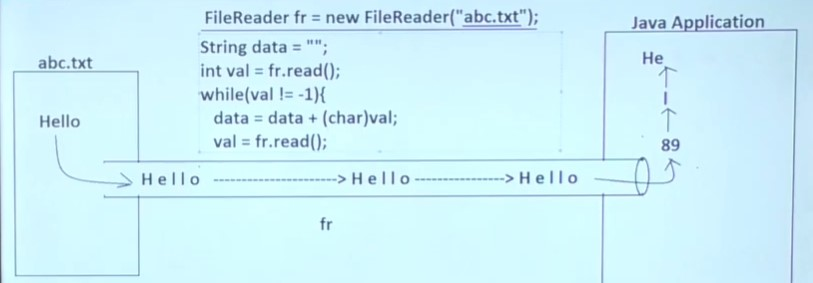

# CharacterStream

<div align="center">

</div>

## FileReader

The Java FileReader class, `java.io.FileReader` makes it possible to read the contents of a file as a **stream of characters**. It works much like the FileInputStream except the FileInputStream reads *bytes*, whereas the FileReader reads characters. The FileReader is intended to read text, in other words. One character may correspond to one or more bytes depending on the character encoding scheme.

<div align="center">

</div>

### read()

The read() method of the Java FileReader returns an int which contains the char value of the character read. If the read() method returns -1, there is no more data to read in the FileReader, and it can be closed. That is, -1 as int value, not -1 as byte value. There is a difference here! Here is an example of reading characters from a Java FileReader until there are no more characters to read:

```java
FileReader fileReader = new FileReader("c:\\data\\input-text.txt");

int data = fileReader.read();
while(data != -1) {
  data = fileReader.read();
}
```

### read(char[])

The Java FileReader also has a method that can read an **array of characters** instead of reading **one character at a time**. Here is an example of reading multiple characters into a char array:

```java
FileReader fileReader = new FileReader("c:\\data\\input-text.txt");

char[] destination = new char[1024];

int charsRead = fileReader.read(destination, 0, destination.length);
```

This read(char[]) method takes the char array to read the characters into as first parameter, the offset into the array from which the characters should be written, and the maximum length of characters to write. The read(char[]) method returns the number of characters that was actually read into the char array. If there are less characters in the file than the maximum number of characters you specified, then there will be less than maximum number of characters read. Otherwise the read(char[]) method will attempt to read maximum number of characters into the array.

### Transparent Buffering via `BufferedReader`

You can add transparent, automatic reading and buffering of an array of bytes from a FileReader using a Java `BufferedReader` . The BufferedReader reads a chunk of chars into a char array from the underlying FileReader. You can then read the bytes one by one from the BufferedReader and still get a lot of the speedup that comes from reading an array of chars rather than one character at a time. Here is an example of wrapping a Java FileReader in a BufferedReader :

```java
Reader input = new BufferedReader(
                      new FileReader("c:\\data\\input-file.txt"),
                        1024 * 1024        /* buffer size */
    );
```

Notice, that a BufferedReader is a Reader subclass and can be used in any place where an Reader can be used.

### FileReader Character Encoding

The Java FileReader assumes that you want to decode the bytes in the file using the default character encoding for the computer your application is running on. This may not always be what you want, and you cannot change it!

*If you want to specify a different character decoding scheme, don't use a FileReader. Use an Java InputStreamReader on a FileInputStream instead. The InputStreamReader lets you specify the character encoding scheme to use when reading the bytes in the underlying file.*

## PrintWriter

The `PrintWriter` class of the java.io package can be used to write output data in a commonly readable form (text).

Unlike other writers, PrintWriter converts the primitive data (int, float, char, etc.) into the text format. It then writes that formatted data to the writer.

Also, the PrintWriter class does not throw any input/output exception. Instead, we need to use the checkError() method to find any error in it.

> Note: The PrintWriter class also has a feature of auto flushing. This means it forces the writer to write all data to the destination if one of the println() or printf() methods is called.

### Create a PrintWriter

1. Using other writers

```java
// Creates a FileWriter
FileWriter file = new FileWriter("output.txt");

// Creates a PrintWriter
PrintWriter output = new PrintWriter(file, autoFlush);
```

2. Using other output streams

```java
// Creates a FileOutputStream
FileOutputStream file = new FileOutputStream("output.txt");

// Creates a PrintWriter
PrintWriter output = new PrintWriter(file, autoFlush);
```

3. Using filename

```java
// Creates a PrintWriter
PrintWriter output = new PrintWriter(String file, boolean autoFlush);
// Creates a PrintWriter using some character encoding
PrintWriter output = new PrintWriter(String file, boolean autoFlush, Charset cs);
```

### Methods of PrintWriter

The PrintWriter class provides various methods that allow us to print data to the output.

- `print()` - prints the specified data to the writer
- `println()` - prints the data to the writer along with a new line character at the end
- `printf()` - Method
- `close()` - closes the print writer
- `checkError()` - checks if there is an error in the writer and returns a boolean result
- `append()` - appends the specified data to the writer
