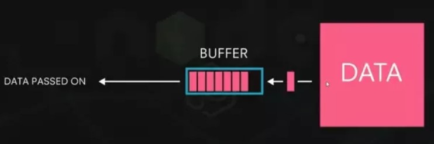
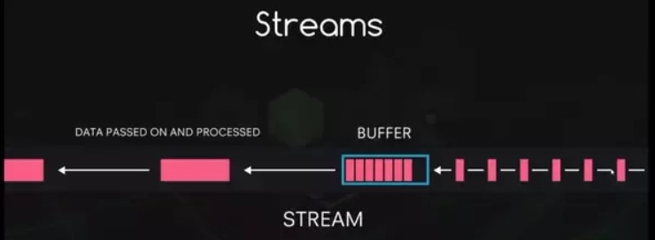
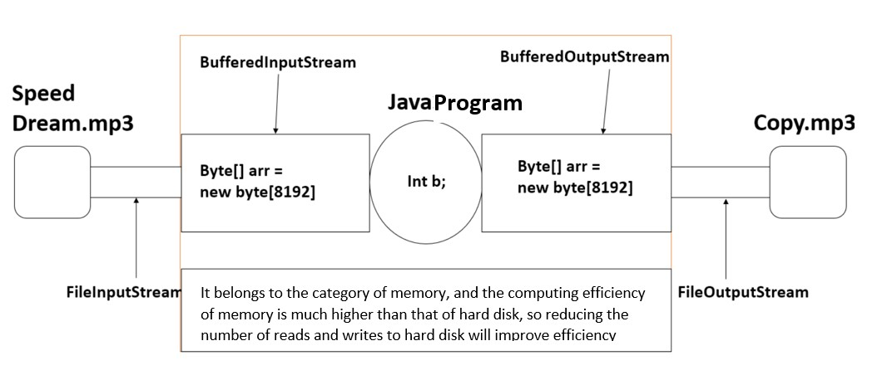
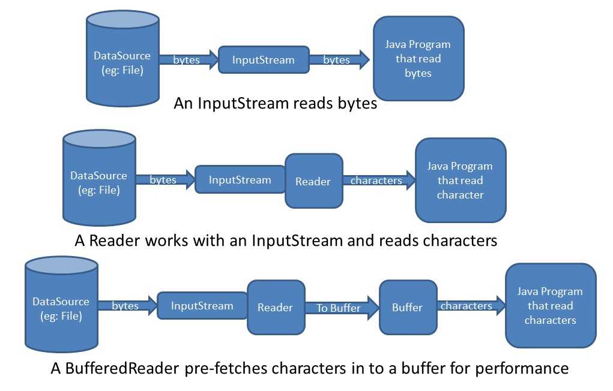

# Buffered Stream

- [Buffered Stream](#buffered-stream)
	- [BufferedIOStream](#bufferediostream)
		- [BufferedInputStream](#bufferedinputstream)
		- [BufferedOutputStream](#bufferedoutputstream)
	- [Dynamic Input Approaches in Java](#dynamic-input-approaches-in-java)

The speed of byte stream reading and writing an array at a time is obviously much faster than the speed of reading and writing one byte at a time. `Buffering` which enables us to read/write a block of bytes from the external device into/from a memory buffer _in a single I/O operation_, is commonly applied to speed up the I/O. *The native input API is called only when the buffer is empty. Similarly, buffered output streams write data to a buffer, and the native output API is called only when the buffer is full.*

## BufferedIOStream

### BufferedInputStream

BufferedInputStream has a built-in buffer (array). When reading a byte from BufferedInputStream, BufferedInputStream will read 8192 from the file at one time, store them in the buffer, and return one to the program. When the program is read again, there is no need to find the file, and it is directly obtained from the buffer until all the buffers have been used, 8192 are read from the file again

### BufferedOutputStream

BufferedOutputStream also has a built-in buffer (array). When the program writes bytes to the stream, it will not be written directly to the file, but written to the buffer first until the buffer is full. BufferedOutputStream will write the data in the buffer to the file at once.

## Dynamic Input Approaches in Java

If we provide input data to the Java applications at runtime then that input data is called as "Dynamic Input".
In Java applications, there are three ways to provide dynamic input.

1. BY Using `BufferedReader`
2. By Using `Scanner`
3. By Using `Console`

