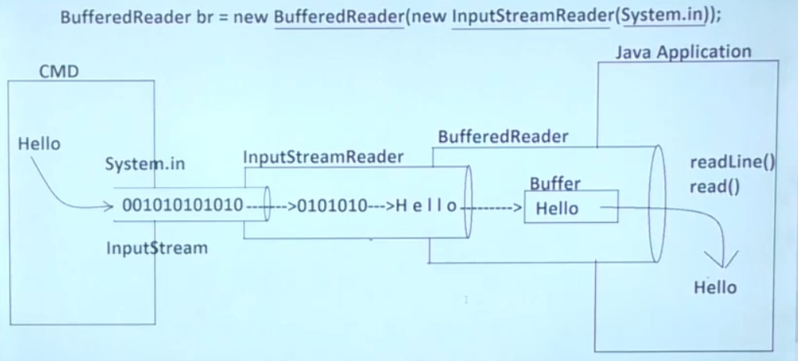

# Buffered Stream

- [Buffered Stream](#buffered-stream)
	- [BufferedIOStream](#bufferediostream)
		- [BufferedInputStream](#bufferedinputstream)
		- [BufferedOutputStream](#bufferedoutputstream)
	- [Dynamic Input Approaches in Java](#dynamic-input-approaches-in-java)
	- [BufferedReader](#bufferedreader)
		- [BufferedReader constructors](#bufferedreader-constructors)
		- [BufferedReader methods](#bufferedreader-methods)
	- [Scanner](#scanner)
	- [BufferedReader vs Scanner in Java](#bufferedreader-vs-scanner-in-java)

The speed of byte stream reading and writing an array at a time is obviously much faster than the speed of reading and writing one byte at a time. `Buffering` which enables us to read/write a block of bytes from the external device into/from a memory buffer _in a single I/O operation_, is commonly applied to speed up the I/O. *The native input API is called only when the buffer is empty. Similarly, buffered output streams write data to a buffer, and the native output API is called only when the buffer is full.*

<div align="center">

</div>

<div align="center">

</div>

<div align="center">

</div>

## BufferedIOStream

### BufferedInputStream

BufferedInputStream has a built-in buffer (array). When reading a byte from BufferedInputStream, BufferedInputStream will read 8192 from the file at one time, store them in the buffer, and return one to the program. When the program is read again, there is no need to find the file, and it is directly obtained from the buffer until all the buffers have been used, 8192 are read from the file again

### BufferedOutputStream

BufferedOutputStream also has a built-in buffer (array). When the program writes bytes to the stream, it will not be written directly to the file, but written to the buffer first until the buffer is full. BufferedOutputStream will write the data in the buffer to the file at once.

## Dynamic Input Approaches in Java

If we provide input data to the Java applications at runtime then that input data is called as "Dynamic Input".
In Java applications, there are three ways to provide dynamic input.

1. BY Using `BufferedReader`
2. By Using `Scanner`
3. By Using `Console`

## BufferedReader

<div align="center">

</div>

Java BufferedReader class is used to read text from a character-input stream. This class is used as a wrapper around any Reader (FileReader and InputStreamReader) whose read() operations may be costly. BufferedReader as the name suggests buffers characters so as to provide for the efficient reading of characters, arrays, and lines. Without buffering, each invocation of read() or readLine() could cause bytes to be read from the file, converted into characters, and then returned, which can be very inefficient.

<div align="center">

</div>

```java
BufferedReader br = new BufferedReader(new InputStreamReader(System.in));
```

Where `in` is a static variable defined in System class, it represent a predefined InputStream object which is
connected with Command Prompt.

If we type any dynamic input on the command prompt then the provided data will be submitted to predefined InputStream
object which is refereed by `'System.in'` in the form of Bytes representation.

In `InputStream` object data is existed in the form of bytes representation, it is not readable, so we have to convert
data from Bytes representation to character representation, because, character representation is more readable.

Where to convert data from bytes representation to character representation we will use `InputStreamReader`. Inside InputStreamReader data is existed in the form of individual characters , to read these characters from InputStream we have to perform multiple read operations which will reduce input operation performance.

In the above context, to improve the performance of the input operation we have to use `BufferedReader`. BufferedReader contains `Buffers` to store data in the form of `String` or in the form of lines, it is very simple to read data from BufferedReader as strings .

To read data from BufferedReader we will use the following two methods.

- `public String readLine()`
- `public int read()`

### BufferedReader constructors

`BufferedReader(Reader in)-` Wraps the passed Reader and creates a buffering character-input stream that uses a default-sized input buffer. Default buffer size for BufferedReader is **8192 bytes i.e. 8 KB**. For example, creating BufferedReader instance by wrapping an instance of `FileReader`-

```java
// Instance of FileReader wrapped in a BufferedReader
 BufferedReader br = new BufferedReader(new FileReader("resources/abc.txt"));
// Instance of InputStreamReader wrapped in a BufferedReader
 BufferedReader br = new BufferedReader(new InputStreamReader(System.in));
```

### BufferedReader methods

Some of the most used methods in BufferedReader class are as given below-


| Methods                               | Description                                                                                                                                                                  |
| ------------------------------------- | ---------------------------------------------------------------------------------------------------------------------------------------------------------------------------- |
| `read() `                             | Reads a single character. Returns the character read, as an integer in the range 0 to 65535 (0x00-0xffff), or -1 if the end of the stream has been reached                   |
| `read(char[] cbuf, int off, int len)` | Reads characters into a portion of an array                                                                                                                                  |
| `readLine() `                         | Reads a line of text                                                                                                                                                         |
| `ready()`                             | Tells whether this stream is ready to be read                                                                                                                                |
| `skip(long n)`                        | Skips characters                                                                                                                                                             |
| `lines()`                             | Returns a Stream, the elements of which are lines read from this BufferedReader. The Stream is lazily populated, i.e., read only occurs during the terminal stream operation |

## Scanner

1. Create Scanner class object.

```java
Scanner s = new Scanner(System.in);
```

1. Read dynamic input by using Scanner class.

```java
//To read String data :
public String nextLine()
public String next()
//To read Primitive data :
public xxx nextXxx()
//XXX may be byte, short, int, long,
```

## BufferedReader vs Scanner in Java


Here are the 5 key differences between the Scanner and BufferedReader class of Java API:

1. A scanner is a much more powerful utility than BufferedReader. It can parse the user input and read an int, short, byte, float, long, and double apart from String. On the other hand, BufferedReader can only read String in Java.

2. BuffredReader has a significantly large buffer (8KB) than Scanner (1KB), which means if you are reading long String from a file, you should use BufferedReader but for short input and input other than String, you can use Scanner class.

3. BufferedReader is older than Scanner. It's present in Java from JDK 1.1 onward but Scanner is only introduced in JDK 1.5 release.

4. Scanner uses regular expression to read and parse text input. It can accept custom delimiter and parse text into primitive data type e.g. int, long, short, float or double using nextInt(), nextLong(), nextShort(), nextFloat(), and nextDouble() methods, while BufferedReader  can only read and store String using readLine() method.

5. Another major difference between BufferedReader and Scanner class is that BufferedReader is synchronized while Scanner is not. This means, you cannot share Scanner between multiple threads but you can share the BufferedReader object.

This synchronization also makes BufferedReader a little bit slower in the single-thread environment as compared to Scanner, but the speed difference is compensated by Scanner's use of regex, which eventually makes BufferedReader faster for reading String. You can further check these Java Programming online courses to learn more about that in-depth.