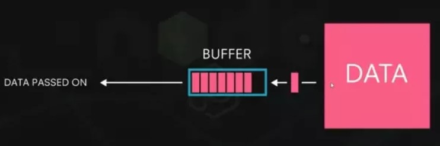

# IO Stream

- [IO Stream](#io-stream)
  - [Introduction to Stream](#introduction-to-stream)
  - [Byte Streams](#byte-streams)
    - [InputStream](#inputstream)
      - [Java InputStream class](#java-inputstream-class)
      - [Methods of InputStream](#methods-of-inputstream)
    - [OutputStream class](#outputstream-class)
      - [Methods of OutputStream](#methods-of-outputstream)
  - [Character streams in Java](#character-streams-in-java)
    - [Java Reader class](#java-reader-class)
      - [Method with Description](#method-with-description)
    - [Java Writer class](#java-writer-class)
      - [Method with Description](#method-with-description-1)
  - [Layered (or Chained) I/O Streams](#layered-or-chained-io-streams)
    - [✔✔ Buffered Stream ✔✔](#-buffered-stream-)
      - [Types of Buffer Stream](#types-of-buffer-stream)
      - [Examples](#examples)

## Introduction to Stream

In Java applications, IO operations are performed using the concept of streams. Generally, a stream means a continuous flow of data. In java, a stream is a logical container of data that allows us to read from and write to it. A stream can be linked to a data source, or data destination, like a console, file or network connection by java IO system. The stream-based IO operations are faster than normal IO operations.

The Stream is defined in the `java.io` package.

To understand the functionality of java streams, look at the following picture.

<div align="center">

</div>

Stream I/O operations involve three steps:

- Open an input/output stream associated with a physical device (e.g., file, network, console/keyboard), by constructing an appropriate I/O stream instance.
- Read from the opened input stream until "end-of-stream" encountered, or write to the opened output stream (and optionally flush the buffered output).
- Close the input/output stream.

Java provides two types of streams, and they are as follows.

- **Byte Stream**
- **Character Stream**

<div align="center">

</div>

## Byte Streams

In java, the byte stream is an 8 bits/1 bytes carrier. The byte stream in java allows us to transmit 8 bits of data.

In Java 1.0 version all IO operations were byte oriented, there was no other stream (character stream).

The java byte stream is defined by two abstract classes, `InputStream` and `OutputStream`. The InputStream class used for byte stream based input operations, and the OutputStream class used for byte stream based output operations.The InputStream and OutputStream classes have several concrete classes to perform various IO operations based on the byte stream.

The following picture shows the classes used for byte stream operations.

<div align="center">

</div>

> Example:

```java
 InputStream fis = null;
 OutputStream fos = null;
 try {
   // Streams
   fis = new FileInputStream("D:\\CSE\\Others\\Codes\\Java\\IO Streams\\00ByteStream\\src\\input.txt");
   fos = new FileOutputStream("D:\\CSE\\Others\\Codes\\Java\\IO Streams\\00ByteStream\\src\\output.txt");
   int b;
   //read and write byte by byte
   while ((b = fis.read()) != -1) {//read and store in `b`
    fos.write(b);//write from `b`
   }
   System.out.println("IO operation done!!");
   fis.close();
   fos.close();
  }catch (Exception e){
    return;
 }
```

### InputStream

The InputStream class of the java.io package is an abstract superclass that represents an input stream of bytes.
Since InputStream is an abstract class, it is not useful by itself. However, its subclasses can be used to read data.

#### Java InputStream class

All byte stream classes representing an input stream of bytes descend from InputStream. Classes in java.io package representing byte input stream are-

- **InputStream**- `java.io.InputStream` is an abstract class which is the **superclass** of all classes representing an input stream of bytes.
- **AudioInputStream**- An audio input stream is an input stream with a specified audio format and length. The length is expressed in sample frames, not bytes.
- **ByteArrayInputStream**- Used to read from the stream into a byte array buffer.
- **FileInputStream**- A FileInputStream obtains input bytes from a file in a file system. FileInputStream is meant for reading streams of raw bytes such as image data.
- **FilterInputStream**- A FilterInputStream contains some other input stream, which it uses as its basic source of data, possibly transforming the data along the way or providing additional functionality.
- **BufferedInputStream**- This class extends FilterInputStream and adds functionality to buffer to another input stream.
- **DataInputStream**- A data input stream lets an application read primitive Java data types from an underlying input stream in a machine-independent way. This class extends FilterInputStream.
- **PushbackInputStream**- A PushbackInputStream adds functionality to another input stream, namely the ability to "push back" or "unread" one byte.
- **ObjectInputStream**- An ObjectInputStream deserializes primitive data and objects previously written using an ObjectOutputStream. Only objects that support the `java.io.Serializable` or `java.io.Externalizable` interface can be read from streams.
- **PipedInputStream**- Used to read and write data using two separate threads. A piped input stream should be connected to a piped output stream; the piped input stream then provides whatever data bytes are written to the piped output stream.
- **SequenceInputStream**- A SequenceInputStream represents the logical concatenation of other input streams. It starts out with an ordered collection of input streams and reads from the first one until end of file is reached, whereupon it reads from the second one, and so on, until end of file is reached on the last of the contained input streams.

#### Methods of InputStream

The InputStream class provides different methods that are implemented by its subclasses. Here are some of the commonly used methods:

| methods              | Description                                                   |
| -------------------- | ------------------------------------------------------------- |
| `read()`             | reads one byte of data from the input stream                  |
| `read(byte[] array)` | reads bytes from the stream and stores in the specified array |
| `available()`        | returns the number of bytes available in the input stream     |
| `close()`            | closes the input stream                                       |
| ...                  | ...                                                           |

> Example: InputStream Using FileInputStream

```java
byte[] byteArray = new byte[100];
try {
  InputStream input = new FileInputStream("D:..absolute path..\\input.txt");
  System.out.println("Available bytes in the file: " + input.available());

  // reads bytes from the stream and stores in the byteArray
  input.read(byteArray);
  System.out.println("Data read from the file: ");

  // Convert byte array into string
  String data = new String(byteArray);
  System.out.println(data);

  // Close the input stream
  input.close();
 } catch (Exception e) {
  System.out.println("error");
  e.getStackTrace();
 }
```

### OutputStream class

All byte stream classes representing an output stream of bytes descend from OutputStream.

Class in java.io package representing byte output stream are-

- **ByteArrayOutputStream**- This class implements an output stream in which the data is written into a byte array.
- **FileOutputStream**- A file output stream is an output stream for writing data to a File or to a FileDescriptor.
- **FilterOutputStream**- This class is the superclass of all classes that filter output streams.
- **BufferedOutputStream**- This class extends FilterOutputStream and provides functionality to buffer output stream.
- **DataOutputStream**- A data output stream lets an application write primitive Java data types to an output stream in a portable way. This class extends FilterOutputStream.
- **PrintStream**- A PrintStream adds functionality to another output stream, namely the ability to print representations of various data values conveniently. This class extends FilterOutputStream.
- **ObjectOutputStream**- An ObjectOutputStream writes primitive data types and graphs of Java objects to an OutputStream. Only objects that support the java.io.Serializable interface can be written to streams.
- **PipedOutputStream**- A piped output stream can be connected to a piped input stream to create a communications pipe. The piped output stream is the sending end of the pipe. Typically, data is written to a PipedOutputStream object by one thread and data is read from the connected PipedInputStream by some other thread.

#### Methods of OutputStream

The OutputStream class provides different methods that are implemented by its subclasses. Here are some of the methods:

| methods               | Description                                                          |
| --------------------- | -------------------------------------------------------------------- |
| `write()`             | writes the specified byte to the output stream                       |
| `write(byte[] array)` | writes the bytes from the specified array to the output stream       |
| `flush()`             | forces to write all data present in output stream to the destination |
| `close()`             | loses the output stream                                              |

> Example: OutputStream Using FileOutputStream

```java
 String data = "Writing data into files....";
 // Converts the string into bytes
 byte[] dataBytes = data.getBytes();
 try {
  OutputStream out = new FileOutputStream("D:..absolute path..\\output.txt");

  // Writes data to the output stream
  out.write(dataBytes);
  System.out.println("Data is written to the file.");

  // Closes the output stream
  out.close();
 }
 catch (Exception e) {
  System.out.println("Error!");
 }
```

## Character streams in Java

In Java IO byte stream classes are used when working with bytes or binary objects same way character stream classes are used when when working with characters or Strings. In Java platform character values are stored using Unicode conventions. Character stream I/O automatically translates this internal format to and from the local character set.

All character stream classes descend from Reader and Writer abstract classes.

<div align="center">

</div>

> Example:

```java
BufferedReader br = null;
 PrintWriter pw = null;
 try {
   br = new BufferedReader(new FileReader("D:absolute path...\\input.txt"));
   pw = new PrintWriter(new FileWriter("D:absolute path..\\output.txt"));

  String line;
  while ((line = br.readLine()) != null) {
   pw.println(line);
  }

  System.out.println("Done!!!");
  br.close();
  pw.close();
 } catch (Exception e) {
            System.out.println("Error");
 }
```

### Java Reader class

All classes in java.io package for reading character streams descend from Reader class which is an abstract class. List of classes in the hierarchy are as given below-

- **BufferedReader**- This reader improves performance by buffering input while reading characters, arrays, and lines.
- **CharArrayReader**- This class uses a char array as an input source.
- **LineNumberReader**- This class extends BufferedReader and represent a buffered character-input stream that keeps track of line numbers.
- **InputStreamReader**- An InputStreamReader is a bridge from byte streams to character streams: It reads bytes and decodes them into characters using a specified charset. To improve efficiency InputStreamReader should be wrapping within a BufferedReader.
- **FileReader**- It is a specialized character stream for reading character files.
- **PushbackReader**- A character-stream reader that allows characters to be pushed back into the stream.This allows you to look ahead in the input stream.
- **PipedReader**- Piped character-input streams which should be connected to PipedWriter to create a piped stream. Ideally separate threads should be used for PipedReader and PipedWriter.
- **StringReader**- A character stream whose source is a string.

#### Method with Description

| Methods                                   | Description                                                                                                                                                                       |
| ----------------------------------------- | --------------------------------------------------------------------------------------------------------------------------------------------------------------------------------- |
| `int read()`                              | It reads the next character from the input stream.                                                                                                                                |
| `int read(char[] cbuffer)`                | It reads a chunk of characters from the input stream and store them in its byte array, cbuffer.                                                                                   |
| `int read(char[] cbuf, int off, int len)` | It reads charaters into a portion of an array.                                                                                                                                    |
| `int read(CharBuffer target)`             | It reads charaters into into the specified character buffer.                                                                                                                      |
| `String readLine()`                       | It reads a line of text. A line is considered to be terminated by any oneof a line feed ('\n'), a carriage return ('\r'), or a carriage returnfollowed immediately by a linefeed. |
| `boolean ready()`                         | It tells whether the stream is ready to be read.                                                                                                                                  |
| `void close()`                            | It closes the input stream and also frees any resources connected with this input stream.                                                                                         |

> Example:

```java
// Creates an array of character
        char[] array = new char[100];

        try {
            // Creates a reader using the FileReader
            Reader input = new FileReader("D:\\CSE\\Others\\Codes\\Java\\IO Streams\\01CharacterStreams\\src\\input.txt");

            // Checks if reader is ready
            System.out.println("Is there data in the stream?  " + input.ready());

            // Reads characters
            input.read(array);
            System.out.println("Data in the stream:");
            System.out.println(array);
            // Closes the reader
            input.close();
        } catch (Exception e) {
            e.getStackTrace();
        }
```

### Java Writer class

All classes in java.io package for writing character streams descend from Writer class which is an abstract class. List of classes in the hierarchy are as given below-

- **BufferedWriter**- Buffers characters while writing text to a character-output stream so as to provide for the efficient writing of single characters, arrays, and strings.
- **CharArrayWriter**- This class uses a char array as the destination.
- **OutputStreamWriter**- An OutputStreamWriter is a bridge from character streams to byte streams: Characters written to it are encoded into bytes using a specified charset. OutputStreamWriter should be wrapped within a - **BufferedWriter** to improve performance.
- **FileWriter**- It is a specialized character stream for writing text to character files.
- **PipedWriter**- Piped character-input streams which should be connected to PipedReader to create a piped stream. Ideally separate threads should be used for PipedReader and PipedWriter.
- **PrintWriter**- Prints formatted representations of objects to a text-output stream.
- **StringWriter**- A character stream that collects its output in a string buffer, which can then be used to construct a string.

#### Method with Description

| Method                                                | Description                                                                                 |
| ----------------------------------------------------- | ------------------------------------------------------------------------------------------- |
| `void flush()`                                        | It flushes the output steam by forcing out buffered bytes to be written out.                |
| `void write(char[] cbuf)`                             | It writes a whole array(cbuf) to the output stream                                          |
| `void write(char[] cbuf, int off, int len)`           | It writes a portion of an array of characters                                               |
| `void write(int c)`                                   | It writes single character                                                                  |
| `void write(String str)`                              | It writes a string.                                                                         |
| `void write(String str, int off, int len)`            | It writes a portion of a string                                                             |
| `Writer append(char c)`                               | It appends the specified character to the writer.                                           |
| `Writer append(CharSequence csq)`                     | It appends the specified character sequence to the writer                                   |
| `Writer append(CharSequence csq, int start, int end)` | It appends a subsequence of the specified character sequence to the writer.                 |
| `void close()`                                        | It closes the output stream and also frees any resources connected with this output stream. |

> Ex:

```java
 String data = "This is the data in the output file";
 try {
  // Creates a Writer using FileWriter
  Writer output = new FileWriter("D:\\CSE\\Others\\Codes\\Java\\IO Streams\\01CharacterStreams\\src\\output.txt");

  // Writes string to the file
   output.write(data);

  // Closes the writer
  output.close();
 } catch (Exception e) {
  System.out.println("Error");
   e.getStackTrace();
 }
```

## Layered (or Chained) I/O Streams

The I/O streams are often layered or chained with other I/O streams, for purposes such as **buffering, filtering, or data-format conversion** (between raw bytes and primitive types). For example, we can layer a BufferedInputStream to a FileInputStream for buffered input, and stack a DataInputStream in front for formatted data input (using primitives such as int, double), as illustrated in the following diagrams.

<div align="center">

</div>

<div align="center">

</div>


### ✔✔ Buffered Stream ✔✔

**How do an InputStream, InputStreamReader and BufferedReader work together in Java?**

Most of the examples we've seen so far use unbuffered I/O. This means each read or write request is handled directly by the underlying OS. This can make a program much less efficient, since each such request often triggers disk access, network activity, or some other operation that is relatively expensive.

In general, disk access is much slower than the processing performed in memory; that’s why it’s not a good idea to access the disk a thousand times to read a file of 1,000 bytes. 

To reduce this kind of overhead, the Java platform implements buffered I/O streams. `Buffering`, which reads/writes a block of bytes from the external device into/from a memory buffer _in a single I/O operation_, is commonly applied to speed up the I/O.*The native input API is called only when the buffer is empty. Similarly, buffered output streams write data to a buffer, and the native output API is called only when the buffer is full.*

<div align="center">

</div>

**Buffer** :- Transferring a big amount of data after converting it into small chunks of data. These small chunks can be used simultaneously, without waiting for the whole amount of the data to download.For example - Watching a youtube video,without downloading the whole file.

<div align="center">

</div>

**Streams** :-Stream is just a process of flow of data from the data source to the buffer and from the buffer to the client.All these bits flow in a stream.

<div align="center">

</div>

In Java, when reading file with `FileInputStream` then `BufferedInputStream`, the class `BufferedInputStream` works as a **middleman** between `FileInputStream` and the `file` itself. ***It reads a big chunk of bytes from a file into memory (a buffer) in one shot, and the `FileInputStream` object then reads single bytes from there, which are fast memory-to-memory operations.*** `BufferedOutputStream` works similarly with the class `FileOutputStream`.

<div align="center">

</div>

**Streams**: Used to deal with byte level data

**Reader/Writer**: Used to deal with character level. It supports various character encoding also.

**BufferedReader/BufferedWriter**: To increase performance. Data to be read will be buffered in to memory for quick access.

The main idea here is to minimize disk access. Buffered streams are not changing the type of the original streams
;they just make reading more efficient. A program performs stream chaining (or stream piping) to connect streams, just as pipes are connected in plumbing.

#### Types of Buffer Stream

There are four buffered stream classes used to wrap un-buffered streams:

- `BufferedInputStream` and `BufferedOutputStream` create buffered `byte` streams.
- `BufferedReader` and `BufferedWriter` create buffered `character` streams.

#### Examples

A program can convert an `un-buffered` stream into a buffered stream using the wrapping idiom we've used several times now, where the un-buffered stream object is passed to the constructor for a buffered stream class. Here's how you might modify the constructor invocations in the CopyCharacters example to use buffered I/O:

```java
inputStream = new BufferedReader(new FileReader("xanadu.txt"));
outputStream = new BufferedWriter(new FileWriter("characteroutput.txt"));
```

To chain the streams together, simply pass an instance of one stream into the constructor of another stream. For example, the following codes chain a FileInputStream to a BufferedInputStream, and finally, a DataInputStream:

```java
FileInputStream fileIn = new FileInputStream("in.dat");
BufferedInputStream bufferIn = new BufferedInputStream(fileIn);
DataInputStream dataIn = new DataInputStream(bufferIn);
// or
DataInputStream in = new DataInputStream(
                        new BufferedInputStream(
                           new FileInputStream("in.dat")));

```

> An `InputStream` is the base class to read `bytes` from a stream (network or file). `DataInputStream` is a kind of InputStream to read data directly as `primitive data` types.

<div align="center">

</div>

<div align="center">

</div>

```java
DataInputStream dis = new DataInputStream (System.in);

System.out.println(“Enter  value : ”);
int n1= Integer.parseInt(dis.readLine());
```


More Examples:

```java
BufferedReader userInput = new BufferedReader(
                            new InputStreamReader(System.in)));

BufferedReader in = new BufferedReader(
                    new InputStreamReader(socket.getInputStream())));
```
