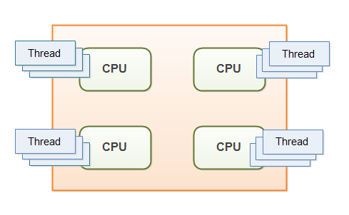

# Multithreading

- [Multithreading](#multithreading)
  - [What is multithreading?](#what-is-multithreading)
  - [Process and Thread](#process-and-thread)
  - [Creating a thread in Java](#creating-a-thread-in-java)
  - [Life cycle of a Thread (Thread States)](#life-cycle-of-a-thread-thread-states)

## What is multithreading?

`Multithreading` in java is a process of executing multiple threads simultaneously. Multithreading is a Java feature that allows concurrent execution of two or more parts of a program for maximum utilization of CPU. Each part of such program is called a thread.

The Java virtual machine executes each thread for a short amount of time and then switches to another thread. This gives the illusion of executing the threads in parallel to each other.



## Process and Thread

A `process` is an execution of a program and a `thread` is a single execution of work within the process. A process can contain multiple threads. A thread is also known as a lightweight process.


- A `program` is an **executable file** like *chrome.exe*

- A `process` is an **executing instance of a `program`**. *When you double click on the Google Chrome icon on your computer, you start a process which will run the Google Chrome program*.
Programs are made up of `processes` and `threads`. You can think of it like this:

- Thread is the **smallest executable unit of a `process`**. A process can have multiple threads with one main thread. In the example, *a single thread could be displaying the current tab you’re in, and a different thread could be another tab.*


In Java, a process is run independently from other processes in a JVM and threads in a JVM share the heap belonging to that process. That is why several threads may access the same object in the heap. Threads share the heap and have their own stack space. Therefore, an invocation of a method and its local variables are kept thread safe from other threads, while heap is not thread safe and must be synchronized for multithreaded programs.


## Creating a thread in Java

There are two ways to create a thread in Java:

1) By **extending** `Thread` class.
2) By **implementing** `Runnable` interface.


```java
/** 1. Extending Thread Class*/
class ThreadA extends Thread {
    ThreadA() {
        super("ThreadA");
    }
    public void run() {
        // Do something....
    }
}

/** .2 Implementing Runnable Interface*/
class ThreadB implements Runnable {
    @Override
    public void run() {
        // Do something....
    }
}

public class Main {
    public static void main(String[] args) throws InterruptedException {

        /**Creating ThreadA....*/
        new ThreadA().start();

        /**Creating ThreadB....*/
        new Thread(new ThreadB(), "ThreadB").start();

        // Do something...
    }
}
```

**Why “implements Runnable” is Preferred over “extends Thread” ??**

he most common difference is

- When you **extends Thread** class, after that you ***can’t extend any other class*** which you required. (As you know, Java does not allow inheriting more than one class).

- When you **implements Runnable**, you can save a space for your class to extend any other class in future or now.

However, the significant difference is.

- When you **extends Thread** class, each of your thread creates unique object and associate with it.
- When you **implements Runnable**, it shares the same object to multiple threads.

<div align="center">

</div>

## Life cycle of a Thread (Thread States)

<div align="center">

</div>


<div align="center">

</div>
