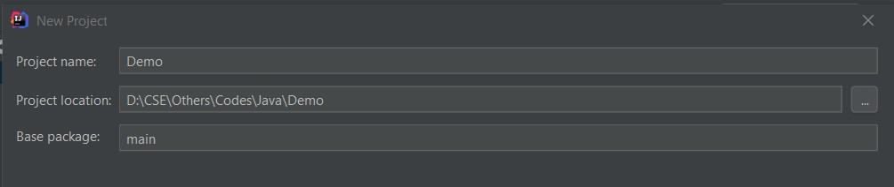
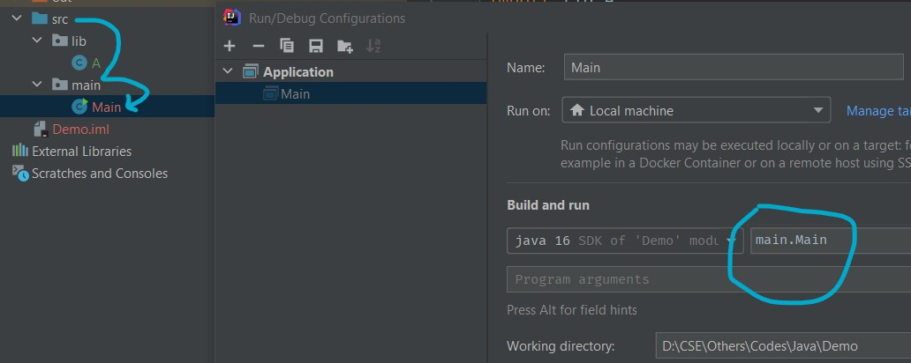
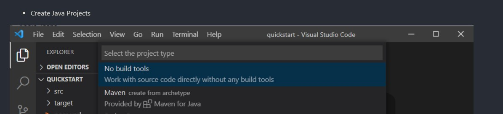
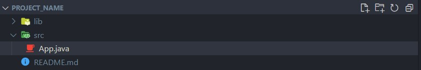
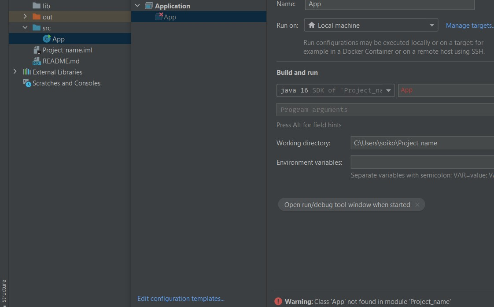
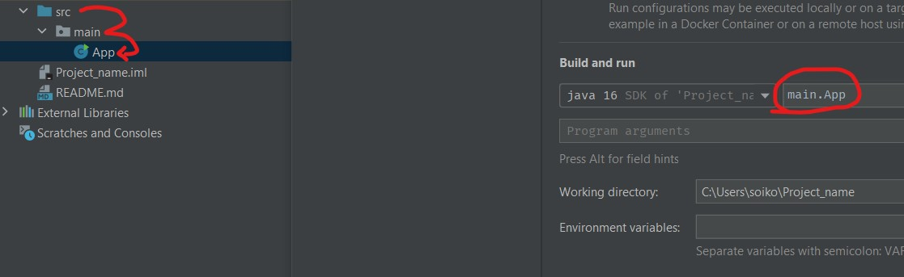

# Overview

- [Overview](#overview)
- [Compiling and Running Java Code](#compiling-and-running-java-code)
  - [Manual](#manual)
  - [IntelliJ IDEA](#intellij-idea)
  - [Vs Code's Project Manager for Java (microsoft)](#vs-codes-project-manager-for-java-microsoft)

# Compiling and Running Java Code

## Manual

**dir setup:**

```
├──com
│  ├──company
│     ├──Main.java
│
├──test
│  ├──A.java
```

`Main.java`

```java
package com.company;
import test.A;
public class Main {
    public static void main(String[] args) {
 // write your code here
        A a =new A();
        a.run();
    }
}

```

`A.java`

```java
package test;
public class A {
    public void  run(){
        System.out.println("Hello World");
    }
}
```

compile:

```bash
javac -d . .\com\company\Main.java
```

run:

```bash
java .\com\company\Main.java
```

## IntelliJ IDEA

**Basic dir setup:**



Run Configuration:



## Vs Code's Project Manager for Java (microsoft)




generated files:



But not compatible with IntelliJ IDEA!!



Making this setup compatible with IntelliJ IDEA by making a sub dir/package


