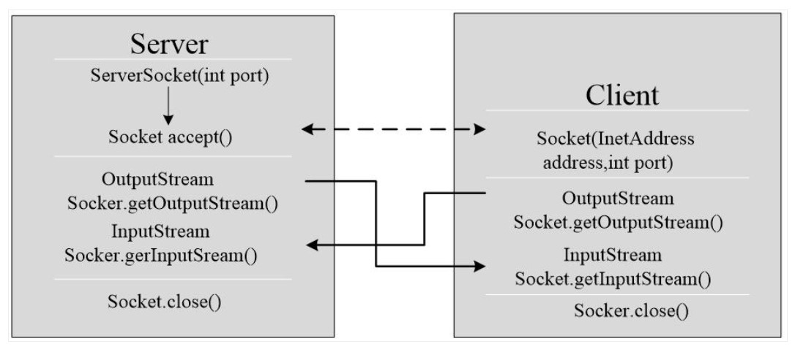

# Socket Programming

A socket is a communications connection point (endpoint) that you can name and address in a network. Socket programming shows how to use socket APIs to establish communication links between remote and local processes.

**Inter Process communication.** This is majorly used in operating system. If one process need some information from other. It just create a socket and it will get the details accordingly.Socket programming is extensively used for creating servers like `web` servers, `mail` servers, `ftp` servers and other servers. 

Socket allows the program to treat the network connection as a `stream`, Data is transferred between IOs via IO.

## Java Socket Programming

<div align="center"></div>

### Recommended IO

```java
// Input
BufferedReader userInput new BufferedReader,
new InputStreamReader(System.in));
BufferedReader in = new BufferedReaders
new InputStreamReader(soc.getInputStream()));
// Output
Printwriter out = new PrintWriter(soc.getOutputStream());
```
