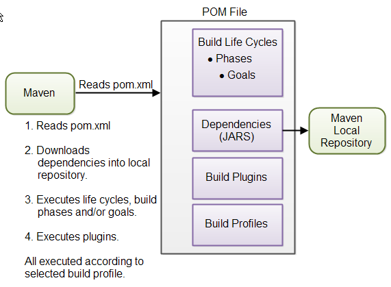
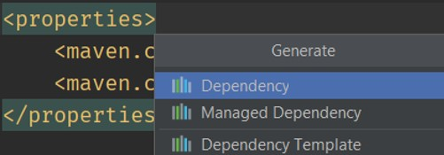
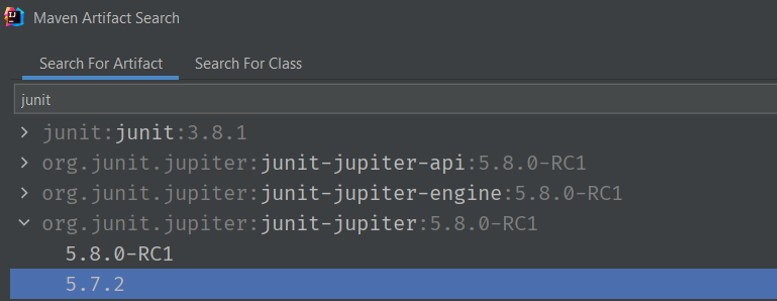
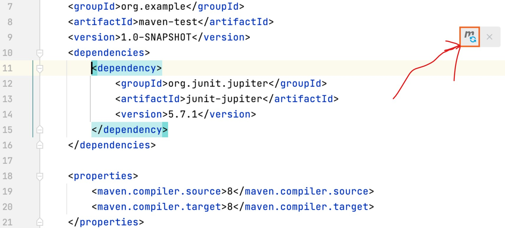
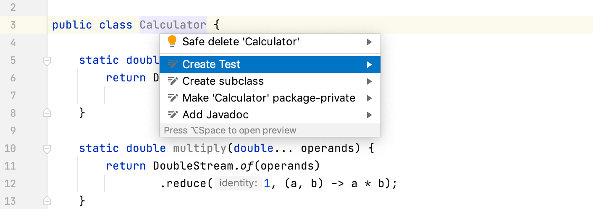
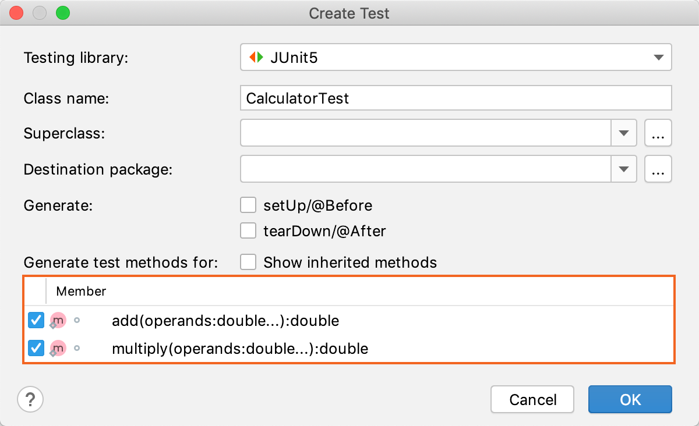
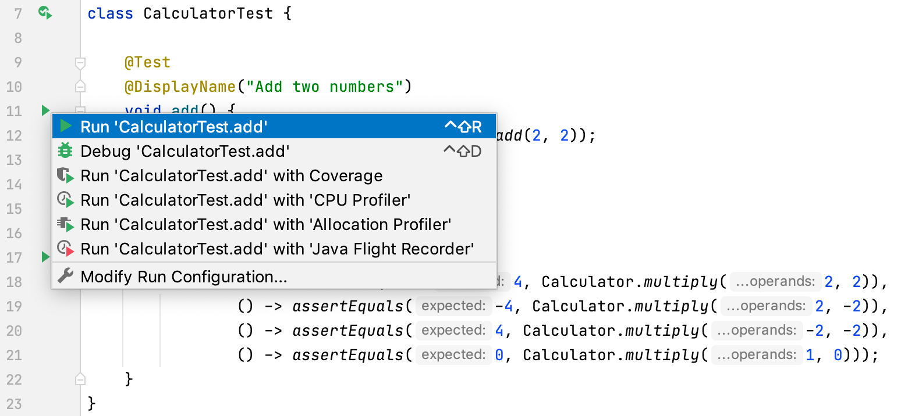

# Maven

[https://medium.com/edureka/maven-tutorial-2e87a4669faf](https://medium.com/edureka/maven-tutorial-2e87a4669faf)
[http://tutorials.jenkov.com/maven/maven-tutorial.html](http://tutorials.jenkov.com/maven/maven-tutorial.html)
[https://www.jetbrains.com/help/idea/junit.html](https://www.jetbrains.com/help/idea/junit.html)

- [Maven](#maven)
  - [Maven Intro](#maven-intro)
    - [Maven Objectives](#maven-objectives)
      - [When should someone use Maven?](#when-should-someone-use-maven)
    - [Maven Architecture](#maven-architecture)
    - [Maven POM Files](#maven-pom-files)
    - [Maven Directory Structure](#maven-directory-structure)
    - [Project Dependencies](#project-dependencies)
      - [External Dependencies](#external-dependencies)
  - [JUnit 5 starter project using Maven in Intellij](#junit-5-starter-project-using-maven-in-intellij)
    - [Create a project](#create-a-project)
    - [Add dependencies](#add-dependencies)
    - [Write application code](#write-application-code)
    - [Create tests](#create-tests)
    - [Run tests and view their results](#run-tests-and-view-their-results)

## Maven Intro

Maven is a powerful build automation tool that is primarily used for Java-based projects. Maven helps you tackle two critical aspects of building software -

- It describes how software is built
- It describes the dependencies.

Maven dynamically downloads Java libraries and Maven plug-ins from one or more repositories such as the Maven Central Repository and stores them in a local cache. The artifacts of the local projects can also be updated with this local cache. Maven can also help you build and manage projects written in C#, Ruby, Scala, and other languages.

### Maven Objectives

#### When should someone use Maven?

- If there are too many dependencies for the project.
- When the dependency version update frequently.
- Continuous builds, integration, and testing can be easily handled by using maven.
- When one needs an easy way to generate documentation from the source code, compiling the source code, packaging compiled code into JAR files or ZIP files.

### Maven Architecture

Maven is centered around the concept of `POM` files (Project Object Model). A POM file is an XML representation of project resources like source code, test code, dependencies (external JARs used) etc. The POM contains references to all of these resources. The POM file should be located in the root directory of the project it belongs to.

Here is a diagram illustrating how Maven uses the POM file, and what the POM file primarily contains:

<div align="center">

</div>

**POM Files**

When you execute a Maven command you give Maven a POM file to execute the commands on. Maven will then execute the command on the resources described in the POM.

**Build Life Cycles, Phases and Goals**

The build process in Maven is split up into build `life cycles`, `phases` and `goals`. A build life cycle consists of a sequence of build phases, and each build phase consists of a sequence of goals. When you run Maven you pass a command to Maven. This command is the name of a build life cycle, phase or goal. If a life cycle is requested executed, all build phases in that life cycle are executed. If a build phase is requested executed, all build phases before it in the pre-defined sequence of build phases are executed too.

**Dependencies and Repositories**

One of the first goals Maven executes is to check the dependencies needed by your project. `Dependencies` are external `JAR` files (Java libraries) that your project uses. If the dependencies are not found in the local Maven repository, Maven downloads them from a central Maven repository and puts them in your local repository. You can specify where the local repository should be located if you want to (I do). You can also specify which remote repository to use for downloading dependencies.

**Build Plugins**

Build plugins are used to insert extra goals into a build phase. If you need to perform a set of actions for your project which are not covered by the standard Maven build phases and goals, you can add a plugin to the POM file. Maven has some standard plugins you can use, and you can also implement your own in Java if you need to.

**Build Profiles**

Build profiles are used if you need to build your project in different ways. For instance, you may need to build your project for your local computer, for development and test. And you may need to build it for deployment on your production environment. These two builds may be different. To enable different builds you can add different build profiles to your POM files. When executing Maven you can tell which build profile to use.

### Maven POM Files

A Maven `POM` file (Project Object Model) is an XML file that describes the resources of the project. This includes the directories where the source code, test source etc. is located in, what external dependencies (JAR files) your projects has etc.

The POM file describes what to build, but most often not how to build it. How to build it is up to the Maven build phases and goals. You can insert custom actions (goals) into the Maven build phase if you need to, though.

It includes the following details of the project configuration:

- `<modelVersion>`: POM model version (always 4.0.0).

- `<groupId>`: Group or organization that the project belongs to. Often expressed as an inverted domain name.

- `<artifactId>`: Name to be given to the project’s library artifact (for example, the name of its JAR or WAR file).

- `<version>`: Version of the project that is being built.

- `<packaging>`:  How the project should be packaged. Defaults to "jar" for JAR file packaging. Use "war" for WAR file packaging.


### Maven Directory Structure

Maven has a standard directory structure. If you follow that directory structure for your project, you do not need to specify the directories of your source code, test code etc. in your POM file.

Here are the most important directories:

```ps
- src
  - main
    - java
    - resources
    - webapp
  - test
    - java
    - resources

- target
```

The src directory is the root directory of your source code and test code. The main directory is the root directory for source code related to the application itself (not test code). The test directory contains the test source code. The java directories under main and test contains the Java code for the application itself (under main) and the Java code for the tests (under test).

The resources directory contains other resources needed by your project. This could be property files used for internationalization of an application, or something else.

The webapp directory contains your Java web application, if your project is a web application. The webapp directory will then be the root directory of the web application. Thus the webapp directory contains the WEB-INF directory etc.

The target directory is created by Maven. It contains all the compiled classes, JAR files etc. produced by Maven. When executing the clean build phase, it is the target directory which is cleaned.

### Project Dependencies

Unless your project is small, your project may need external Java APIs or frameworks which are packaged in their own JAR files. These JAR files are needed on the classpath when you compile your project code.

Keeping your project up-to-date with the correct versions of these external JAR files can be a comprehensive task. Each external JAR may again also need other external JAR files etc. Downloading all these external dependencies (JAR files) recursively and making sure that the right versions are downloaded is cumbersome. Especially when your project grows big, and you get more and more external dependencies.

Luckily, Maven has built-in dependency management. You specify in the POM file what external libraries your project depends on, and which version, and then Maven downloads them for you and puts them in your local Maven repository. If any of these external libraries need other libraries, then these other libraries are also downloaded into your local Maven repository.

You specify your project dependencies inside the dependencies element in the POM file. Here is an example:

```xml
<?xml version="1.0" encoding="UTF-8"?>
<project xmlns="http://maven.apache.org/POM/4.0.0"
         xmlns:xsi="http://www.w3.org/2001/XMLSchema-instance"
         xsi:schemaLocation="http://maven.apache.org/POM/4.0.0 http://maven.apache.org/xsd/maven-4.0.0.xsd">
    <modelVersion>4.0.0</modelVersion>

    <groupId>org.example</groupId>
    <artifactId>maven-junit-starter</artifactId>
    <version>1.0-SNAPSHOT</version>
    <dependencies>
        <dependency>
            <groupId>org.junit.jupiter</groupId>
            <artifactId>junit-jupiter</artifactId>
            <version>5.7.2</version>
        </dependency>
    </dependencies>

    <properties>
        <maven.compiler.source>16</maven.compiler.source>
        <maven.compiler.target>16</maven.compiler.target>
    </properties>

</project>
```

Notice the dependencies element in bold. Inside it are two dependency elements. Each dependency element describes an external dependency.

Each dependency is described by its groupId, artifactId and version. You may remember that this is also how you identified your own project in the beginning of the POM file. The example above needs the org.jsoup group's jsoup artifact in version 1.7.1, and the junit group's junit artifact in version 4.8.1.

When this POM file is executed by Maven, the two dependencies will be downloaded from a central Maven repository and put into your local Maven repository. If the dependencies are already found in your local repository, Maven will not download them. Only if the dependencies are missing will they be downloaded into your local repository.

Sometimes a given dependency is not available in the central Maven repository. You can then download the dependency yourself and put it into your local Maven repository. Remember to put it into a subdirectory structure matching the groupId, artifactId and version. Replace all dots (.) with / and separate the groupId, artifactId and version with / too. Then you have your subdirectory structure.

The two dependencies downloaded by the example above will be put into the following subdirectories:


```bash
MAVEN_REPOSITORY_ROOT/junit/junit/4.8.1
MAVEN_REPOSITORY_ROOT/org/jsoup/jsoup/1.7.1
```

#### External Dependencies

An external dependency in Maven is a dependency (JAR file) which is not located in a Maven repository (neither local, central or remote repository). It may be located somewhere on your local hard disk, for instance in the lib directory of a webapp, or somewhere else. The word "external" thus means external to the Maven repository system - not just external to the project. Most dependencies are external to the project, but few are external to the repository system (not located in a repository).

You configure an external dependency like this:


```xml
<dependency>
  <groupId>mydependency</groupId>
  <artifactId>mydependency</artifactId>
  <scope>system</scope>
  <version>1.0</version>
  <systemPath>${basedir}\war\WEB-INF\lib\mydependency.jar</systemPath>
</dependency>
```

The groupId and artifactId are both set to the name of the dependency. The name of the API used, that is. The scope element value is set to system. The systemPath element is set to point to the location of the JAR file containing the dependency. The ${basedir} points to the directory where the POM is located. The rest of the path is relative from that directory.

## JUnit 5 starter project using Maven in Intellij

### Create a project

1. From the main menu, select `File | New | Project`

2. Select `Maven`. Click `Next`. ( !!!No need to check *Create from archetype*).

3. Specify the name for the project, then click `Next`

Wait for the project to open.

### Add dependencies

1. Open `pom.xml`.

2. In pom.xml, press `Alt+Insert`, select `Dependency` options

<div align="center">

</div>

3. Enter `junit` and select `org.junit.jupiter:junit-jupiter`.

<div align="center">

</div>

4. Now we need to apply the changes in the build script.Click `Load Maven Changes` or Press Ctrl+Shift+O in the notification that appears in the top-right corner of the editor.

<div align="center">

</div>

### Write application code

- Go to `src/main/java` and create a Java file called `Calculator.java`
- Paste the following code in the file:

```java
import java.util.stream.DoubleStream;

public class Calculator {

    static double add(double... operands) {
        return DoubleStream.of(operands)
                .sum();
    }

    static double multiply(double... operands) {
        return DoubleStream.of(operands)
                .reduce(1, (a, b) -> a * b);
    }
}
```

### Create tests

1. Place the cursor at the `Calculator` class declaration and press `Alt+Enter`.

<div align="center">

</div>

2. Select the two class methods that we are going to test.

<div align="center">

</div>

3. The editor takes you to the newly created test class. Modify the test  class as follows:

```java
import org.junit.jupiter.api.DisplayName;
import org.junit.jupiter.api.Test;
import static org.junit.jupiter.api.Assertions.*;

class CalculatorTest {

    @Test
    @DisplayName("Add two numbers")
    void add() {
        assertEquals(4, Calculator.add(3, 2));
    }

    @Test
    @DisplayName("Multiply two numbers")
    void multiply() {
        assertAll(() -> assertEquals(4, Calculator.multiply(2, 2)),
                () -> assertEquals(-4, Calculator.multiply(2, -2)),
                () -> assertEquals(4, Calculator.multiply(-2, -2)),
                () -> assertEquals(0, Calculator.multiply(1, 0)));
    }

}
```

### Run tests and view their results

After we have set up the code for the testing, we can run the tests and find out if the tested methods are working correctly.

- To run an test, click Icons run configurations test state run in the gutter and select Run.

<div align="center">

</div>
