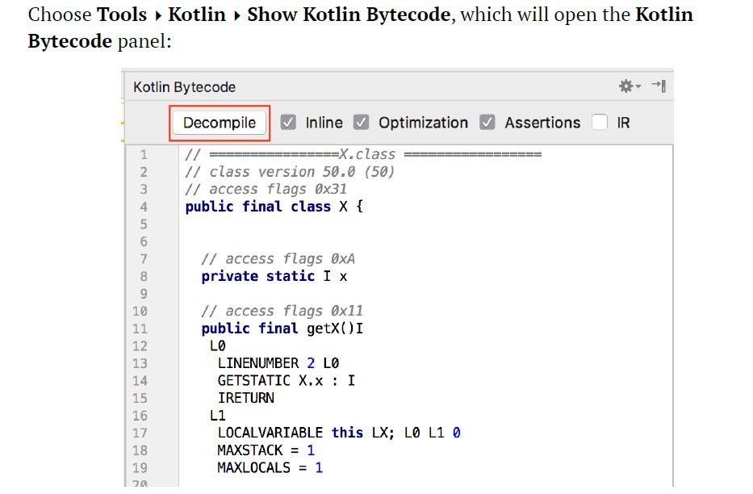

# OOP in Kotlin

- [OOP in Kotlin](#oop-in-kotlin)
  - [Creating Class and Object](#creating-class-and-object)
  - [Primary Constructor](#primary-constructor)
    - [Default values](#default-values)
  - [Property initializers: `init`](#property-initializers-init)
  - [Secondary Constructor](#secondary-constructor)
  - [Custom accessors - Getter, Setter](#custom-accessors---getter-setter)
  - [Inheritance](#inheritance)
    - [PolyMorphism](#polymorphism)
  - [Abstract Class](#abstract-class)
  - [Interface](#interface)
  - [Anonymous class](#anonymous-class)
  - [Data classes](#data-classes)
  - [Singletons and Companion Objects](#singletons-and-companion-objects)
    - [Named objects](#named-objects)
    - [Singleton use cases](#singleton-use-cases)
      - [Comparison to classes](#comparison-to-classes)
    - [Using static members](#using-static-members)
      - [Creating companion objects](#creating-companion-objects)

## Creating Class and Object

```kotlin
class User {
    var name: String = ""
    var email: String = ""
    fun checkEmail(): Boolean {
        return email.isNotEmpty()
    }

    override fun toString(): String {
        return "User[name=$name, email=$email]"
    }
}

fun main() {
    val user: User = User()
    println(user)//User[name=, email=]
    println(user.checkEmail())//false
    user.email = "abc@email.com"
    user.name = "abc"
    println(user)//User[name=abc, email=abc@email.com]
}
```

## Primary Constructor

You can use this class over and over again to build an array of users, each with a
different value. The properties you want to store are an individual’s name and
email address.

These are the properties of the `User` class. **You provide a data type for each, but opt not to assign a default value, because you plan to assign the value upon initialization**.
After all, the values will be different for each instance of `User`. You create an object by passing values as arguments into the class primary constructor:

```kotlin
class User(var email: String, var name: String) {
    fun checkEmail(): Boolean {
        return email.isNotEmpty()
    }

    override fun toString(): String {
        return "User[name=$name, email=$email]"
    }
}
```

You create an object by passing values as arguments into the class primary constructor:

```kotlin
fun main() {
    val user: User = User("abc@email.com", "abc")
    println(user)//User[name=abc, email=abc@email.com]
    println(user.checkEmail())//true
}
```

If you’d like to **prevent a value from changing**, you can define a property as a
constant instead using `val`.

### Default values

If you can make a reasonable assumption about what the value of a property should
be when the type is initialized, you can give that property a default value.
It doesn’t make sense to create a default name or email address for a `User`, but
imagine there’s a new property type to indicate what kind of `User` it is:

```kotlin
class User1(var email: String, var name: String="Jhon"){
    override fun toString(): String {
        return "User[name=$name, email=$email]"
    }
}

val user1: User1 = User1("abc@gmail.com")
println(user1)//User[name=Jhon, email=abc@gmail.com]
```

## Property initializers: `init`

Properties can also be initialized outside of the primary constructor, using literals
and values passed into the primary constructor, using a property initializer.

In `User`, the `address` and `city` properties are initialized in their declaration. The `name` and `email` properties are initialized inside of `init`. Since all four properties of `User` are given values inside the class definition, you can create an `User` instance using an empty **constructor** call:

```kotlin
class User2{
    var name:String
    var email:String
    var city = ""
    var address: String? = null
    init {
        name="abc"
        email="abc@gmail"
    }

    override fun toString(): String {
        return "User[name=$name, email=$email]"
    }
}

val user2 = User2()
println(user2)
```

```kotlin
class User3(email: String, name: String = "Jhon") {
    var name: String
    var email: String

    init {
        this.name = name
        this.email = email
    }
}
```

## Secondary Constructor

```kotlin
class User4{
    var name: String =""
    var email: String =""
    var id:Int = 0

    constructor(name:String){
        this.name = name
    }
    constructor(name:String,email: String){
        this.name = name
        this.email = email
    }

    constructor(name:String,email: String,id:Int):this(name, email){
        this.id = id
    }
}

    val user4 = User4("abc")
    val user44 = User4("abc","abc@gmail.com")
    val user444 = User4("abc","abc@gmail.com",11)
```

## Custom accessors - Getter, Setter

```kotlin
class Student {
    val school: String = "Merit Model"
    var age: Int = 5

    val isTeenager: Boolean
        get() {
            return age > 12
        }

    var name: String? = null
        get() = field ?: "Unknown"
        set(value) {
            if (value != null) field = value
        }
}

fun main() {
    val student: Student = Student()
    println("1. Student is Teenager: ${student.isTeenager}")
    student.age = 14
    println("2. Student is Teenager: ${student.isTeenager}")
    println("3. Student name is: ${student.name}")
    student.name = "Soikat"
    println("4. Student name is: ${student.name}")
}
```

## Inheritance

```kotlin
open class Person(val name: String) {
    init {
        println("This is a person")
    }
    var age: Int = 1
    fun doWork() {
        println("Person is doing work")
    }
}

class Students(name: String, val school: String) : Person(name) {
    init {
        println("This is a student")
    }
}

    val student = Students("Jhon", "MMC")
    student.doWork()//Person is doing work
    val x: Person = Students("Mark", "MMC")
    println(x.age)//1
    x.doWork()//Person is doing work
```

Overriding Function and Properties:

```kotlin
open class Person(val name: String) {
    init {
        println("This is a person")
    }
    open var age: Int = 1
    open fun doWork() {
        println("Person is doing work")
    }
}

class Students(name: String, val school: String,override var age:Int) : Person(name) {
    init {
        println("This is a student")
    }

    override fun doWork() {
        super.doWork()
        println("Student is doing work")
    }
}

    val x: Person = Students("Mark", "MMC",10)
    println(x.age)//10
    x.doWork()
    //Person is doing work
    //Student is doing work
```

### PolyMorphism

```kotlin
open class Vehicle {
    open fun startEngine() {}
}

class BMWCar() : Vehicle() {
    override fun startEngine() {
        println("BMWCar: start the engine")
        super.startEngine()
    }
}

class AudiCar() : Vehicle() {
    override fun startEngine() {
        println("AudiCar: start the engine")
        super.startEngine()
    }
}

fun startCar(car: Vehicle) {
    car.startEngine()
}

fun startBMWCar(car: BMWCar) {
    car.startEngine()
}

fun startAudiCar(car: AudiCar) {
    car.startEngine()
}

    val bmwCar: BMWCar = BMWCar()
    startCar(bmwCar)
    val bmwCar1: Vehicle = BMWCar()
    startCar(bmwCar1)
//    startBMWCar(bmwCar1) [error]
//    startAudiCar(bmwCar) [error]
    startBMWCar(bmwCar)

    val audiCar: Vehicle = AudiCar()
    startCar(audiCar)
```

## Abstract Class

## Interface

```kotlin
interface Footballer {
    val pos: String
    fun dribble()
    fun kick() {
        println("Kick the football")
    }
}

open class Person1(val name: String)

class Student1(name: String, override val pos: String) : Person1(name), Footballer {
    override fun dribble() {
        println("Dribble the ball")
    }
}

fun playFootball(footballer: Footballer){
    footballer.dribble()
    footballer.kick()
}
fun printName(person: Person1){
    println("Person name is: ${person.name}")
}

fun main() {
    val student = Student1("Jhon", "Sticker")
    playFootball(student)
    printName(student)
}

//Dribble the ball
//Kick the football
//Person name is: Jhon
```

## Anonymous class


```kotlin
open class Person {
    fun walk() {
        println("Person is walking")
    }
    fun sleep() {
        println("Person is sleeping")
    }
    open fun talk() {
        println("Person is talking")
    }
}

fun startTalking(person: Person) {
    person.talk()
}

fun main() {
    startTalking(object : Person() { //not new Person()
        override fun talk() {
            println("I am talking")
        }
    })

}
```

## Data classes

Suppose you want to define a `Student` class and have added functionality, such as
the ability to compare whether two students are equal or the ability to easily print
the student data. You might define the class as follows:

```kotlin
data class StudentA(val name: String, var section: String) {
    var age: Int = 8
}

fun main() {
    val student = StudentA("Jhon", "A")
    student.age = 10
    val student1 = StudentA("Jhon", "A")
    println("1. equal(): ${student.equals(student1)}")
    println("2. toString(): $student")
    val student2 = student.copy(name = "Mark")
    println("3. copy(): $student2")

    //destructing
    val (name, section) = student
    println("4. destructuring: $name is in section $section")
}
//1. equal(): true
//2. toString(): StudentA(name=Jhon, section=A)
//3. copy(): StudentA(name=Mark, section=A)
//4. destructuring: Jhon is in section A
```

## Singletons and Companion Objects

A Singleton pattern is a software design pattern wherein **only a single instance of a class exists** throughout the project and **the class itself provides a global access point to that particular instance**.

Use of singletons is sometimes discouraged because they introduce a **global state** into your application; therefore, you must be careful when accessing a singleton from different application threads.

Kotlin addresses some of these concerns by giving you a built-in way to create singletons.

### Named objects

The object keyword in Kotlin lets you define a type that only has a single instance — a named object.

A type defined with object cannot have constructors: Since there is only one instance of an object, there is no reason to provide constructor functions to create other instances. In a sense, the type is the instance.

To see what the Kotlin compiler is doing to follow the singleton pattern, it's instructive to see how the compiled version of Kotlin code created with object looks in Java. We can do so by having IntelliJ IDEA `decompile` the Kotlin bytecode into Java.

Add the following bare bones object into the new file:

```kotlin
object X {
    var x = 0
}
```

<div align="center">

</div>

Next, hit the `Decompile` button in the panel.

The decompiled Java for the simple object will open in a new editor window

```java
public final class X {
   private static int x;
   @NotNull
   public static final X INSTANCE;
   public final int getX() {
      return x;
   }
   public final void setX(int var1) {
      x = var1;
   }
   private X() {
   }
   static {
      X var0 = new X();
      INSTANCE = var0;
   }
}
```

The Java code uses a common approach to create singletons in Java. You have the
static and final INSTANCE field that is of the same type as the class.

The INSTANCE value is set in a static block, and it is set to a new instance of the
class. You also have getters and setters for the single-member field x.

Comparing the Java and Kotlin versions of the code, you see that the boilerplate
singleton setup code has been significantly reduced by using the object keyword.

### Singleton use cases

An example use case for a singleton is an in-memory repository for a set of data. Consider an app that needs a registry of students who are defined with the following data class:

```kotlin
data class StudentB(
    val id: Int, val firstName: String, val
    lastName: String
) {
    var fullName = "$lastName, $firstName"
}

    val marie = StudentB(1, "Marie", "Curie")
    val albert = StudentB(2, "Albert", "Einstein")
    val richard = StudentB(3, "Richard", "Feynman")
```

Using `object`, you can create a **registry** that maintains the list of students in a
mutable list, lets you add and remove students from the registry and lets you print
out the full name of all the students in the registry.

```kotlin
object StudentRegistry {
    val allStudents = mutableListOf<StudentB>()
    fun addStudent(student: StudentB) {
        allStudents.add(student)
    }

    fun removeStudent(student: StudentB) {
        allStudents.remove(student)
    }

    fun listAllStudents() {
        allStudents.forEach {
            println(it.fullName)
        }
    }
}
```

You call methods defined on the object using the object name with dot syntax:

```kotlin
StudentRegistry.addStudent(marie)
    StudentRegistry.addStudent(albert)
    StudentRegistry.addStudent(richard)
    StudentRegistry.listAllStudents()
// > Curie, Marie
// > Einstein, Albert
// > Feynman, Richard
}
```

If you had used a `class` to represent your student **registry**, **your app would allow for
mutliple registries to be created**, which could **lead to inconsistent registries to exist within** the software [ as if you are removing from one database but adding into another database]. Using a Kotlin object ensures that only one registry can be created.


Another example use case is to use object to provide a **namespace for constants** and methods that need to be referenced from multiple places in your app.


```kotlin
object JsonKeys {
    const val JSON_KEY_ID = "id"
    const val JSON_KEY_FIRSTNAME = "first_name"
    const val JSON_KEY_LASTNAME = "last_name"
}
```


Here, you've created a namespace for holding JSON keys that will be used to parse
JSON received from a server. By putting constants into an object, you reduce the
likelihood of name collisions when your constants are given commonly used names.

#### Comparison to classes

While constructors are not allowed for objects, they do have many similarities with
classes:

- Objects can have properties and member functions.
- Properties of the object must be initialized before use, either at declaration or in
an init block.
- Objects can inherit from classes and implement interfaces.

### Using static members

One of the students we define in this chapter, Emmy Noether, was a key contributor to the theory of conservation laws in physics. There appears to be a "law of conservation of keywords" because, while Kotlin has gained the object keyword, it's also lost a keyword found in other languages like Java and Swift: **There is no `static` keyword in Kotlin**.

The static keyword is used in these other languages to denote a class member that is common to all instances of the class and is not specific to each instance. Static members remove the need to duplicate items that are common to all instances.

But removing this code duplication is useful, so how does Kotlin allow you to define static members? You do so by creating a **companion object** inside the class.

#### Creating companion objects

You create the companion object by prepending `companion` to an `object` defined in
the class:

```kotlin
class Scientist private constructor(
    val id: Int,
    val firstName: String,
    val lastName: String
) {
    companion object {
        var currentId = 0
        fun newScientist(firstName: String, lastName: String):
                Scientist {
            currentId += 1
            return Scientist(currentId, firstName, lastName)
        }
    }

    var fullName = "$firstName $lastName"
}
```


In the Scientist class, you've added a companion object that holds a `currentId` value that you'll use for generating unique `ID` numbers for each scientist. The currentId value is common to all instances of the class, and it is used by the class to create new ID values when a new scientist instance is created.

A common use case for static members is to implement the **factory pattern** for creating new class instances. You're using the factory pattern in `Scientist` by making the class primary constructor private and adding a factory method
`newScientist()` to the companion object, which creates new scientist instances. By making the constructor private, you enforce that the new scientist instances can only be created using the factory method, ensuring that your `currentId` value is correctly incremented whenever new scientest objects are instantiated.

You can create a repository of scientists as a singleton:

```kotlin
object ScientistRepository {
    val allScientists = mutableListOf<Scientist>()
    fun addScientist(student: Scientist) {
        allScientists.add(student)
    }
    fun removeScientist(student: Scientist) {
        allScientists.remove(student)
    }
    fun listAllScientists() {
        allScientists.forEach {
            println("${it.id}: ${it.fullName}")
        }
    }
}
```

You create new scientist instances using dot syntax to call the companion object
method on the class name:

```kotlin
    val emmy = Scientist.newScientist("Emmy", "Noether")
    val isaac = Scientist.newScientist("Isaac", "Newton")
    val nick = Scientist.newScientist("Nikola", "Tesla")
    ScientistRepository.addScientist(emmy)
    ScientistRepository.addScientist(isaac)
    ScientistRepository.addScientist(nick)
    ScientistRepository.listAllScientists()
// 1: Emmy Noether
// 2: Isaac Newton
// 3: Nikola Tesla
```