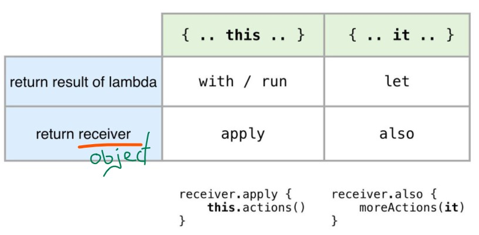
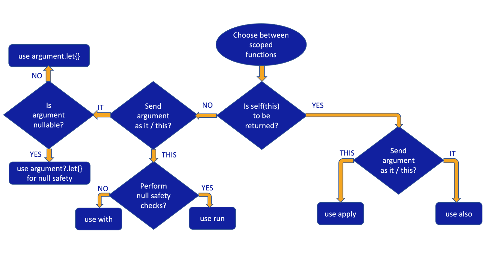

# Advance Kotlin

- [Advance Kotlin](#advance-kotlin)
  - [Standard Library - Scope functions](#standard-library---scope-functions)
    - [`let`](#let)
      - [Chaining `let` functions](#chaining-let-functions)
      - [Nesting let](#nesting-let)
    - [`with`](#with)
    - [`run`](#run)
      - [run as extension](#run-as-extension)
      - [run as function](#run-as-function)
    - [`apply`](#apply)
      - ["apply" use-case in Android Development](#apply-use-case-in-android-development)
    - [`also`](#also)
    - [Summary](#summary)

## Standard Library - Scope functions

The Kotlin standard library contains several functions whose sole purpose is to execute a block of code within the context of an object. When you call such a function on an object with a lambda expression provided, it forms a temporary scope. In this scope, you can access the object without its name. Such functions are called scope functions. There are five of them: `let`, `run`, `with`, `apply`, and `also`.

Here is a short guide for choosing scope functions depending on the intended purpose:

- Executing a lambda on an objects (non-null): `let`
- Introducing an expression as a variable in local scope: `let`
- Object configuration: `apply`
- Object configuration and computing the result: `run`
- Running statements where an expression is required: non-extension `run`
- Additional effects: `also`
- Grouping function calls on an object: `with`

If the property is nullable, you can use let or run

### `let`

Mostly **used for `null` checks**, when applying `?.let` on an `object`, we can rest safe that every time we access that `object` inside the scope function, the object will be not `null`. To reference the object inside the scope function, we use the keyword `it`.

- `Context Object` – `it`
- `Returns` – **last statement**
- `Use case` – let function is often used to provide **null safety calls**. Use safe call operator(`?.`) with `let`for `null` safety. It executes the block only with the non-null value.

```kotlin
data class Employee(var firstName: String, var age: Int)

fun main(args: Array<String>) {
    var employee: Employee? = null
    employee?.let {
        println("First Time : User $it")
        println("First Time : User $employee")
    }
    employee = Employee("A", 20)
    employee?.let {
        println("Second Time : User $it")
        println("Second Time : User $employee")
    }
}
```

So basically, let function will be:

- called only during the owner function will be called.
- called ONLY ONCE.
- called on the calling object.
- and will return the expression returned by the lambda passed to the let function.

Please note that we can point to the calling object by using `it`.

we can even use a local parameter for the calling object to avoid conflicts in the nested let or lambda function.

```kotlin
employee?.let { person ->
    person.firstName?.let { name ->
        println(name)
    }
}
```

Here the `person` and `name` are the named variable within the let function scope.

If the let lambda contains only a single expression, we can even use method reference (`::`) instead of lambda

```kotlin
employee?.firstName?.let(::println)
```

**The last value from the let is returned as an argument as shown below.**

```kotlin
	var strLength = str.let {
        println("$it!!")//Hello World!!
        "$it function".length // returns
    }
    println("strLength is $strLength") //prints strLength is 25
```

Things to keep in mind about let,
- `let` uses the context as it or we can use a named parameter.
- `let` return the last expression of the lambda passed which can also be void.

#### Chaining `let` functions

```kotlin
	var a = 1
    var b = 2

    a = a.let { it + 2 }.let {
        val i = it + b
        i//returns
    }
    println(a) //5
```

As you can see we’ve declared a local variable `“i”` inside the second let function. Setting the last statement of the let function to `i` returns the property to the outer property `a`.

Also, the `let` function can be used to invoke one or more functions on the result of the chain.

```kotlin
	var list = mutableListOf(6, 1, 5, 2, 4, 3)
    list.filter { it % 2 == 0 }.sortedBy { it }.let {
        println("Sorted even numbers are : $it")
    }
```

#### Nesting let

We can set a let expression inside another let expression as shown below.

```kotlin
	var x = "X"
    x.let { outer ->
        outer.let { inner ->
            print("Inner is $inner and outer is $outer")
            //Inner is X and outer is X
        }
    }
```

For nested let, we can’t use `it` keyword. We need to assign explicit names to `it` in both the let functions.
Only the**outermost let returns the value** as shown below.

```kotlin
var y = "Y"
    y = y.let { outer ->
        outer.let { inner ->
            println("Inner is $inner and outer is $outer")//Inner is Y and outer is Y
            "Kotlin Tutorials Inner let"
        }
        "Kotlin Tutorials Outer let"
    }
    println(y) //prints Kotlin Tutorials Outer let
```

### `with`

Similar to `apply` function, `with` is also **used to change properties of an instance i.e. object configuration**. The only difference is with is not an extension function. The last expression of with function returns a result.

- `Context Object` – `this`
- `Returns` – last statement
- `Use Case` – Run multiple operations on an object

```kotlin
data class User(var name: String, var address: String)

fun main() {
    val user = User("A","BD")
    val username = with(user) {
        name = "B"
        address = "USA"
        println("$user $this")
        //User(name=B, address=USA) User(name=B, address=USA)
        name// return value
    }
    println(username)//B
}
```

We can avoid the use of `this` pointer or use it to avoid the conflicts between other properties or objects with the same name within that class. It points to the calling object only.

we can **return** the last expression from the higher-order function passed to the with function.

### `run`

`run` function can be said as the combination of `‘let’` and `‘with’` functions.

- `Context Object` – `it`
- `Returns` – last statement
- `Use Case` – Used when the object lambda contains both initialization and the computation of the return value. Using run we can perform **null safety calls** as well as other computations.

It is the only scope function that has two variants.

#### run as extension

used to create a scope to **run an operation over an object**, and **get a result**.

```kotlin
data class User(var name: String, var address: String)

fun main() {
    var user:User? = null
    user?.run {
        name = "John"
        name
    }
    println(user)//null
    user = User("a","London")
    val username = user?.run {
        name = name.uppercase(Locale.getDefault())
        name
    }
    println(username)//A
}

```

#### run as function

run lets us execute a block of several statements where an expression is required.
This is like defining our block and the variables which will be defined in that block will not be present outside.

```kotlin
    val alphaNumeric = run {
        val digits = "0-9"
        val aplhabets = "A-Za-z"

        Regex("[$digits$aplhabets]+")
    }
    //digits = ".."//error``

    for (match in alphaNumeric.findAll("+1234 -FFFF I-am?-a!string?!")) {
        println(match.value)
    }
```

Let’s combine the let and run functions together.


```kotlin
var p : String? = null
    p?.let { println("p is $p") } ?: run {
        println("p was null. Setting default value to: ")
        p = "Kotlin"
    }

    println(p) //Kotlin
```

### `apply`

Basically, if you are **initializing an object**, and setting a **bunch of properties** like in this case, you have a pretty solid candidate to apply this scope function.

- `Context Object` – `this`
- `Returns` – same object
- `Use Case` – Initialize and configure an object

```kotlin
fun main() {
    val user = User("A","BD")
    val updatedUser = user.apply {
        name = "B"
        address = "London"
    }
    println(updatedUser)//User(name=B, address=London)
}
```

```kotlin
class Employee {
    var firstName: String = ""
    var age: Int = 0
    fun somefunction(){
        //do something here
    }
}

Employee().apply{
        this.firstName = "A"
        this.age = 27
    }.somefunction()
```

#### "apply" use-case in Android Development

Specifically for Android Development, "apply" can be useful in many cases. We have many scenarios where we should **return an instance of `Intent` or an `Alert Dialog` etc., by adding specific attributes to them**. Let's take the example of an intent here:

```kotlin
// Normal approach
fun createIntent(intentData: String, intentAction: String): Intent {
    val intent = Intent()
    intent.action = intentAction
    intent.data = Uri.parse(intentData)
    return intent
}

// Improved approach, by using apply
fun createIntent(intentData: String, intentAction: String) =
    Intent().apply {
        action = intentAction
        data = Uri.parse(intentData)
    }
```

The improved approach from the above code snippet helps in avoiding variable name redundancy thereby enhancing the code readability and the principle of clean code.

### `also`

A common use also is for **side effects** - **without modifying the object**. We can use it for doing some operations on the intermediate results. also **does not transform** the object. It **returns the same object**.

- `Context Object` – it
- `Returns` – same object
- `Use Case` – It is used where we have to perform additional operations when we have initialized the object members.

```kotlin
fun main() {
    val user = User("A","BD")

    val updatedUser = user.apply {
        name = "B"
        address = "London"
    }.also {
        println(it)
    }
}

data class User(var name: String, var address: String)
```

```kotlin
class ConnectionManager {
    var endPoint: String = ""
    var credentials: Pair<String, String> = Pair("", "")

    fun connect() {
        //make network connection
    }
}

    val connectionManager = ConnectionManager()
        .apply {
            endPoint = "http://endpoint.com"
            credentials = Pair("username", "password")
        }
        .also {
            it.connect()
        }
        .also {
            print("connection is made on ${it.endPoint}")
        }
```

we can even use a named parameter in also.

```kotlin
val connectionManager = ConnectionManager()
        .apply {
            endPoint = "http://endpoint.com"
            credentials = Pair("username", "password")
        }
        .also { manager ->
            manager.connect()
        }
```

### Summary

<div align="center">

</div>

<div align="center">

</div>