# Coroutines

- [Coroutines](#coroutines)
  - [Create Project with Kotlin Coroutines](#create-project-with-kotlin-coroutines)
  - [Threads](#threads)
  - [Coroutines intro](#coroutines-intro)
    - [Coroutines - basic concepts](#coroutines---basic-concepts)
    - [Suspending vs. blocking](#suspending-vs-blocking)
  - [Scope](#scope)
  - [Context](#context)
  - [Suspending functions](#suspending-functions)
  - [Dispatchers](#dispatchers)
  - [async](#async)
  - [withContext](#withcontext)
  - [Jobs](#jobs)
  - [Exception handling](#exception-handling)
  - [🚀Kotlin Flow🚀](#kotlin-flow)
    - [Intro](#intro)
      - [Components of a Flow](#components-of-a-flow)
      - [Creating a flow](#creating-a-flow)
        - [`flow{..emit(value)..}`: Generate flow by emitting each value](#flowemitvalue-generate-flow-by-emitting-each-value)
        - [`flowOf(vararg el: T)`](#flowofvararg-el-t)
        - [`.asFlow()`](#asflow)
      - [Collecting values From a Flow](#collecting-values-from-a-flow)
    - [Flow Properties](#flow-properties)
      - [cancellation](#cancellation)
    - [Flow operators](#flow-operators)
    - [Buffering](#buffering)
    - [Composing flows](#composing-flows)
    - [Exception handling](#exception-handling-1)

## Create Project with Kotlin Coroutines

<div align="center">
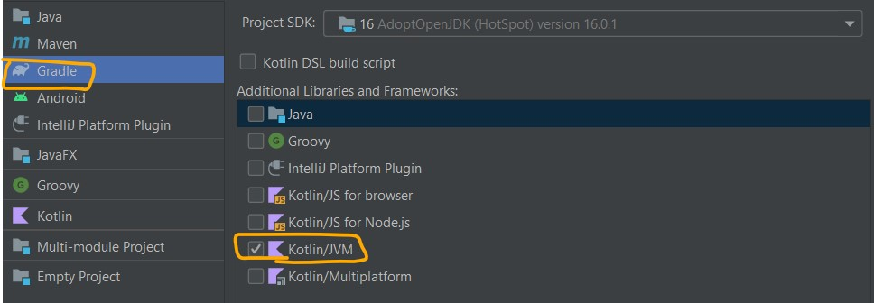
</div>

[dependencies](https://github.com/Kotlin/kotlinx.coroutines)

```gradle
implementation "org.jetbrains.kotlinx:kotlinx-coroutines-core:1.6.0"
```

## Threads

In `Java` — and accordingly in Kotlin on the JVM — you can **parallelize** your program
using threads. Each `java.lang.Thread`object represents one execution flow, which
sequentially performs the commands within the single thread. You can operate on
threads in various ways — create them, start, pause, join, etc. By creating several
threads, you can perform multiple tasks simultaneously.

Take a look at the example below:

```kotlin
fun main() {
    thread(start = true, name = "another thread") {
        (0..3).forEach {
            println("Message #$it from the ${Thread.currentThread().name}")
        }
    }
    (0..3).forEach {
        println("Message #$it from the ${Thread.currentThread().name}")
    }
}
```

In the above, you first create a thread named `"another thread"` using the function
`thread()` from the `kotlin.concurrent` package. You pass true for the start parameter,
so the thread will start executing commands immediately. A message with the thread
name and a number will be printed 11 times.

```
Message #0 from the another thread
Message #0 from the main
Message #1 from the another thread
Message #2 from the another thread
Message #1 from the main
Message #2 from the main
Message #3 from the another thread
Message #3 from the main
```

The exact ordering of the parallel println() results from the two threads is
indeterminate, and it depends on whatever is going on in your CPU at the time you run.
You can see that your main thread, along with "another thread," are executing at the
same time without waiting for each other to complete, which is expected and is the
desired behavior.

Everything seems fine with threads until you need to manipulate a large number of
them or pass data back and forth between them. Also, it's important to note that Java
threads are based on OS-level threads and, therefore, consume a significant amount of
system resources. You can't create thousands of threads as you'll likely end up with an
OutOfMemoryError thrown by the JVM

without thread:

<div align="center">
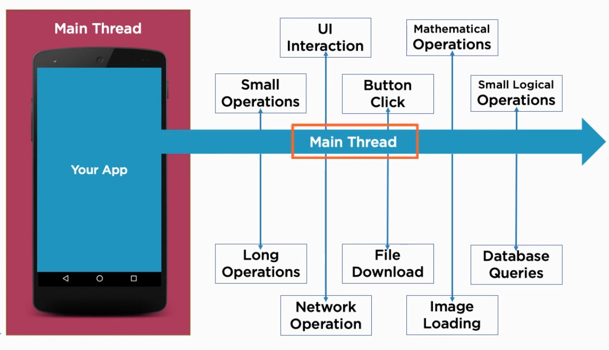
</div>

with thread:

<div align="center">
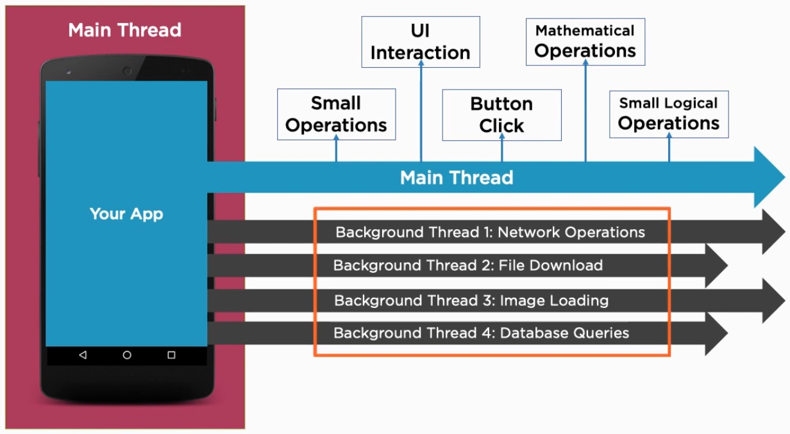
</div>

⚠️⚠️

<div align="center">
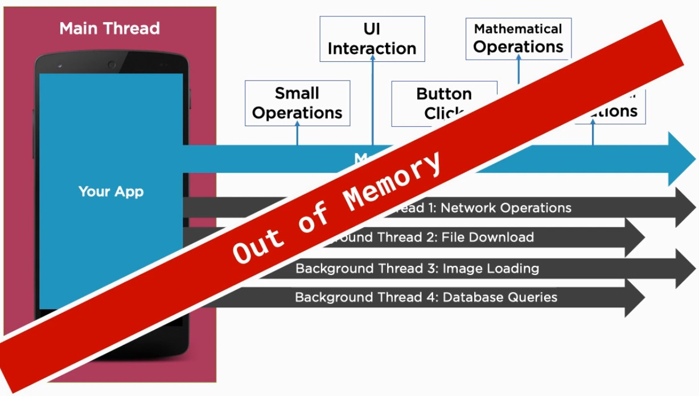
</div>

## Coroutines intro

<div align="center">
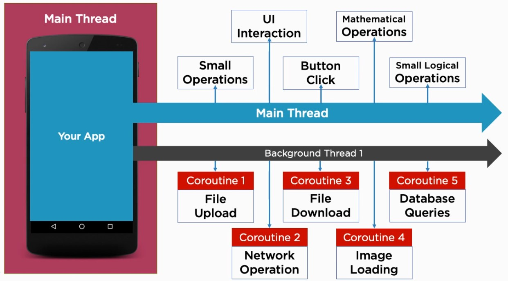
</div>

The documentation says Kotlin Coroutines are like **lightweight threads**. They are lightweight because creating coroutines **doesn’t allocate new threads**. Instead, they u**se predefined thread pools, and smart scheduling**. Scheduling is the process of determining which piece of work you will execute next. Just like a regular schedule.

Additionally, coroutines can be `suspended` and `resumed` mid-execution. This means you can have a long-running task, which you can execute little-by-little. You can pause it any number of times, and resume it when you’re ready again. Knowing this, creating a large number of Kotlin Coroutines won’t bring unnecessary memory overhead to your program. You’ll just suspend some of them until the thread pool frees up.

Key Takeaways:

- Threads are resource intensive
- Coroutines are lightweight threads `[threads!=Coroutines]`
  - Use thread pools
- Simplify async code, callbacks and synchronisation
- Simple syntax
- Can suspended and resume at any time, on a number of threads

### Coroutines - basic concepts

- `Scope` - create and run coroutines, provides lifecycle events
- `Context` - the Scope provides a context in which the coroutine runs
- `Suspending functions` - functions that can be run in a coroutine
(can be suspended)
- `Jobs` - a handle on a coroutine
- **`Deferred`** - a future result of a coroutine
- `Dispatcher` - manages which thread(s) the coroutine runs on
- `Error handling`

### Suspending vs. blocking

So what does suspended at certain points mean and how is it different from blocking the thread?

Well, suspension and blocking sound similar, but they’re actually very different. A blocking call to a function means that a call to any other function, from the same thread, will halt the parent’s execution. Following up, this means that if you make a blocking call on the main thread’s execution, you effectively freeze the UI. Until that blocking calls finishes, the user will see a static screen, which is not a good thing.

You can visualize it like this:

<div align="center">
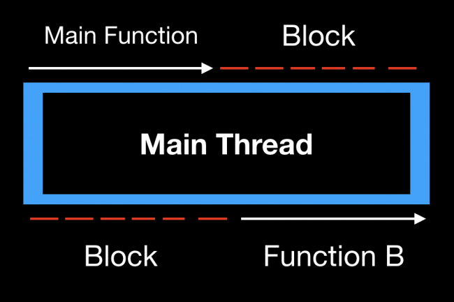
</div>

On the other hand, suspending doesn’t necessarily block your parent function’s execution. If you call a suspending function in some thread, you can easily push that function to a different thread. In case it is a heavy operation, it won’t block the main thread. Moreover, if you require a result from the function, you can bridge back to the main thread, without a lot of code. That way you can fetch data in a coroutine, from the main thread. All you have to do is launch the coroutine in a worker thread. This way you’ll effectively call something from the main thread, switch to the background, and switch back once the data is ready.

If the suspending function has to suspend, it will simply pause its execution. This way you free up its thread for other work. Once it’s done suspending, it will get the next free thread from the pool, to finish its work.

You can visualize the difference like this:

<div align="center">
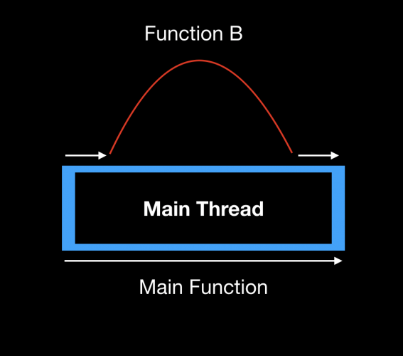
</div>

In the example above, Function B suspends on the main thread, but you can resume it on any other worker thread. As soon as the suspended function returns, you can consume the results, on the main thread.

## Scope

- Provides lifecycle methods for coroutines
- allow us to start and stop coroutines
- `GlobalScope.launch{}` - the scope of the coroutine is the lifecycle of the entire application
- `GlobalScope.async{}` - the scope of the coroutine is the lifecycle of the entire application
- `runBlocking{}` - creates a scope and runs a coroutine in a blocking way
- `coroutineScope{}` - creates a new scope does not complete until all children coroutines complete

```kotlin
import kotlinx.coroutines.*

fun main() {
    println("Program execution will now block")
    runBlocking { //create a blocking coroutine that executes in the current thread(main)
        launch {
            delay(1000L)
            println("Task from runBlocking")
        }

        GlobalScope.launch {
            delay(500L)
            println("Task from GlobalScope")
        }

        coroutineScope {
            launch {
                delay(1500L)
                println("Task from coroutineScope")
            }
        }
    }
    println("Program execution will now continue")
}
```

```bash
Program execution will now block
Task from GlobalScope
Task from runBlocking
Task from coroutineScope
Program execution will now continue
```

## Context

- A context is a set of data that relates to the coroutine
- All coroutines have an associated context
- Important elements of a context
- `Dispatcher` - which thread the coroutine is run on
- `Job` - handle on the coroutine lifecycle

```kotlin
fun main() {
    runBlocking {  //create a blocking coroutine that executes in the current thread(main)
        launch(CoroutineName("myCoroutine")) {
            //println("This is run from ${coroutineContext.get(CoroutineName.Key)}")
            println("This is run from ${coroutineContext[CoroutineName.Key]}")
        }
    }
}
```

## Suspending functions

- Functions that can be run in a coroutine
- Make callbacks seamless

```kotlin
suspend fun sayHello() {
 println(“Hello!”)
}
GlobalScope.launch {
 sayHello( )
}
```

```kotlin
var functionCalls = 0

fun main() {
    GlobalScope.launch { completeMessage() }
    GlobalScope.launch { improveMessage() }
    print("Hello, ")
    Thread.sleep(2000L)
    println("There have been $functionCalls calls so far")
}

suspend fun completeMessage() {
    delay(500L)
    println("World!")
    functionCalls++
}

suspend fun improveMessage() {
    delay(1000L)
    println("Suspend functions are cool")
    functionCalls++
}
```

## Dispatchers

- A dispatcher determines which thread or thread pool the coroutine runs on
- Different dispatchers are available depending on the task specificity

```kotlin
launch(Dispatchers.Default) {
 // do some CPU intensive processing task here
}
```

Common dispatchers:

- `Main`- Main thread update in UI driven applications (e.g. Android) Main dispatcher needs to be defined in Gradle
- `Default` -Useful for CPU intensive work
- `IO`- Useful for network communication or reading/writing files
- `Unconfined`- Starts the coroutine in the inherited dispatcher that called it
- `newSingleThreadContext(“MyThread”)`- Forces creation of a new thread

```kotlin
import kotlinx.coroutines.*
fun main() {
    runBlocking {
        launch(Dispatchers.Unconfined) {
            println("Unconfined1. Thread: ${Thread.currentThread().name}")
            delay(100L)
            println("Unconfined2. Thread: ${Thread.currentThread().name}")
        }

        launch(Dispatchers.Default) {
            println("Default. Thread: ${Thread.currentThread().name}")
        }

        launch(Dispatchers.IO) {
            println("IO. Thread: ${Thread.currentThread().name}")
        }

        launch(newSingleThreadContext("MyThread")) {
            println("newSingleThreadContext. Thread: ${Thread.currentThread().name}")
        }
    }
}
```

## async

- Just like `launch`, except it **returns a result**
- In the form of a `Deferred`
  - `Deferred` - a future promise of a returned value
- When we need the value, we call `await()` (blocking call)
  - If the value is available, it will return immediately
  - If the value is not available, it will pause the thread until it is

```kotlin
suspend fun getRandom() = Random.nextInt(1000)

val valueDeferred = GlobalScope.async { getRandom() }
… // Do some processing here
val finalValue = valueDeferred.await( )
```

```kotlin
fun main() {
    runBlocking {
        val firstDeferred = async { getFirstValue() }
        val secondDeferred = async { getSecondValue() }

        println("Doing some processing here")
        delay(500L)
        println("Waiting for values")

        val firstValue = firstDeferred.await()
        val secondValue = secondDeferred.await()

        println("The total is ${firstValue + secondValue}")
    }
}

suspend fun getFirstValue(): Int {
    delay(1000L)
    val value = Random.nextInt(100)
    println("Returning first value $value")
    return value
}

suspend fun getSecondValue(): Int {
    delay(2000L)
    val value = Random.nextInt(1000)
    println("Returning second value $value")
    return value
}
```

## withContext

- Allows us to easily change context
- Easily switch between dispatchers
- Very lightweight

```kotlin
fun main() {
    runBlocking {
        launch(newSingleThreadContext("MyThread")) {
            // default context
            println(Thread.currentThread().name) //MyThread
            withContext(Dispatchers.IO) {
                println(Thread.currentThread().name)//DefaultDispatcher-worker-2
            }
            println(Thread.currentThread().name) //MyThread
            // back to default context
        }
    }
}
```

## Jobs

- A `.launch()` call returns a `Job`
- Allows us to manipulate the coroutine lifecycle
- Live in the hierarchy of other Jobs
  - both as parents or children
- Can access lifecycle variables and methods
  - `cancel()`
  - `join()`
- If a job is cancelled, all its parents and children will be cancelled too

```kotlin
fun main() {
    runBlocking { //create a blocking coroutine that executes in the current thread(main)
        println("Main program starts: ${Thread.currentThread().name}")
        val job: Job = launch {
            println("fake start start: ${Thread.currentThread().name}")
            delay(2000)
            println("fake start end: ${Thread.currentThread().name}")
        }
        println("Main program ends: ${Thread.currentThread().name}")
    }
}
```

```bash
Main program starts: main
Main program ends: main
fake start start: main
fake start end: main
```

We can  `Main program ends: main` prints before `fake start start: main` that means `Main` thread doesn't wait for the  coroutine to finish.

```kotlin
fun main() {
    runBlocking { //create a blocking coroutine that executes in the current thread(main)
        println("Main program starts: ${Thread.currentThread().name}")
        val job: Job = launch {
            println("fake start start: ${Thread.currentThread().name}")
            delay(2000)
            println("fake start end: ${Thread.currentThread().name}")
        }
        job.join() //wait for the job/coroutine to finish
        println("Main program ends: ${Thread.currentThread().name}")
    }
}
```

```bash
Main program starts: main
fake start start: main
fake start end: main
Main program ends: main
```

## Exception handling

```kotlin
import kotlinx.coroutines.*
import java.lang.IndexOutOfBoundsException

fun main() {
    runBlocking {
        val myHandler = CoroutineExceptionHandler {coroutineContext, throwable ->
            println("Exception handled: ${throwable.localizedMessage}")
        }

        val job = GlobalScope.launch(myHandler) {
            println("Throwing exception from job")
            throw IndexOutOfBoundsException("exception in coroutine")
        }
        job.join()

        val deferred = GlobalScope.async {
            println("Throwing exception from async")
            throw ArithmeticException("exception from async")
        }

        try {
            deferred.await()
        } catch (e: java.lang.ArithmeticException) {
            println("Caught ArithmeticException ${e.localizedMessage}")
        }
    }
}
```

## 🚀Kotlin Flow🚀

### Intro

Kotlin `Flow` is a new stream processing API that is an implementation of the Reactive Stream specification, an initiative whose goal is to provide a standard for **asynchronous stream processing**. Kotlin Flow is built on top of Kotlin Coroutines.

Returning values using `suspending` functions is very much different from the `Flow` API, with a few examples!

```kotlin
suspend fun getValues(): List<Int> {
    delay(1000)
    return listOf(1, 2, 3)
}

fun processValues() {
    runBlocking {
        println("Processing.....")
        val values = getValues()
        for (value in values) {
            println(value)
        }
    }
    println("Done!")
}

fun main() {
    processValues()
}
```

We’ll get this output after a delay of one second:

<div align="center">
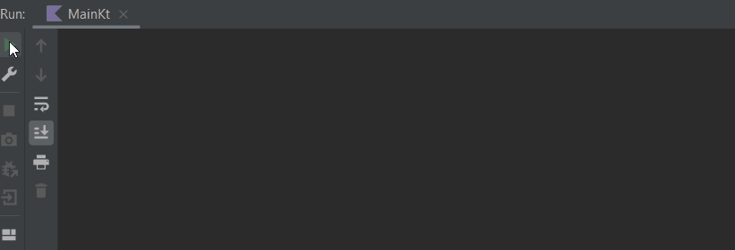
</div>

When you call `getValues()`, it `returns` a List with three values. We then use those values in `processValues()`. Within a for loop, you iterate over the List and print out the values.

A visual representation of the function is the following:

<div align="center">
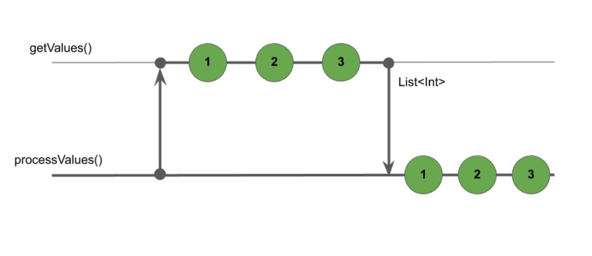
</div>

With `Flow` we can handle a stream of data that **emits** values **sequentially**. And Kotlin Flow is an implementation of **cold streams** - start pushing values only when you start collecting!
, powered by Kotlin Coroutines!

<div align="center">
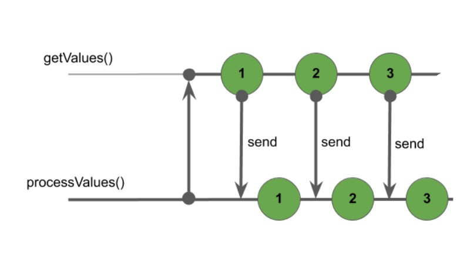
</div>

#### Components of a Flow

So, A flow is a stream of values that are asynchronously computed

Parts:

- `flow { … }` - **builder**
- `emit(value)` - **transmit** a value
- `collect { … }` - **receive** the values

#### Creating a flow

##### `flow{..emit(value)..}`: Generate flow by emitting each value

To create a Flow, you need to use a `flow builder`. You’ll start by using the most basic builder – `flow { ... }`.

```kotlin
import kotlinx.coroutines.flow.flow

suspend fun getValues() = flow {
    val values = listOf(1, 2, 3)
    for (value in values) {
        delay(1000)
        emit(value)
    }
}
```

We used a for loop to go through the list of values and **emit** each value after a small delay. The Flow uses `emit()` send values to **consumers**.

There are other Flow builders that you can use for an easy Flow declaration.

##### `flowOf(vararg el: T)`

A flow can be generated from a number of parameters of any type

```.kotlin
suspend fun  getValues() = flowOf(1, 2, 3)
```

##### `.asFlow()`

We can convert various collections and sequences to a Flow:

```.kotlin
suspend fun  getValues() = listOf(1, 2, 3).asFlow()
```

#### Collecting values From a Flow

`collect()` collects values from a Flow and executes an action with each item. In this case, you're printing an item to the console.

```kotlin
fun main() = runBlocking {
    println("Processing.....")
    getValues().collect { println(it) }
    println("Done!")
}
```

<div align="center">
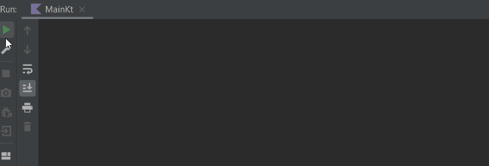
</div>

### Flow Properties

- Flows are `cold`- The code does not run until the collect function is called
- A flow cannot be cancelled by itself
- It will be cancelled when the encompassing coroutine is cancelled
- Flow is transparent for cancellation

#### cancellation

```kotlin
fun sendNumbers(): Flow<Int> = flow {
    val list = listOf(-1, 2, 3)
    list.forEach {
        delay(398)
        emit(it)
    }
}

runBlocking {
    val numbersFlow = sendNumbers()
    println("Flow hasn't started yet")
    println("Starting flow now:")
    withTimeoutOrNull(998) {
        numbersFlow.collect { println(it) }
    }
}
```

### Flow operators

- `Flow operators`: Take an input flow, transform it and return an output flow
- `Terminal flow operators`: Convert the flow into a collection : `collect`, `toList`, `toSet`, `reduce` etc
- Operators are `cold`
- The `returning` flow is `synchronous`

<div align="center">
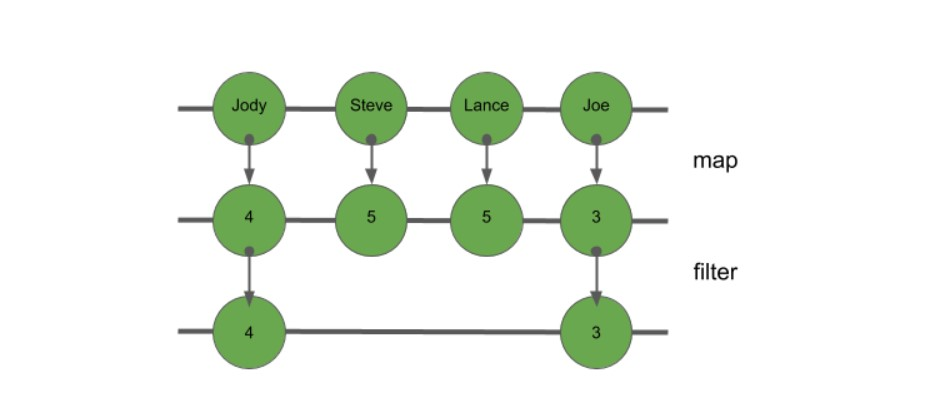
</div>

`map`: Map a flow to another flow

```kotlin
    (1..10).asFlow()
        .map {
            delay(500)
            "mapping $it"
        }
        .collect {
            println(it)
        }
```

`filter`: Filter flow values

```kotlin
    (1..10).asFlow()
        .filter {
            it % 2 == 0
        }
        .collect {
            println(it)
        }
```

`transform`: General transformation operator;Can emit any value at any point

```kotlin
(1..10).asFlow()
        .transform {
            emit("Emitting string value $it")
            emit(it)
        }
        .collect {
            println(it)
        }
```

`take`: Use only a number of values, disregard the rest

```kotlin
(1..10).asFlow()
   .take(2)
   .collect {
       println(it)
   }
```

`reduce`: Reduce a flow to a single value

```kotlin
val size = 10
    val factorial = (1..size).asFlow()
        .reduce { accumulator, value ->
            accumulator * value
        }
    println("Factorial of $size is $factorial")
```

`flowOn`: Change the thread that a flow is executed on

```kotlin
(1..10).asFlow()
        .flowOn(Dispatchers.IO)
        .collect {
            println(it)
        }
```

### Buffering

In case processing a flow takes a long time, a buffer is useful to accumulate flow values that can be processed later.

<div align="center">
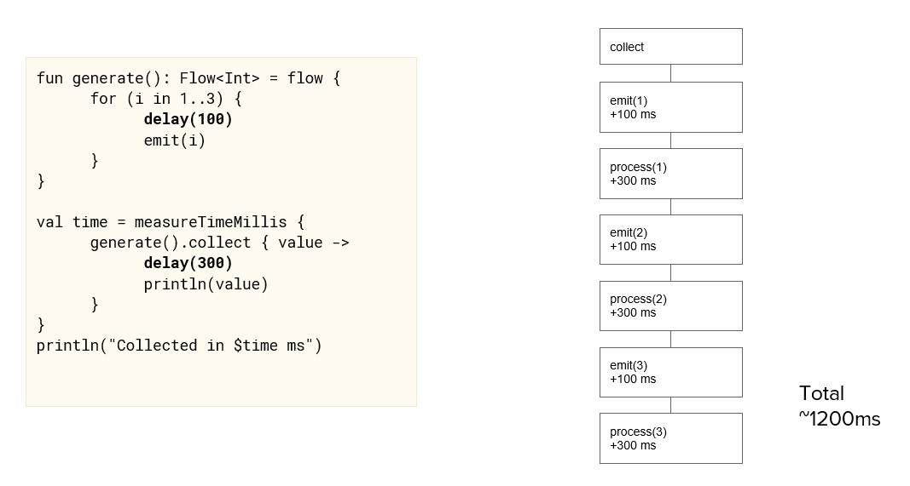
</div>
<div align="center">
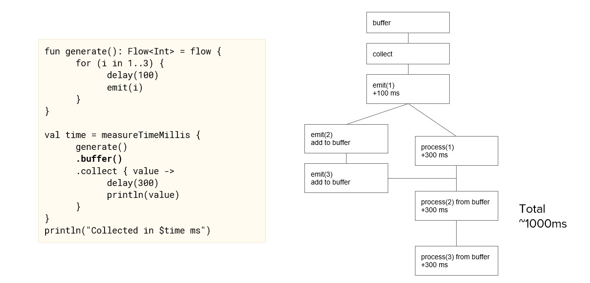
</div>

### Composing flows

`zip`: Matches corresponding values of two flows

```kotlin
val english = flowOf("One", "Two", "Three")
val french = flowOf("Un", "Deux", "Trois")
english.zip(french) {a, b -> "'$a' in French is '$b'"}
   .collect { println(it) }
```

```
'One' in French is 'Un'
'Two' in French is 'Deux'
'Three' in French is 'Trois'
```

`combine`: Combine the latest value of one flow with the latest value of the other

```kotlin
val numbers = (1..5).asFlow()
.onEach { delay(300) }
val values = flowOf("One", "Two", "Three", "Four", "Five")
.onEach { delay(400)}
numbers.combine(values) {a, b -> "$a -> $b"}
   .collect { println(it) }
```

```
1 -> One
2 -> One
2 -> Two
3 -> Two
3 -> Three
4 -> Three
5 -> Three
5 -> Four
5 -> Five
```

### Exception handling

`try/catch`: Surround collect call with try/catch


```kotlin
try {
(1..3).asFlow()
    .onEach { check(it != 2) }
    .collect { println(it) }
}catch (e: Exception) {
     println("Caught exception $e")
}
```

`.catch()`: An exception can be caught by the operator .catch

```kotlin
(1..3).asFlow()
   .onEach { check(it != 2) }
   .catch { e -> println("Caught exception $e") }
   .collect { println(it) }
```
Catches any exception that occurs above the catch operator;	not below

`onCompletion()`: The equivalent of a finally block

```kotlin
(1..3).asFlow()
    .onEach { check(it != 2) }
    .onCompletion { cause ->
        if(cause != null)
        println("Flow completed with $cause")
        else
        println("Flow completed successfully")
    }
    .catch { e -> println("Caught exception $e") }
    .collect { println(it) }
```