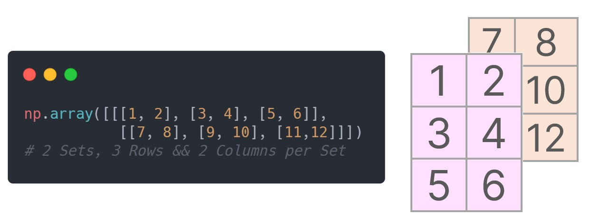

# NumPy

- [NumPy](#numpy)
  - [Why Numpy?](#why-numpy)
    - [Less Memory](#less-memory)
    - [Fast](#fast)
  - [Array creation](#array-creation)
    - [1) Converting Python sequences to NumPy Arrays](#1-converting-python-sequences-to-numpy-arrays)
    - [2) Intrinsic NumPy array creation functions](#2-intrinsic-numpy-array-creation-functions)
      - [1 - 1D array creation functions](#1---1d-array-creation-functions)
      - [`numpy.arange(start,[end,[step]])`](#numpyarangestartendstep)
      - [`numpy.linspace(s,en,equally spaced between)`](#numpylinspacesenequally-spaced-between)
      - [2, 3 - general ndarray creation functions](#2-3---general-ndarray-creation-functions)

```python
import numpy as np
```

## Why Numpy?

- performs fast operations (because of Vectorization)
- numpy arrays can be treated as vectors and matrices from linear algebra


```python
l = [1,2,3,4,5,6,7,8,9,10]
```


```python
%timeit [i**2 for i in l]
```

    3.83 µs ± 575 ns per loop (mean ± std. dev. of 7 runs, 100000 loops each)
    


```python
arr = np.array(l)
arr
```


    array([ 1,  2,  3,  4,  5,  6,  7,  8,  9, 10])


```python
%timeit arr**2
```

    1.17 µs ± 40.9 ns per loop (mean ± std. dev. of 7 runs, 1000000 loops each)
    


```python
# adding 1 to each element of this vector
l + 1
```


    ---------------------------------------------------------------------------

    TypeError                                 Traceback (most recent call last)

    <ipython-input-13-9fd71c034c35> in <module>
          1 # adding 1 to each element of this vector
    ----> 2 l + 1
    

    TypeError: can only concatenate list (not "int") to list


```python
# but it's possible in numpy
arr + 1
```


    array([ 2,  3,  4,  5,  6,  7,  8,  9, 10, 11])


### Less Memory


```python
import time
import sys
S= range(1000)
print(sys.getsizeof(5)*len(S))
 
D= np.arange(1000)
print(D.size*D.itemsize)
```

    28000
    4000
    

### Fast


```python
import time
import sys
 
SIZE = 1000000
 
L1= range(SIZE)
L2= range(SIZE)
A1= np.arange(SIZE)
A2=np.arange(SIZE)
 
start= time.time()
result=[(x,y) for x,y in zip(L1,L2)]
print((time.time()-start)*1000)
 
start=time.time()
result= A1+A2
print((time.time()-start)*1000)
```

    221.99392318725586
    59.9970817565918
    

## Array creation

`array`: Fundamental element in numpy is homogenous array. Numpy Arrays can be 1D, 2D, 3D ...nD

Different ways to create np array:

### 1) Converting Python sequences to NumPy Arrays

- `np.array()`


```python
a1D = np.array([1, 2, 3, 4])
print(a1D)
print(type(a1D))
print(a1D.ndim)
print("shape: ",a1D.shape)  

print()

# 2D
a2D = np.array([[1, 2], [3, 4]])
print(a2D)
print("shape: ",a2D.shape)  
```

    [1 2 3 4]
    <class 'numpy.ndarray'>
    1
    shape:  (4,)
    
    [[1 2]
     [3 4]]
    shape:  (2, 2)
    


```python
# 3D
a3D = np.array([[[1, 2], [3, 4], [5, 6]],
                [[7, 8], [9, 10], [11,12]]])
print(a3D)
print("shape: ",a3D.shape)  # 2 Sets, 3 Rows && 2 Columns per Set
print()
a3D2 = np.array([[[1, 2], [3, 4]],
                [[7, 8], [9, 10]],
                [[11,12], [5, 6]]])
print(a3D2)
print("shape: ",a3D2.shape)  # 3 Sets, 2 Rows && 2 Columns per Set

```

    [[[ 1  2]
      [ 3  4]
      [ 5  6]]
    
     [[ 7  8]
      [ 9 10]
      [11 12]]]
    shape:  (2, 3, 2)
    
    [[[ 1  2]
      [ 3  4]]
    
     [[ 7  8]
      [ 9 10]]
    
     [[11 12]
      [ 5  6]]]
    shape:  (3, 2, 2)
    

<div align="center"></div>


```python

```

### 2) Intrinsic NumPy array creation functions

NumPy has over 40 built-in functions for creating arrays as laid out in the Array creation routines. These functions can be split into roughly three categories, based on the dimension of the array they create:

1. 1D arrays
2. 2D arrays
3. ndarrays


#### 1 - 1D array creation functions

The 1D array creation functions e.g. `numpy.linspace` and `numpy.arange` generally need at least two inputs,`start` and `stop`.

#### `numpy.arange(start,[end,[step]])`

`numpy.arange` creates arrays with regularly incrementing values.


```python
print(np.arange(10))

print()

print(np.arange(1,10))

print()

print(np.arange(1,10,2))
```

    [0 1 2 3 4 5 6 7 8 9]
    
    [1 2 3 4 5 6 7 8 9]
    
    [1 3 5 7 9]
    

#### `numpy.linspace(s,en,equally spaced between)` 

`numpy.linspace`  will create arrays with a specified number of elements, and spaced equally between the specified beginning and end values.


```python
print(np.linspace(1,10,5)) # from 
```

    [ 1.    3.25  5.5   7.75 10.  ]
    

#### 2, 3 - general ndarray creation functions

- `zeros()`
- `ones()`
- `diag()`
- `indentity()` , `eye()`


```python
print(np.zeros(10))
print("2d..............")
print(np.zeros((3,3)))
print("3d.............")
print(np.zeros((2,3,3)))
```

    [0. 0. 0. 0. 0. 0. 0. 0. 0. 0.]
    2d..............
    [[0. 0. 0.]
     [0. 0. 0.]
     [0. 0. 0.]]
    3d.............
    [[[0. 0. 0.]
      [0. 0. 0.]
      [0. 0. 0.]]
    
     [[0. 0. 0.]
      [0. 0. 0.]
      [0. 0. 0.]]]
    


```python
print(np.ones(10))
print()
print(np.ones((3,3)) * 5) 
```

    [1. 1. 1. 1. 1. 1. 1. 1. 1. 1.]
    
    [[5. 5. 5.]
     [5. 5. 5.]
     [5. 5. 5.]]
    


```python
np.diag([1,2,3,4])
```


    array([[1, 0, 0, 0],
           [0, 2, 0, 0],
           [0, 0, 3, 0],
           [0, 0, 0, 4]])


```python
np.identity(4)
```


    array([[1., 0., 0., 0.],
           [0., 1., 0., 0.],
           [0., 0., 1., 0.],
           [0., 0., 0., 1.]])


```python
np.eye(4)
```


    array([[1., 0., 0., 0.],
           [0., 1., 0., 0.],
           [0., 0., 1., 0.],
           [0., 0., 0., 1.]])


