# NumPy

- [NumPy](#numpy)
  - [Why Numpy?](#why-numpy)
  - [Array Creation](#array-creation)
    - [1) Manual Construction of arrays: Converting Python sequences to NumPy Arrays](#1-manual-construction-of-arrays-converting-python-sequences-to-numpy-arrays)
    - [2) Functions for creating arrays](#2-functions-for-creating-arrays)
      - [`arrange`](#arrange)
      - [`numpy.linspace(s,en,equally spaced between)`](#numpylinspacesenequally-spaced-between)
      - [2, 3 - general ndarray creation functions](#2-3---general-ndarray-creation-functions)
  - [Generating an array of random numbers in NumPy](#generating-an-array-of-random-numbers-in-numpy)
    - [NumPy Random Seed](#numpy-random-seed)
  - [Basic DataTypes](#basic-datatypes)
  - [Indexing and Masking](#indexing-and-masking)
    - [Array slicing](#array-slicing)
      - [Negative slicing of NumPy arrays](#negative-slicing-of-numpy-arrays)
    - [Masking](#masking)
    - [Selecting values from your array that fulfill certain conditions](#selecting-values-from-your-array-that-fulfill-certain-conditions)
      - [Indexing with a mask can be very useful to assign a new value to a sub-array](#indexing-with-a-mask-can-be-very-useful-to-assign-a-new-value-to-a-sub-array)
      - [`np.where()` to select elements or indices from an array](#npwhere-to-select-elements-or-indices-from-an-array)
  - [3D Arrays](#3d-arrays)
    - [Converting to 1D array with `flatten()` method](#converting-to-1d-array-with-flatten-method)
  - [Manipulating Arrays](#manipulating-arrays)
    - [Matrix Arithmetic](#matrix-arithmetic)
    - [with scalars](#with-scalars)
    - [Transcendental functions](#transcendental-functions)
    - [Shape Mismatch](#shape-mismatch)
    - [Dot Product](#dot-product)
  - [Basic Reductions](#basic-reductions)
    - [Matrix Aggregation](#matrix-aggregation)
    - [Logical Operations](#logical-operations)
    - [Statistics](#statistics)
  - [Broadcasting](#broadcasting)
  - [Shape Manipulation - Transposing, Reshaping, Stacking etc](#shape-manipulation---transposing-reshaping-stacking-etc)
    - [flatten()](#flatten)
    - [reshape()](#reshape)
    - [Transpose](#transpose)
    - [Adding a Dimension](#adding-a-dimension)
    - [Stacking of Array](#stacking-of-array)
  - [Vectorization](#vectorization)
    - [Machine Learning context](#machine-learning-context)

```python
import numpy as np
```

## Why Numpy?

- performs fast operations (because of Vectorization)
- numpy arrays can be treated as vectors and matrices from linear algebra

```python
l = [1,2,3,4,5,6,7,8,9,10]
```

```python
%timeit [i**2 for i in l]
```

    3.52 µs ± 1.05 µs per loop (mean ± std. dev. of 7 runs, 100000 loops each)

```python
arr = np.array(l)

arr
```

    array([ 1,  2,  3,  4,  5,  6,  7,  8,  9, 10])

```python
%timeit arr**2
```

    975 ns ± 122 ns per loop (mean ± std. dev. of 7 runs, 1000000 loops each)

```python
# adding 1 to each element of this vector

l + 1
```

    ---------------------------------------------------------------------------

    TypeError                                 Traceback (most recent call last)

    <ipython-input-43-9fd71c034c35> in <module>
          1 # adding 1 to each element of this vector
    ----> 2 l + 1
    

    TypeError: can only concatenate list (not "int") to list

```python
# but it's possible in numpy

arr + 1
```

    array([ 2,  3,  4,  5,  6,  7,  8,  9, 10, 11])

## Array Creation

`array`: Fundamental element in numpy is homogenous array. Numpy Arrays can be 1D, 2D, 3D ...nD

Different ways to create np array:

### 1) Manual Construction of arrays: Converting Python sequences to NumPy Arrays

- `np.array()`

```python
a1D = np.array([1, 2, 3, 4])

print(a1D)

# da

print(type(a1D))

print(a1D.ndim)

print(a1D.dtype)

print("shape: ",a1D.shape)  


print()


# 2D

a2D = np.array([[1, 2], [3, 4]])

print(a2D) 

print("total item: ",a2D.size)  

print("shape: ",a2D.shape)  

print("shape is indexable: ",a2D.shape[0],"~",a2D.shape[1])  
```

    [1 2 3 4]
    <class 'numpy.ndarray'>
    1
    int32
    shape:  (4,)
    
    [[1 2]
     [3 4]]
    total item:  4
    shape:  (2, 2)
    shape is indexable:  2 ~ 2

### 2) Functions for creating arrays

NumPy has over 40 built-in functions for creating arrays as laid out in the Array creation routines. These functions can be split into roughly three categories, based on the dimension of the array they create:

1. 1D arrays

2. 2D arrays

3. ndarrays

#### `arrange`

The 1D array creation functions e.g. `numpy.linspace` and `numpy.arange` generally need at least two inputs,`start` and `stop`.

`numpy.arange` creates arrays with regularly incrementing values. `arange` is an array-valued version of the built-in Python range function

```python
print(np.arange(10))  # 0.... n-1


print()


print(np.arange(1,10)) #start, end (exclusive)


print()


print(np.arange(1, 10, 2))  # start, end (exclusive), step


```

    [0 1 2 3 4 5 6 7 8 9]
    
    [1 2 3 4 5 6 7 8 9]
    
    [1 3 5 7 9]

#### `numpy.linspace(s,en,equally spaced between)`

`numpy.linspace`  will create arrays with a specified number of elements, and spaced equally between the specified beginning and end values.

```python
print(np.linspace(1, 10, 5))  # start, end, number of points
```

    [ 1.    3.25  5.5   7.75 10.  ]

#### 2, 3 - general ndarray creation functions

- `zeros()`
- `ones()`
- `diag()`
- `indentity()` , `eye()`

```python
print(np.zeros(10))

print("2d..............")

print(np.zeros((3,3)))

print("3d.............")

print(np.zeros((2,3,3)))
```

    [0. 0. 0. 0. 0. 0. 0. 0. 0. 0.]
    2d..............
    [[0. 0. 0.]
     [0. 0. 0.]
     [0. 0. 0.]]
    3d.............
    [[[0. 0. 0.]
      [0. 0. 0.]
      [0. 0. 0.]]
    
     [[0. 0. 0.]
      [0. 0. 0.]
      [0. 0. 0.]]]

```python
print(np.ones(10))

print()

print(np.ones((3,3)) * 5) 
```

    [1. 1. 1. 1. 1. 1. 1. 1. 1. 1.]
    
    [[5. 5. 5.]
     [5. 5. 5.]
     [5. 5. 5.]]

```python
np.diag([1,2,3,4])
```

    array([[1, 0, 0, 0],
           [0, 2, 0, 0],
           [0, 0, 3, 0],
           [0, 0, 0, 4]])

```python
np.identity(4)
```

    array([[1., 0., 0., 0.],
           [0., 1., 0., 0.],
           [0., 0., 1., 0.],
           [0., 0., 0., 1.]])

```python
c = np.eye(4)  # Return a 2-D array with ones on the diagonal and zeros elsewhere.

print(c)

print()

# 3 is number of rows, 2 is number of columns, index of diagonal start with 0

d = np.eye(3, 2)

print(d)


```

    [[1. 0. 0. 0.]
     [0. 1. 0. 0.]
     [0. 0. 1. 0.]
     [0. 0. 0. 1.]]
    
    [[1. 0.]
     [0. 1.]
     [0. 0.]]

## Generating an array of random numbers in NumPy

We can generate an array of random numbers using `rand()`, `randn()` or `randint()` functions.

- Using `random.rand()`, we can generate an array of random numbers of the shape we pass to it from uniform distribution over 0 to 1.

```python
# For example, say we want a one-dimensional array of 4 objects that are uniformly 

# distributed from 0 to 1, we can do this:


r = np.random.rand(4)

print(r)


# And if we want a two-dimensional array of 3rows and 2columns:

print()

r = np.random.rand(3, 2)

print(r)
```

    [0.9448474  0.93929097 0.4827775  0.65302109]
    
    [[0.26754535 0.03942572]
     [0.31236268 0.85961221]
     [0.99364858 0.35495844]]

- Using `randn()`, we can generate random samples from **Standard, normal or Gaussian distributioncentered around 0** . For example, let’s generate 7 random numbers:

```python
r = np.random.randn(7)

r
```

    array([ 0.85628608,  1.06652993, -0.24465544,  0.74419801, -0.35160372,
           -0.14436767, -0.06093946])

When you plot the result will give us a normal distribution curve.

```python
import matplotlib.pyplot as plt
```

```python
r = np.random.randn(700)

plt.hist(r)

plt.show()
```

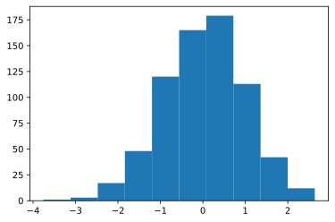

- Lastly, we can use the `randint()` function to generate an array of integers.
- The `randint()` function can take up to 3 arguments;
  - the low(inclusive),
  - high(exclusive)
  - size of the array.

```python
print(np.arange(10)) # Remember!! not random but sequential

print(np.random.randint(20)) #generates a random integer exclusive of 20

print()

print(np.random.randint(2, 20))#generates a random integer including 2 but excluding 20

print()

print(np.random.randint(2, 20, 7))#generates 7 random integers including 2 but excluding 20

print()

print(np.random.randint(2, 20, (2,3)))#generates 2D array of shape 2,3
```

    17
    
    12
    
    [10  8 18 18  5 16 15]
    
    [[13  8 13]
     [ 5  8  9]]

### NumPy Random Seed

If we set the np.random.seed(a_fixed_number) every time you call the numpy's other random function, the result will be the same:

```python
r= np.random.randint(10,size=(2,3))

print(r)

# changes each time
```

    [[2 3 8]
     [1 3 3]]

```python
np.random.seed(43)

r= np.random.randint(10,size=(2,3))

print(r) # fixed
```

    [[4 0 1]
     [5 0 3]]

## Basic DataTypes

**Each built-in data type has a character code that uniquely identifies it.**

- 'b' − boolean

- 'i' − (signed) integer

- 'u' − unsigned integer

- 'f' − floating-point

- 'c' − complex-floating point

- 'm' − timedelta

- 'M' − datetime

- 'O' − (Python) objects

- 'S', 'a' − (byte-)string

- 'U' − Unicode

- 'V' − raw data (void)

```python
a = np.zeros((3, 3))

print(a)


a.dtype
```

    [[0. 0. 0.]
     [0. 0. 0.]
     [0. 0. 0.]]
    


    dtype('float64')

## Indexing and Masking

```python
a = np.random.randint(0,20,(5,4)) 

a
```

    array([[16,  3, 16, 10],
           [18, 17, 15,  0],
           [ 5, 13, 18, 10],
           [ 7,  5,  9, 14],
           [ 6,  9,  2,  2]])

```python
# first row

print(a[0])

# sencond last row

print(a[-2])

# first element

print(a[0,0])

# last element

print(a[4,3])
```

    [16  3 16 10]
    [ 7  5  9 14]
    16
    2

### Array slicing

`arr[start_row_idx : end_row_idx + 1, start_col_idx : end_col_idx + 1]`

```python
a = np.array([[1 , 2, 3, 4], 

              [5, 6, 7, 8], 

              [9, 10, 11, 12],

              [13 , 14, 15, 16]])
```

<div align="center">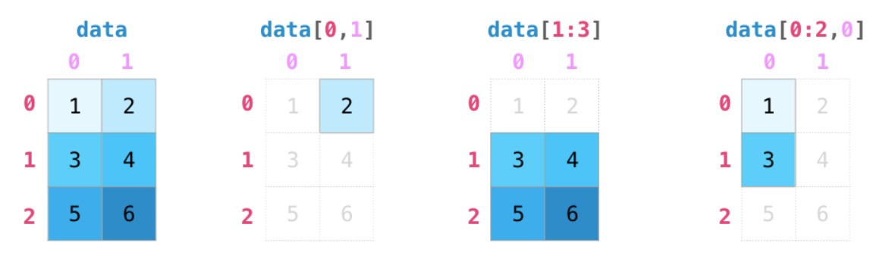</div>

<div align="center">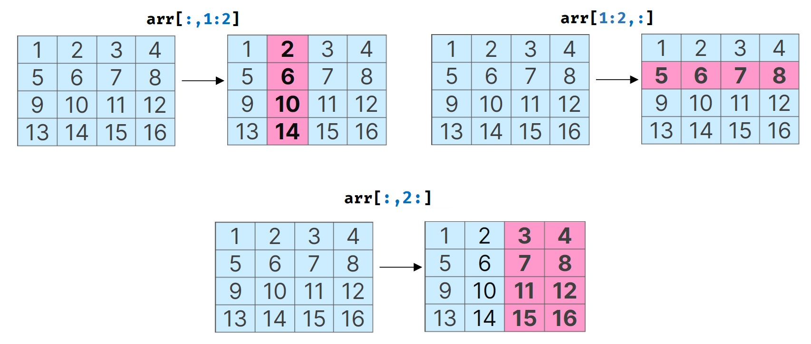</div>

```python
print(a[0:2,0:2])

print()

print(a[:2,:2])
```

    [[1 2]
     [5 6]]
    
    [[1 2]
     [5 6]]

```python
# diff. ways of indexing first two rows

print(a[0:2]) 

print()

print(a[:2,:])

print()

print(a[:2])
```

    [[1 2 3 4]
     [5 6 7 8]]
    
    [[1 2 3 4]
     [5 6 7 8]]
    
    [[1 2 3 4]
     [5 6 7 8]]

```python
print(a[:,1]) #all rows of column 2

print("vs")

print(a[:,1:2]) #all rows of column 2
```

    [ 2  6 10 14]
    vs
    [[ 2]
     [ 6]
     [10]
     [14]]

```python
print(a[1,:]) #all columns of row 2

print("vs")

print(a[1:2,:]) #all columns of row 2
```

    [5 6 7 8]
    vs
    [[5 6 7 8]]

```python
print(a[:,2:]) #all rows of last two rows
```

    [[ 3  4]
     [ 7  8]
     [11 12]
     [15 16]]

#### Negative slicing of NumPy arrays

```python
# last column only

print(a[:,-1]) # all rows, last column

print()

print(a[:,3])
```

    [ 4  8 12 16]
    
    [ 4  8 12 16]

```python
#  last two  column only

ans = a[:,-2:]

print(ans) 

print()

print(ans[1,0])
```

    [[ 3  4]
     [ 7  8]
     [11 12]
     [15 16]]
    
    7

If, however, we wanted to extract from the end, we would have to explicitly provide a negative step-size otherwise the result would be an empty list.

```python
print(a[:,-1:-3:-1])
```

    [[ 4  3]
     [ 8  7]
     [12 11]
     [16 15]]

```python
print('Reversed array :','\n',a[::-1,::-1])
```

    Reversed array : 
     [[16 15 14 13]
     [12 11 10  9]
     [ 8  7  6  5]
     [ 4  3  2  1]]

### Masking

NumPy arrays can be indexed with slices, but also with boolean or integer arrays **(masks)**. This method is called **fancy indexing**. It creates copies not views.

```python
a = np.array([[1 , 2, 3, 4], 

              [5, 6, 7, 8], 

              [9, 10, 11, 12],

              [1 , 2, 3, 4]])


a[1:3,1:3] = 0

print(a)
```

    [[ 1  2  3  4]
     [ 5  0  0  8]
     [ 9  0  0 12]
     [ 1  2  3  4]]

```python
mask = a>5

print(mask)
```

    [[False False False False]
     [False False False  True]
     [ True False False  True]
     [False False False False]]

```python
# get all values greater then 5

a[mask]
```

    array([ 8,  9, 12])

### Selecting values from your array that fulfill certain conditions

```python
# print all of the values in the array that are less than 5.

print(a[a<5]) 


# numbers that are equal to or greater than 5

print()

five_up = (a >= 5)

print(a[five_up])


# elements that are divisible by 2:

print()

divisible_by_2 = a[a%2==0]

print(divisible_by_2)


# elements that satisfy two conditions using the & and | operators:

print()

c = a[(a > 2) & (a < 11)]

print(c)
```

    [1 2 3 4 0 0 0 0 1 2 3 4]
    
    [ 5  8  9 12]
    
    [ 2  4  0  0  8  0  0 12  2  4]
    
    [3 4 5 8 9 3 4]

#### Indexing with a mask can be very useful to assign a new value to a sub-array

```python
a = np.random.randint(0, 20, 15)

print(a)

mask = (a % 2 == 0)

a[mask] = -1

a
```

    [18 14 14  7 11  1 10  4  1 10 10 18 17  5  2]
    


    array([-1, -1, -1,  7, 11,  1, -1, -1,  1, -1, -1, -1, 17,  5, -1])

#### `np.where()` to select elements or indices from an array

```python
# print the indices of elements that are, for example, less than 5:

a = np.array([[1 , 5, 6, 4], 

              [5, 1, 7, 8], 

              [9, 10, 11, 1]])

b = np.where(a<5)

print(b)
```

    (array([0, 0, 1, 2], dtype=int64), array([0, 3, 1, 3], dtype=int64))

In this example, a tuple of arrays was returned: one for each dimension.

The first array represents the row indices where these values are found, and

the second array represents the column indices where the values are found.

## 3D Arrays

<div align="center">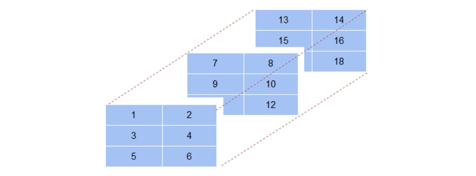</div>

```python
a = np.array([[[1,2],[3,4],[5,6]],# first axis array

[[7,8],[9,10],[11,12]],# second axis array

[[13,14],[15,16],[17,18]]])# third axis array


a.shape # 3 sets , 3 rows, 2 columns
```

    (3, 3, 2)

```python
# value

print(a[0],'\n')

print(a[0,0],'\n')

# First array, first row, first column value

print(a[0,0,0],'\n')

# First array last column 

print(a[0,:,1],'\n')
```

    [[1 2]
     [3 4]
     [5 6]] 
    
    [1 2] 
    
    1 
    
    [2 4 6] 

```python
print(a[1])

print()

print(a[2])

print()

print("first row from each arrays:",'\n')

print(a[:,0,:2])
```

    [[ 7  8]
     [ 9 10]
     [11 12]]
    
    [[13 14]
     [15 16]
     [17 18]]
    
    first row from each arrays: 
    
    [[ 1  2]
     [ 7  8]
     [13 14]]

```python
# First one rows for second and third arrays:

print(a[1:,:1,:2])

print('\n',"watch out!!",'\n')

# First one rows for second and third arrays:

print(a[1:,0,:2],'\n')
```

    [[[ 7  8]]
    
     [[13 14]]]
    
     watch out!! 
    
    [[ 7  8]
     [13 14]] 

```python

```

### Converting to 1D array with `flatten()` method

```python
print('Printing as a single array :','\n',a[1:,0:2,0:2].flatten())
```

    Printing as a single array : 
     [ 7  8  9 10 13 14 15 16]

```python

```

    [[[ 5  6]
      [ 3  4]]
    
     [[11 12]
      [ 9 10]]
    
     [[17 18]
      [15 16]]]

## Manipulating Arrays

### Matrix Arithmetic

We can add and multiply matrices using `arithmetic operators (+-*/)` if the two matrices are the **same size**. NumPy handles those as **`position-wise`** operations:

<div align="center"></div>

We can get away with doing these arithmetic operations on matrices of **different size** only if the different dimension is one (e.g. the matrix has only one column or one row), in which case NumPy uses its **`broadcast`** rules for that operation:

<div align="center"></div>

```python
a = np.array([10,20,30,40])

b = np.arange(1,5)

print(a)

print(b)
```

    [10 20 30 40]
    [1 2 3 4]

```python
a + b
```

    array([11, 22, 33, 44])

```python
a - b
```

    array([ 9, 18, 27, 36])

```python
a * b
```

    array([ 10,  40,  90, 160])

### with scalars

```python
a = np.array([1, 2, 3, 4])  # create an array

a*2
```

    array([2, 4, 6, 8])

```python
a= a ** 2

a
```

    array([ 1,  4,  9, 16], dtype=int32)

```python
# Masking

a>15
```

    array([False,  True,  True,  True])

### Transcendental functions

```python
np.log(b)
```

    array([0.        , 0.69314718, 1.09861229, 1.38629436])

```python
np.sin(a)
```

    array([-0.54402111,  0.91294525, -0.98803162,  0.74511316])

### Shape Mismatch

```python
a = np.arange(4)


a + np.array([1, 2])


```

    ---------------------------------------------------------------------------

    ValueError                                Traceback (most recent call last)

    <ipython-input-26-e480c525d1d6> in <module>
          1 a = np.arange(4)
          2 
    ----> 3 a + np.array([1, 2])
    

    ValueError: operands could not be broadcast together with shapes (4,) (2,) 

```python
a = np.array([[1,2],[3,4]])

b = np.array([1,1])

a + b


```

    array([[2, 3],
           [4, 5]])

### Dot Product

To multiply an `m×n` matrix by an `n×p` matrix, the `n`s must be the same,

and the result is an `m×p` matrix.

A key distinction to make with arithmetic is the case of matrix multiplication using the dot product. NumPy gives every matrix a dot() method we can use to carry-out dot product operations with other matrices:

<div align="center">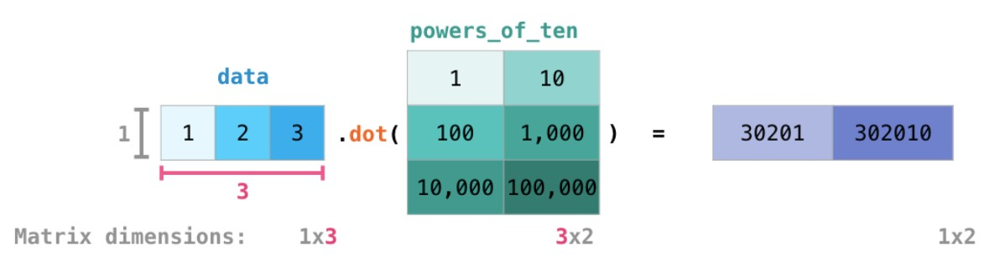</div>

I’ve added matrix dimensions at the bottom of this figure to stress that the two matrices have to have the same dimension on the side they face each other with. You can visualize this operation as looking like this:

<div align="center">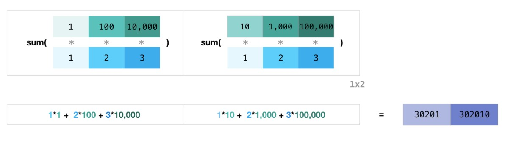</div>

```python
# A = np.random.randint(0,5,(3,4))

# B = np.random.randint(0,5,(4,2))

A = np.array([1,2,3])

B = np.array([[1,10],[100,1000],[10000,100000]])

print(A)

print()

print(B)
```

    [1 2 3]
    
    [[     1     10]
     [   100   1000]
     [ 10000 100000]]

```python
# Dot product

A.dot(B)
```

    array([ 30201, 302010])

## Basic Reductions

### Matrix Aggregation

We can aggregate matrices the same way we aggregated vectors:

<div align="center">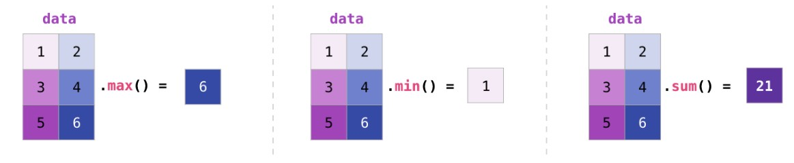</div>

Not only can we aggregate all the values in a matrix, but we can also aggregate across the rows or columns by using the `axis` parameter:

<div align="center">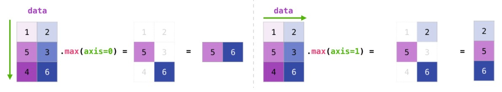</div>

```python
print("1:------------\n",np.sum(B))

print("2:------------\n",np.sum(B,axis=0))

print("3:------------\n",np.sum(B,axis=1))


print("4:------------\n",np.sqrt(B))

print("5:------------\n",np.mean(B))

print("6:------------\n",np.mean(B,axis=0))
```

    1:------------
     111111
    2:------------
     [ 10101 101010]
    3:------------
     [    11   1100 110000]
    4:------------
     [[  1.           3.16227766]
     [ 10.          31.6227766 ]
     [100.         316.22776602]]
    5:------------
     18518.5
    6:------------
     [ 3367. 33670.]

### Logical Operations

```python
np.all([True, True, False])


```

    False

```python
np.any([True, False, False])


```

    True

```python
#Note: can be used for array comparisions

a = np.zeros((50, 50))

np.any(a != 0)


```

    False

```python
np.all(a == a)


```

    True

```python
a = np.array([1, 2, 3, 2])

b = np.array([2, 2, 3, 2])

c = np.array([6, 4, 4, 5])

((a <= b) & (b <= c)).all()


```

    True

### Statistics

```python
x = np.array([1, 2, 3, 1])

y = np.array([[1, 2, 3], [5, 6, 1]])

x.mean()


```

    1.75

```python
np.median(x)


```

    1.5

```python
np.median(y, axis=-1)  # last axis


```

    array([2., 5.])

```python
x.std()          # full population standard dev.


```

    0.82915619758885

## Broadcasting

Broadcasting is a process performed by NumPy that allows mathematical operations to work with objects that don't necessarily have compatible dimensions.

- First rule of Numpy: 2 Array can perform operaiton only when they have same shapes

- `Broadcasting` let two Arrays of different shapes to do some operaitons.

  - The `small` Array will repeat itself, and convert to the same shape as of another array.

<div align="center"></div>

<div align="center">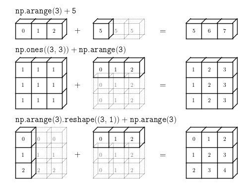</div>

<div align="center"></div>

```python
A = np.array([[1,2,1],[2,3,1],[3,4,1]])

a = np.array([[1,2,3]])
```

```python
A + 4
```

    array([[5, 6, 5],
           [6, 7, 5],
           [7, 8, 5]])

```python
A + a
```

    array([[2, 4, 4],
           [3, 5, 4],
           [4, 6, 4]])

```python
a.T
```

    array([[1],
           [2],
           [3]])

```python
A + a.T
```

    array([[2, 3, 2],
           [4, 5, 3],
           [6, 7, 4]])

## Shape Manipulation - Transposing, Reshaping, Stacking etc

```python
A = np.array([[1,2,3],[4,5,6]])
```

    array([[1, 2, 3],
           [4, 5, 6]])

### flatten()

```python
A.flatten()
```

    array([1, 2, 3, 4, 5, 6])

### reshape()

```python
print(A.reshape(2,3))

print()

print(A.reshape(3,2))
```

    [[1 2 3]
     [4 5 6]]
    
    [[1 2]
     [3 4]
     [5 6]]

<div align="center">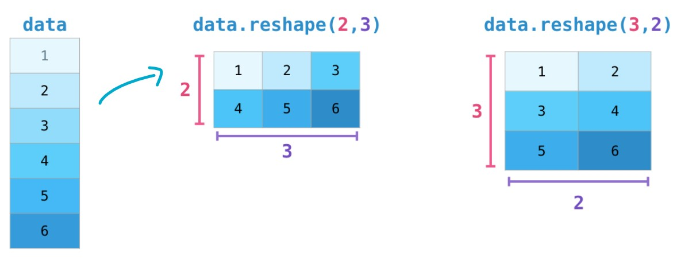</div>

### Transpose

A common need when dealing with matrices is the need to **rotate** them. This is often the case when we need to take the dot product of two matrices and need to align the dimension they share. NumPy arrays have a convenient property called T to get the `transpose` of a matrix:

<div align="center">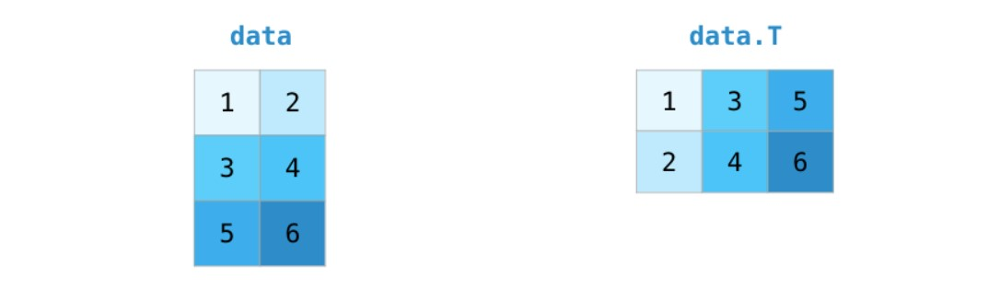</div>

```python
print(A.flatten())

X = A.reshape(2,3)

Y = A.reshape(3,2)

print()

print("X:---------------\n",X)

print()

print("Y:---------------\n",Y)

print()

print("X.T=Y:-----------\n",X.T)

print()

print("Y.T=X:-----------\n",Y.T)
```

    [1 2 3 4 5 6]
    
    X:---------------
     [[1 2 3]
     [4 5 6]]
    
    Y:---------------
     [[1 2]
     [3 4]
     [5 6]]
    
    X.T=Y:-----------
     [[1 4]
     [2 5]
     [3 6]]
    
    Y.T=X:-----------
     [[1 3 5]
     [2 4 6]]

### Adding a Dimension

Indexing with the np.newaxis object allows us to add an axis to an array

`newaxis` is used to increase the dimension of the existing array by one more dimension, when used once. Thus,

1D array will become 2D array

2D array will become 3D array

3D array will become 4D array and so on

```python
z = np.array([1, 2, 3])

z


```

    array([1, 2, 3])

```python
z[:, np.newaxis]


```

    array([[1],
           [2],
           [3]])

### Stacking of Array

<div align="center">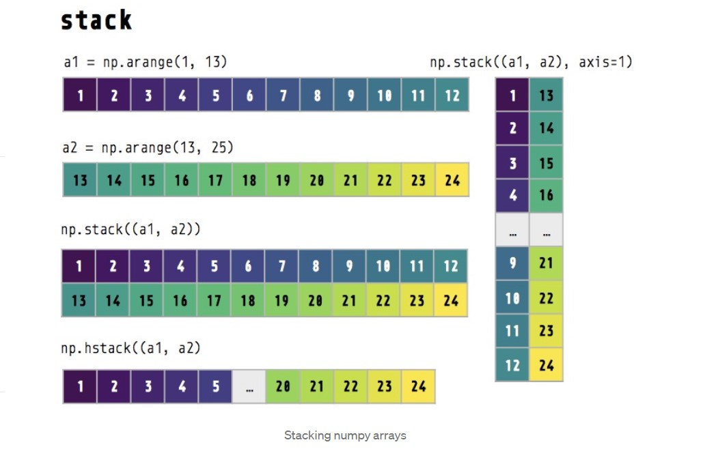</div>

```python
a = np.arange(0,5)

b = np.arange(5,10)

print('Array 1 :','\n',a)

print('Array 2 :','\n',b)

print('Vertical stacking :','\n',np.vstack((a,b)))

print('Horizontal stacking :','\n',np.hstack((a,b)))
```

    Array 1 : 
     [0 1 2 3 4]
    Array 2 : 
     [5 6 7 8 9]
    Vertical stacking : 
     [[0 1 2 3 4]
     [5 6 7 8 9]]
    Horizontal stacking : 
     [0 1 2 3 4 5 6 7 8 9]

## Vectorization

- performing operation directly on Arrays

Vectorization is the process of modifying code to utilize array operation methods. Array operations can be computed internally by NumPy using a lower-level language, which leads to many benefits:

- Vectorized code tends to execute much faster than equivalent code that uses loops (such as for-loops and while-loops). Usually a lot faster. Therefore, vectorization can be very important for machine learning, where we often work with large datasets

- Vectorized code can often be more compact. Having fewer lines of code to write can potentially speed-up the code-writing process, make code more readable, and reduce the risk of errors

```python
# find the distance between any two points (x1, y1) and (x2, y2)

p1 = np.array([1,2,3,4])  # [x1,x2,x3.....,xn]

p2 = np.array([5,5,3,4])  # [y1,y2,x3.....,xn]
```

```python
s=0

for i in range(3):

    s += (p2[i] - p1[i])**2


print(s**0.5)
```

    5.0

```python
# efficient

def point_distance(p1,p2):

    return np.sqrt(np.sum((p2-p1)**2))


print(point_distance(p1,p2))
```

    5.0

### Machine Learning context

Let's imagine a machine learning problem where we use a linear regression algorithm to model the cost of electricity.

Let's denote our model features as `x1,x2...xn`. Features could represent things like **the amount of available wind energy**, **the current gas price**, and **the current load on the grid**.

After we train the algorithm, we obtain model parameters, `θ0,θ1,θ2...θn`. These model parameters constitute the _weights_ that should be used for each feature.

For instance, `x2` might represent the price of gas. The model might find that gas prices are particularly decisive in determining the price of electricity. The corresponding weight of `θ2` would then be expected to be much larger in magnitude than other weights for less important features. The result (hypothesis/prediction) returned by our linear regression model for a given set of x is a linear expression:

`h=θo+x1.θ1+x2.θ2+...+xn.θn`

Furthermore, let's assume we have a set of `m` test examples. In other words, we have `m` sets of `x` for which we would like to obtain the model's prediction. The linear expression, `h`, is to be calculated for each of the test examples. There will be a total of `m` individual hypothesis outputs.

First, define a `10x4` array (x) in which each row is a training set. Here, m=10 and n=4:

```python
x = np.arange(1,41).reshape(10,4) 

# x is now a range of 40 numbers reshaped to be 10 rows by 4 columns.

print('x:\n', x)
```

    x:
     [[ 1  2  3  4]
     [ 5  6  7  8]
     [ 9 10 11 12]
     [13 14 15 16]
     [17 18 19 20]
     [21 22 23 24]
     [25 26 27 28]
     [29 30 31 32]
     [33 34 35 36]
     [37 38 39 40]]

Now, add a column of ones to represent `x0`, known in machine learning as the `bias` term. `x` is now a `10x5` array:

```python
# print(np.full((4,1),1)) # uncomment before run

ones = np.full((10,1),1)

x = np.hstack((ones,x))

print('x:\n', x)

# Using np.full, we created a 10x1 array full of ones then horizontally stacked it (np.hstack) to the front of x.

print('shape : \n', x.shape)

print('x.shape[0] : \n', x.shape[0])

print('x.shape[1] : \n', x.shape[1])
```

    [[1]
     [1]
     [1]
     [1]]
    x:
     [[ 1  1  2  3  4]
     [ 1  5  6  7  8]
     [ 1  9 10 11 12]
     [ 1 13 14 15 16]
     [ 1 17 18 19 20]
     [ 1 21 22 23 24]
     [ 1 25 26 27 28]
     [ 1 29 30 31 32]
     [ 1 33 34 35 36]
     [ 1 37 38 39 40]]
    shape : 
     (10, 5)
    x.shape[0] : 
     10
    x.shape[1] : 
     5

Now let's initialize our model parameters as a `5x1` array

```python
theta = np.arange(1,6).reshape(5,1)

print('theta:\n', theta)
```

    theta:
     [[1]
     [2]
     [3]
     [4]
     [5]]

Armed with our matrix `x` and vector `θ`, we'll proceed to define vectorized and non-vectorized versions of evaluating the linear expressions to compare the computation time.

```python
#Non-vectorized version
def non_vectorized_output(x, theta):
    h = []
    for i in range(x.shape[0]): # range(10) row
        total = 0
        for j in range(x.shape[1]): # range(5) column
            total = total + x[i, j] * theta[j, 0]  
            # ∑Xeach_row_all_colum_el.θeach_row`~~`h=θo+x1.θ1+x2.θ2+...+xn.θn` 
        h.append(total)
    return h
    
#Vectorized version
def vectorized_output(x, theta):
    h = np.matmul(x, theta) # NumPy's matrix multiplication function
    return h
```

```python
print(vectorized_output(x,theta))
```

    [[ 41]
     [ 97]
     [153]
     [209]
     [265]
     [321]
     [377]
     [433]
     [489]
     [545]]

<div align="center">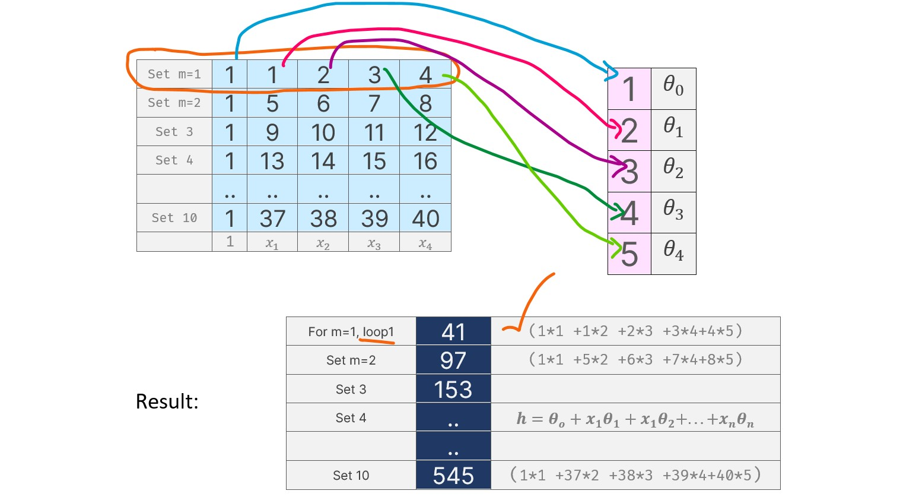</div>

```python
nv_time = %timeit -o non_vectorized_output(x, theta)
```

    80.5 µs ± 11 µs per loop (mean ± std. dev. of 7 runs, 10000 loops each)

```python
v_time = %timeit -o vectorized_output(x, theta)
```

    4.62 µs ± 280 ns per loop (mean ± std. dev. of 7 runs, 100000 loops each)

```python
print('Non-vectorized version:', f'{1E6 * nv_time.average:0.2f}', 'microseconds per execution, average')

print('Vectorized version:', f'{1E6 * v_time.average:0.2f}', 'microseconds per execution, average')

print('Computation was', "%.0f" % (nv_time.average / v_time.average), 'times faster using vectorization')
```

    Non-vectorized version: 80.53 microseconds per execution, average
    Vectorized version: 4.62 microseconds per execution, average
    Computation was 17 times faster using vectorization

Note that in both examples, NumPy's vectorized calculations significantly outperformed native Python calculations using loops. The improved performance is substantial.

However, vectorization does have potential disadvantages. Vectorized code can be less intuitive to those who do not know how to read it. It can also be more memory intensive.
