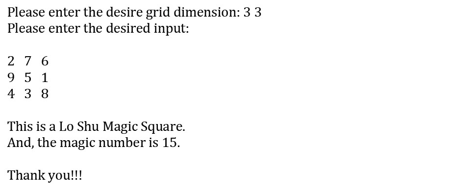

# LIST


- [LIST](#list)
  - [🚀🚀Creating List](#creating-list)
  - [🚀🚀Indexing/Slicing of List works same as String](#indexingslicing-of-list-works-same-as-string)
  - [🚀🚀Unpacking Operator](#unpacking-operator)
  - [🚀🚀Iteration](#iteration)
    - [`for item in list`](#for-item-in-list)
    - [`in range(start, end, step)`](#in-rangestart-end-step)
    - [using indexing](#using-indexing)
      - [`for i in range(len(list))`](#for-i-in-rangelenlist)
      - [`for i,value in enumerate(list)`](#for-ivalue-in-enumeratelist)
  - [🚀🚀Common methods for list](#common-methods-for-list)
    - [add:`append,extend,insert,+`](#addappendextendinsert)
    - [remove: `pop,remove,del`](#remove-popremovedel)
    - [reverse](#reverse)
    - [finding elements: `in,index,count`](#finding-elements-inindexcount)
  - [🚀🚀List Comprehension](#list-comprehension)
    - [List comprehension using if statement](#list-comprehension-using-if-statement)
    - [Difference between Generator Expressions and List Comprehensions](#difference-between-generator-expressions-and-list-comprehensions)
  - [🚀🚀List Input](#list-input)
    - [Multiline Input](#multiline-input)
    - [Single Line Input](#single-line-input)
  - [🚀Queue and Stack using List](#queue-and-stack-using-list)
  - [🚀2D list](#2d-list)
    - [Creating 2D list](#creating-2d-list)
      - [Taking Input](#taking-input)
      - [Multiline Input](#multiline-input-1)
      - [Single Line Input](#single-line-input-1)
    - [Accessing 2D list](#accessing-2d-list)
    - [Iterating 2D list](#iterating-2d-list)
    - [Operations on 2D list](#operations-on-2d-list)
  - [🚀Sorting](#sorting)
      - [Using lembda:](#using-lembda)
  - [🚀Utility Functions](#utility-functions)
    - [🚀🚀Map Function](#map-function)
    - [🚀🚀Filter Function](#filter-function)
    - [Replacing Map and Filter function with list comprehension](#replacing-map-and-filter-function-with-list-comprehension)
    - [Zip Function](#zip-function)
  - [🚀🚀Utils](#utils)
    - [find elements in one list that are `not in` the other : `subtraction`](#find-elements-in-one-list-that-are-not-in-the-other--subtraction)
    - [find elements in one list that are `in` the other : `intersection`](#find-elements-in-one-list-that-are-in-the-other--intersection)
    - [check if a list contains any item from another list python](#check-if-a-list-contains-any-item-from-another-list-python)
    - [check if an item is a subset of another list](#check-if-an-item-is-a-subset-of-another-list)
  - [Examples](#examples)
    - [ex1](#ex1)
    - [Ex2](#ex2)
    - [List to String vice-versa](#list-to-string-vice-versa)
    - [ex 3](#ex-3)
    - [ex4 - Rotation of a List](#ex4---rotation-of-a-list)
    - [EX: 🌟Lo Shu Magic Square](#ex-lo-shu-magic-square)
    - [ex: 🌟 Breath First Search (CLRS) 🌟](#ex--breath-first-search-clrs-)

```python
"""
cd .\Py\03list\
jupyter nbconvert --to markdown py_list.ipynb --output README.md
"""
```

## 🚀🚀Creating List


```python
print(list(range(10)))
print([i**2 for i in range(20) if i % 2 == 0])
print([0] * 10)
```

    [0, 1, 2, 3, 4, 5, 6, 7, 8, 9]
    [0, 4, 16, 36, 64, 100, 144, 196, 256, 324]
    [0, 0, 0, 0, 0, 0, 0, 0, 0, 0]


```python
print([[None]*2]*2)
# List having multiple ref
l = [1, 2, 3, 4]
ref = l.copy()
ref.append(6)

print(l)
print(ref)
```

    [[None, None], [None, None]]
    [1, 2, 3, 4]
    [1, 2, 3, 4, 6]


## 🚀🚀Indexing/Slicing of List works same as String


```python
l = [1,2,3,4,5,6]

print(l[0])
print(l[-1])
print(l[1:-1])
print(l[::2])
# because of mutable property
l[0] = 5
print(l)
```

    1
    6
    [2, 3, 4, 5]
    [1, 3, 5]
    [5, 2, 3, 4, 5, 6]


## 🚀🚀Unpacking Operator


```python
# rest equivalent
n = list(range(5))
first,second,*other =n

print(first)
print(second)
print(other)

print()
first,*other,last =n

print(first)
print(last)
print(other)

print()
n = [*range(5),*"Hello"]
print(n)
```

    0
    1
    [2, 3, 4]

    0
    4
    [1, 2, 3]

    [0, 1, 2, 3, 4, 'H', 'e', 'l', 'l', 'o']


## 🚀🚀Iteration

### `for item in list`


```python
for i in "abc":
	print(i,end=" ")

```

    a b c


```python
programming_lan = ["Java", "C", "C++", "Kotlin", "TypeScript"]

# List Membership Test
v = "C" in programming_lan
print(v)
print()

# looping
for l in programming_lan:
    print(l)

print()

```

    True

    Java
    C
    C++
    Kotlin
    TypeScript


### `in range(start, end, step)`


```python
print(range(10))

print(list(range(10)))

print(list(range(2, 8)))

print(list(range(2, 20, 3)))

```

    range(0, 10)
    [0, 1, 2, 3, 4, 5, 6, 7, 8, 9]
    [2, 3, 4, 5, 6, 7]
    [2, 5, 8, 11, 14, 17]


```python
for i in range(5):
	print(i,end=" ")
```

    0 1 2 3 4

### using indexing

Above code doesn't give index of the element. It gives the element itself. Below are the ways to get the index of the element.

#### `for i in range(len(list))`


```python
# !index
# Tricks
for i in range(len(programming_lan)):
    print(f"{i}: {programming_lan[i]}")

print()


```

    0: Java
    1: C
    2: C++
    3: Kotlin
    4: TypeScript


#### `for i,value in enumerate(list)`


```python

# looping with enumerate()
for lan in enumerate(programming_lan):
    print(lan)

print()
# also returns each item with its index postion.
for i, v in enumerate(programming_lan):
    print(f"{i}: {v}")

print()

```

    (0, 'Java')
    (1, 'C')
    (2, 'C++')
    (3, 'Kotlin')
    (4, 'TypeScript')

    0: Java
    1: C
    2: C++
    3: Kotlin
    4: TypeScript


## 🚀🚀Common methods for list

### add:`append,extend,insert,+`


```python
# add the given element at the end of the list
l.append(33)
print(l)
# insert 10 at index 1
l.insert(1,10)
print(l)

odd = [2, 4, 6, 8]
# change 2nd to 4th items
odd[1:4] = [3, 5, 7]
print(odd)

# Concatenating and repeating lists
print(odd + [9, 7, 5])
print(["re"] * 3)

```

    ['', 10, 'A', '', 'B', '', 'C', 33, 33]
    ['', 10, 10, 'A', '', 'B', '', 'C', 33, 33]
    [2, 3, 5, 7]
    [2, 3, 5, 7, 9, 7, 5]
    ['re', 're', 're']


Append vs Extend:


```python
l1 = [1,2,3]
l2 = [4,5,6]
l1.append(l2)
l1
```


    [1, 2, 3, [4, 5, 6]]


```python
l1 = [1, 2, 3]
l2 = [4, 5, 6]
l1.extend(l2)
l1
```


    [1, 2, 3, 4, 5, 6]


### remove: `pop,remove,del`


```python
# pop():
# delete the last element
# can also delete from specified index
l.pop()
print(l)
l.pop(1)
print(l)

# remove()
l.remove(5)
print(l)

del l[0:3]
print(l)

l.clear()
print(l)
```

    [5, 10, 2, 3, 4, 5, 6]
    [5, 2, 3, 4, 5, 6]
    [2, 3, 4, 5, 6]
    [5, 6]
    []


### reverse


```python
l.reverse()
print(l)
```

    [6, 5, 4, 3, 2]


### finding elements: `in,index,count`


```python
letters = ["a","b","c"]
print(letters.count("d"))

if "b" in letters:
    print(letters.index("b"))
```

    0
    1


## 🚀🚀List Comprehension

`[expression for item in list if condition == True]`


```python
l = [1,2,3,4,5]
```


```python
# l = [x for x in [1,2,3]]  # [x loop(x,l)] -> SELECT x FROM l
l = [x for x in l]
l
```


    [1, 2, 3]


```python
l = [(x + 100) for x in l]  # [x_ loop(x,l)] ; x_ = modified x
l

```


    [102, 103, 104, 105, 106]


### List comprehension using if statement


```python
l =[1,2,3,4,5,6,7,8]
# filtering even elements
filtered = [i for i in l if i % 2==0] # [x loop(x,l) condition(x)] -> SELECT x FROM l WHERE condition
print(filtered)

filtered = [i**2 for i in l if i % 2 == 0] # [x_ loop(x,l) condition(x)]
print(filtered)
# new_l=[]
# for i in l:
# 	if(i%2==0):
# 		new_l.append(i**2)
```

    [2, 4, 6, 8]
    [4, 16, 36, 64]


```python
# removing empty string from the list
l = ["", "A", "", "B", "", "C"]
removed = [i for i in l if i]
print(removed)
```

    ['A', 'B', 'C']


If-Else:


```python
# VS->
# else block in this case is must
filtered = [i**2 if i % 2 == 0 else i**3 for i in l]
print(filtered)
# new_l=[]
# for i in l:
# 	if(i%2==0):
# 		new_l.append(i**2)
# 	else:
# 		new_l.append(i**3)

```

    [1, 4, 27, 16, 125, 36, 343, 64]


```python
fruits = ["mango" if i%3==0 else "orange" for i in range(6)]
print(fruits)
```

    ['mango', 'orange', 'orange', 'mango', 'orange', 'orange']


Python list comprehension using nested if statement


```python
num = [i for i in range(50) if i % 2 == 0 if i % 3 == 0 if i % 3 == 0]
print(num)

```

    [0, 6, 12, 18, 24, 30, 36, 42, 48]


### Difference between Generator Expressions and List Comprehensions

**What are Generator Expressions?**

Generator Expressions are somewhat similar to list comprehensions, but the former doesn’t construct list object. Instead of creating a list and keeping the whole sequence in the memory, the generator generates the next element in demand.
When a normal function with a return statement is called, it **terminates** whenever it gets a return statement. But a function with a yield statement **saves the state of the function and can be picked up from the same state, next time the function is called.**

The Generator Expression allows us to create a generator _without the yield keyword._without


## 🚀🚀List Input

### Multiline Input


```python
# creating an empty list
lst = []

# number of elements as input
n = int(input("Enter number of elements : "))

# iterating till the range
for i in range(0, n):
    ele = int(input(f"element - {i+1} : "))

    lst.append(ele)  # adding the element

print(lst)

```

    [1, 2, 3]


```bash
>> Enter number of elements : 3
>> element - 1 : 1
>> element - 2 : 2
>> element - 3 : 3
>> [1, 2, 3]
```

### Single Line Input


```python
lists = input("Enter Space separated list : ")
# converting the input string to list
lists = lists.split()
lists = [int(i) for i in lists]
lists
```


    [1, 2, 4, 5]


```py
>> Enter Space Separated Numbers : 1 2 3
>> [1, 2, 3]
```


```python
lists = [int(i) for i in input("Enter Space separated list : ").split()]
lists
```


    [1, 2, 4, 55]


```python
# List Comprehension
list_comprehension = [i for i in range(11) if i % 2 == 0]

print(list_comprehension)

# Generator Expression
generator_expression = (i for i in range(11) if i % 2 == 0)
print(generator_expression)
for i in generator_expression:
    print(i, end=" ")
```

    [0, 2, 4, 6, 8, 10]
    <generator object <genexpr> at 0x00000242AFC14C80>
    0 2 4 6 8 10

**So what’s the difference between Generator Expressions and List Comprehensions?**

The generator yields one item at a time and generates item only when in demand. Whereas, in a list comprehension, Python reserves memory for the whole list. Thus we can say that the generator expressions are memory efficient than the lists. Generator expressions are also faster than list comprehension and hence time efficient.


```python
# import getsizeof from sys module
from sys import getsizeof

comp = [i for i in range(10000)]
gen = (i for i in range(10000))

#gives size for list comprehension
x = getsizeof(comp)
print("x = ", x)

#gives size for generator expression
y = getsizeof(gen)
print("y = ", y)
```

    x =  87616
    y =  112


## 🚀Queue and Stack using List


```python
# queue using list
q = [1,2,3]
q.append(4)
print(q)
q.pop(0)
print(q)
```

    [1, 2, 3, 4]
    [2, 3, 4]


```python
# stack using list
s = [1,2,3]
s.append(4)
print(s)
s.pop()
print(s)
```

    [1, 2, 3, 4]
    [1, 2, 3]


## 🚀2D list

### Creating 2D list


```python
list_2d = [ [1,2,3],
			[4,5,6],
			[7,8,9]]
print(list_2d)

print([[0]*2]*2)


```

    [[1, 2, 3], [4, 5, 6], [7, 8, 9]]
    [[0, 0], [0, 0]]


```python
GRID_SIZE =3
GRID = [[0 for x in range(GRID_SIZE)] for y in range(GRID_SIZE)]
GRID
```


    [[0, 0, 0], [0, 0, 0], [0, 0, 0]]


#### Taking Input

#### Multiline Input


```python

LINE = int(input("Enter the number of rows:"))
EL = int(input("Enter the number of columns:"))

matrix = []
print("Enter the entries rowwise:")

# For user input
for i in range(LINE):		 # A for loop for row entries
	a = []
	for j in range(EL):	 # A for loop for column entries
		a.append(int(input()))
	matrix.append(a)

matrix
```

    Enter the entries rowwise:


    [[1, 1, 1], [1, 1, 1], [1, 1, 1]]


```
Enter the number of rows:2
Enter the number of columns:3
Enter the entries rowwise:
1
2
3
4
5
6

1 2 3
4 5 6
```


```python
# one-liner logic to take input for rows and columns
LINE = 2
EL = 3
mat = [[int(input()) for x in range (EL)] for line in range(LINE)]
mat
```


    [[1, 1, 1], [1, 1, 1]]


#### Single Line Input

Prerequisite: [Single Line Input](#single-line-input)


```python
GRID_SIZE = 3
GRID = [[int(x) for x in input().split()] for line in range(GRID_SIZE)]
# for each line , take space separated input and store it in a list
GRID
```


    [[1, 2, 3], [4, 5, 6], [7, 8, 9]]


```bash
>> 1 2 3
>> 4 5 6
>> 7 8 9
>> [[1, 2, 3], [4, 5, 6], [7, 8, 9]]
```

### Accessing 2D list


```python
print(list_2d[1])
print(list_2d[1][0])
```

    [[1, 2, 3], [4, 5, 6], [7, 8, 9]]
    [4, 5, 6]
    4


### Iterating 2D list


```python
for i,line in enumerate(list_2d):
	for j,value in enumerate(line):
		print(f"{i},{j}: {value}")
```

    0,0: 1
    0,1: 2
    0,2: 3
    1,0: 4
    1,1: 5
    1,2: 6
    2,0: 7
    2,1: 8
    2,2: 9


### Operations on 2D list


```python
A = [[1, 2],
     [3, 4]]

B = [[2, 3],
     [1, 1]]

C = [[None, None], [None, None]]
for i in range(2):
	for j in range(2):
		C[i][j] = A[i][j] + B[i][j]

print(C)
print(C[1][1])

```

    [[3, 5], [4, 5]]
    5


## 🚀Sorting


```python
l=[1,2,3,4,5]

l.sort(reverse=True)
print(l)
l.sort()
print(l)

# sorted() returns new list
sorted_list =sorted(l,reverse=True)
print(sorted_list)

# Case-Insensitive Sorting
l=['a','B','e','D','c']
l.sort()
print(l)
l.sort(key=str.casefold)
print(l)

```

    [5, 4, 3, 2, 1]
    [1, 2, 3, 4, 5]
    [5, 4, 3, 2, 1]
    ['B', 'D', 'a', 'c', 'e']
    ['a', 'B', 'c', 'D', 'e']


```python
items = [
    ("product 1",10),
    ("product 2",5),
    ("product 4",45),
    ("product 5",23),
]

def sorted_item(i):
    return i[1] #return price

items.sort(key=sorted_item)
print(items)
```

    [('product 2', 5), ('product 1', 10), ('product 5', 23), ('product 4', 45)]


#### Using lembda:

syntax:

`lembda parameters:expression`


```python
items = [
    ("product 1",10),
    ("product 2",5),
    ("product 4",45),
    ("product 5",23),
]
# def sorted_item(i):
#     return i[1]
items.sort(key=lambda i:i[1])
print(items)
```

    [('product 2', 5), ('product 1', 10), ('product 5', 23), ('product 4', 45)]


## 🚀Utility Functions

### 🚀🚀Map Function


```python
items = [
    ("product 1",10),
    ("product 2",5),
    ("product 4",45),
    ("proeduct 5",23),
]
# extracting price from list of tuples
prices = []
for item in items:
    prices.append(item[1])

print(prices)
print()
# using map
prices_mapped = map(lambda item:item[1],items)
print(type(prices_mapped))
prices = list(prices_mapped)
print(prices)
```

    [10, 5, 45, 23]

    <class 'map'>
    [10, 5, 45, 23]


### 🚀🚀Filter Function


```python
filtered = list(filter(lambda item:item[1]>=10,items ))
print(filtered)
```

    [('product 1', 10), ('product 4', 45), ('proeduct 5', 23)]


### Replacing Map and Filter function with list comprehension


```python
items = [
    ("product 1",10),
    ("product 2",5),
    ("product 4",45),
    ("proeduct 5",23),
]

# prices = list(map(lambda item:item[1],items))
prices = [item[1] for item in items]
# filtered = list(filter(lambda item:item[1]>=10,items ))
filtered = [item for item in items if item[1] >= 10]


print(prices)
print(filtered)
```

    [10, 5, 45, 23]
    [('product 1', 10), ('product 4', 45), ('proeduct 5', 23)]


### Zip Function


```python
l1 = [1,2,3]
l2= [10,20,30]

print(list(zip(l1,l2)))
print(list(zip("abc",l1,l2)))
```

    [(1, 10), (2, 20), (3, 30)]
    [('a', 1, 10), ('b', 2, 20), ('c', 3, 30)]


## 🚀🚀Utils

### find elements in one list that are `not in` the other : `subtraction`

- [https://stackoverflow.com/questions/41125909/python-find-elements-in-one-list-that-are-not-in-the-other](https://stackoverflow.com/questions/41125909/python-find-elements-in-one-list-that-are-not-in-the-other)


```python
base_list = [0, 1, 2, 3, 4, 5, 6, 7, 8]
checking_list = [1, 3, 5]
```

Native: `O(n^2)` solution:


```python
elements_not_in_checking_list = []
for elem in base_list:
	if elem not in checking_list:
		elements_not_in_checking_list.append(elem)
elements_not_in_checking_list
```


    [0, 2, 4, 6, 7, 8]


```python
[x for x in base_list if x not in checking_list]
```


    [0, 2, 4, 6, 7, 8]


Like mentioned in the comments below, with large lists, the above is not the ideal solution. When that's the case, a better option would be converting `checking_list` to a `set` first:


```python
checking_set = set(checking_list)  # this reduces the lookup time from O(n) to O(1)
[item for item in base_list if item not in checking_set]

```


    [0, 2, 4, 6, 7, 8]


Native: `O(n)` two pointer solution:


```python
j = 0
i = 0
elements_not_in_checking_list = []
while i < len(base_list):
    if j < len(checking_list) and base_list[i] == checking_list[j]:
        i += 1
        j += 1
    else:
        elements_not_in_checking_list.append(base_list[i])
        i += 1
elements_not_in_checking_list

```


    [0, 2, 4, 6, 7, 8]


🧠🧠🧠Shortcut: using `set`🧠🧠🧠


```python
list(set(base_list) - set(checking_list))

```


    [0, 2, 4, 6, 7, 8]


```python
[b for a, b in zip(base_list, checking_list) if a != b]

```


    [1, 3, 5]


Shortcut: using `np.setdiff1d


```python
import numpy as np
main_list = np.setdiff1d(base_list, checking_list)
main_list
```


    array([0, 2, 4, 6, 7, 8])


### find elements in one list that are `in` the other : `intersection`


```python
base_list = [0, 1, 2, 3, 4, 5, 6, 7, 8]
checking_list = [1, 3, 10, 12, 5]

```


```python
checking_set = set(checking_list)  # this reduces the lookup time from O(n) to O(1)
[item for item in base_list if item in checking_set]
```


    [1, 3, 5]


```python
list(set(base_list) & set(checking_list))

```


    [1, 3, 5]


### check if a list contains any item from another list python


```python
base_list = [0, 1, 2, 3, 4, 5, 6, 7, 8]
checking_list = [1, 3, 10, 12, 5]

```


```python
check = any(item in base_list for item in checking_list)
print(check)

```

    True


```python
check = all(item in base_list for item in checking_list)
print(check) #checking_list = [1, 3, 10, 12, 5]


```

    False


```python
set_A = set(base_list)
set_B = set(checking_list)
output = False if (set_A.intersection(set_B) == set()) else True
print(output)

```

    True


### check if an item is a subset of another list


```python
L = [[2, 4, 6, 8, 10], [1, 3, 5, 7, 9], [4, 8, 12, 16, 20]]
search_item = 16
if search_item in (item for sublist in L for item in sublist):
   print("Element is Present")
else:
   print("Element Not Present")

```

    Element is Present


```python
[item for sublist in L for item in sublist]

```


    [2, 4, 6, 8, 10, 1, 3, 5, 7, 9, 4, 8, 12, 16, 20]


## Examples

### ex1


`R` and `Python` have some libraries (like `numpy` and `pandas`) compare each element of the list to a number (i.e. do an 'element-wise' comparison) and give us a list of booleans like `[False, False, True, True]`.


```python
L=[1,2,3,4]
l = []
for num in L:
    if num > 2:
        l.append(True)
    else:
        l.append(False)

print(l)

l=[]
for ele in L:
    l.append(ele > 2)
print(l)

l = [ele > 2 for ele in L]
print(l)
```

    [False, False, True, True]
    [False, False, True, True]
    [False, False, True, True]


### Ex2


```python
op ="xx"
lan = []

while op !='0':
    if op in "12345":
        print(f"Adding {op}")
        if op == '1':
            lan.append("Java")
        elif op =='2':
            lan.append("C")
        elif op =='3':
            lan.append("C++")
        elif op =='4':
            lan.append("Kotlin")
        elif op =='5':
            lan.append("TypeScript")
    else:
        print("Please add options from the list below:")
        print("1:Java")
        print("2:C")
        print("3:C++")
        print("4:Kotlin")
        print("5:TypeScript")
        print()

    op = input()

print(f"Selected Language: {lan}")

```

    Please add options from the list below:
    1:Java
    2:C
    3:C++
    4:Kotlin
    5:TypeScript

    Adding 1
    Adding 1
    Adding 2
    Adding 3
    Selected Language: ['Java', 'Java', 'C', 'C++']


### List to String vice-versa


```python
digits=["1","2","3","4","5"]
s="".join(digits)
print(s)

datestr = '1956-01-31'
year, month, day = datestr.split('-')
s='/'.join([month, day, year])
print(s)
```

    12345
    01/31/1956


```python
zip_code="12345x"
digits = [digit for digit in zip_code if digit.isdigit()]
print(zip_code)
print()
print(digits)

```

    12345x

    ['1', '2', '3', '4', '5']


### ex 3

A researcher has gathered thousands of news articles. But she wants to focus her attention on articles including a specific word. Complete the function below to help her filter her list of articles.

Your function should meet the following criteria:

- Do not include documents where the keyword string shows up only as a part of a larger word. For example, if she were looking for the keyword “closed”, you would not include the string “enclosed.”
- She does not want you to distinguish upper case from lower case letters. So the phrase “Closed the case.” would be included when the keyword is “closed”
- Do not let periods or commas affect what is matched. “It is closed.” would be included when the keyword is “closed”. But you can assume there are no other types of punctuation.


```python
doc_list = ['The Learn Python Challenge Casino', 'They bought a car, and a horse',
            'Casinoville?', "He bought a casino. That's crazy."]
  # list to hold the indices of matching documents
keyword = "casino"
indeces=[]
keyword_to_indices = {}

# Iterate through the indices (i) and elements (doc) of documents
for i,doc in enumerate(doc_list):
	tokens = doc.split()
	print([token for token in tokens])
	normalized = [token.rstrip('.,?').lower() for token in tokens]
	print(normalized)
	print()
	if keyword.lower() in normalized:
		indeces.append(i)
		keyword_to_indices[keyword] = i

print("found at : "+str(indeces))
print(keyword_to_indices)

```

    ['The', 'Learn', 'Python', 'Challenge', 'Casino']
    ['the', 'learn', 'python', 'challenge', 'casino']

    ['They', 'bought', 'a', 'car,', 'and', 'a', 'horse']
    ['they', 'bought', 'a', 'car', 'and', 'a', 'horse']

    ['Casinoville?']
    ['casinoville']

    ['He', 'bought', 'a', 'casino.', "That's", 'crazy.']
    ['he', 'bought', 'a', 'casino', "that's", 'crazy']

    found at : [0, 3]
    {'casino': 3}


### ex4 - Rotation of a List


```python
lst = [3,5,2,7,8,9]
steps=4
n=len(lst)

key=lst[-1]

for i in range(n-1, 0, -1):  # range(start, stop[, step])
	lst[i] = lst[i-1]

lst[0]=key
print(lst)
```

    [9, 3, 5, 2, 7, 8]


### EX: 🌟Lo Shu Magic Square

The Lo Shu Magic Square is a grid with 3 rows and 3 columns.The Lo Shu Magic Square has the following properties:

1. The grid contains the numbers 1 through 9 exactly.
2. The sum of each row, each column, and each diagonal all add up to the same number.

<div align="center">

</div>

<div align="center">

</div>


```python
def findSum(n):
    return int(n * ((n**2) + 1) / 2)


def isSumOfEachRowMagic(grid, SUM):
	# print(SUM)
	for row in grid:
		s = sum(row)
		# print(s)
		if s != SUM:
			return False
	return True


def isSumOfEachColumnMagic(grid, SUM):
	for column_no in range(len(grid[0])):
		eachColumnSum = 0
		for eachRow in grid:
			eachColumnSum += eachRow[column_no]
		if eachColumnSum != SUM:
			return False
	return True


def isSumOfLeftToRightDiagonalMagic(grid, SUM):
	DiagonalSum = 0
	for row_no in range(len(grid[0])):
		DiagonalSum += grid[row_no][row_no]
	if DiagonalSum != SUM:
		return False
	return True


def isSumOfRightToLeftDiagonalMagic(grid, SUM):
	DiagonalSum = 0
	N = len(grid[0])
	for row_no in range(N):
		DiagonalSum += grid[row_no][N-row_no-1]
	if DiagonalSum != SUM:
		return False
	return True


def isMagicGrid(grid, SUM):
	return isSumOfEachRowMagic(grid, SUM) and isSumOfEachColumnMagic(grid, SUM) and isSumOfLeftToRightDiagonalMagic(grid, SUM) and isSumOfRightToLeftDiagonalMagic(grid, SUM)


def main():
    GRID_SIZE = [int(x) for x in input("Please enter the desire grid dimension:").split()]

    GRID = [[int(x) for x in input("Please enter the desired input:").split()] for y in range(GRID_SIZE[1])]

    print(GRID)
    SUM = findSum(GRID_SIZE[0])
    if isMagicGrid(GRID,SUM):
        print("This is a Lo Shu Magic Square.")
        print(f"And, the magic number is {SUM}")
    else:
        print("This is Not a Lo Shu Magic Square.")


main()

```

    [[2, 7, 6], [9, 5, 1], [4, 3, 8]]
    This is a Lo Shu Magic Square.
    And, the magic number is 15


### ex: 🌟 Breath First Search (CLRS) 🌟

<div align="center">

</div>

Algorithm:

<div align="center">

</div>


```python
nodes = ["v", "r", "s", "w", "t", "u", "x", "y"]
AdjMatrix = [
  #  v  r  s  w  t  u  x  y
    [0, 1, 0, 0, 0, 0, 0, 0], # v
	[1, 0, 1, 0, 0, 0, 0, 0], # r
    [0, 1, 0, 1, 0, 0, 0, 0], # s
    [0, 0, 1, 0, 1, 0, 1, 0], # w
    [0, 0, 0, 1, 0, 1, 1, 0], # t
    [0, 0, 0, 0, 1, 0, 1, 1], # u
    [0, 0, 0, 1, 1, 1, 0, 1], # x
 	[0, 0, 0, 0, 0, 1, 1, 0]  # y
]
for i, r in enumerate(AdjMatrix):
	print(f"{nodes[i]} ->", end="")
	for j, c in enumerate(r):
		if(c == 1):
			print(nodes[j], end="")
	print()

```

    v ->r
    r ->vs
    s ->rw
    w ->stx
    t ->wux
    u ->txy
    x ->wtuy
    y ->ux


```python
queue = []
visited = []
colour = [0] * 8
d = [0] * 8
p = [None] * 8
start = 2
colour[start] = 1
queue.append(start)
while queue:
	# print(f"Q: {queue}")
	current_node = queue.pop(0)
	# print(f"Currently Visiting: {nodes[current_node]}")
	visited.append(current_node)
	# print(AdjMatrix[current_node])
	for i, child_of_current in enumerate(AdjMatrix[current_node]):
		if child_of_current == 1:
			# print(f"{nodes[i]} ",end="")
			if colour[i] == 0:
				colour[i] = 1
				queue.append(i)
				d[i] = d[current_node] + 1
				p[i] = current_node

	colour[current_node] = 2

```


```python
def PrintTable():
	print()
	print("Nodes: ", end="")
	for i, node in enumerate(nodes):
		print(f"{node} ", end="")
	print()
	print("Color: ", end="")
	for c in colour:
		if c == 0:
			print(f"W ", end="")
		elif c == 1:
			print(f"G ", end="")
		else:
			print(f"B ", end="")
	print()
	print("Dist.: ", end="")
	for i in d:
		print(f"{i} ", end="")
	print()
	print("Prev.: ", end="")
	for i, node in enumerate(nodes):
		if p[i] is not None:
			print(f"{nodes[p[i]]} ", end="")
		else:
			print("- ", end="")
	print()

PrintTable()
```


    Nodes: v r s w t u x y
    Color: B B B B B B B B
    Dist.: 2 1 0 1 2 3 2 3
    Prev.: r s - s w t w x


<div align="center">

</div>

Printing Step By Step:


```python
queue = []
visited = []
colour = [0] * 8
d = [0] * 8
p = [None] * 8
start = 2
colour[start] = 1
queue.append(start)
while queue:
	current_node = queue.pop(0)
	visited.append(current_node)
	for i, child_of_current in enumerate(AdjMatrix[current_node]):
		if child_of_current == 1:
			if colour[i] == 0:
				colour[i] = 1
				queue.append(i)
				d[i] = d[current_node] + 1
				p[i] = current_node

	colour[current_node] = 2
	PrintTable()
```

With Weighted Cost:

<div align="center">

</div>


```python
nodes = ["A", "E", "H", "F", "C"]
AdjMatrix = [
  #  A  E  H  F  C
    [0, 1, 1, 0, 0], # A
	[0, 0, 1, 1, 0], # E
    [0, 0, 0, 1, 1], # H
    [0, 0, 0, 0, 1], # F
    [0, 0, 0, 0, 0]  # C
]
cost = [
  #  A  E  H  F  C
    [0, 5, 2, 0, 0],   # A
   	[0, 0, 8, 20, 0],  # E
    [0, 0, 0, 3, 5],   # H
    [0, 0, 0, 0, 1],   # F
    [0, 0, 0, 0, 0]    # C
]

for i, r in enumerate(AdjMatrix):
	print(f"{nodes[i]} ->", end="")
	for j, c in enumerate(r):
		if(c == 1):
			print(nodes[j], end="")
			print(f"({cost[i][j]}) ", end="")
	print()

```

    A ->E(5) H(2)
    E ->H(8) F(20)
    H ->F(3) C(5)
    F ->C(1)
    C ->


```python
queue = []
visited = []
colour = [0] * 5
d = [0] * 5
p = [None] * 5
start = 0
colour[start] = 1
queue.append(start)
while queue:
	current_node = queue.pop(0)
	visited.append(current_node)
	for i, child_of_current in enumerate(AdjMatrix[current_node]):
		if child_of_current == 1:
			if colour[i] == 0:
				colour[i] = 1
				queue.append(i)
				d[i] = d[current_node] + cost[current_node][i]
				p[i] = current_node

	colour[current_node] = 2
	PrintTable()
```


    Nodes: A E H F C
    Color: B B B B B
    Dist.: 0 5 2 25 7
    Prev.: - A A E H

