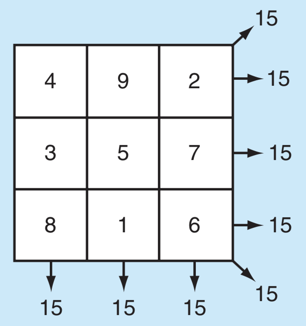
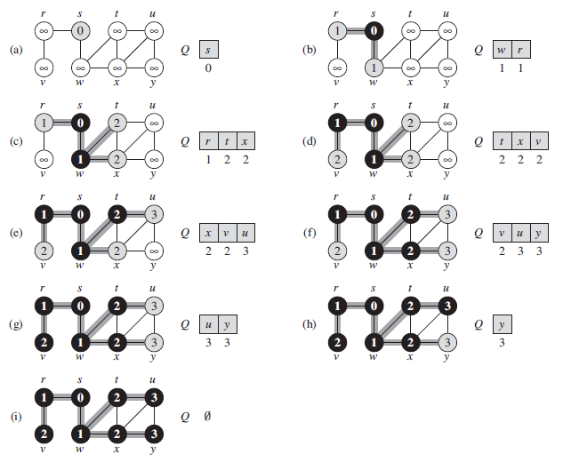
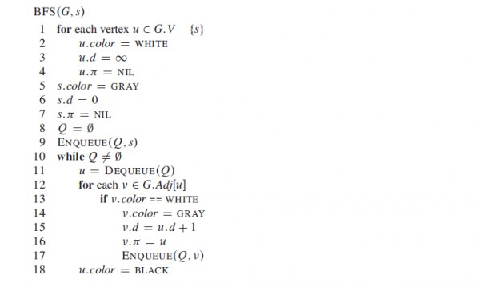
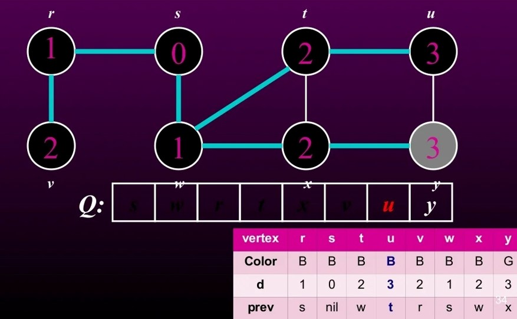
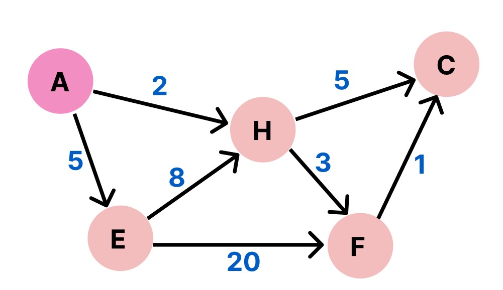

# LIST

- [LIST](#list)
  - [🌟Creating List🌟](#creating-list)
  - [Indexing/Slicing of List works same as String](#indexingslicing-of-list-works-same-as-string)
  - [🌟Unpacking Operator🌟](#unpacking-operator)
  - [🌟Iteration🌟](#iteration)
    - [`for item in list`](#for-item-in-list)
    - [`in range(start, end, step)`](#in-rangestart-end-step)
    - [using indexing](#using-indexing)
      - [`for i in range(len(list))`](#for-i-in-rangelenlist)
      - [`for i,value in enumerate(list)`](#for-ivalue-in-enumeratelist)
  - [Some methods for list](#some-methods-for-list)
    - [add](#add)
    - [remove](#remove)
    - [Finding Items](#finding-items)
  - [Queue and Stack using List](#queue-and-stack-using-list)
  - [2D list](#2d-list)
    - [Creating 2D list](#creating-2d-list)
      - [Taking Input](#taking-input)
    - [Accessing 2D list](#accessing-2d-list)
    - [Iterating 2D list](#iterating-2d-list)
    - [Operations on 2D list](#operations-on-2d-list)
  - [Sorting](#sorting)
      - [Using lembda:](#using-lembda)
  - [🌟Map Function🌟](#map-function)
  - [🌟Filter Function🌟](#filter-function)
  - [List Comprehension🌟🌟🌟](#list-comprehension)
    - [We can also add an if condition](#we-can-also-add-an-if-condition)
    - [Using with String](#using-with-string)
    - [Making Nested List Comprehension](#making-nested-list-comprehension)
    - [Replacing Map and Filter function with list comprehension](#replacing-map-and-filter-function-with-list-comprehension)
    - [Difference between Generator Expressions and List Comprehensions](#difference-between-generator-expressions-and-list-comprehensions)
  - [Zip Function](#zip-function)
  - [Examples](#examples)
    - [ex1](#ex1)
    - [Ex2](#ex2)
    - [List to String vice-versa](#list-to-string-vice-versa)
    - [ex 3](#ex-3)
    - [ex4 - Rotation of a List](#ex4---rotation-of-a-list)
    - [EX: 🌟Lo Shu Magic Square](#ex-lo-shu-magic-square)
    - [ex: 🌟 Breath First Search (CLRS) 🌟](#ex--breath-first-search-clrs-)

```python
"""
cd .\Py\03list\
jupyter nbconvert --to markdown py_list.ipynb --output README.md
"""
```

## 🌟Creating List🌟


```python
print(list(range(10)))
print([i**2 for i in range(20) if i % 2 == 0])
print([0] * 10)
```

    [0, 1, 2, 3, 4, 5, 6, 7, 8, 9]
    [0, 4, 16, 36, 64, 100, 144, 196, 256, 324]
    [0, 0, 0, 0, 0, 0, 0, 0, 0, 0]


```python
print([[None]*2]*2)
# List having multiple ref
l = [1, 2, 3, 4]
ref = l.copy()
ref.append(6)

print(l)
print(ref)
```

    [[None, None], [None, None]]
    [1, 2, 3, 4]
    [1, 2, 3, 4, 6]


## Indexing/Slicing of List works same as String


```python

l = [1,2,3,4,5,6]

print(l[0])
print(l[-1])
print(l[1:-1])
print(l[::2])
# because of mutable property
l[0] = 5
print(l)
```

    1
    6
    [2, 3, 4, 5]
    [1, 3, 5]
    [5, 2, 3, 4, 5, 6]


## 🌟Unpacking Operator🌟


```python
# rest equivalent
n = list(range(5))
first,second,*other =n

print(first)
print(second)
print(other)

print()
first,*other,last =n

print(first)
print(last)
print(other)

print()
n = [*range(5),*"Hello"]
print(n)
```

    0
    1
    [2, 3, 4]

    0
    4
    [1, 2, 3]

    [0, 1, 2, 3, 4, 'H', 'e', 'l', 'l', 'o']


## 🌟Iteration🌟

### `for item in list`


```python
for i in "abc":
	print(i,end=" ")

```

    a b c


```python
programming_lan = ["Java", "C", "C++", "Kotlin", "TypeScript"]

# List Membership Test
v = "C" in programming_lan
print(v)
print()

# looping
for l in programming_lan:
    print(l)

print()

```

    True

    Java
    C
    C++
    Kotlin
    TypeScript


### `in range(start, end, step)`


```python
print(range(10))

print(list(range(10)))

print(list(range(2, 8)))

print(list(range(2, 20, 3)))

```

    range(0, 10)
    [0, 1, 2, 3, 4, 5, 6, 7, 8, 9]
    [2, 3, 4, 5, 6, 7]
    [2, 5, 8, 11, 14, 17]


```python
for i in range(5):
	print(i,end=" ")
```

    0 1 2 3 4

### using indexing

Above code doesn't give index of the element. It gives the element itself. Below are the ways to get the index of the element.

#### `for i in range(len(list))`


```python
# !index
# Tricks
for i in range(len(programming_lan)):
    print(f"{i}: {programming_lan[i]}")

print()


```

    0: Java
    1: C
    2: C++
    3: Kotlin
    4: TypeScript


#### `for i,value in enumerate(list)`


```python

# looping with enumerate()
for lan in enumerate(programming_lan):
    print(lan)

print()
# also returns each item with its index postion.
for i, v in enumerate(programming_lan):
    print(f"{i}: {v}")

print()

```

    (0, 'Java')
    (1, 'C')
    (2, 'C++')
    (3, 'Kotlin')
    (4, 'TypeScript')

    0: Java
    1: C
    2: C++
    3: Kotlin
    4: TypeScript


## Some methods for list

### add


```python
# add the given element at the end of the list
l.append(33)
print(l)
# insert 10 at index 1
l.insert(1,10)
print(l)

odd = [2, 4, 6, 8]
# change 2nd to 4th items
odd[1:4] = [3, 5, 7]
print(odd)

# Concatenating and repeating lists
print(odd + [9, 7, 5])
print(["re"] * 3)

```

    ['', 10, 'A', '', 'B', '', 'C', 33, 33]
    ['', 10, 10, 'A', '', 'B', '', 'C', 33, 33]
    [2, 3, 5, 7]
    [2, 3, 5, 7, 9, 7, 5]
    ['re', 're', 're']


### remove


```python
# pop():
# delete the last element
# can also delete from specified index
l.pop()
print(l)
l.pop(1)
print(l)

# remove()
l.remove(5)
print(l)

del l[0:3]
print(l)

l.clear()
print(l)
```

    [5, 10, 2, 3, 4, 5, 6]
    [5, 2, 3, 4, 5, 6]
    [2, 3, 4, 5, 6]
    [5, 6]
    []


```python
# reverse
l.reverse()
print(l)
```

    [6, 5, 4, 3, 2]


### Finding Items


```python
letters = ["a","b","c"]
print(letters.count("d"))

if "b" in letters:
    print(letters.index("b"))
```

    0
    1


## Queue and Stack using List


```python
# queue using list
q = [1,2,3]
q.append(4)
print(q)
q.pop(0)
print(q)
```

    [1, 2, 3, 4]
    [2, 3, 4]


```python
# stack using list
s = [1,2,3]
s.append(4)
print(s)
s.pop()
print(s)
```

    [1, 2, 3, 4]
    [1, 2, 3]


## 2D list

### Creating 2D list


```python
list_2d = [ [1,2,3],
			[4,5,6],
			[7,8,9]]
print(list_2d)

print([[0]*2]*2)


```

    [[1, 2, 3], [4, 5, 6], [7, 8, 9]]
    [[0, 0], [0, 0]]


#### Taking Input


```python

R = int(input("Enter the number of rows:"))
C = int(input("Enter the number of columns:"))

matrix = []
print("Enter the entries rowwise:")

# For user input
for i in range(R):		 # A for loop for row entries
	a = []
	for j in range(C):	 # A for loop for column entries
		a.append(int(input()))
	matrix.append(a)
```

    Enter the entries rowwise:


```
Enter the number of rows:2
Enter the number of columns:3
Enter the entries rowwise:
1
2
3
4
5
6

1 2 3
4 5 6
```


```python
# one-liner logic to take input for rows and columns
R = 2
C = 2
mat = [[int(input()) for x in range (C)] for y in range(R)]
mat
```


    [[1, 2], [3, 4]]


### Accessing 2D list


```python
print(list_2d[1])
print(list_2d[1][0])
```

    [[1, 2, 3], [4, 5, 6], [7, 8, 9]]
    [4, 5, 6]
    4


### Iterating 2D list


```python
for i,line in enumerate(list_2d):
	for j,value in enumerate(line):
		print(f"{i},{j}: {value}")
```

    0,0: 1
    0,1: 2
    0,2: 3
    1,0: 4
    1,1: 5
    1,2: 6
    2,0: 7
    2,1: 8
    2,2: 9


### Operations on 2D list


```python
A = [[1, 2],
     [3, 4]]

B = [[2, 3],
     [1, 1]]

C = [[None, None], [None, None]]
for i in range(2):
	for j in range(2):
		C[i][j] = A[i][j] + B[i][j]

print(C)
print(C[1][1])

```

    [[3, 5], [4, 5]]
    5


## Sorting


```python
l=[1,2,3,4,5]

l.sort(reverse=True)
print(l)
l.sort()
print(l)

# sorted() returns new list
sorted_list =sorted(l,reverse=True)
print(sorted_list)

# Case-Insensitive Sorting
l=['a','B','e','D','c']
l.sort()
print(l)
l.sort(key=str.casefold)
print(l)

```

    [5, 4, 3, 2, 1]
    [1, 2, 3, 4, 5]
    [5, 4, 3, 2, 1]
    ['B', 'D', 'a', 'c', 'e']
    ['a', 'B', 'c', 'D', 'e']


```python
items = [
    ("product 1",10),
    ("product 2",5),
    ("product 4",45),
    ("product 5",23),
]

def sorted_item(i):
    return i[1] #return price

items.sort(key=sorted_item)
print(items)
```

    [('product 2', 5), ('product 1', 10), ('product 5', 23), ('product 4', 45)]


#### Using lembda:

syntax:

`lembda parameters:expression`


```python
items = [
    ("product 1",10),
    ("product 2",5),
    ("product 4",45),
    ("product 5",23),
]
# def sorted_item(i):
#     return i[1]
items.sort(key=lambda i:i[1])
print(items)
```

    [('product 2', 5), ('product 1', 10), ('product 5', 23), ('product 4', 45)]


## 🌟Map Function🌟


```python
items = [
    ("product 1",10),
    ("product 2",5),
    ("product 4",45),
    ("proeduct 5",23),
]
# extracting price from list of tuples
prices = []
for item in items:
    prices.append(item[1])

print(prices)
print()
# using map
prices_mapped = map(lambda item:item[1],items)
print(type(prices_mapped))
prices = list(prices_mapped)
print(prices)
```

    [10, 5, 45, 23]

    <class 'map'>
    [10, 5, 45, 23]


## 🌟Filter Function🌟


```python
filtered = list(filter(lambda item:item[1]>=10,items ))
print(filtered)
```

    [('product 1', 10), ('product 4', 45), ('proeduct 5', 23)]


## List Comprehension🌟🌟🌟


`[expression for item in list]`

```python
letters = list(map(lambda x: x, 'human'))
print(letters) # ['h','u','m','a','n']

```


```python
l = [1,2,3,4,5,6]
# creating a new list of squares of each element
new_l = []
for el in l:
    new_l.append(el**2)

print(new_l)

# With List Comprehension:

new_l = [el**2 for el in new_l] # [(What to Store ) for each element of list]
print(new_l)

```

    [1, 4, 9, 16, 25, 36]
    [1, 16, 81, 256, 625, 1296]


### We can also add an if condition


```python
l =[1,2,3,4,5,6,7,8]
# filtering even elements
filtered = [i for i in l if i % 2==0]
print(filtered)
# for i in l:
# 	if(i%2==0):
# 		print(i)

# (If you're familiar with SQL, you might think of this as being like a "WHERE" clause)

filtered = [i**2 for i in l if i % 2 == 0]
print(filtered)
# new_l=[]
# for i in l:
# 	if(i%2==0):
# 		new_l.append(i**2)

# VS->
# else block in this case is must
filtered = [i**2 if i % 2 == 0 else i**3 for i in l]
print(filtered)
# new_l=[]
# for i in l:
# 	if(i%2==0):
# 		new_l.append(i**2)
# 	else:
# 		new_l.append(i**3)

print()
# removing empty string from the list
l =["","A","","B","","C"]
removed = [i for i in l if i]
print(removed)

```

    [2, 4, 6, 8]
    [4, 16, 36, 64]
    [1, 4, 27, 16, 125, 36, 343, 64]

    ['A', 'B', 'C']


### Using with String


```python

list_string = ['maNgo', 'BanAna', 'PytHoN iS Love', 'Cat iS not doG']

# make the list of string to list of list of words
list_of_list = [sentence.split() for sentence in list_string]
print(list_of_list)

words = sum(list_of_list, [])  # make the list of list to a single list
print(words)  # print the list of word

# modify the case
correct_case = [str.upper(word[0])+str.lower(word[1:]) for word in words if len(word) > 1]

# print the list of word with desired case
print(correct_case)
```

    [['maNgo'], ['BanAna'], ['PytHoN', 'iS', 'Love'], ['Cat', 'iS', 'not', 'doG']]
    ['maNgo', 'BanAna', 'PytHoN', 'iS', 'Love', 'Cat', 'iS', 'not', 'doG']
    ['Mango', 'Banana', 'Python', 'Is', 'Love', 'Cat', 'Is', 'Not', 'Dog']


### Making Nested List Comprehension

However, you can also use nested List comprehension. That means, you can use a list comprehension inside another list comprehension. For example, the previous example code can be written shorter using nested Python list Comprehension. Like this,


```python

list_string = ['maNgo', 'BanAna', 'PytHoN iS Love', 'Cat iS not doG']

correct_case = [str.upper(word[0])+str.lower(word[1:])
                for word in sum([sentence.split() for sentence in list_string], [])
                if len(word) > 1]

# print the list of word with desired case
print(correct_case)
```

    ['Mango', 'Banana', 'Python', 'Is', 'Love', 'Cat', 'Is', 'Not', 'Dog']


### Replacing Map and Filter function with list comprehension


```python
items = [
    ("product 1",10),
    ("product 2",5),
    ("product 4",45),
    ("proeduct 5",23),
]

# prices = list(map(lambda item:item[1],items))
prices = [item[1] for item in items]
# filtered = list(filter(lambda item:item[1]>=10,items ))
filtered = [item for item in items if item[1] >= 10]


print(prices)
print(filtered)
```

    [10, 5, 45, 23]
    [('product 1', 10), ('product 4', 45), ('proeduct 5', 23)]


### Difference between Generator Expressions and List Comprehensions

**What are Generator Expressions?**

Generator Expressions are somewhat similar to list comprehensions, but the former doesn’t construct list object. Instead of creating a list and keeping the whole sequence in the memory, the generator generates the next element in demand.
When a normal function with a return statement is called, it **terminates** whenever it gets a return statement. But a function with a yield statement **saves the state of the function and can be picked up from the same state, next time the function is called.**

The Generator Expression allows us to create a generator _without the yield keyword._without


```python
# List Comprehension
list_comprehension = [i for i in range(11) if i % 2 == 0]

print(list_comprehension)

# Generator Expression
generator_expression = (i for i in range(11) if i % 2 == 0)
print(generator_expression)
for i in generator_expression:
    print(i, end=" ")
```

    [0, 2, 4, 6, 8, 10]
    <generator object <genexpr> at 0x00000242AFC14C80>
    0 2 4 6 8 10

**So what’s the difference between Generator Expressions and List Comprehensions?**

The generator yields one item at a time and generates item only when in demand. Whereas, in a list comprehension, Python reserves memory for the whole list. Thus we can say that the generator expressions are memory efficient than the lists. Generator expressions are also faster than list comprehension and hence time efficient.


```python
# import getsizeof from sys module
from sys import getsizeof

comp = [i for i in range(10000)]
gen = (i for i in range(10000))

#gives size for list comprehension
x = getsizeof(comp)
print("x = ", x)

#gives size for generator expression
y = getsizeof(gen)
print("y = ", y)
```

    x =  87616
    y =  112


## Zip Function


```python
l1 = [1,2,3]
l2= [10,20,30]

print(list(zip(l1,l2)))
print(list(zip("abc",l1,l2)))
```

    [(1, 10), (2, 20), (3, 30)]
    [('a', 1, 10), ('b', 2, 20), ('c', 3, 30)]


## Examples

### ex1


`R` and `Python` have some libraries (like `numpy` and `pandas`) compare each element of the list to a number (i.e. do an 'element-wise' comparison) and give us a list of booleans like `[False, False, True, True]`.


```python
L=[1,2,3,4]
l = []
for num in L:
    if num > 2:
        l.append(True)
    else:
        l.append(False)

print(l)

l=[]
for ele in L:
    l.append(ele > 2)
print(l)

l = [ele > 2 for ele in L]
print(l)
```

    [False, False, True, True]
    [False, False, True, True]
    [False, False, True, True]


### Ex2


```python
op ="xx"
lan = []

while op !='0':
    if op in "12345":
        print(f"Adding {op}")
        if op == '1':
            lan.append("Java")
        elif op =='2':
            lan.append("C")
        elif op =='3':
            lan.append("C++")
        elif op =='4':
            lan.append("Kotlin")
        elif op =='5':
            lan.append("TypeScript")
    else:
        print("Please add options from the list below:")
        print("1:Java")
        print("2:C")
        print("3:C++")
        print("4:Kotlin")
        print("5:TypeScript")
        print()

    op = input()

print(f"Selected Language: {lan}")

```

    Please add options from the list below:
    1:Java
    2:C
    3:C++
    4:Kotlin
    5:TypeScript

    Adding 1
    Adding 1
    Adding 2
    Adding 3
    Selected Language: ['Java', 'Java', 'C', 'C++']


### List to String vice-versa


```python
digits=["1","2","3","4","5"]
s="".join(digits)
print(s)

datestr = '1956-01-31'
year, month, day = datestr.split('-')
s='/'.join([month, day, year])
print(s)
```

    12345
    01/31/1956


```python
zip_code="12345x"
digits = [digit for digit in zip_code if digit.isdigit()]
print(zip_code)
print()
print(digits)

```

    12345x

    ['1', '2', '3', '4', '5']


### ex 3

A researcher has gathered thousands of news articles. But she wants to focus her attention on articles including a specific word. Complete the function below to help her filter her list of articles.

Your function should meet the following criteria:

- Do not include documents where the keyword string shows up only as a part of a larger word. For example, if she were looking for the keyword “closed”, you would not include the string “enclosed.”
- She does not want you to distinguish upper case from lower case letters. So the phrase “Closed the case.” would be included when the keyword is “closed”
- Do not let periods or commas affect what is matched. “It is closed.” would be included when the keyword is “closed”. But you can assume there are no other types of punctuation.


```python
doc_list = ['The Learn Python Challenge Casino', 'They bought a car, and a horse',
            'Casinoville?', "He bought a casino. That's crazy."]
  # list to hold the indices of matching documents
keyword = "casino"
indeces=[]
keyword_to_indices = {}

# Iterate through the indices (i) and elements (doc) of documents
for i,doc in enumerate(doc_list):
	tokens = doc.split()
	print([token for token in tokens])
	normalized = [token.rstrip('.,?').lower() for token in tokens]
	print(normalized)
	print()
	if keyword.lower() in normalized:
		indeces.append(i)
		keyword_to_indices[keyword] = i

print("found at : "+str(indeces))
print(keyword_to_indices)

```

    ['The', 'Learn', 'Python', 'Challenge', 'Casino']
    ['the', 'learn', 'python', 'challenge', 'casino']

    ['They', 'bought', 'a', 'car,', 'and', 'a', 'horse']
    ['they', 'bought', 'a', 'car', 'and', 'a', 'horse']

    ['Casinoville?']
    ['casinoville']

    ['He', 'bought', 'a', 'casino.', "That's", 'crazy.']
    ['he', 'bought', 'a', 'casino', "that's", 'crazy']

    found at : [0, 3]
    {'casino': 3}


### ex4 - Rotation of a List


```python
lst = [3,5,2,7,8,9]
steps=4
n=len(lst)

key=lst[-1]

for i in range(n-1, 0, -1):  # range(start, stop[, step])
	lst[i] = lst[i-1]

lst[0]=key
print(lst)
```

    [9, 3, 5, 2, 7, 8]


### EX: 🌟Lo Shu Magic Square

The Lo Shu Magic Square is a grid with 3 rows and 3 columns.The Lo Shu Magic Square has the following properties:

1. The grid contains the numbers 1 through 9 exactly.
2. The sum of each row, each column, and each diagonal all add up to the same number.

<div align="center">

</div>


```python
# Array dimensions
N = 3

# Directions
HORIZONTAL = "HORIZONTAL"
VERTICAL = "VERTICAL"
DIAGONAL = "DIAGONAL"

# use this array to bypass user input when testing
SQUARE = [[4, 9, 2],
          [3, 5, 7],
          [8, 1, 6]]


# Horizontal, Vertical and Diagonal summing
def universal_sum(square, direction):
    diagonal_1 = 0
    diagonal_2 = 0
    row_sum = 0
    u_sum = []
    for x in range(N):
        if direction == DIAGONAL:
            diagonal_1 += square[x][x]
            diagonal_2 += square[x][N - (x + 1)]
        for y in range(N):
            if direction == HORIZONTAL:
                row_sum += square[x][y]
            elif direction == VERTICAL:
                row_sum += square[y][x]
        u_sum.append(row_sum)
        row_sum = 0
    if direction == DIAGONAL:
        return [diagonal_1, diagonal_2]
    return u_sum


# check if sums are equal in horizontal, vertical
# and diagonal arrays
def check_equal(iterator):
    return len(set(iterator)) <= 1


# method to find duplicates for lo shu condition
def find_repeat(square):
    seen = set()
    for x in range(N):
        for y in range(N):
            if square[x][y] in seen:
                return 0
            seen.add(square[x][y])
    return 1


# lo shu checks
def is_lo_shu(square):
    for row in square:
        for element in row:
            if element >= 10:
                return 0

    if sum(universal_sum(square, HORIZONTAL)) == 45:
        if sum(universal_sum(square, VERTICAL)) == 45:
            if sum(universal_sum(square, DIAGONAL)) == 30:
                if find_repeat(square) == 1:
                    return 1
    return 0


# get user input and return 2d array
def getuserinput():
    square = []
    i = 1
    for x in range(N):
        row_list = []
        for y in range(N):
            print("Enter number", i, "[", x, "][", y, "]: ", end="")
            row_list.append(int(input(), 10))
            i += 1
        square.append(row_list)
    return square


def check_square(square):
    if check_equal(universal_sum(square, HORIZONTAL)) and check_equal(universal_sum(square, VERTICAL)) and check_equal(
            universal_sum(square, DIAGONAL)):
        is_magic = 1
    else:
        is_magic = 0

    if is_lo_shu(square):
        is_loshu = 1
    else:
        is_loshu = 0

    if is_magic and is_loshu:
        print("Square is Magic and is Lo Shu\n")
        return
    elif is_magic and not is_loshu:
        print("Square is Magic, but not Lo Shu\n")
        return
    elif not is_magic:
        print("Square is not Magic\n")
        return


def main():
    # while 1:
        # square = getuserinput()

        check_square(SQUARE)
        # repeat = input('Do you wish to enter a new square? (y/n)')
        # if "n" in repeat:
        #     break
    # print("Bye!")


main()

```

    Square is Magic and is Lo Shu


### ex: 🌟 Breath First Search (CLRS) 🌟

<div align="center">

</div>

Algorithm:

<div align="center">

</div>


```python
nodes = ["v", "r", "s", "w", "t", "u", "x", "y"]
AdjMatrix = [
  #  v  r  s  w  t  u  x  y
    [0, 1, 0, 0, 0, 0, 0, 0], # v
	[1, 0, 1, 0, 0, 0, 0, 0], # r
    [0, 1, 0, 1, 0, 0, 0, 0], # s
    [0, 0, 1, 0, 1, 0, 1, 0], # w
    [0, 0, 0, 1, 0, 1, 1, 0], # t
    [0, 0, 0, 0, 1, 0, 1, 1], # u
    [0, 0, 0, 1, 1, 1, 0, 1], # x
 	[0, 0, 0, 0, 0, 1, 1, 0]  # y
]
for i, r in enumerate(AdjMatrix):
	print(f"{nodes[i]} ->", end="")
	for j, c in enumerate(r):
		if(c == 1):
			print(nodes[j], end="")
	print()

```

    v ->r
    r ->vs
    s ->rw
    w ->stx
    t ->wux
    u ->txy
    x ->wtuy
    y ->ux


```python
queue = []
visited = []
colour = [0] * 8
d = [0] * 8
p = [None] * 8
start = 2
colour[start] = 1
queue.append(start)
while queue:
	# print(f"Q: {queue}")
	current_node = queue.pop(0)
	# print(f"Currently Visiting: {nodes[current_node]}")
	visited.append(current_node)
	# print(AdjMatrix[current_node])
	for i, child_of_current in enumerate(AdjMatrix[current_node]):
		if child_of_current == 1:
			# print(f"{nodes[i]} ",end="")
			if colour[i] == 0:
				colour[i] = 1
				queue.append(i)
				d[i] = d[current_node] + 1
				p[i] = current_node

	colour[current_node] = 2

```


```python
def PrintTable():
	print()
	print("Nodes: ", end="")
	for i, node in enumerate(nodes):
		print(f"{node} ", end="")
	print()
	print("Color: ", end="")
	for c in colour:
		if c == 0:
			print(f"W ", end="")
		elif c == 1:
			print(f"G ", end="")
		else:
			print(f"B ", end="")
	print()
	print("Dist.: ", end="")
	for i in d:
		print(f"{i} ", end="")
	print()
	print("Prev.: ", end="")
	for i, node in enumerate(nodes):
		if p[i] is not None:
			print(f"{nodes[p[i]]} ", end="")
		else:
			print("- ", end="")
	print()

PrintTable()
```


    Nodes: v r s w t u x y
    Color: B B B B B B B B
    Dist.: 2 1 0 1 2 3 2 3
    Prev.: r s - s w t w x


<div align="center">

</div>

Printing Step By Step:


```python
queue = []
visited = []
colour = [0] * 8
d = [0] * 8
p = [None] * 8
start = 2
colour[start] = 1
queue.append(start)
while queue:
	current_node = queue.pop(0)
	visited.append(current_node)
	for i, child_of_current in enumerate(AdjMatrix[current_node]):
		if child_of_current == 1:
			if colour[i] == 0:
				colour[i] = 1
				queue.append(i)
				d[i] = d[current_node] + 1
				p[i] = current_node

	colour[current_node] = 2
	PrintTable()
```

With Weighted Cost:

<div align="center">

</div>


```python
nodes = ["A", "E", "H", "F", "C"]
AdjMatrix = [
  #  A  E  H  F  C
    [0, 1, 1, 0, 0], # A
	[0, 0, 1, 1, 0], # E
    [0, 0, 0, 1, 1], # H
    [0, 0, 0, 0, 1], # F
    [0, 0, 0, 0, 0]  # C
]
cost = [
  #  A  E  H  F  C
    [0, 5, 2, 0, 0],   # A
   	[0, 0, 8, 20, 0],  # E
    [0, 0, 0, 3, 5],   # H
    [0, 0, 0, 0, 1],   # F
    [0, 0, 0, 0, 0]    # C
]

for i, r in enumerate(AdjMatrix):
	print(f"{nodes[i]} ->", end="")
	for j, c in enumerate(r):
		if(c == 1):
			print(nodes[j], end="")
			print(f"({cost[i][j]}) ", end="")
	print()

```

    A ->E(5) H(2)
    E ->H(8) F(20)
    H ->F(3) C(5)
    F ->C(1)
    C ->


```python
queue = []
visited = []
colour = [0] * 5
d = [0] * 5
p = [None] * 5
start = 0
colour[start] = 1
queue.append(start)
while queue:
	current_node = queue.pop(0)
	visited.append(current_node)
	for i, child_of_current in enumerate(AdjMatrix[current_node]):
		if child_of_current == 1:
			if colour[i] == 0:
				colour[i] = 1
				queue.append(i)
				d[i] = d[current_node] + cost[current_node][i]
				p[i] = current_node

	colour[current_node] = 2
	PrintTable()
```


    Nodes: A E H F C
    Color: B B B B B
    Dist.: 0 5 2 25 7
    Prev.: - A A E H

