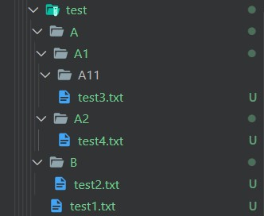

# OS module

- [OS module](#os-module)
  - [Current Directory](#current-directory)
  - [`os.path.join()`](#ospathjoin)
  - [Make New Directory](#make-new-directory)
  - [Get the list of all files and dir. in the specified directory.](#get-the-list-of-all-files-and-dir-in-the-specified-directory)
    - [`os.listdir()`](#oslistdir)
    - [`os.scandir()`](#osscandir)
    - [`os.walk()`](#oswalk)
  - [Remove](#remove)
    - [Get Stats: `os.stat() & os.scandir().stat()`](#get-stats-osstat--osscandirstat)


```python
"""
cd .\Py\08modules\built_in\os\
jupyter nbconvert --to markdown py_os.ipynb --output README.md
"""

```


```python
import os
print(dir(os))
```

    ['DirEntry', 'F_OK', 'GenericAlias', 'Mapping', 'MutableMapping', 'O_APPEND', 'O_BINARY', 'O_CREAT', 'O_EXCL', 'O_NOINHERIT', 'O_RANDOM', 'O_RDONLY', 'O_RDWR', 'O_SEQUENTIAL', 'O_SHORT_LIVED', 'O_TEMPORARY', 'O_TEXT', 'O_TRUNC', 'O_WRONLY', 'P_DETACH', 'P_NOWAIT', 'P_NOWAITO', 'P_OVERLAY', 'P_WAIT', 'PathLike', 'R_OK', 'SEEK_CUR', 'SEEK_END', 'SEEK_SET', 'TMP_MAX', 'W_OK', 'X_OK', '_AddedDllDirectory', '_Environ', '__all__', '__builtins__', '__cached__', '__doc__', '__file__', '__loader__', '__name__', '__package__', '__spec__', '_check_methods', '_execvpe', '_exists', '_exit', '_fspath', '_get_exports_list', '_walk', '_wrap_close', 'abc', 'abort', 'access', 'add_dll_directory', 'altsep', 'chdir', 'chmod', 'close', 'closerange', 'cpu_count', 'curdir', 'defpath', 'device_encoding', 'devnull', 'dup', 'dup2', 'environ', 'error', 'execl', 'execle', 'execlp', 'execlpe', 'execv', 'execve', 'execvp', 'execvpe', 'extsep', 'fdopen', 'fsdecode', 'fsencode', 'fspath', 'fstat', 'fsync', 'ftruncate', 'get_exec_path', 'get_handle_inheritable', 'get_inheritable', 'get_terminal_size', 'getcwd', 'getcwdb', 'getenv', 'getlogin', 'getpid', 'getppid', 'isatty', 'kill', 'linesep', 'link', 'listdir', 'lseek', 'lstat', 'makedirs', 'mkdir', 'name', 'open', 'pardir', 'path', 'pathsep', 'pipe', 'popen', 'putenv', 'read', 'readlink', 'remove', 'removedirs', 'rename', 'renames', 'replace', 'rmdir', 'scandir', 'sep', 'set_handle_inheritable', 'set_inheritable', 'spawnl', 'spawnle', 'spawnv', 'spawnve', 'st', 'startfile', 'stat', 'stat_result', 'statvfs_result', 'strerror', 'supports_bytes_environ', 'supports_dir_fd', 'supports_effective_ids', 'supports_fd', 'supports_follow_symlinks', 'symlink', 'sys', 'system', 'terminal_size', 'times', 'times_result', 'truncate', 'umask', 'uname_result', 'unlink', 'unsetenv', 'urandom', 'utime', 'waitpid', 'waitstatus_to_exitcode', 'walk', 'write']


## Current Directory


```python
os.getcwd() # current woring dir
```


    'd:\\CSE\\Others\\Codes\\Py\\08modules\\built_in\\os'


## `os.path.join()`


```python
# Path
path = "/home"

# Join various path components
print(os.path.join(path, "User/Desktop", "file.txt"))## /home\User/Desktop\file.txt


# Path
path = "User/Documents"

# Join various path components
print(os.path.join(path, "/home", "file.txt")) # /home\file.txt

# In above example '/home'
# represents an absolute path
# so all previous components i.e User / Documents
# are thrown away and joining continues
# from the absolute path component i.e / home.


# Path
path = "/User"

# Join various path components
print(os.path.join(path, "Downloads", "file.txt", "/home")) # /home
# In above example '/User' and '/home'
# both represents an absolute path
# but '/home' is the last value
# so all previous components before '/home'
# will be discarded and joining will
# continue from '/home'

# Path
path = "/home"

# Join various path components
print(os.path.join(path, "User/Public/", "Documents", ""))
# /home\User/Public/Documents\

# In above example the last
# path component is empty
# so a directory separator ('/')
# will be put at the end
# along with the concatenated value

```

    /home\User/Desktop\file.txt
    /home\file.txt
    /home
    /home\User/Public/Documents\


## Make New Directory


```python
os.mkdir("newly_created")
```

## Get the list of all files and dir. in the specified directory.

- [https://stackoverflow.com/questions/59268696/why-is-os-scandir-as-slow-as-os-listdir](https://stackoverflow.com/questions/59268696/why-is-os-scandir-as-slow-as-os-listdir)

### `os.listdir()`

It doesn't seem to have advantages compared to `os.scandir()` excepting that is easier to understand. Use it when only need to list files in directory.


```python
os.listdir()
```


    ['img', 'newly_created', 'py_os.ipynb', 'README.md', 'test']


```python
os.listdir(os.getcwd())

```


    ['img', 'newly_created', 'py_os.ipynb', 'README.md', 'test']


```python
my_files = [x for x in os.listdir() if x.endswith(".md")]
print(my_files)
```

    ['README.md']


### `os.scandir()`

The `os.scandir()` method extracts an `iterator` of `os.DirEntry` objects. These objects correspond to entries in a directory given by path.


```python
os.scandir()
```


    <nt.ScandirIterator at 0x2366c77d250>


```python
[ x for x in os.scandir(".")]
```


    [<DirEntry 'img'>,
     <DirEntry 'newly_created'>,
     <DirEntry 'py_os.ipynb'>,
     <DirEntry 'README.md'>,
     <DirEntry 'test'>]


```python
[ x.name for x in os.scandir(".") if x.is_file()]
```


    ['py_os.ipynb', 'README.md']


```python
my_files = [f.name for f in os.scandir() if f.name.endswith('.md')]
print(my_files)

```

    ['README.md']


### `os.walk()`

This is the most used function when we need to fetch all the items in a directory (and subdirs).

<div align="center">

</div>


```python
test_path = os.path.join(os.getcwd(), "test")
test_path
```


    'd:\\CSE\\Programs\\Codes\\Py\\08modules\\built_in\\os\\test'


```python
for (root,dirs,files) in os.walk(test_path, topdown=True):
        print(root)
        print(dirs)
        print(files)
        print("____________________________________")


```

    d:\CSE\Others\Codes\Py\08modules\built_in\os\test
    ['A', 'B']
    ['test1.txt']
    ____________________________________
    d:\CSE\Others\Codes\Py\08modules\built_in\os\test\A
    ['A1', 'A2']
    []
    ____________________________________
    d:\CSE\Others\Codes\Py\08modules\built_in\os\test\A\A1
    ['A11']
    ['test3.txt']
    ____________________________________
    d:\CSE\Others\Codes\Py\08modules\built_in\os\test\A\A1\A11
    []
    []
    ____________________________________
    d:\CSE\Others\Codes\Py\08modules\built_in\os\test\A\A2
    []
    ['test4.txt']
    ____________________________________
    d:\CSE\Others\Codes\Py\08modules\built_in\os\test\B
    []
    ['test2.txt']
    ____________________________________


```python
for r, d, f in os.walk(test_path):
    for file in f:
        if ".txt" in file:
            print(os.path.join(r, file))

```

    d:\CSE\Programs\Codes\Py\08modules\built_in\os\test\test1.txt
    d:\CSE\Programs\Codes\Py\08modules\built_in\os\test\A\A1\test3.txt
    d:\CSE\Programs\Codes\Py\08modules\built_in\os\test\A\A2\test4.txt
    d:\CSE\Programs\Codes\Py\08modules\built_in\os\test\B\test2.txt


## Remove


```python
# os.remove()
# os.removedirs()
# os.rename()
```

### Get Stats: `os.stat() & os.scandir().stat()`


```python
os.stat("py_os.ipynb")

```


    os.stat_result(st_mode=33206, st_ino=3659174697397727, st_dev=2828569586, st_nlink=1, st_uid=0, st_gid=0, st_size=12729, st_atime=1656249417, st_mtime=1653930990, st_ctime=1624143014)


- `st_atime(self)` time of most recent access,
- `st_mtime(self)` time of most recent content modification
- `st_ctime(self)` time of creation


```python
os.stat("py_os.ipynb").st_size

```


    12729


```python
file_size_in_bytes = os.stat("py_os.ipynb").st_size

if file_size_in_bytes > 1000:
	print(f"{round(file_size_in_bytes/1000)}kb")

```

    13kb


```python
# sort files by creation time
files = [x for x in os.listdir() if x.endswith(".txt")]
files.sort(key=lambda x: os.stat(x).st_ctime)
print(files)
```

    ['test_1.txt', 'test_2.txt']


```python
# sort files by creation time
files = [x for x in os.listdir() if x.endswith(".txt")]
print([ os.stat(x).st_mtime for x in files ])
files.sort(key=lambda x: os.stat(x).st_mtime)
print(files)
```

    [1656250060.3008769, 1656250152.18407]
    ['test_1.txt', 'test_2.txt']


```python
sorted(os.scandir(), key=lambda t: t.stat().st_ctime, reverse=True)
```


    [<DirEntry 'test_2.txt'>,
     <DirEntry 'test_1.txt'>,
     <DirEntry 'img'>,
     <DirEntry 'test'>,
     <DirEntry 'py_os.ipynb'>,
     <DirEntry 'README.md'>,
     <DirEntry 'newly_created'>]


```python
[ (x.name,x.stat().st_ctime) for x in os.scandir() if x.is_file()]
```


    [('py_os.ipynb', 1624143014.365672),
     ('README.md', 1624143014.3646705),
     ('test_1.txt', 1656249866.3820255),
     ('test_2.txt', 1656249878.7464452)]


