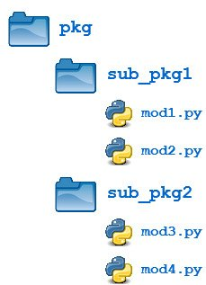

# Modules and Packages

  

## Differences Between Python Modules and Packages

- A **module** is a `file` containing Python code. A **package**, however, is like a `directory` that holds `sub-packages` and `modules`.
- A package must hold the file `__init__.py`. This does not apply to modules.
- To import everything from a module, we use the wildcard *. But this does not work with packages