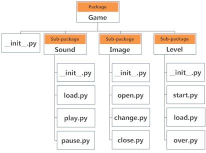

# What are packages?

We don't usually store all of our files on our computer in the same location. We use a well-organized hierarchy of directories for easier access. Similar files are kept in the same directory, for example, we may keep all the songs in the "music" directory. Analogous to this, Python has **packages** for `directories` and **modules** for `files`.

A Python **package** can have `sub-packages` and `modules`.

**A directory must contain a file named `__init__.py` in order for Python to consider it as a package.** This file can be left empty but we generally place the initialization code for that package in this file.

Here is an example. Suppose we are developing a game. One possible organization of packages and modules could be as shown in the figure below.

  

