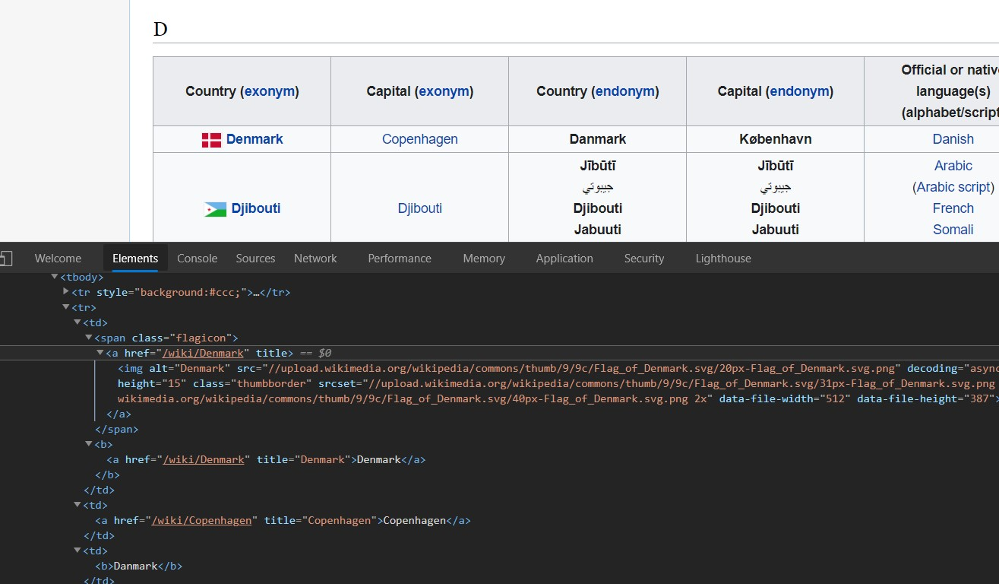

# BeautifulSoup
- used for web scraping 
- it's a parser for html and xml
- `pip install bs4` ; included in anaconda!!
- [doc](https://www.crummy.com/software/BeautifulSoup/bs4/doc/)


```python
import bs4
import requests
```


```python
url = 'https://en.wikipedia.org/wiki/List_of_countries_and_dependencies_and_their_capitals_in_native_languages'
res = requests.get(url)
res
```


    <Response [200]>


```python
text = res.content
soup = bs4.BeautifulSoup(text) # full web c
type(soup)
```


    bs4.BeautifulSoup


```python
soup.title
```


    <title>List of countries and dependencies and their capitals in native languages - Wikipedia</title>


```python
soup.title.text
```


    'List of countries and dependencies and their capitals in native languages - Wikipedia'


```python
soup.h1.text
```


    'List of countries and dependencies and their capitals in native languages'


```python
soup.find('p')
```


    <p>The following chart lists <a href="/wiki/List_of_sovereign_states" title="List of sovereign states">countries</a> and <a href="/wiki/Dependent_territory" title="Dependent territory">dependencies</a> along with their <a class="mw-redirect" href="/wiki/Capital_(political)" title="Capital (political)">capital</a> cities, in English as well as any additional <a href="/wiki/Official_language" title="Official language">official language</a>(s).
    </p>


```python
all_tables= soup.findAll('table',attrs={"class":"wikitable"})
len(all_tables)
```


    25


<p align="center">
  
</p>


```python
D_table = all_tables[3].find_all('tr')[1:] # skip first row which is headers
all_tds = D_table[0].find_all('td')
all_tds[0].img.attrs['src']
```


    '//upload.wikimedia.org/wikipedia/commons/thumb/9/9c/Flag_of_Denmark.svg/20px-Flag_of_Denmark.svg.png'


```python
country = all_tds[0].text
capital = all_tds[1].text
language = all_tds[-1].text
print(country,capital,language)
```

     Denmark Copenhagen Danish
    
    

**getting all info from 1 table**


```python
for tr in D_table:
    all_tds= tr.find_all('td')

    country = all_tds[0].text
    capital = all_tds[1].text
    language = all_tds[-1].text
    print("country: ",country," capital: ",capital," language:",language)
```

    country:   Denmark  capital:  Copenhagen  language: Danish
    
    country:   Djibouti  capital:  Djibouti  language: Arabic(Arabic script)FrenchSomaliAfar
    
    country:   Dominica  capital:  Roseau  language: English
    
    country:   Dominican Republic  capital:  Santo Domingo  language: Spanish
    
    


```python
for one_table in all_tables:
    all_rows = one_table.find_all('tr')[1:]
    for tr in D_table:
        all_tds= tr.find_all('td')
        country = all_tds[0].text
        capital = all_tds[1].text
        language = all_tds[-1].text
        print("country: ",country," capital: ",capital," language:",language)
```
