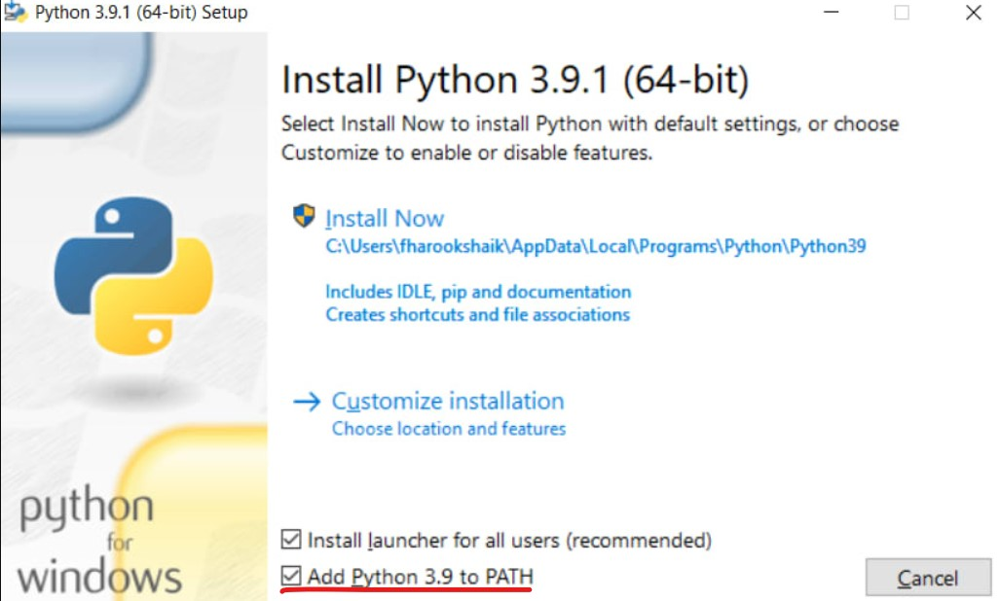
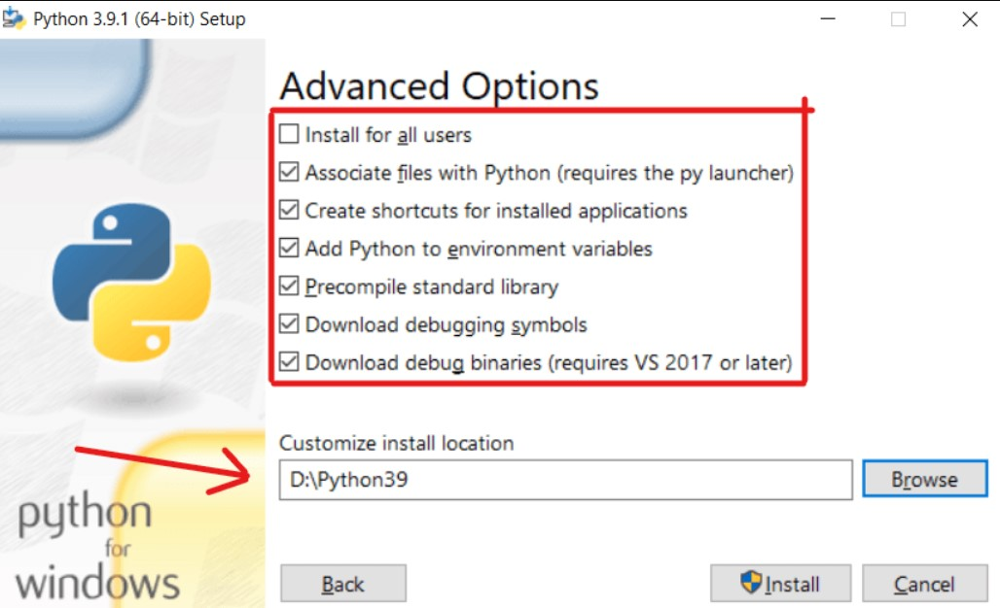
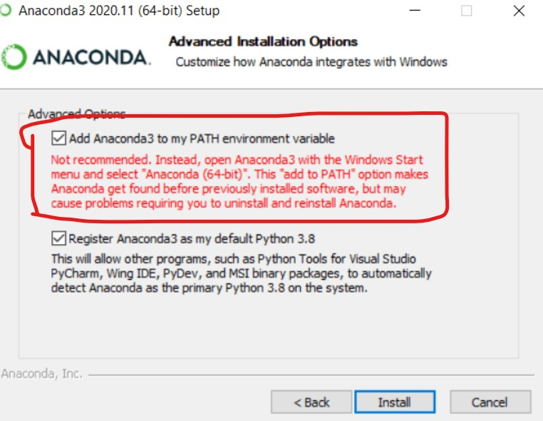
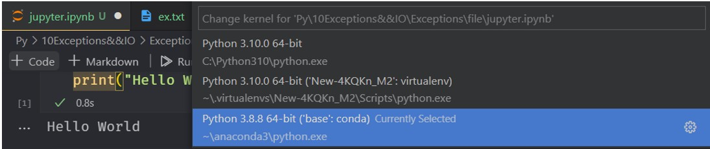
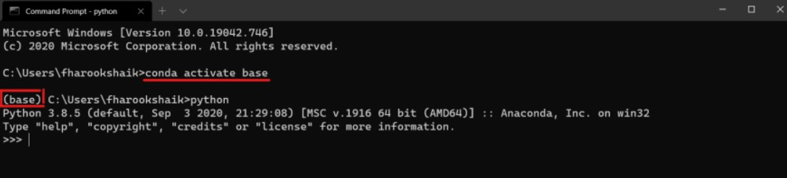
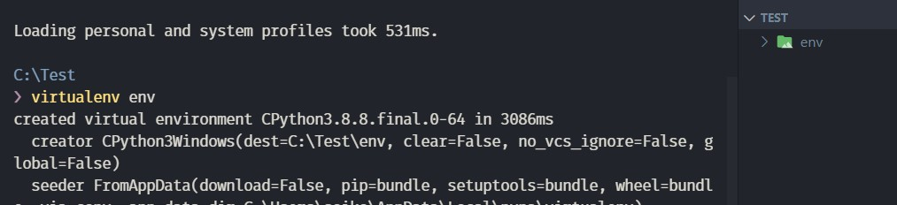
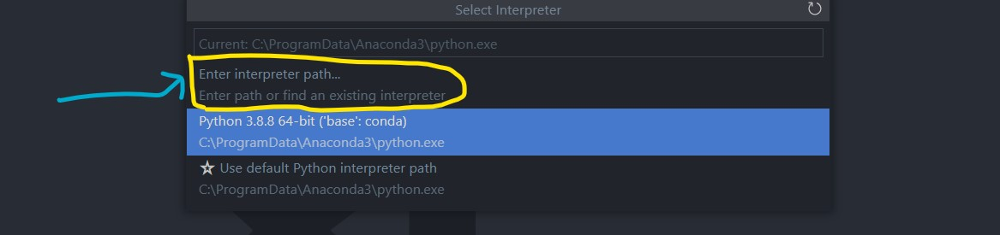
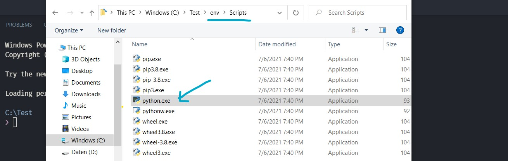
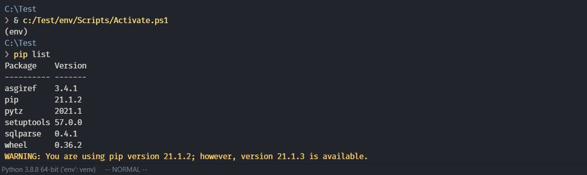
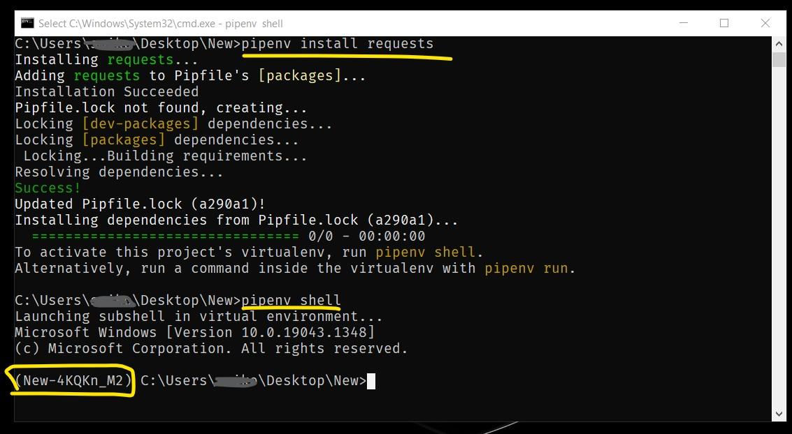

# Python

- [Python](#python)
	- [Install both Anaconda & Python | Windows](#install-both-anaconda--python--windows)
		- [Install Python 🐍](#install-python-)
		- [Install Anaconda Distribution](#install-anaconda-distribution)
		- [🤔 How to Access Anaconda & Python from cmd?](#-how-to-access-anaconda--python-from-cmd)
			- [Accessing `Anaconda` from `VsCode`](#accessing-anaconda-from-vscode)
			- [Accessing `Anaconda` from `cmd`](#accessing-anaconda-from-cmd)
			- [Accessing `Python` from `cmd`](#accessing-python-from-cmd)
		- [📥 Install packages differently](#-install-packages-differently)
	- [`pipenv` vs `virtualenv` vs `conda` environment](#pipenv-vs-virtualenv-vs-conda-environment)
		- [Virtualenv](#virtualenv)
			- [with vscode](#with-vscode)
			- [using cmd](#using-cmd)
		- [`pipenv` 🌟🌟🌟](#pipenv-)
			- [Creating and Activating a virtualenv](#creating-and-activating-a-virtualenv)
			- [Installing from a copied a `pipfile`](#installing-from-a-copied-a-pipfile)
			- [UnInstalling packages](#uninstalling-packages)
			- [Remove virtualenv](#remove-virtualenv)
		- [Create Anaconda Environment](#create-anaconda-environment)
	- [Using Pip to install packages to Anaconda Environment](#using-pip-to-install-packages-to-anaconda-environment)
	- [Convert `ipynb` files into html, markdown, pdf and other format files](#convert-ipynb-files-into-html-markdown-pdf-and-other-format-files)

## Install both Anaconda & Python | Windows

### Install Python 🐍

- Make sure that you have checked out `ADD Python to PATH`.

<div align="center" ></div>

- Click on `Customize installation` and make few clicks on Next till you've got this page.

<div align="center" ></div>

- Choose a custom location other than the default. In this case I've choose `D:\Python310`.

### Install Anaconda Distribution

- Make sure you have checked out `Add Anaconda3 to my PATH environment variable`. This provides the flexibility to access the distribution of anaconda python anywhere from the PC.

<div align="center" ></div>

- Once installed, do a quick run of Anaconda Navigator and ensure it's running fine.

### 🤔 How to Access Anaconda & Python from cmd?

#### Accessing `Anaconda` from `VsCode`

- Select Anaconda as the kernel

<div align="center" ></div>

#### Accessing `Anaconda` from `cmd`

- Open command prompt and use the following command to activate conda base environment.

```sh
conda activate base
```

- Type `python` and you'll be welcomed with python from anaconda environment.

<div align="center" ></div>

- The `(base)` before the path indicates that conda environment is active.

- To deactivate conda environment, use the following command

> Note: Every anaconda distribution comes with base environment. Any additional virtual environments created inside anaconda can be activated using the `conda activate <envname>`

#### Accessing `Python` from `cmd`

- Just type `python` or `py` to open the python interpreter.

### 📥 Install packages differently

With both the distributions installed, you have control on installing packages separately for each distribution.

- To install any package/dependency in **conda environment**, use the following command

```python
conda install <packageName>
```

- To install any package/dependency in **native python**, use the following command

```python
pip install <packageName>
```

## `pipenv` vs `virtualenv` vs `conda` environment

### Virtualenv

Virtualenv was the default way of creating virtual environment for many years. It is still used by many although people are moving to improved `pipenv` or `conda` (explained below).

#### with vscode

> Create a virtual environment:

```powershell
virtualenv env
```

<div align="center" ></div>

> Select and activate an environment in vscode:

<div align="center" ></div>

<div align="center" ></div>

_select `python.exe` from current\env\Script dir:_

<div align="center" ></div>

> Now vs code terminal will use `env` virtual environment

<div align="center" ></div>

#### using cmd

```bash
# pre-install with anaconda..
pip install virtualenv
pip list
```

Start `virtualenv`:

```cmd
virtualenv env
```

To `activate` or `deactivate` virtualenv:

```cmd
env\Scripts\activate
deactivate
```

### `pipenv` 🌟🌟🌟

Pipenv was created due to many shortcomings of virtualenv such as it not making a distinction if project dependency and the depending of the project dependency, not having mechanism to distinguish dev and production needs etc.

To install pipenv, you need to install pip first. Then do

```bash
pip install pipenv
```

#### Creating and Activating a virtualenv

```bash
### ~Desktop/project_name
pipenv install django
# Successfully created virtual environment!
# Virtualenv location: C:\Users\X\.virtualenvs\project_name-zqtDNc_4

### Activate virtualenv
pipenv shell
```

<div align="center" ></div>

#### Installing from a copied a `pipfile`

```bash
pipenv sync
# or
pipenv install
```

[https://stackoverflow.com/questions/52171593/how-to-install-dependencies-from-a-copied-pipfile-inside-a-virtual-environment](https://stackoverflow.com/questions/52171593/how-to-install-dependencies-from-a-copied-pipfile-inside-a-virtual-environment)

#### UnInstalling packages

- For the unInstallation of the package, use the following command.

```python
pipenv uninstall flask
```

#### Remove virtualenv

```bash
pipenv --rm
```

### Create Anaconda Environment

[https://towardsdatascience.com/manage-your-python-virtual-environment-with-conda-a0d2934d5195](https://towardsdatascience.com/manage-your-python-virtual-environment-with-conda-a0d2934d5195)

```bash
# List all existing environments
conda env list
# Create a new environment
conda create --name env_name
conda create --name env_name python=3.7
# Activate your new environment
conda activate env_name
# Deactivate/Change your active environment
conda activate base # can be change using VScode also
conda deactivate
#  Remove your environment
conda env remove --name env_name
```

The environments created by Conda is always located in `/Users/.../anaconda3/envs/`. You may change the default location by using the following command but it is not encouraged. Conda can no longer find your environment by your environment name, you will have to specify the environment’s full path to activate it every time.

```
conda create --prefix /path/project-env
```

`conda list` also supports revision history. It is an incredibly useful feature to have to manage your package in the environment.

```sh
(project-env) username ~ % conda list --revision
# 2020-02-03 00:01:32  (rev 0)       # new environment
#     +ca-certificates-2020.1.1
#     +pip-20.0.2
#     +python-3.7.6...
# ...
# 2020-02-03 00:24:55  (rev 1)       # installed numpy
#     +blas-1.0
#     +intel-openmp-2019.4
#     +..
#     +six-1.14.0
# 2020-02-03 22:14:24  (rev 2)      # installed configparser
#     +configparser-3.5.0
```

Imagine you accidentally screw up your dependencies just because you update/install a new package. Revision history allows you to rollback your environment to the previous version just like that.

```bash
conda install --revision 1
## Package Plan ##
# environment location: /Users/username/opt/anaconda3/envs/project-env
# added / updated specs:
#     - configparser
#     - numpy
#     - python=3.7
# The following packages will be REMOVED:
# configparser-3.5.0-py37_0
```

## Using Pip to install packages to Anaconda Environment

```sh
# activate base env
conda activate

# now install your package
python -m pip uninstall pipenv
python -m pip install <package>
# -m mod : run library module as a script..
```

## Convert `ipynb` files into html, markdown, pdf and other format files

```bash
# ipython nbconvert --to FORMAT notebook.ipynb

jupyter nbconvert --to html test.ipynb
jupyter nbconvert --to markdown test.ipynb --output README.md
jupyter nbconvert --to pdf test.ipynb

# Note: VsCode jupyter notebooks has built in converter
```

[https://ipython.org/ipython-doc/3/notebook/nbconvert.html](https://ipython.org/ipython-doc/3/notebook/nbconvert.html)

[https://www.programmersought.com/article/95748768264/](https://www.programmersought.com/article/95748768264/)
