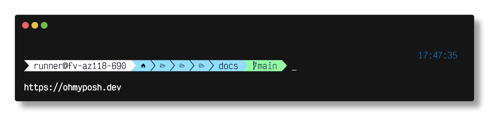
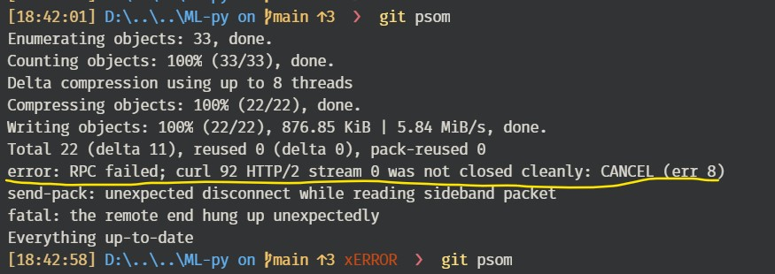
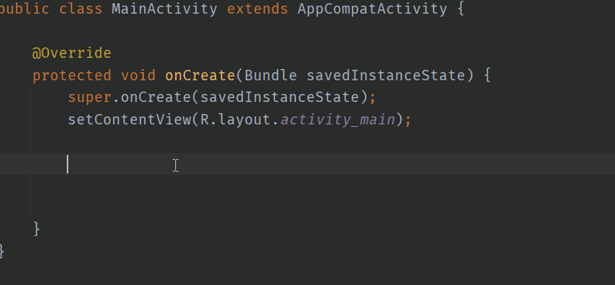

# Quick Navigation

- [Quick Navigation](#quick-navigation)
  - [Vs Code Setting](#vs-code-setting)
    - [font](#font)
    - [snippets](#snippets)
    - [Terminal](#terminal)
      - [For Windows Terminal](#for-windows-terminal)
        - [Install auto-suggestions](#install-auto-suggestions)
  - [Markdown Guide](#markdown-guide)
    - [Aligning images](#aligning-images)
    - [Mathematical Formula in markdown](#mathematical-formula-in-markdown)
      - [Writing inline expressions with `$`:](#writing-inline-expressions-with-)
      - [Writing expressions as blocks - with `$$` | `'''math`:](#writing-expressions-as-blocks---with---math)
  - [GIT and GITHUB 🚀🚀](#git-and-github-)
    - [Clear Git Cache](#clear-git-cache)
      - [Clear Entire Git Cache](#clear-entire-git-cache)
    - [Git Alias 🚀🚀](#git-alias-)
    - [Commands for Github Repo](#commands-for-github-repo)
    - [Change the URI (URL) for a remote Git repository](#change-the-uri-url-for-a-remote-git-repository)
    - [👉Git branching](#git-branching)
    - [☁️🩹Merging Remote Changes](#️merging-remote-changes)
      - [With Clean Working Directory; no local changes](#with-clean-working-directory-no-local-changes)
        - [op1: `fetch+merge`](#op1-fetchmerge)
        - [op2: `pull[fetch+merge]`](#op2-pullfetchmerge)
      - [🚀Conflicts With Local Changes (Uncommitted)](#conflicts-with-local-changes-uncommitted)
        - [🚀🚀`commit` local changes first and then pull](#commit-local-changes-first-and-then-pull)
        - [🚀🚀`stash`: save local changes without committing](#stash-save-local-changes-without-committing)
      - [🚀Conflicts With Local Changes (Committed)](#conflicts-with-local-changes-committed)
    - [`push` error: remote contains work that you do not have locally](#push-error-remote-contains-work-that-you-do-not-have-locally)
      - [Op1: pull and resolve](#op1-pull-and-resolve)
      - [Op2: force push](#op2-force-push)
    - [error while pushing: RPC failed](#error-while-pushing-rpc-failed)
  - [Creating Snippets 🚀🚀](#creating-snippets-)
    - [Live Templates in JetBrains IDE's](#live-templates-in-jetbrains-ides)
  - [Vim](#vim)
    - [Setup and Configure](#setup-and-configure)
      - [Linux(ubuntu)](#linuxubuntu)
      - [Intellij](#intellij)
      - [Colab](#colab)
    - [🔥Vim Commands](#vim-commands)
  - [Unicode](#unicode)
    - [LINKS](#links)
    - [Examples](#examples)

## Vs Code Setting

### font

**For Editor:** _`FiraCode-Regular.ttf`_ and _`FiraCode-Bold.ttf`_ from:
[tonsky/FiraCode](https://github.com/tonsky/FiraCode)

**For Terminal:** _`FiraMono NF`_ from
[Nerd Font](https://www.nerdfonts.com/font-downloads)

### snippets

You can easily define your own snippets without any extension. To create or edit your own snippets,

- select `User Snippets` under `File > Preferences > User Snippets` or `Setting > User Snippets`
- then **select the language**(by typing language identifier) for which the snippets should appear,
  - or type `New Global Snippets` file option if they should appear for all languages.

[https://code.visualstudio.com/docs/editor/userdefinedsnippets](https://code.visualstudio.com/docs/editor/userdefinedsnippets)

- Each snippet is defined under a `snippet name` and has a `scope`, `prefix`, `body` and `description`.
- Add comma separated ids of the languages where the snippet is applicable in the scope field.
  - `"scope": "javascript,typescript"`
- If scope is left empty or omitted, the snippet gets applied to all languages.
- The `prefix` is what is used to **trigger the snippet** and the body will be expanded and inserted.
  - Possible variables are:
    - `$1`, `$2` for tab stops,
    - `$0` for the final cursor position, and
    - `${1:label}`, `${2:another}` for placeholders.
      - Placeholders with the same ids are connected.

```json
{

 "Print to console": {
   "scope": "javascript,typescript",
   "prefix": "log",
   "body": ["for(int i = $1,i<=$2;i++){",
     "    console.log(\"${3:string}\");",
     "    console.log(\"${3:string}\");",
     "}",
     "$0"],
   "description": "Log output to console"
  }

}
```

[https://snippet-generator.app](https://snippet-generator.app/): !!!To declare a placeholder (ctrl + i): ${1:example}

### Terminal

#### For Windows Terminal

---



[Oh My Posh](https://github.com/jandedobbeleer/oh-my-posh)

1. Winget Installation:

```bash
winget install JanDeDobbeleer.OhMyPosh -s winget
```

2. configure your shell to use Oh My Posh:

- (Optional) make sure to create the profile first:
```bash
New-Item -Path $PROFILE -Type File -Force
```
`C:\Users\u\Documents\WindowsPowerShell\Microsoft.PowerShell_profile.ps1` file will be created:


- Open PowerShell profile in Notepad with the following command:

```bash
notepad $profile
#or
code $profile
```

Then add the following line:

```bash
oh-my-posh init pwsh --config 'them_json_path' | Invoke-Expression
```
ex: `them_json_path`:  `C:/Users/x/pure.omp.json`


##### Install auto-suggestions

- [https://github.com/PowerShell/PSReadLine](https://github.com/PowerShell/PSReadLine)

Run the following command:

```bash
Install-Module PSReadLine -Force
```

Now, paste the following code in the PowerShell profile:

```bash
Set-PSReadLineOption -PredictionSource History
Set-PSReadLineOption -PredictionViewStyle ListView
```

Complete PowerShell profile:

```bash
oh-my-posh init pwsh --config 'C:/Users/x/star.omp.json' | Invoke-Expression
Set-PSReadLineOption -PredictionSource History
Set-PSReadLineOption -PredictionViewStyle ListView
```

> Edit Powershell Commad History: `code (Get-PSReadlineOption).HistorySavePath`
> Clearing duplicate histories:

```py
# remove_duplicates_commad_history.py
input_path = r'C:\Users\x\AppData\Roaming\Microsoft\Windows\PowerShell\PSReadLine\ConsoleHost_history.txt'
output_path = input_path

with open(input_path, 'r') as file:
    lines = file.readlines()

unique_lines = list(set(lines))

with open(output_path, 'w') as file:
    file.writelines(unique_lines)

```

## Markdown Guide

### Aligning images

```html
<p align="center">

</p>
```

### Mathematical Formula in markdown

- [Writing mathematical expressions](https://docs.github.com/en/get-started/writing-on-github/working-with-advanced-formatting/writing-mathematical-expressions)

#### Writing inline expressions with `$`:

```bash
This sentence uses `$` delimiters to show math inline:  $\sqrt{3x-1}+(1+x)^2$
```

This sentence uses `$` delimiters to show math inline:  $\sqrt{3x-1}+(1+x)^2$

#### Writing expressions as blocks - with `$$` | `'''math`:

To add a math expression as a block, start a new line and delimit the expression with two dollar symbols `$$`.

```bash
$$\left( \sum_{k=1}^n a_k b_k \right)^2 \leq \left( \sum_{k=1}^n a_k^2 \right) \left( \sum_{k=1}^n b_k^2 \right)$$
```

$$\left( \sum_{k=1}^n a_k b_k \right)^2 \leq \left( \sum_{k=1}^n a_k^2 \right) \left( \sum_{k=1}^n b_k^2 \right)$$

## GIT and GITHUB 🚀🚀

### Git Alias 🚀🚀

[gist](https://gist.github.com/dev-SR/bf82b701864366b77b3320b543fbef75)

<div id="githubrepo"/>

### Commands for Github Repo

…or create a new repository on the command line

```
git init
git add .
git commit -m "first commit"
git branch -M main
git remote add origin <url>
git push -u origin main
```

…or push an existing repository from the command line 🚀

```
git remote add origin <url>
git branch -M main
git push -u origin main
```

<div id="changeremote"/>

### Change the URI (URL) for a remote Git repository

```bash
git remote -v
# View existing remotes
# origin  https://github.com/user/repo.git (fetch)
# origin  https://github.com/user/repo.git (push)

git remote set-url origin https://github.com/user/repo2.git
# Change the 'origin' remote's URL

git remote -v
# Verify new remote URL
# origin  https://github.com/user/repo2.git (fetch)
# origin  https://github.com/user/repo2.git (push)

```

### 👉Git branching

Absolutely, I'd be happy to provide you with some common Git branching commands. Branching is an essential aspect of version control in Git, enabling you to work on different features or bug fixes simultaneously. Here are some commands you might find useful:

1. **Create a New Branch:**
   - `git branch <branch-name>`: Creates a new branch but doesn't switch to it.

2. **Switch to a Branch:**
   - `git checkout <branch-name>`: Switches to the specified branch.

3. **Create and Switch to a New Branch:**
   - `git checkout -b <new-branch-name>`: Creates and switches to a new branch in one command.
   - Alias: **`git ckb <new-branch-name>`**

4. **List Branches:**
   - `git branch`: Lists all the branches in the repository. The current branch is indicated with an asterisk (*).
   - Alias: **`git b`**

5. **Rename a Branch:**
   - `git branch -m <new-branch-name>`: Renames the current branch to the specified new name.
   - `git branch -m <old-branch-name> <new-branch-name>`: Renames a specific branch to a new name.

6. **Delete a Branch:**
   - `git branch -d <branch-name>`: Deletes a branch. The branch must be fully merged into the current branch.
   - `git branch -D <branch-name>`: Forces deletion of a branch, even if it's not fully merged.
   - Alias: **`git bd`**

7. **Merge Branches:**
   - `git checkout <target-branch>`: Switches to the branch you want to merge into.
     - Alias: **`git ck <target-branch>`**
   - `git merge <source-branch>`: Merges the changes from the source branch into the target branch.
     - Alias: **`git m <source-branch>`**

8. **Rebase Branches:**
   - `git rebase <base-branch>`: Moves the commits from the current branch onto the tip of the base branch, effectively replaying your changes on top of it.

9. **View Merge Conflict:**
   - During a merge or rebase, if conflicts arise, Git will mark the conflicting areas in the files. Use a text editor or specialized tools to resolve these conflicts.

10. **Abort Merge or Rebase:**
    - `git merge --abort`: Abort a merge that resulted in conflicts and return to the state before the merge.
    - `git rebase --abort`: Abort an ongoing rebase and return to the original branch state.

Remember to always commit your changes before performing any branch operations, as Git doesn't allow you to switch branches with uncommitted changes in most cases. It's also a good practice to frequently pull the latest changes from the remote repository to ensure your branches are up to date.

Please exercise caution when using these commands, especially when force-deleting branches or performing rebases, as they can rewrite commit history and cause data loss if not used correctly.

### Creating a pull request

1. **Fork the Repository:**
   - Fork the repository to your GitHub account.

2. **Clone the Repository:**
   - Clone the forked repository to your local machine using `git clone`.

3. **Create a Branch:**
   - Create a new branch for your changes using `git checkout -b branch-name`.

4. **Make Changes:**
   - Make the necessary changes to the codebase.

5. **Commit Changes:**
   - Commit your changes using `git commit -m "Descriptive message"`.

6. **Push Changes:**
   - Push your branch to your GitHub repository with `git push origin branch-name`.

7. **Create Pull Request:**
   - Go to the original repository on GitHub.
   - Click on "New Pull Request".
   - Select your branch and the branch you want to merge into.

8. **Provide Details:**
   - Write a concise title and description for your pull request.

9. **Submit Pull Request:**
   - Submit your pull request.

10. **Review and Merge:**
   - Await feedback and address any comments.
   - Once approved, the maintainers will merge your changes into the main branch.

### ☁️🩹Merging Remote Changes

#### With Clean Working Directory; no local changes

##### op1: `fetch+merge`

List All Branches:

- To see local branches, run this command: `git branch`
- To see remote branches, run this command: `git branch -r`
- To see all local and remote branches, run this command: `git branch -a`

1. Fetch remote changes:

```bash
git fetch
# git fetch origin # we don't need to specify origin here as we used `-u` flag with git push
```

2. Merge remote changes:

```bash
git merge origin/main
```

##### op2: `pull[fetch+merge]`

```bash
git pull
# git pull origin
```

#### 🚀Conflicts With Local Changes (Uncommitted)

```txt
error: Your local changes to the following files would be overwritten by merge:
        README.md
Please commit your changes or stash them before you merge.
Aborting
Updating eeac98a..55e0242
```

In this case, we need to commit our local changes first and then pull. Or we can stash them.

##### 🚀🚀`commit` local changes first and then pull

```bash
git add -A
git commit -m "commit local changes before pull"
git pull
```

##### 🚀🚀`stash`: save local changes without committing

```bash
git stash
# name the stash
git stash save stashing
git stash save "stashing local changes"
git pull
```

```bash
>> git stash list
stash@{0}: On main: stashing
stash@{1}: On main: stashing local changes
```

2. Apply to changes back to the code:

```bash
git stash pop
git stash apply 0
```

#### 🚀Conflicts With Local Changes (Committed)

1. Pull remote changes:

```bash
git pull
```

2. Resolve conflicts using VSCode

3. Commit changes

### `push` error: remote contains work that you do not have locally

Remote repo has changes that we do not have locally.

#### Op1: pull and resolve

1. Pull remote changes:`git pull`
2. Resolve conflicts using VSCode
3. Commit changes
4. then push: `git push`

#### Op2: force push

```bash
git push --force
```
### Clear Git Cache

[Ref](https://devconnected.com/how-to-clear-git-cache/)

When working with Git, you may want to add some new lines to your gitignore
files.

However, when listing the files to be committed in your staging area, you
realize that some of the ignored files are still showing up.

In this case, you may need to clear your Git cache.

**The easiest way to clear your Git cache is to use the “git rm” command with
the `–cached` option.**

```properties
 git rm --cached filename
```

> **Note** o not forget the `--cached` option or your file will be deleted from
> the filesystem.

#### Clear Entire Git Cache

In some cases, you may want to clear the cache of your entire Git staging area.

This is particularly useful when you added multiple files that you want now to
be ignored via your `.gitignore` file.

**To clear your entire Git cache, use the `"git rm"` command with the `"-r"`
option for recursive.**

1. apply below cmd to un-stage all files:

```properties
 git rm -r --cached .
```

2. add intended file to `.gitignore`
3. then, get all files back simply by :

```properties
 git add .
```

<div id="alias"/>

### error while pushing: RPC failed

<div align="center">

</div>

- Change network

Or,

- try increasing the buffer size.

```bash
git config http.postBuffer 524288000
```

Or,

- downgrading version of HTTP from 2 to 1.1:

```bash
git config --global http.version HTTP/1.1
```

After this change, pushing was successful and change HTTP version to 2 again:

```bash
git config --global http.version HTTP/2
```

## Creating Snippets 🚀🚀

### Live Templates in JetBrains IDE's

`Setting > Editor > Live Templates > Java`

```java
for(int $INDEX$ = 0; $INDEX$ < $LIMIT$; $INDEX$++) {
  $END$
}
```

- [https://www.jetbrains.com/help/idea/using-live-templates.html#live_templates_configure](https://www.jetbrains.com/help/idea/using-live-templates.html#live_templates_configure)

<div align="center">

</div>

## Vim

### Setup and Configure

#### Linux(ubuntu)

Install Vim (Enhanced version of vi which is preinstalled)

```bash
sudo apt install vim
```

Configure .vimrc

```bash
# search if.vimrc exits
ls -a | grep .vim
# open .vimrc
vim .vimrc
```

```bash
inoremap jj <Esc>
syntax on
set number
```

#### Intellij

Keymap:

```bash
imap jj <Esc>
```

#### Colab

```bash
:imap jj <Esc>
```

### 🔥Vim Commands

**Moving Around:**

- Move By Char
  - `h` - move left one character
  - `j` - move down one line
  - `k` - move up one line
  - `l` - move right one character
- Move by Word
  - `w` - move forward one word
  - `b` - move backward one word
- Line
  - `0` - move to the beginning of the line
  - `Shift+6` - move to the first non-blank character of the line
  - `Shift+4` - move to the end of the line
  - `G` - move to the last line of the file
  - `gg` - move to the first line of the file
  - `:n` - Go to the line number 
- **Page Jump**
  - `Ctrl+d` - **half page down**
  - `Ctrl+u` - **half page up**
  - `Ctrl+f` - **page down**
  - `Ctrl+b` - **page up**
  - `H` - move to the **top of the visible screen**
  - `M` - move to the **middle of the visible screen**
  - `L` - move to the **bottom of the visible screen**
- **Match Moving**
  - `%` - **move to matching parenthesis, bracket, or brace**

**Editing Text:**

- Insert Mode
  - `i` - insert text before the cursor
  - `a` - append text after the cursor
  - `o` - open a new line below the current line
  - `O` - open a new line above the current line
- Delete
  - `x` - delete the character under the cursor
- - `d` - delete the selected text
  - `dw` - delete the current word
  - `dd` - delete the current line
  - `D` - **delete from the cursor to the end of the line**

- Copy & Paste
  - `y` - yank (copy) the selected text
  - `yw` - yank (copy) the current word
  - `yy` - yank (copy) the current line
  - `p` - paste the yanked text after the cursor
  - `P` - paste the yanked text before the cursor

- Undo & Redo
  - `u` - undo the last change
  - `Ctrl+r` - redo the last undone change

**Searching and Replacing:**

- `/pattern` - **search for the specified pattern**
- `n` - **find the next occurrence of the pattern**
- `N` - **find the previous occurrence of the pattern**
- `:s/old/new/g` - **replace all occurrences of "old" with "new" on the current line**
- `:%s/old/new/g` - **replace all occurrences of "old" with "new" in the entire file**
- `:1,10s/old/new/g` - **replace all occurrences of "old" with "new" between lines 1 and 10**
- Replace visually selected text
  1. select the text in visual mode
  2. yank the text with `y`
  3. `:%s/<C-r>0/new_text` (`0` is the yank register)

**Using Marks for Navigation:**

- `ma` - **set a mark at the current position**
- ``a` - **jump back to mark "a"**
- `'a` - **jump back to mark "a" in the same line**

**Here are some examples of combining Vim commands for advanced operations:**

- Combining Movement and Editing:
  - `d2w` - delete the next two words
  - `ci( | di(` - **delete the text inside parentheses - (inside)**
  - **`dit | cit`** - **delete the text between matching html/xml tags - <tag>inside</tag>** 
  - `yi(` -**yank the text inside (parentheses)**
  - `ct(` – change up to the first `"` (deletes `OldFun` from `OldFun("x")`)


- Using Visual Mode for Complex Edits.
  - `viw`- select the inner word
  - `vap`- select the paragraph
  - `ggVG` - select the entire file
  - For Code block like this:

    ```bash
    if (true){
      line1
      line2
      line3
      line4
    }
    ```

    - `V6jd` -**visually select the next 6 lines and delete them**
    - `f{V%d` - **find first `{` on the current line, visually select to the matching `}`, and delete the contents**
    - `vi{d` - **visually select the contents inside `{}`, and delete them**
    - `va{d` - **visually select the contents inside `{}` along with the braces, and delete them**
    - `va{Vd` - **visually select the contents inside `{}` along with the braces and the line, and delete them**


**Additional Useful Commands:**

- `>` - **indent the selected lines** , (`>>/Shift..` in vs-code )
- `<` - **unindent the selected lines**
- `zz` - **center the current line on the screen**
- `.` - **repeat the last command**
- `3.` - **repeat the last command 3 times**

**Using Macros for Automation:**

- `qa` - start recording a macro in register "a"
- `<actions to record>`
- `q` - stop recording the macro
- `@a` - replay macro "a"

## Unicode

### LINKS

[Arrows](https://unicode-table.com/en/sets/arrow-symbols/)

[Box Drawing](https://unicode-table.com/en/blocks/box-drawing/)

### Examples

```
    /**
       int **p = new int*[2]; <- array of Integer Pointers
             ┃
             ▼
       ┏━━━━━━┓      ┏━━━━━━━━━━━━━━━┓
       ┃ p[0] ┃----> ┃ new int[n];   ┃
       ┗━━━━━━┛      ┗━━━━━━━━━━━━━━━┛
       ┏━━━━━━┓      ┏━━━━━━━━━━━━━━━┓
       ┃ p[1] ┃----> ┃ new int[n];   ┃
       ┗━━━━━━┛      ┗━━━━━━━━━━━━━━━┛

     ┌───┐───┐───┐───┐───┐
     │   │   │   │   │   │
     └───┘───┘───┘───┘───┘
     ┌───┐───┐───┐───┐───┐
     │   │   │   │   │   │
     └───┘───┘───┘───┘───┘
     ┌───┐───┐───┐───┐───┐
     │   │   │   │   │   │
     └───┘───┘───┘───┘───┘
     ┌───┐───┐───┐───┐───┐
     │   │   │   │   │   │
     └───┘───┘───┘───┘───┘
     ┌───┐───┐───┐───┐───┐
     │   │   │   │   │   │
     └───┘───┘───┘───┘───┘

           */
```
