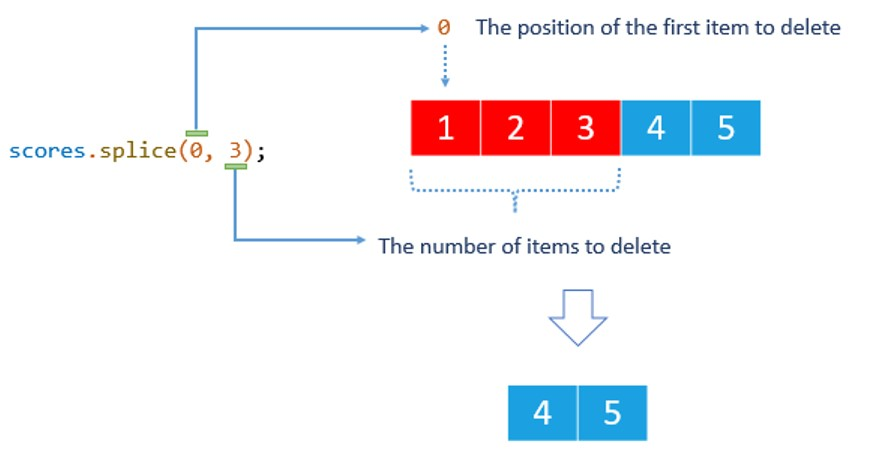
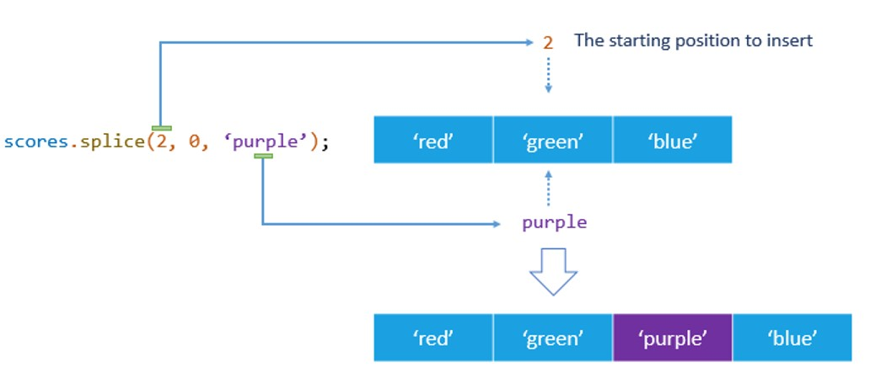
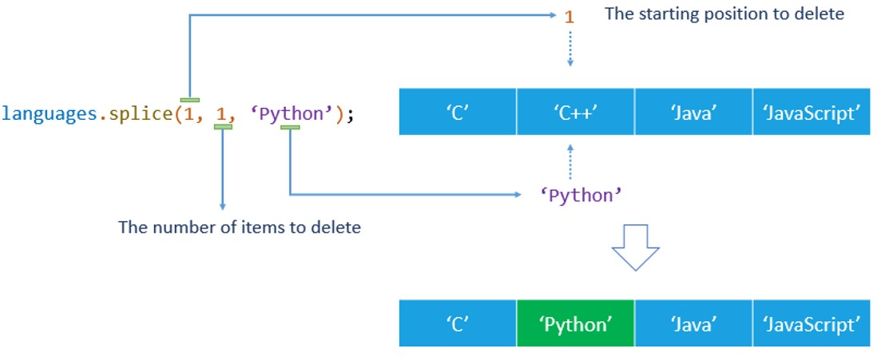

# Array in TypeScript/Javascript

- [Array in TypeScript/Javascript](#array-in-typescriptjavascript)
	- [Creating JavaScript arrays](#creating-javascript-arrays)
	- [Iterating over JavaScript arrays](#iterating-over-javascript-arrays)
	- [Spread operator](#spread-operator)
	- [Array methods](#array-methods)
		- [`indexOf` and `lastIndexOf`](#indexof-and-lastindexof)
			- [find all occurrences of an element in an array](#find-all-occurrences-of-an-element-in-an-array)
		- [`find` , `findIndex`](#find--findindex)
		- [🌟`splice`: Delete,Insert,Replace](#splice-deleteinsertreplace)
			- [Deleting elements: `splice(position, num)`](#deleting-elements-spliceposition-num)
			- [Inserting elements: `splice(position, 0,el1, el2,...);`](#inserting-elements-spliceposition-0el1-el2)
			- [Replacing elements: `splice(position, 1/n, el1, el2,...);`](#replacing-elements-spliceposition-1n-el1-el2)
			- [Custom: swap elements](#custom-swap-elements)
		- [`slice`:  extract subarray](#slice--extract-subarray)
		- [🌟🌟`filter`: Removing | filter elements](#filter-removing--filter-elements)
		- [🌟🌟`map`: Updating | transform array into new array](#map-updating--transform-array-into-new-array)
		- [🌟`split` and `join` | string <-> array](#split-and-join--string---array)
		- [`every`: Determining If All Array Elements Pass a Test](#every-determining-if-all-array-elements-pass-a-test)
		- [`some`: Check If at Least one Array Element Passes a Test](#some-check-if-at-least-one-array-element-passes-a-test)
		- [`sort`: Sorting Array Elements](#sort-sorting-array-elements)


## Creating JavaScript arrays

```typescript
// 1
let arr1 = [1, 2, 3, 4, 5];
console.log(arr1); // [ 1, 2, 3, 4, 5 ]

// 2.
let arr2 = new Array(1, 2, 3, 4, 5);
console.log(arr2); // [ 1, 2, 3, 4, 5 ]

// 2.1
let arr3 = new Array();
arr3.push(1);
arr3.push(2);

console.log(arr3); // [ 1, 2 ]

// generate array of 5 elements from `0` to `4`
let arr0toN_1 = [...Array( 4 ).keys()];
console.log( arr0toN_1 );//[ 0, 1, 2, 3 ]

let athletes = new Array(3); // creates an array with initial size 3
let scores = new Array(1, 2, 3); // create an array with three numbers 1,2 3
let signs = new Array("Red"); // creates an array with one element 'Red'

// array size
console.log(athletes.length); // 3
let emptyArray = []
console.log(emptyArray.length); // 0

// Accessing JavaScript array elements
let arr = [1, 2, 3, 4, 5];
console.log(arr[0]); // 1
console.log(arr[1]); // 2
// last element
console.log(arr[arr.length - 1]); // 5

```

## Iterating over JavaScript arrays

```typescript
let ar = [1, 2, 3, 4, 5];

console.log(ar);

// iterate over array
for (let i = 0; i < ar.length; i++) {
	console.log(ar[i]);
}

// iterate over array
for (let i in ar) {
	console.log(ar[i]);
}

// iterate over array
for (let i of ar) {
	console.log(i);
}

// iterate over array
ar.forEach((v, i) => {
	console.log(v);
});
```

## Spread operator

```typescript
let exArr = [1, 2, 3, 4, 5];
let copyArr = [...exArr, 6, 7, 8, 9, 10];
console.log(copyArr);
```

## Array methods

### `indexOf` and `lastIndexOf`


```javascript
var scores = [10, 20, 30, 10, 40, 20];
console.log(scores.indexOf(10)); // 0
console.log(scores.indexOf(30)); // 2
console.log(scores.indexOf(50)); // -1
console.log(scores.indexOf(10, 1)); // 3
```

#### find all occurrences of an element in an array

```ts
function findAllIndex<T>(arr: T[], value: T) {
	let indexes = [];
	for (let i = 0; i < arr.length; i++) if (arr[i] === value) indexes.push(i);
	return indexes;
}
let arr = [1, 2, 3, 4, 5, 1, 2, 3, 4, 5];
console.log(findAllIndex(arr, 1)); // [ 0, 5 ]
```

```typescript
function findAllIndexAllAtOnce<T>(arr: T[], values: T[]) {
	let indexes = [];
	for (let i = 0; i < arr.length; i++) if (values.includes(arr[i])) indexes.push(i);
	return indexes;
}
let arr = [1, 2, 3, 4, 5, 1, 2, 3, 4, 5];
console.log(findAllIndexAllAtOnce(arr, [1, 2])); // [ 0, 1, 5, 6 ]
```

### `find` , `findIndex`

```javascript
let numbers = [1, 2, 3, 4, 5];
// find odd number
let oddNumber = numbers.find((n) => n % 2 !== 0);
console.log(oddNumber); // 1
// find index of odd number
let oddIndex = numbers.findIndex((n) => n % 2 !== 0);
console.log(oddIndex); // 0

```

### 🌟`splice`: Delete,Insert,Replace

JavaScript Array type provides a very powerful splice() method that allows you to insert new elements into the middle of an array. However, you can use this method to delete and replace existing elements as well.

#### Deleting elements: `splice(position, num)`

<div align="center">

</div>

- The `position` specifies the position of the first item to delete
- the `num` argument determines the number of elements to delete.


```javascript
let scores = [1, 2, 3, 4, 5];
let deletedScores = scores.splice(0, 3); // delete 3 elements from index 0
console.log(scores); //  [4, 5]
console.log(deletedScores); // [1, 2, 3]
```

#### Inserting elements: `splice(position, 0,el1, el2,...);`

<div align="center">

</div>

- The `position` specifies the starting position in the array that the new elements will be inserted.
- The second argument is zero `(0)` that instructs the splice() method to not delete any array elements.
- The third argument, fourth argument, and so on are the new elements that are inserted into the array.

```typescript
let colors = ["red", "green", "blue"];
colors.splice(2, 0, "purple");
console.log(colors); // ["red", "green", "purple", "blue"]
```

```typescript
let colors = ['red', 'green', 'blue'];
colors.splice(2, 0, 'purple', 'yellow');
console.log(colors); // [ 'red', 'green', 'purple', 'yellow', 'blue' ]
```

#### Replacing elements: `splice(position, 1/n, el1, el2,...);`

<div align="center">

</div>

The splice() method allows you to insert new elements into an array while deleting existing elements simultaneously.

To do this, you pass at least three arguments with the second one that specifies the number of items to delete and the third one that indicates the elements to insert.

Note that the number of elements to delete needs not to be the same as the number of elements to insert. Suppose you have an array of programming languages with four elements as follows:


```typescript
let languages = ["C", "C++", "Java", "JavaScript"];
languages.splice(1, 1, "Python");
console.log(languages);
// ["C", "Python", "Java", "JavaScript"]
```

#### Custom: swap elements

```typescript
function swapArrayElement<T>(arr_modify_in_place: T[], fromIndex: number, toIndex: number) {
	var element = arr_modify_in_place[fromIndex];
	// delete the element from the array
	arr_modify_in_place.splice(fromIndex, 1);
	// insert the element at the new position
	arr_modify_in_place.splice(toIndex, 0, element);
}

let swapInPlace = ['a', 'b','c'];
console.log(swapArrayElement(swapInPlace, 0, 1));
console.log(swapInPlace); //[ 'b', 'a', 'c' ]
```


### `slice`:  extract subarray

 slice() method allows you to extract subset elements of an array and add them to the new array.

```javascript
var colors = ['red', 'green', 'blue', 'yellow', 'purple'];
var clonedColors = colors.slice(); //[ 'red', 'green', 'blue', 'yellow', 'purple' ]
console.log(clonedColors);
var rgb = colors.slice(0, 3);
console.log(rgb); // ["red", "green", "blue"]
```

### 🌟🌟`filter`: Removing | filter elements

The filter() method allows you to filter elements of an array based on a condition and add them to a new array.

```javascript
var scores = [10, 20, 30, 40, 50];
var filteredScores = scores.filter(function (score) {
	return score > 30;
});
console.log(filteredScores); // [40, 50]
```

```javascript
const test = [1, 2, 3];
const elToRemove = 2;

const removed = test.filter( ( n ) => n != elToRemove );
console.log(removed);//[1,3]
```


### 🌟🌟`map`: Updating | transform array into new array

The map() method allows you to transform elements of an array into a new array.

```javascript
var scores = [10, 20, 30, 40, 50];
var doubledScores = scores.map(function (score) {
	return score * 2;
});
console.log(doubledScores); // [20, 40, 60, 80, 100]
```

update array with map

```javascript
var scores = [10, 20, 30, 40, 50];
var updatedScores = scores.map( s => s > 30 ? s + 100 : s );
console.log(updatedScores);//[ 10, 20, 30, 140, 150 ]
```

### 🌟`split` and `join` | string <-> array

```typescript
const cssClasses = ['btn', 'btn-primary', 'btn-active'];
const btnClass = cssClasses.join(' ');
console.log(btnClass);
//Output: btn btn-primary btn-active
```


```typescript
const title = 'JavaScript array join example';
const url = title.split(' ').join('-').toLowerCase();

console.log(url);
//Output: javascript-array-join-example;
```


### `every`: Determining If All Array Elements Pass a Test


```javascript
let numbers = [1, 3, 5];
let result = numbers.every(e => e > 0);
console.log(result);//true
```

### `some`: Check If at Least one Array Element Passes a Test

```javascript
let marks = [4, 5, 7, 9, 10, 3];
lessThanFive = marks.some(function (e) {
   return e < 5;
});
console.log(lessThanFive); //True;
```

### `sort`: Sorting Array Elements


```typescript
let numbers = [0, 1, 2, 3, 10, 20, 30];
numbers.sort();
console.log(numbers); //The output is:[ 0, 1, 10, 2, 20, 3, 30 ]

let scores = [9, 80, 10, 20, 5, 70];
// ascending order
scores.sort((a, b) => a - b);
console.log(scores); //Output: [5, 9, 10, 20, 70, 80];

let scores = [9, 80, 10, 20, 5, 70];
// descending order
scores.sort((a, b) => b - a);
console.log(scores); //Output: [80, 70, 20, 10, 9, 5];


```
