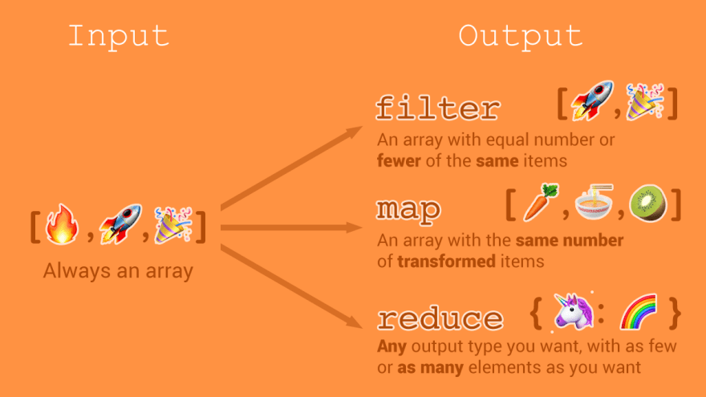
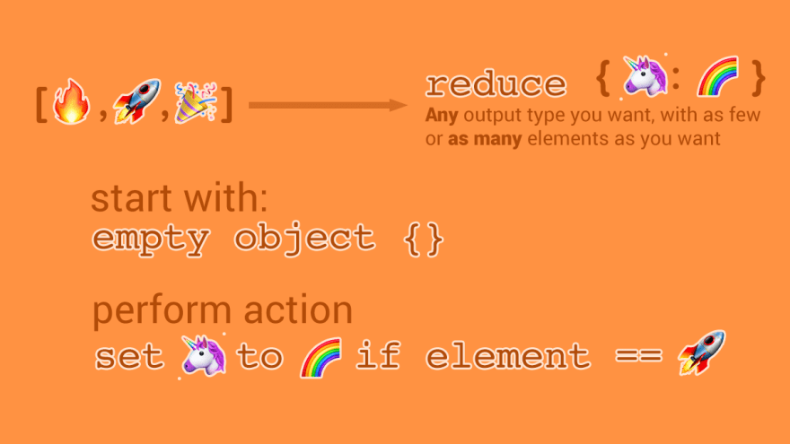

# Javascript/TypeScript

- [Javascript/TypeScript](#javascripttypescript)
  - [Logics](#logics)
    - [Convert any type of value to boolean](#convert-any-type-of-value-to-boolean)
  - [Function](#function)
    - [Function Declaration](#function-declaration)
    - [Function Parameters](#function-parameters)
      - [Function with Default Parameter](#function-with-default-parameter)
      - [Function with Rest Parameters](#function-with-rest-parameters)
    - [Arrow Function](#arrow-function)
    - [Higher-Order Function](#higher-order-function)
  - [Array and Object](#array-and-object)
    - [Object Basic](#object-basic)
      - [Creating Objects](#creating-objects)
        - [Object Literal](#object-literal)
      - [Accessing Object Properties](#accessing-object-properties)
      - [Iterating](#iterating)
    - [Array Basic](#array-basic)
      - [Array Creation](#array-creation)
      - [Array iteration](#array-iteration)
      - [Stack and Queue](#stack-and-queue)
        - [LIFO (Stack):](#lifo-stack)
        - [FIFO (Queue)](#fifo-queue)
    - [Object Methods - `values`, `keys`, `entries` and `fromEntries`](#object-methods---values-keys-entries-and-fromentries)
    - [Array Methods](#array-methods)
      - [Search](#search)
        - [`find()`](#find)
        - [`filter()`](#filter)
        - [`includes()`](#includes)
        - [`indexOf()`](#indexof)
        - [`lastIndexOf()`](#lastindexof)
        - [`findIndex()`](#findindex)
        - [`some()`](#some)
        - [`every()`](#every)
      - [Iterating and transforming - map,reduce](#iterating-and-transforming---mapreduce)
        - [`map()`](#map)
        - [`reduce()`](#reduce)
      - [Extraction \& SubSetting with `slice` and `splice`](#extraction--subsetting-with-slice-and-splice)
      - [Sorting](#sorting)
      - [Utils](#utils)
        - [Remove Duplicates array values](#remove-duplicates-array-values)
        - [Last elements of an array](#last-elements-of-an-array)
    - [Array and Object Destructuring](#array-and-object-destructuring)
      - [Array Destructuring](#array-destructuring)
      - [Object Destructuring](#object-destructuring)
        - [Basic Object Destructuring](#basic-object-destructuring)
        - [Advance Unpacking](#advance-unpacking)
    - [Rest vs Spread Operator](#rest-vs-spread-operator)
      - [Rest with Arrays For destructuring](#rest-with-arrays-for-destructuring)
      - [Rest with Objects For Destructuring](#rest-with-objects-for-destructuring)
      - [Spread with Arrays Cloning](#spread-with-arrays-cloning)
      - [Spread with Objects Cloning/Property Updating](#spread-with-objects-cloningproperty-updating)
  - [OOP](#oop)
    - [Composition Over Inheritance](#composition-over-inheritance)
    - [Composition Over Inheritance in TypeScript](#composition-over-inheritance-in-typescript)
    - [Advanced OOP Patterns in JavaScript](#advanced-oop-patterns-in-javascript)
      - [Factory Pattern](#factory-pattern)
      - [Singleton Pattern](#singleton-pattern)
      - [Observer Pattern](#observer-pattern)
  - [JS Concepts](#js-concepts)
    - [Lexical Environment](#lexical-environment)
    - [Global Scope](#global-scope)
    - [Local Scope](#local-scope)
    - [Block Scope\*](#block-scope)
    - [Let vs  Const vs Var](#let-vs--const-vs-var)
    - [Hoisting](#hoisting)
    - [Closures](#closures)

## Logics

### Convert any type of value to boolean

In JavaScript, there are two types of boolean values true and false. You can use the Boolean() function to find out if a variable is true or not.


```typescript
let num1;
console.log(!!num1); // false

const num2 = 10;
console.log(!!num2); // true

const n1 = 'Tim';
console.log(!!n1); // true

const n2 = '';
console.log(!!n2); // false
```


## Function

### Function Declaration

```typescript
// Basic Function Declaration
function functionDeclaration() {
	console.log("function declaration !");
}
//  Function Expression
const SaySomething = function() {
	console.log("Something");
};

// Arrow Function 
const sayHello = () => {
	console.log("Hello!");
};

functionDeclaration(); // function declaration !
SaySomething(); // Something
sayHello(); // Hello!
```

### Function Parameters

#### Function with Default Parameter


```typescript
function sayHello2(name = "Guest") {
	console.log(`Hello, ${name}!`);
}
sayHello2(); // Hello, Guest!
sayHello2("Clifford"); // Hello, Clifford!
```

#### Function with Rest Parameters

```typescript
function sumNumbers(...numbers: number[]) {
	let sum = 0;
	for(let num of numbers) {
		sum += num;
	}
	console.log(sum);
}

sumNumbers(1,2,3,4); // 10
```


### Arrow Function

```typescript
// TYPE 1 Curly Braces and Parens
const fn1 = ( arg1: number, arg2: number ) => {
    const res = arg1 + arg2;
    return `Sum is ${res}`;
}
// TYPE 2: No curly braces - auto return
const fn2 = ( arg1: number, arg2: number ) => `Sum is ${arg1 + arg2}`

// Type 3: no parens - only valid with exactly 1 argument
const fn3 = ( arg1: any ) => `Only 1 arg here ${arg1}`
```

### Higher-Order Function

A **higher-order function** is a function that can **take another function as an argument** or **return a function as a result**, enabling abstraction and code reuse.

```typescript
type Operation = (x: number, y: number) => number;

function applyOperation(a: number, b: number, operation: Operation): number {
  return operation(a, b);
}

let result = applyOperation(5, 2, (a, b) => a * b);
console.log(result); // Output: 10

result = applyOperation(5, 2, (a, b) => a + b);
console.log(result); // Output: 7
```

In this example, `applyOperation` takes a function (`operation`) as an argument to perform a custom operation (e.g., multiplication or addition) on `a` and `b`. It demonstrates how higher-order functions enhance flexibility and reduce redundancy.

## Array and Object

### Object Basic

#### Creating Objects

##### Object Literal

```typescript
const vehicles = {
    car: "🚗",
    taxi: "🚕",
    bus: "🚌",
    minibus: "🚐"
};

// Object Property
const quantity = 324,price = 45.50;
// Longhand
const product = {
    quantity: quantity,
    price: price
}
// Shorthand
const product = {quantity,price}
```

#### Accessing Object Properties

```typescript
// 1. Accessing object properties using the dot notation
console.log(vehicles.car)
// 2. Accessing object properties using the bracket notation
console.log(vehicles['car'])
```

#### Iterating

```typescript
// Looping Through an Object
for(let key in vehicles) {
    console.log(`${key}:${vehicles[key]}`)
}

/* 
car:🚗
taxi:🚕
bus:🚌
minibus:🚐
*/
```

### Array Basic

#### Array Creation

```typescript
const animals = ['🐑','🐈','🐄','🐪','🐅'];
const genArray1 = new Array(5).fill(0); // [0, 0, 0, 0, 0]
const genArray1 = Array(5).fill(0); // [0, 0, 0, 0, 0]
const genArray2 = [...Array(5).keys()]; // [0, 1, 2, 3, 4]
const genArray3 = Array.from({length: 5},(_,i) => i); //[0,1,2,3,4]
const genArray4 = Array.from({length: 5},(_,i) => i + 1); //[1,2,3,4,5]

const matrix = Array(5).fill(0).map(() => Array(5).fill(0));//[ [ 0, 0, 0 ], [ 0, 0, 0 ], [ 0, 0, 0 ] ]

```

#### Array iteration

```typescript
// Longhand
for(let i = 0; i < animals.length; i++) {
    console.log(animals[i]);
}
// Shorthand
for(let animal of animals) {
    console.log(animal);
}
// Getting the index
for(let index in animals) {
    console.log(`${index}:${animals[index]}`);
}
animals.forEach((value,index) => {
    console.log(`${index}:${value}`);
})
```

#### Stack and Queue

Arrays can be used as stacks and queues: Arrays can be used as both stacks (last-in, first-out) and queues (first-in, first-out) by using the `push()`,` pop()`, `shift()`, and `unshift()` methods.

| Method      | Description                             |
| ----------- | --------------------------------------- |
| `push()`    | Adds to the end, returns new length.    |
| `unshift()` | Adds to the start, returns new length.  |
| `pop()`     | Removes last, returns removed element.  |
| `shift()`   | Removes first, returns removed element. |


##### LIFO (Stack):

```typescript
// LIFO (Stack) example

// Create a new stack (empty array)
const  stack = [];

// Add elements to the top of the stack using push()
stack.push("apple");
stack.push("banana");
stack.push("cherry");

// Remove the top element of the stack using pop()
let lastItem = stack.pop();
console.log(lastItem); // output : "cherry"
console.log(stack); // output: ["apple", "banana"]
```

In this example, the `push()` method is used to add elements to the top of the stack, and the `pop()` method is used to remove the top element of the stack (i.e., the last item that was added).

##### FIFO (Queue)

```typescript
// FIFO (Queue) example

// Create a new queue (empty array)
const queue = [];

// Add elements to the end of the queue using push()
queue.push("apple");
queue.push("banana");
queue.push("cherry");

// Remove the first element of the queue using shift()
let firstItem = queue.shift();
console.log(firstItem); // output: "apple"
console.log(queue); // output: ["banana", "cherry"]
```

In this example, the `push()` method is used to add elements to the end of the queue, and the `shift()` method is used to **remove the first element of the queue** (i.e., the item that was added first).

### Object Methods - `values`, `keys`, `entries` and `fromEntries`

```typescript
const vehicles = {
    car: "🚗",
    taxi: "🚕",
    bus: "🚌",
    minibus: "🚐"
};

Object.keys(vehicles)//[ "car", "taxi", "bus", "minibus" ]
Object.values(vehicles)//[ "🚗", "🚕", "🚌", "🚐" ]
Object.entries(vehicles)
/* 
[
  [ "car", "🚗" ],
  [ "taxi", "🚕" ],
  [ "bus", "🚌" ],
  [ "minibus", "🚐" ]
]
*/
Object.fromEntries([
    ["car","🚗"],
    ["taxi","🚕"],
    ["bus","🚌"],
    ["minibus","🚐"]
])
/* 
{
    car: "🚗",
    taxi: "🚕",
    bus: "🚌",
    minibus: "🚐"
}
*/
```

### Array Methods

#### Search 

Here are some **search-related array methods** in JavaScript/TypeScript with examples:

##### `find()`
Returns the first element that matches a condition or `undefined` if none matches.

```typescript
const arr = [1, 2, 3, 4];
const found = arr.find((x) => x > 2);
console.log(found); // Output: 3
```

##### `filter()`
Returns a new array with elements that match a condition.

```typescript
const arr = [1, 2, 3, 4];
const filtered = arr.filter((x) => x > 2);
console.log(filtered); // Output: [3, 4]
```

##### `includes()`
Checks if an element exists in the array, returning `true` or `false`.

```typescript
const arr = [1, 2, 3, 4];
console.log(arr.includes(3)); // Output: true
console.log(arr.includes(5)); // Output: false
```

#####  `indexOf()` 
Finds the first occurrence of an element and returns its index, or `-1` if not found.

```typescript
const arr = [1, 2, 3, 4, 2];
console.log(arr.indexOf(2)); // Output: 1
console.log(arr.indexOf(5)); // Output: -1
```

##### `lastIndexOf()`
Finds the last occurrence of an element and returns its index, or `-1` if not found.

```typescript
const arr = [1, 2, 3, 4, 2];
console.log(arr.lastIndexOf(2)); // Output: 4
console.log(arr.lastIndexOf(5)); // Output: -1
```

##### `findIndex()`
Returns the index of the first element that matches a condition, or `-1` if none matches.

```typescript
const arr = [1, 2, 3, 4];
const index = arr.findIndex((x) => x > 2);
console.log(index); // Output: 2
```

##### `some()`
Checks if at least one element matches a condition, returning `true` or `false`.

```typescript
const arr = [1, 2, 3, 4];
console.log(arr.some((x) => x > 3)); // Output: true
console.log(arr.some((x) => x > 5)); // Output: false
```

##### `every()`
Checks if all elements match a condition, returning `true` or `false`.

```typescript
const arr = [1, 2, 3, 4];
console.log(arr.every((x) => x > 0)); // Output: true
console.log(arr.every((x) => x > 2)); // Output: false
```


These methods allow flexible searching and processing of arrays based on specific conditions.

#### Iterating and transforming - map,reduce

<p align="center">

</p>

##### `map()`

```typescript
// INPUT:
let animalObj = [
    {id: 1,emoji: '🐔',name: 'Chicken'},
    {id: 2,emoji: '🦇',name: 'Bat'},
    {id: 3,emoji: '🦉',name: 'Owl'},
    {id: 4,emoji: '🦄',name: 'Unicorn'},
    {id: 5,emoji: '🐺',name: 'Wolf'}
];
let emojis = animalObj.map(animal => animal.emoji);
console.log(emojis) //OUTPUT: [ "🐔", "🦇", "🦉", "🦄", "🐺" ]
```

##### `reduce()`

<p align="center">

</p>

- `reduce` loops over an array and let's you "collect" the elements into something else (by running a function)
- That "something else" is specified by you as the second argument
- This way, you can "collapse" (reduce) the array into a new array, an object, number, etc.

- During each loop of reduce, you can get **result of the last loop - Accumulator**, and **the Current element & Current index**
- Change the result, then return it for the next loop iteration
- When you're done, you have the completed collection


When reduce calls your reducer function, it passes the following four parameters in:

- **Accumulator** - result of the last loop
- **Current element** 
- **Current index**
- **Source array**

Case study: the `sum` function
We're all familiar with the sum function. Let's take a look at a simple implementation:

```typescript
function sum(numbers) {
    let accumulationSoFar = 0;

    for(const number of numbers) {
        accumulationSoFar += number;
    }
    return accumulationSoFar;
}
```

The body of the `for` loop is describing how to **combine the current element (number) with the current accumulator to produce the next accumulator for the next iteration**. This should sound familiar! With reduce, this is the job of the reducer function:


```typescript
function sumReduced(numbers,reducerCallback,initial = 0) {
    let accumulator = initial;

    for(const number of numbers) {
        accumulator = reducerCallback(accumulator,number);
                    //reducer gets current el and current accumulator and returns next accumulator
    }

    return accumulator;
}

function reducer1(accumulator,currentElement) {
    return accumulator + currentElement;
}
function reducer2(accumulator,currentElement) {
    return accumulator * currentElement;
}
console.log(sumReduced([1,2,3],reducer1))//6
console.log(sumReduced([1,2,3],reducer2,1))//6
```

Last but not least, with native reduce we don't need to pass in the array because we're calling reduce on the array. For illustrative purposes it looks something like the following:

```typescript
Array.prototype.reduce = function(reducer, initialValue) {
  let accumulator = initialValue;

  for (let i = 0; i < this.length; ++i) {
    accumulator = reducer(accumulator, this[i], i, this);
  }

  return accumulator;
}
```

Applications of reduce?

```typescript
const array  = [5,4,7,8,9,2]; 

// Sum in array javascript
array.reduce((a,b) => a+b);// 35

// MAX in array javascript
array.reduce((a,b) => a>b?a:b);//9

// MIN in array javascript
array.reduce((a,b) => a<b?a:b);//2
```

```typescript
let data = [
    {id: 1,emoji: '🐔',name: 'Chicken',number: 5},
    {id: 2,emoji: '🦇',name: 'Bat',number: 6},
    {id: 3,emoji: '🦉',name: 'Owl',number: 9},
    {id: 4,emoji: '🦄',name: 'Unicorn',number: 2},
    {id: 5,emoji: '🐺',name: 'Wolf',number: 10}
];

let countAnimalReducer = (accumulator,currentValue) => accumulator + currentValue.number;

const totalAnimals = data.reduce(countAnimalReducer,0)

console.log(totalAnimals) // 32


const res = data.reduce((accumulator,currentItem) => {
    accumulator[currentItem.name] = currentItem.name.length;
    return accumulator
},{})

console.log(res); //{ Chicken: 7, Bat: 3, Owl: 3, Unicorn: 7, Wolf: 4 }

```

#### Extraction & SubSetting with `slice` and `splice`

`arr.slice(start, [end])` method is used to copy a given part of the array. It returns the copied array as a new array without changing the original array.

Rules

1. A new array is returned and the original array is unmodified.
2. If `end` is omitted, end becomes the end (last element) of array.
3. If `start` is `-ve`, the elements are counted from the end.


`arr.splice(start, [deleteCount, itemToInsert1, itemToInsert2, ...])` method changes the original array, by adding or removing elements from it and return the removed items in a new array. **The first argument is the starting point for removing elements**. Elements that have a smaller index number from the given index won’t be removed.

Rules:

1. Operation is in place.
2. An array is returned with the deleted items.
3. If `start` is -ve, the elements are counted from the end.
4. If `deleteCountis` omitted,the elements until the end of array are removed.
   1. If items to insert such as itemToInsert1 are omitted, elements are only removed.


```typescript
const myArray  = [1,2,3,4,5,6,7] 

console.log(myArray.slice(0))       // [ 1, 2, 3, 4, 5, 6, 7 ]
console.log(myArray.slice(0, 1))    // [ 1 ]
console.log(myArray.slice(1))       // [ 2, 3, 4, 5, 6, 7 ]
console.log(myArray.slice(5))       // [ 6, 7 ]
console.log(myArray.slice(-1))      // [ 7 ]
console.log(myArray)                // [ 1, 2, 3, 4, 5, 6, 7 ]

const secondArray = [10, 20, 30, 40, 50]

console.log(secondArray.splice(0, 1))   // [ 10 ] : deletes 1 element starting at index 0
console.log(secondArray.splice(-2, 1))  // [ 40 ] : deletes 1 element starting at index end-2 
console.log(secondArray)                // [ 20, 30, 50 ]
console.log(secondArray.splice(0))      // [ 20, 30, 50 ] : deletes all elements starting at index 0
console.log(secondArray)                // []
console.log(secondArray.splice(2, 0, 60, 70)) // [] : deletes 0 elements starting at index 2 (doesn't exist so defaults to 0) and then inserts 60, 70
console.log(secondArray)                // [60, 70]
```

#### Sorting 

```typescript
const stringArr = ["Joe", "Kapil", "Steve", "Musk"]
stringArr.sort();// ["Joe", "Kapil", "Musk", "Steve"]
stringArr.reverse();// ["Steve", "Musk", "Kapil", "Joe"]

//### Sort Number Array in javascript
const array  = [40, 100, 1, 5, 25, 10];
array.sort((a,b) => a-b);// [1, 5, 10, 25, 40, 100]
array.sort((a,b) => b-a); // [100, 40, 25, 10, 5, 1]
```

#### Utils

##### Remove Duplicates array values

```typescript
const array  = [5,4,7,8,9,2,7,5];
array.filter((item,idx,arr) => arr.indexOf(item) === idx);
// or
const nonUnique = [...new Set(array)];
// Output: [5, 4, 7, 8, 9, 2]
```

##### Last elements of an array

```typescript
const elements = [5,6,7,8,9,10];
const last = elements.slice(-1);//10

const secondLast = elements.slice(-2);// 9,10
```


### Array and Object Destructuring


#### Array Destructuring

Destructuring is a clean and simple way of assigning the values of an array to separate variables. 

```typescript
const animals = ['🐑', '🐈', '🐄', '🐪', '🐖'];

// ❌Usually, to access an item in an array, you would have to access the items via their indexes as shown below.
const sheep = animals[0]
const cat = animals[1]
// ✅ With destructuring, there is no need to use indexes or loops.
const [sheep, cat, cow, camel, pig] = animals;
console.log(sheep)// 🐑
console.log(cat)// 🐈
console.log(cow)// 🐄
console.log(camel)// 🐪
console.log(pig)// 🐖
```

In the same way, you can assign **default values** to the variables.Thus, if you have more variables than there are in the array, your variables will still have values defined.

```typescript
const fruits = ['🍇','🍎'];
const [
   grapes = 'A lot of Grapes',
   apple = 'Red Apple',
   peach = '🍑',
   mango = '🥭'
] = fruits;

console.log(grapes) // 🍇
console.log(mango) // 🥭
```

Variable Swap:

```typescript
let owl = '🦢';
let swan = '🦉';

[owl, swan] = [swan, owl]

console.log(owl)// 🦉
console.log(swan)// 🦢
```

#### Object Destructuring

##### Basic Object Destructuring

```typescript
const vehicles = {
  car: "🚗",
  taxi: "🚕",
  bus: "🚌",
  minibus: "🚐"
};

const { car, taxi, bus, minibus } = vehicles

console.log(car)// 🚗
console.log(taxi)// 🚕
```


##### Advance Unpacking

**Default values** can be assigned to the variable in a destructuring assignment if the unpacked value from the object is undefined.

```typescript
const {unicorn = "🦆",eagle = "🦅",chicken = "🐔"} = {unicorn: "🦄"}

console.log(unicorn)// 🦄
console.log(chicken)// 🐔
```

Likewise, a **property unpacked from an object can be assigned to a variable with a different name**.

```typescript
const balls = {fball: "⚽️", bball: "🏀", sball: "🥎", vball: "🏐"}
const {fball: football, bball: basketball, sball: softball, vball: volleyball} = balls

console.log(football)// ⚽️
console.log(basketball)// 🏀
console.log(softball)// 🥎
console.log(volleyball)// 🏐
```

Similarly, we can unpack fields from objects passed as a function parameter

```typescript
const animals = {
  id: 23,
  location: "Madagascar",
  birds: {
    swan: "🦢",
    cockerel: "🐓",
    turkey: "🦃",
    flamingo: "🦩",
    parrot: "🦜"
  },
  mammals: {
    skunk: "🦨",
    raccoon: "🦝",
    kangaroo: "🦘",
    badger: "🦡",
    llama: "🦙"
  }
}

function whereis({location, mammals: {raccoon: image}}){
  return `${image} is located at ${location}`
}

function whichGroup({birds: {swan: bird}, mammals: {badger: mammal}}){
  return `${bird} is a bird and ${mammal} is a mamal`
}

console.log(whereis(data))//🦝 is located at Madagascar
console.log(whichGroup(data))//🦢 is a bird and 🦡 is a mamal
```

### Rest vs Spread Operator

In JavaScript, the rest and spread operators are both denoted by the same three dots (`...`) syntax, but they are used in different contexts and have different effects.

| **Feature** | **Spread**                      | **Rest**                     |
| ----------- | ------------------------------- | ---------------------------- |
| **Purpose** | Expands elements/properties     | Collects elements/properties |
| **Usage**   | Copies or merges arrays/objects | Destructure arrays/objects   |
| **Context** | Array literals, object literals | Destructuring assignment     |


The main difference between two is -

- The **rest** operator is used to fill a JavaScript array with the remaining data from a user.
  - Destructuring and catching indefinite number of arguments
- The JavaScript **spread** operator allows an array or an object to be spread or flattened into its elements.
  - For creating shallow copies
  - For merging

In common terms We can say -

- Rest we use for **pack** elements.
- Spread we use for **unpack** elements.


#### Rest with Arrays For destructuring 
```typescript
const [first, ...rest] = ['🍇', '🍎', '🍌'];
console.log(rest); // ['🍎', '🍌']

function fruits() {
  return ["🍐", "🥭", "🍑", "🍒"]
}
// skipping 🥭 and 🍑
let [pear,...rest] = fruits()
console.log(pear) //🍐
console.log(rest) //[ "🥭" , "🍑", "🍒" ]
```

The rest operator is used in a function's parameter list to represent an indefinite number of arguments passed to the function. It allows you to pass a variable number of arguments to a function and handle them as an array inside the function. Here's an example:


```typescript
function sum(...numbers:number[]) {
  return numbers.reduce((total, num) => total + num, 0);
}

console.log(sum(1, 2, 3)); // output: 6
```

#### Rest with Objects For Destructuring 
```typescript
const { debug, ...otherConfig } = { mode: 'development', debug: true, test: true };
console.log(otherConfig); // { mode: 'development', test: true }
```


#### Spread with Arrays Cloning
```typescript
const fruits = ['🍇', '🍎'];
const moreFruits = [...fruits, '🍌', '🍒'];
console.log(moreFruits); // ['🍇', '🍎', '🍌', '🍒']
```

#### Spread with Objects Cloning/Property Updating

```typescript
const baseConfig = { mode: 'development', debug: true };
const prodConfig = { ...baseConfig, mode: 'production' };

console.log(prodConfig); // { mode: 'production', debug: true }
```


## OOP

Key Concepts of OOP in TypeScript
- **Class**: A blueprint for creating objects.
- **Constructor**: Initializes object properties.
- **Properties** and Methods: Define object data and behaviors.
- **Inheritance**: Extend functionality from another class.
- **Access** Modifiers: Control access to class members (public, private, protected).
- **Encapsulation**: Protects data by making properties private and exposing them through methods.
- **Polymorphism**: Polymorphism lets different classes respond to the same function or method call. JavaScript achieves polymorphism via method overriding. Modeling a **User** and extending it to a specialized **Admin** user.

```typescript
// Base Class: User
class User {
  // Properties with access modifiers
  protected username: string; // Accessible in derived classes
  private password: string; // Only accessible within this class

  // Constructor
  constructor(username: string, password: string) {
    this.username = username;
    this.password = password;
  }

  // Public Method: Accessible everywhere
  public login(inputPassword: string): boolean {
    return this.password === inputPassword;
  }

  // Getter for username
  public getUsername(): string {
    return this.username;
  }
}

// Derived Class: Admin (inherits from User)
class Admin extends User {
  private adminLevel: number;

  constructor(username: string, password: string, adminLevel: number) {
    super(username, password); // Call the constructor of the base class
    this.adminLevel = adminLevel;
  }

  // Additional method for admin privileges
  public getAdminLevel(): number {
    return this.adminLevel;
  }

  // Override: Adding extra behavior
  public getUsername(): string {
    return `Admin: ${super.getUsername()}`;
  }
}

// Example Usage
const user = new User("JohnDoe", "1234");
console.log(user.login("1234")); // true
console.log(user.getUsername()); // JohnDoe

const admin = new Admin("AdminJane", "adminPass", 1);
console.log(admin.login("adminPass")); // true
console.log(admin.getAdminLevel()); // 1
console.log(admin.getUsername()); // Admin: AdminJane
```
 **Key Features Highlighted in the Example**
1. **Inheritance**: `Admin` extends `User` and uses `super` to call the parent class constructor or methods.  
2. **Encapsulation**: `password` is private, accessible only within the `User` class.  
3. **Polymorphism**: `getUsername()` is overridden in the `Admin` class.  
4. **Access Modifiers**: 
   - `private`: Restricted to the defining class (`password`).  
   - `protected`: Accessible in subclasses (`username`).  
   - `public`: Accessible everywhere (`login`, `getUsername`).

This approach ensures scalability, modularity, and secure object design in TypeScript.

### Composition Over Inheritance

Composition is a design principle where objects are constructed using smaller, reusable components rather than relying on a strict inheritance hierarchy. This leads to more flexible, decoupled, and maintainable code.

In contrast to inheritance (which imposes a "is-a" relationship), composition uses a "has-a" relationship. For example, instead of an `Admin` being a specialized type of User, the `Admin` can have user-like behavior through composition.


### Composition Over Inheritance in TypeScript  

Composition is a design principle where objects are constructed using smaller, reusable components rather than relying on a strict inheritance hierarchy. This leads to more flexible, decoupled, and maintainable code.  

In contrast to inheritance (which imposes a "is-a" relationship), **composition uses a "has-a" relationship. For example**, instead of an `Admin` *being* a specialized type of `User`, the `Admin` can *have* user-like behavior through composition.


Detailed Example:  A `User` object with basic authentication functionality, and an `Admin` object with additional roles, constructed via composition.

Step 1: Define Reusable Behaviors as Separate Classes  
```typescript
// Authentication Behavior
class Auth {
  private username: string;
  private password: string;

  constructor(username: string, password: string) {
    this.username = username;
    this.password = password;
  }

  public login(inputPassword: string): boolean {
    return this.password === inputPassword;
  }

  public getUsername(): string {
    return this.username;
  }
}

// Role Management Behavior
class Roles {
  private roles: string[];

  constructor(roles: string[]) {
    this.roles = roles;
  }

  public addRole(role: string): void {
    this.roles.push(role);
  }

  public getRoles(): string[] {
    return this.roles;
  }
}
```

Step 2: Compose the `User` and `Admin` Classes  

```typescript
// User Class
class User {
  private auth: Auth;

  constructor(username: string, password: string) {
    this.auth = new Auth(username, password); // Composing Auth functionality
  }

  public login(password: string): boolean {
    return this.auth.login(password);
  }

  public getUsername(): string {
    return this.auth.getUsername();
  }
}

// Admin Class
class Admin {
  private auth: Auth;
  private roles: Roles;

  constructor(username: string, password: string, roles: string[]) {
    this.auth = new Auth(username, password); // Composing Auth functionality
    this.roles = new Roles(roles); // Composing Roles functionality
  }

  public login(password: string): boolean {
    return this.auth.login(password);
  }

  public getUsername(): string {
    return this.auth.getUsername();
  }

  public getRoles(): string[] {
    return this.roles.getRoles();
  }

  public addRole(role: string): void {
    this.roles.addRole(role);
  }
}
```

 Step 3: Example Usage  
 
```typescript
// Create a basic user
const user = new User("JohnDoe", "password123");
console.log(user.login("password123")); // true
console.log(user.getUsername()); // JohnDoe

// Create an admin with roles
const admin = new Admin("AdminJane", "adminPass", ["Editor"]);
console.log(admin.login("adminPass")); // true
console.log(admin.getUsername()); // AdminJane
console.log(admin.getRoles()); // ["Editor"]
// Add a new role to the admin
admin.addRole("Manager");
console.log(admin.getRoles()); // ["Editor", "Manager"]
```

 **Advantages of Composition Over Inheritance**
1. **Reusability**: Individual behaviors (`Auth`, `Roles`) can be reused in other contexts without tying them to specific classes.  
2. **Flexibility**: You can mix and match behaviors to create objects tailored to your needs.  
3. **Decoupling**: Changes in one behavior class (`Auth`) won't directly affect others.  
4. **Avoids the Inheritance Hierarchy Trap**: No deeply nested inheritance tree, which can make code rigid and harder to maintain.

### Advanced OOP Patterns in JavaScript  

Here are concise examples of advanced OOP patterns in JavaScript with explanations:  

#### Factory Pattern

A factory creates objects without exposing the instantiation logic to the client.  

**Example**:  
```javascript
class Car {
  constructor(model, price) {
    this.model = model;
    this.price = price;
  }
}

class CarFactory {
  createCar(model, price) {
    return new Car(model, price);
  }
}

// Usage
const factory = new CarFactory();
const tesla = factory.createCar("Tesla Model S", 80000);
console.log(tesla); // Car { model: 'Tesla Model S', price: 80000 }
```

####  Singleton Pattern

Ensures a class has only one instance, and provides a global point of access to it.  

**Example**:  
```javascript
class Singleton {
  constructor() {
    if (Singleton.instance) return Singleton.instance;
    Singleton.instance = this;
  }
}

// Usage
const instance1 = new Singleton();
const instance2 = new Singleton();
console.log(instance1 === instance2); // true
```

#### Observer Pattern

 Defines a subscription mechanism to notify multiple observers about changes in a subject.  

**Example**:  
```javascript
class Subject {
  constructor() {
    this.observers = [];
  }

  subscribe(observer) {
    this.observers.push(observer);
  }

  unsubscribe(observer) {
    this.observers = this.observers.filter((obs) => obs !== observer);
  }

  notify(data) {
    this.observers.forEach((observer) => observer.update(data));
  }
}

class Observer {
  constructor(name) {
    this.name = name;
  }

  update(data) {
    console.log(`${this.name} received data: ${data}`);
  }
}

// Usage
const subject = new Subject();
const observer1 = new Observer("Observer 1");
const observer2 = new Observer("Observer 2");

subject.subscribe(observer1);
subject.subscribe(observer2);

subject.notify("Hello Observers!"); 
// Observer 1 received data: Hello Observers!
// Observer 2 received data: Hello Observers!
```


## JS Concepts

### Lexical Environment

A mechanism where variables and functions are resolved based on their location in the code during definition, not runtime.

```typescript
function outer() {
  let outerVar = "Outer";

  function inner() {
    console.log(outerVar); // Accesses `outerVar` from outer function's scope
  }

  inner(); // Prints "Outer"
}
outer();
```

---

### Global Scope

Variables declared outside any function or block are in the global scope and accessible everywhere.

```typescript
let globalVar = "Accessible Globally";

function accessGlobal() {
  console.log(globalVar); // Accessible here
}
accessGlobal();
console.log(globalVar); // Accessible here too
```

### Local Scope

Variables declared within a function or block are only accessible within that scope.

```typescript
function localScopeDemo() {
  let localVar = "Local";
  console.log(localVar); // Accessible here
}
console.log(localVar); // Error: `localVar` is not defined
localScopeDemo();
```

### Block Scope*

Variables declared with `let` or `const` inside a block `{}` are not accessible outside.

```typescript
{
  let blockScoped = "Block Scoped";
  console.log(blockScoped); // Accessible
}
console.log(blockScoped); // Error: Not accessible outside block
```

### Let vs  Const vs Var

- `var`: Function-scoped. Can be redeclared and updated. Hoisted but undefined before initialization.  
- `let`: Block-scoped. Cannot be redeclared in the same scope. Hoisted but not initialized.  
- `const`: Block-scoped. Must be initialized at declaration. Cannot be reassigned.  

**Example**:
```typescript
function scopeDemo() {
  if (true) {
    var x = 10; //  Accessible outside this block but Function-scoped
    let y = 20; // Block-scoped, inaccessible outside
    const z = 30; // Block-scoped and constant
  }
  console.log(x); // 10
  console.log(y); // Error: 'y' is not defined
  console.log(z); // Error: 'z' is not defined
}
scopeDemo();
```


### Hoisting

Variable and function declarations are moved to the top of their scope during compilation. Variables declared with `let`/`const` are hoisted but not initialized.

```typescript
console.log(hoistedVar); // undefined
var hoistedVar = "I am hoisted";

console.log(notHoistedLet); // Error: Cannot access before initialization
let notHoistedLet = "I am not hoisted";
```

### Closures

Functions that remember the scope in which they were created, even after that scope has ended.

```typescript
function counter() {
  let count = 0;
  return function () {
    count++;
    return count;
  };
}

const increment = counter();
console.log(increment()); // 1
console.log(increment()); // 2
```

---

Would you like me to continue with the remaining concepts in the same detailed style?

1.  Bind 5:11
2.  Passed By Value 5:30
3.  Passed By Reference 5:36
4.  Object Literal 5:46
5.  Object Constructor 5:52
6.  Property 5:56
7.  Prototype Chain 6:00
8.  Inheritance 6:11
9.  OOP 6:19
10. Classes 6:22
11. Constructor 6:25
12. Get/Set 6:34
13. Instance Method 6:39
14. Static Method 6:42
15. Array 6:46
16. Set 6:53
17. Map 6:56
18. Garbage Collection 7:05
19. Weak & Weakest 7:16
20. Event Loop 7:26
21. Sync 7:32
22. Async 7:36
23. Single Threaded 7:49
24. SetTimeOut 7:56
25. CallBack 8:04
26. CallBack Hell 8:12
27. Promise 8:18
28. Resolve 8:24
29. Reject 8:30
30. Then/Catch 8:33
31. Async 8:40
32. Await 8:46
33. Try/Catch 8:51
34. ES Modules 9:00
35. Default Import/Export 9:07
36. Named Import/Export 9:19

37. DOM 9:45
38. Document 9:52
39. QuerySelector 10:00
40. CSS Selector 10:04
41. Element 10:10
42. QuerySelectorAll 10:16
43. Event 10:25
44. Imperative 10:34
45. Declarative 10:42
46. Components 10:48
47. Data Binding 10:58
48. Module Bundling 11:05
49. Network Waterfall 11:19
50. Dynamic Imports 11:28
51.  ESLint07 12:01